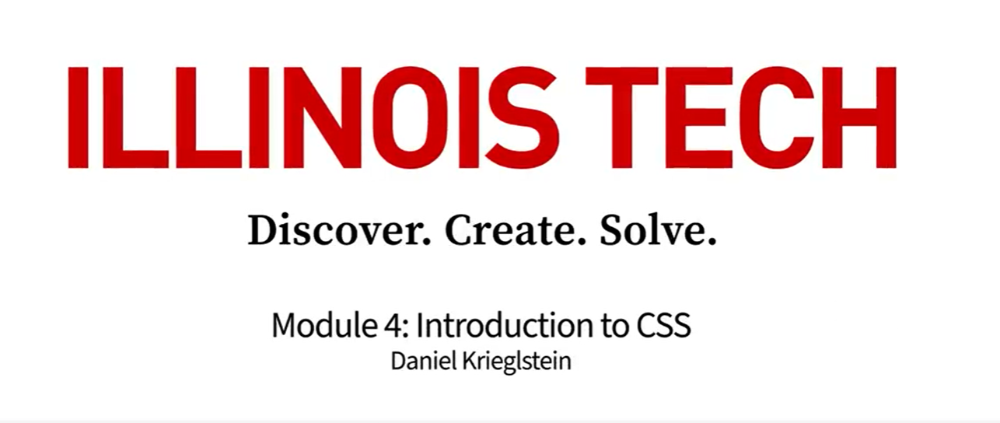

<h1 align="center">Fundamentals of Web Development</h2>
<h6 align="center">(by Illinoi Tech)</h6>

<!-- {width="2.0in" height="1.1100481189851268in"} -->
<!--~~~~~~~~~~~~~~~~~~~~~~~~~~~~~~~~~~~~~~~~~~~~~~~~~~~~~~~~~~~~~~~~~~~~~~~~~~~~~~~~~~~~~~~~~~~~-->
<!--~~~~~~~~~~~~~~~~~~~~~~~~~~~~~~ 01. introduction (1-01) (05) ~~~~~~~~~~~~~~~~~~~~~~~~~~~~~~~~-->
<p align="center" width="100%">

</p>
<!--  style="width:20%;" -->

<h3>9 week course, 134 hours (approx) to complete.</h3>

<p>This course is part of the Bachelor of Information Technology program from Illinois Tech. If you 
are admitted and enroll in the degree program, your coursework can count toward your degree 
learning and your progress can transfer with you.</p>

<h2><a href=#syllabus">Syllabus</a></h2>

<h3><a href="wk1">Week 1: Internet Structures and an Introduction to HTML</a></h3>

<p>Welcome to Fundamentals of Web Development! This course will cover the
creation of Web pages and sites using HTML, CSS, Javascript, jQuery, and
graphical applications as well as the client and server architecture of
the Internet and related web technologies. Students will be able to
create and deploy a Web site with multiple pages and cross-linked
structures by the end of this course.</p>

<p>In Module 1, students are introduced to the world of web development,
starting with writing basic HTML scripts and publishing them on GitHub
and GitHub Pages. It elucidates the roles and functions of the
internet\'s core technologies - HTML, CSS, and JavaScript - and
differentiates how browsers operate uniquely compared to other computer
applications. Students will become proficient in using essential tools
for internet publishing and code archiving, including text editors and
GitHub, coupled with an understanding of live hosting practices.
Additionally, the course offers insights into the physical
infrastructure of the internet, focusing on server technology, and
providing a holistic view of the digital landscape from code creation to
global connectivity.</p>

<p><small><small>17 lessons, 13 readings</small></small></p>

1.  [Course
    Overview](https://www.coursera.org/lecture/illinois-tech-fundamentals-of-web-development/course-overview-D3XXr)
    (7:34)

-   Syllabus

-   <b>Reading:</b> Module 1: Asset Library (code used in video demonstrations)

2.  Module 1 Introduction (2:00)

-   <b>Reading:</b> Lecture Slides: History of the Web

3.  History of the Web - Part 1 (10:11)

4.  History of the Web - Part 2 (12:13)

5.  History of the Web - Part 3 (11:27)

-   <b>Reading:</b> Lesson 1 Video Reference Page

-   <b>Reading:</b> Lecture Slides: The Tools of Internet Publishing

6.  The Tools of Internet Publishing - Part 1 (8:20)

7.  The Tools of Internet Publishing - Part 2 (6:56)

8.  The Tools of Internet Publishing - Part 3 (8:44)

-   <b>Reading:</b> Lecture Slides: Browsers and Web Addresses

9.  Browsers and Web Addresses - Part 1 (11:46)

10. Browsers and Web Addresses - Part 2 (10:45)

-   <b>Reading:</b> Lesson 3 Video Reference Page

-   <b>Reading:</b> Lecture Slides: HTTP Requests

11. HTTP Requests (8:45)

-   <b>Reading:</b> Lecture Slides: Meet Our Three Languages

12. Meet Our Three Languages (10:31)

-   <b>Reading:</b> Lecture Slides: The Basics of HTML

13. The Basics of HTML - Part 1 (8:25)

14. The Basics of HTML - Part 2 (8:48)

15. The Basics of HTML - Part 3 (10:27)

-   <b>Reading:</b> Lesson 6 Video Reference Page

-   <b>Reading:</b> Lecture Slides: How to Turn In Labs

-   <b>Reading:</b> Module 1 Summary

<h3><a href="wk2">Week 2: HTML</a></h3>

Module 2 equips students with advanced skills in HTML, focusing on
creating, hosting, and accurately indexing links and images to enhance
web page functionality and aesthetics. Students will learn how to
convert unique characters into UTF8 Unicode, ensuring global
compatibility and accessibility. This module also delves into crafting
and publishing essential HTML elements such as lists, and teaches the
intricacies of writing and nesting HTML tables and their content. These
skills enable students to structure web content effectively, laying the
foundation for sophisticated web design and development.

<p><small><small>7 lessons, 9 readings</small></small></p>

1.  [Module 2
    Introduction](https://www.coursera.org/lecture/illinois-tech-fundamentals-of-web-development/module-2-introduction-5FFqx)

-   <b>Reading:</b> Module 2: Asset Library (code used in video demonstrations)

-   <b>Reading:</b> Lecture Slides: HTML Elements (inline vs box)

2.  HTML Elements (inline vs box) - Part 1

3.  HTML Elements (inline vs box) - Part 2

-   <b>Reading:</b> Lesson 1 Video Reference Page

-   <b>Reading:</b> Lecture Slides: HTML Lists and Cascades

4.  HTML Lists and Cascades

-   <b>Reading:</b> Lesson 2 Video Reference Page

-   <b>Reading:</b> Lecture Slides: HTML Links and Images

5.  HTML Links and Images - Part 1

6.  HTML Links and Images - Part 2

-   <b>Reading:</b> Lecture Slides: HTML Tables

7.  HTML Tables

-   <b>Reading:</b> Lesson 4 Video Reference Page

-   <b>Reading:</b> Module 2 Summary

<h3><a href="wk3">Week 3: HTML Forms</a></h3>

Module 3 guides students through the process of creating well-structured
HTML navigation, essential for user-friendly website design. Learners
will delve into writing various HTML form elements designed to interact
seamlessly with PHP receiving forms, facilitating effective user data
collection and interaction. Additionally, the module focuses on crafting
HTML scripts that encode the full spectrum of a traditional resume,
teaching students how to present professional information in a clear,
accessible, and visually appealing online format.

<p><small><small>6 lessons, 7 readings</small></small></p>

1.  [Module 3
    Introduction](https://www.coursera.org/lecture/illinois-tech-fundamentals-of-web-development/module-3-introduction-1qphz)

-   <b>Reading:</b> Module 3: Asset Library

-   <b>Reading:</b> Lecture Slides: Website Navigation (Simple HTML)

2.  Website Navigation (Simple HTML)

-   <b>Reading:</b> Lecture Slides: HTML Forms

3.  HTML Forms - Part 1

4.  HTML Forms - Part 2

5.  HTML Forms - Part 3

-   <b>Reading:</b> Lesson 2 Video Reference Page

-   <b>Reading:</b> Lecture Slides: UTF8 Characters

6.  UTF8 Special Characters

-   <b>Reading:</b> Lesson 3 Video Reference Page

-   <b>Reading:</b> Module 3 Summary

<h3><a href="wk4">Week 4: Introduction to CSS</a></h3>

Module 4 explores the crucial concept of the HTML cascade in CSS,
highlighting its value in creating coherent and visually appealing web
designs. Students will learn to write and publish core CSS elements,
gaining hands-on experience in styling web content. A key focus is on
understanding the four layers of an HTML Box element (content, padding,
border, and margin) and mastering their manipulation using CSS for
optimal layout control. The module also guides students in choosing the
right box-sizing techniques for their website projects and underscores
the importance of implementing CSS resets to ensure a consistent styling
baseline before applying unique CSS customizations. This approach
fosters a comprehensive understanding of CSS as a tool for sophisticated
web design and layout management.

<p><small><small>7 lessons, 12 readings</small></small></p>

1.  [Module 4
    Introduction](https://www.coursera.org/lecture/illinois-tech-fundamentals-of-web-development/module-4-introduction-UQBs5)

-   <b>Reading:</b> Module 4: Asset Library

-   <b>Reading:</b> Lecture Slides: How CSS talks to HTML

2.  How CSS talks to HTML

-   <b>Reading:</b> Lesson 1 Video Reference Page

-   <b>Reading:</b> Lecture Slides: CSS Declarations

3.  CSS Declaration - Part 1

4.  CSS Declaration - Part 2

-   <b>Reading:</b> Lesson 2 Video Reference Page

-   <b>Reading:</b> Lecture Slides: Writing CSS Selectors for Specificity

5.  Writing CSS Selectors for Specificity

-   <b>Reading:</b> Lesson 3 Video Reference Page

-   <b>Reading:</b> Lecture Slides: The Box Model and Box Sizing

6.  The Box Model and Box Sizing

-   <b>Reading:</b> Lesson 4 Video Reference Page

-   <b>Reading:</b> Lecture Slides: CSS Resets

7.  CSS Resets

-   <b>Reading:</b> Lab 6 Practice Assignment

-   <b>Reading:</b> Module 4 Summary

<h3><a href="wk5">Week 5: CSS Floats and Positions</a></h3>

In Module 5, students will deepen their CSS knowledge by learning to
write and publish CSS properties specifically for fonts, enhancing the
typographic appeal of web content. This module also covers the
intricacies of CSS floats and positions, teaching students how to
effectively manipulate the layout and placement of elements on a
webpage. A practical component involves transforming a basic vertical
HTML navigation into a stylish, horizontal navigation bar, complete with
techniques for centering it within the website. These skills are
essential for students aiming to create visually compelling and
user-friendly web interfaces with advanced CSS techniques.

<p><small><small>10 lessons, 10 readings</small></small></p>

1.  [Module 5
    Introduction](https://www.coursera.org/lecture/illinois-tech-fundamentals-of-web-development/module-5-introduction-XyyIa)

-   <b>Reading:</b> Module 5: Asset Library

-   <b>Reading:</b> Lecture Slides: CSS Fonts

2.  CSS Fonts - Part 1

3.  CSS Fonts - Part 2

-   <b>Reading:</b> Lesson 1 Video Reference Page

-   <b>Reading:</b> Lecture Slides: CSS Floats

4.  CSS Floats - Part 1

5.  CSS Floats - Part 2

-   <b>Reading:</b> Lesson 2 Video Reference Page

-   <b>Reading:</b> Lecture Slides: CSS Positions

6.  CSS Positions - Part 1

7.  CSS Positions - Part 2

-   <b>Reading:</b> Lecture Slides: Horizontal Navigation

8.  Horizontal Navigation - Part 1

9.  Horizontal Navigation - Part 2

-   <b>Reading:</b> Lecture Slides: Centered navigation

10. Centered Navigation

-   <b>Reading:</b> Project 2 Practice Assignment: First Attempt

-   <b>Reading:</b> Module 5 Summary

<h3><a href="wk6">Week 6: Website Layouts and Design</a></h3>

Module 6 introduces students to the four fundamental layouts of website
design, providing a foundational understanding of various web design
approaches. It emphasizes the importance of adopting a mobile-first
mindset when starting CSS styling, aligning with contemporary web usage
trends. The module also advances into the dynamic aspects of CSS,
teaching students how to write and publish CSS transitions,
transformations, and animations, adding interactivity and visual flair
to web pages. Additionally, learners will explore the use of CSS
pseudo-selectors to enhance element styling. The culmination of these
skills enables students to create a complete and comprehensive website
using HTML and CSS, demonstrating proficiency in responsive and visually
appealing web design.

<p><small><small>9 lessons, 11 readings, 4 practice quizzes</small></small></p>

1.  [Module 6
    Introduction](https://www.coursera.org/lecture/illinois-tech-fundamentals-of-web-development/module-6-introduction-eEOos)

-   <b>Reading:</b> Module 6: Asset Library

-   <b>Reading:</b> Lecture Slides: Standard Website Layouts

2.  Standard Website Layouts

-   <b>Reading:</b> Lecture Slides: Responsive Design

3.  Responsive Design

-   <b>Reading:</b> Lesson 2 Video Reference Page

-   <b>Reading:</b> Lecture Slides: CSS Transitions, Transformations, and Animations

4.  CSS Transitions, Transformations, and Animations - Part 1

5.  CSS Transitions, Transformations, and Animations - Part 2

6.  CSS Transitions, Transformations, and Animations - Part 3

-   <b>Reading:</b> Lesson 3 Video Reference Page

-   <b>Reading:</b> Lecture Slides: CSS Pseudo-selectors

7.  CSS Pseudo-selectors

-   <b>Reading:</b> Lesson 4 Video Reference Page

-   <b>Reading:</b> Lecture Slides: Full-site Demonstration

8.  Full-site Demonstration - Part 1

9.  Full-site Demonstration - Part 2

-   <b>Reading:</b> Project 2 Practice Assignment: Second Attempt

-   <b>Reading:</b> Module 6 Summary

<h3><a href="wk7">Week 7: Introduction to Javascript</a></h3>

This module delves into the fundamental principles of writing JavaScript
(JS), offering students a solid grounding in the language\'s core
concepts. Students will learn to write and publish essential JavaScript
elements, developing skills crucial for interactive web development.
This module includes practical exercises where students will import and
integrate a Google Map into their website, demonstrating the ability to
enhance web pages with external APIs. Additionally, learners will gain
experience in importing and manipulating JavaScript events, furthering
their understanding of dynamic web interactions and user engagement
techniques.

<p><small><small>10 lessons, 10 readings</small></small></p>

1.  [Module 7
    Introduction](https://www.coursera.org/lecture/illinois-tech-fundamentals-of-web-development/module-7-introduction-2wA0M)

-   <b>Reading:</b> Module 7: Asset Library

-   <b>Reading:</b> Lecture Slides: The Basics of JavaScript (JS)

2.  The Basics of JavaScript (JS) - Part 1

3.  The Basics of JavaScript (JS) - Part 2

-   <b>Reading:</b> Lesson 1 Video Reference Page

-   <b>Reading:</b> Lecture Slides: JS Language Features and Syntax

4.  JS Language Features and Syntax - Part 1

5.  JS Language Features and Syntax - Part 2

6.  JS Language Features and Syntax - Part 3

-   <b>Reading:</b> Lecture Slides: Google Maps API (Application Programming Interface)

7.  Google Maps API (Application Programming Interface) - Part 1

8.  Google Maps API (Application Programming Interface) - Part 2

-   <b>Reading:</b> Lesson 3 Video Reference Page

-   <b>Reading:</b> Lecture Slides: JavaScript Objects, Event Handling, and DOM (Document Object Model)

9.  JavaScript Objects, Event Handling, and DOM (Document Object Model) - Part 1

10. JavaScript Objects, Event Handling, and DOM (Document Object Model) - Part 2

-   <b>Reading:</b> Lesson 4 Video Reference Page

-   <b>Reading:</b> Project 3 Practice Assignment: First Attempt

-   <b>Reading:</b> Module 7 Summary

<h3><a href="wk8">Week 8: jQuery and Frameworks</a></h3>

Module 8 focuses on empowering students with the skills to dynamically
manipulate HTML content using JavaScript, enhancing web interactivity
and functionality. Students will explore the integration and utilization
of a jQuery Box Slider, adding sophisticated visual elements to their
web projects. A key aspect of the course is teaching students how to
responsively resize video widths, ensuring optimal viewing experiences
across different screen sizes. Additionally, the module highlights the
value of these skills in the context of working with various website
frameworks, preparing students for advanced web development tasks and
modern responsive design practices.

<p><small><small>7 lessons, 9 readings</small></small></p>

1.  [Module 8
    Introduction](https://www.coursera.org/lecture/illinois-tech-fundamentals-of-web-development/module-8-introduction-hjsK2)

-   <b>Reading:</b> Module 8: Asset Library

-   <b>Reading:</b> Lecture Slides: How-To Grab JavaScript Objects and Change HTML

2.  How-To Grab JavaScript Objects and Change HTML

-   <b>Reading:</b> Lecture Slides: jQuery Intro and Box Sliders

3.  <b>j</b>Query Intro and Box Sliders - Part 1

4.  jQuery Intro and Box Sliders - Part 2

-   <b>Reading:</b> Lesson 2 Video Reference Page

-   <b>Reading:</b> Lecture Slides: Responsive Videos

5.  Responsive Videos

-   <b>Reading:</b> Lecture Slides: What This All Means for Using Website Frameworks

6.  What This All Means for Using Website Frameworks - Part 1

7.  What This All Means for Using Website Frameworks - Part 2

-   <b>Reading:</b> Lesson 4 Video Reference Page

-   <b>Reading:</b> Project 3 Practice Assignment: Second Attempt

-   <b>Reading:</b> Module 8 Summary

<h3><a href="wk9">Week 9: Summative Course Assessment</a></h3>

This module contains the summative course assessment that has been
designed to evaluate your understanding of the course material and
assess your ability to apply the knowledge you have acquired throughout
the course. Be sure to review the course material thoroughly before
taking the assessment.
<!--~~~~~~~~~~~~~~~~~~~~~~~~~~~~~~~~~~~~~~~~~~~~~~~~~~~~~~~~~~~~~~~~~~~~~~~~~~~~~~~~~~~~~~~~~~~~-->
**START HERE -- Illinois Tech's Fundamentals of Web Development**
<!--~~~~~~~~~~~~~~~~~~~~~~~~~~~~~~~~~~~~~~~~~~~~~~~~~~~~~~~~~~~~~~~~~~~~~~~~~~~~~~~~~~~~~~~~~~~~-->
<h2 id="wk1">Week 1: Internet Structures and an Introduction to HTML</h2>
<!--~~~~~~~~~~~~~~~~~~~~~~~~~~~~~~~~~~~~~~~~~~~~~~~~~~~~~~~~~~~~~~~~~~~~~~~~~~~~~~~~~~~~~~~~~~~~-->

Welcome to Fundamentals of Web Development! This course will cover the
creation of Web pages and sites using HTML, CSS, Javascript, jQuery, and
graphical applications as well as the client and server architecture of
the Internet and related web technologies. Students will be able to
create and deploy a Web site with multiple pages and cross-linked
structures by the end of this course. In Module 1, students are
introduced to the world of web development, starting with writing basic
HTML scripts and publishing them on GitHub and GitHub Pages. It
elucidates the roles and functions of the internet\'s core
technologies - HTML, CSS, and JavaScript - and differentiates how
browsers operate uniquely compared to other computer applications.
Students will become proficient in using essential tools for internet
publishing and code archiving, including text editors and GitHub,
coupled with an understanding of live hosting practices. Additionally,
the course offers insights into the physical infrastructure of the
internet, focusing on server technology, and providing a holistic view
of the digital landscape from code creation to global connectivity.

Learning Objectives

  -   Explain how a browser operates differently from all other computer
    applications.

  -   Explain the role and function of internet's physical infrastructure
    (i.e., Server Technology).

  -   Use the key technologies of internet publishing and code archiving
    (Text Editors, Github, Live Hosting).

  -   Explain what HTTP requests are used for.

  -   Write basic HTML script and publish it to Github and Github Pages.

  -   Explain the role and function of the internet's key technologies
    (HTML, CSS and JS).

<!--~~~~~~~~~~~~~~~~~~~~~~~~~~~~~~~~~~~~~~~~~~~~~~~~~~~~~~~~~~~~~~~~~~~~~~~~~~~~~~~~~~~~~~~~~~~~-->
<h2 id="ch0">Course Overview (7:34)</h2>
<!--~~~~~~~~~~~~~~~~~~~~~~~~~~~~~~~~~~~~~~~~~~~~~~~~~~~~~~~~~~~~~~~~~~~~~~~~~~~~~~~~~~~~~~~~~~~~-->
Hello and welcome to fundamentals of web development. My name is
Professor Krieglstein. We\'re going to start with a course
introduction. 

First lesson is how the web came to be and what it is that
you\'re actually working on when you\'re building a website. We\'re
going to learn how websites are built and specifically, not how to build
a website because you can go on any sort of free website builder, you
can build a website, but you may not understand it. Like asking AI to do
your math for you. You\'re going to get the right answer but you\'re not
going to understand it. What I want you to be able to do by the end of
this class is take one of those builders where you\'re building your own
website, and be able to go behind the scenes and make it your own. Make
the color your own, put the right images in that fits the product
or brand you\'re trying to develop. That\'s my goal. With this, we\'re
going to learn three languages, HTML, CSS, and Javascript. With those
three languages, it doesn\'t matter whether you\'re on a Mac, whether
you\'re on a PC, whether you\'re on an Android phone, whether you\'re on
a Samsung phone, whatever tool you\'re using to access the web, those
three languages work everywhere. That\'s the power of the web. It\'s one
code that fits every software or every device. Sorry about that. We\'re
going to learn what\'s called standard compliance and we\'re going to
make sure it\'s accessible. If you\'re building a website for, let\'s
say, a two million dollars small, medium sized company, and you don\'t
make it accessible to everyone. You\'re losing out on revenue. If
you\'re trying to build a non for profit website. You want to make sure
that you\'re able to access every community that wants to access the
information you\'re providing. That\'s what it means to make it standard
compliant and accessible. You do not limit the user experience depending
on their process of getting to your website. That\'s important because
not all tools that build a website for you take that into
consideration. That\'s what we\'re going to do with this course. Then
we\'re going to teach you how to design handwritten code and coming back
to this idea, you can go on an AI now and ask them to build your website
and it\'s going to use many of the tools out there. It\'s going to put
it together. It\'s going to look pretty but you\'re not going to know
how to fix it yourself. You\'re not going to know how to go under the
hood and make it your own. Brand, it the way your company or your
organization wants it to be branded. That\'s what it means to write
handwritten code. It\'s kind of like learning your multiplication
tables, learning how to handwrite out an equation before you pick up a
calculator. Before you start going to statistics softwares. When you
start using those tools, you\'re going to understand what it is that\'s
actually being delivered to the consumer and you\'re going to be able to
take control of that. That\'s my goal of this class. 

As far as the core structure, something I want to emphasize here that\'s
going to be different from how you might have learned coding. If you
took a few online sessions or you watched a few videos, they\'re going
to try and teach you the website\'s whole structure. What I\'m going to
do is I want to emphasize what each one of these three languages does
so you understand when something needs to be changed. You\'re looking at
the structure of what needs to be changed, and you know which language
to look at to change it. We\'re going to start with just HTML. It\'s
going to feel like an empty space. Everything\'s going to be left
justified on the screen. There\'s not going to be any colors. You\'re
not going to have pretty fonts and you\'re going to want to
instinctually put some borders on things and make your website pretty
but this first few lessons is just going to be that skeleton of HTML, so
you understand the limitations of HTML, but more importantly you
understand how to write it correctly. That allows the other two codes to
build off of that. Next we\'re going to move on to CSS, add some CSS to
what you\'ve already built with your HTML website. You\'re going to
have some labs throughout there taking you step by step but once you add
that CSS, your HTML skeleton will be so perfect that it actually make it
easier to write the CSS. Something you may not be able to achieve if you
learn them in tandem. 

Finally, we could have a whole entire separate lecture on just
Javascript. I\'m going to teach you some of the basics of Javascript and
I\'m going to teach you how to cut and paste into your HTML and
CSS, some key Javascript codes, like a Google Maps API, a little image
slider, so you\'ll understand what it is and how you can plug that into
your HTML. 

Most Javascript that works on the web is already really well written by
someone else. Your job usually is a website admin, is to be able to make
sure it integrates properly into your HTML and CSS. You don\'t have to
write it from scratch, and that\'s kind of what you\'re going to get
from this class. 

The ability to look at someone else\'s Javascript, say that\'s a really
good application, I\'d like to implement on my website. You\'re going to
be able to do that. Again, the HTML is going to be our content
layer. CSS is going to be our style or design. The Javascript is that
interactivity. It brings the web to life. For this class don\'t
worry, you\'re going to have a video after this one on how to download
the software on which software you need but essentially you\'re going to
need these core tools. A Github account, Github Desktop, which is
separate from a Github account, a plain text code editor, I recommend
Notepad++ if you\'re using a PC Textwrangler, which I\'m pretty sure
comes native in Mac or Sublime, which is a multi platform. 

I will be demoing Notepad++ for PC, and that\'s going to look most like
Sublime. If you\'re comfortable with the Textwrangler Mac, you can use
that, but I would recommend maybe downloading Sublime if you haven\'t
committed to one, because it\'ll be easier to understand from my
lessons. 

Image editor of your choice. We want to understand how to make images
accessible, not have huge multi megabyte images on tiny downloads for
cell phones. I\'ll teach you how to do that. Then at least three
different browsers, Chrome, Opera, Firefox, or Edge. The reason I
say three because if you interview for a job after this, it looks very
professional that you\'re the one who\'s going to look at how this
website looks on multiple browsers. It\'s not just enough to look at one
browser and make sure that your website looks the way you want it to. 

You want to be the person who tests it on different things. Always Edge
Microsoft is the outlier. If you can make it look good there, it looks
good most anywhere in this day and age though, there\'s more browsers
than that. If you\'re looking, for instance, on Instagram, you click on
a link, you\'re not popping up Chrome or Opera, you\'re actually looking
at their own native browser. It\'s becoming harder and harder to test
your website on every single browser that exists but generally, if your
standards compliant and you\'re accessible, it\'s going to work
everywhere that the user is accessing it from. That\'s an introduction
to this class. I look forward to teaching you more and feel free to
engage with the teaching assistants and myself throughout this
lecture, if you ever feel like you\'re struggling. The goal of this
class is introduction. I want you to feel comfortable engaging with
those materials. If you\'re stressed out, chances are you\'re
overthinking it or you\'re missing a key step and that\'s the time for
you to reach out and ask for help. Thank you.

<!--~~~~~~~~~~~~~~~~~~~~~~~~~~~~~~~~~~~~~~~~~~~~~~~~~~~~~~~~~~~~~~~~~~~~~~~~~~~~~~~~~~~~~~~~~~~~-->
<h2 id="ch1-01">Week 1: Introduction (2:00)</h2>
<!--~~~~~~~~~~~~~~~~~~~~~~~~~~~~~~~~~~~~~~~~~~~~~~~~~~~~~~~~~~~~~~~~~~~~~~~~~~~~~~~~~~~~~~~~~~~~-->

Welcome to Module 1, Internet Structures and an Introduction to HTML. 

Again, this is our fundamentals of web development course. In this
module, you\'re going to start with a nice introduction to the structure
of the web. The goal of this lecture will be not so much that you have
to write down notes or take a quiz, there\'s going to be a lot of
information. It\'s more to help you conceptualize what the web actually
is. Oftentimes, when we hear words like the cloud or the Internet, we
have ideas of what it is. 

But when we\'re building a website, it helps to have a good foundation
of that understanding of the history and where your website plays into
that network. Then we\'ll have a tools of internet publishing. This is
going to be really hands-on on how to downloading software, make sure it
works, and our first lab will work around making sure that you have all
these things up and running so you don\'t later on, when you\'re working
on the code part of it, freak out about the software. Then take it back
another breather, how browsers and HTP and HTPS work. It\'s going to be
another short little lecture on what it is that\'s actually being
communicated when a computer asks for the files of a website. Again, not
something you really need to take notes on or stress about, but helping
you frame the whole concept of website. Then the last two lessons in
this module are going to be around introduction to the actual
code itself and some basics of HTML, and we\'ll round out with a nice
little lab on writing your basically your first website. Enjoy.

Lecture Slides: History of the Web

<!--~~~~~~~~~~~~~~~~~~~~~~~~~~~~~~~~~~~~~~~~~~~~~~~~~~~~~~~~~~~~~~~~~~~~~~~~~~~~~~~~~~~~~~~~~~~~-->
<h2 id="ch1-02">History of the Web - Part 1 (10:11)</h2>
<!--~~~~~~~~~~~~~~~~~~~~~~~~~~~~~~~~~~~~~~~~~~~~~~~~~~~~~~~~~~~~~~~~~~~~~~~~~~~~~~~~~~~~~~~~~~~~-->

In this first lesson, I don\'t want you to have to take notes or worry
about learning all this information. It\'s more about helping you frame
what a website is and how it plays into an ecosystem, a network of
computers. 

And how young the Internet is, and specifically how exciting it is to
get involved at this stage. Because we\'re about to take the next step
in the next few years into wearable devices that allow us to navigate
websites in 3D. So, what you think of the web, how you understand the
web, or cloud computing, that\'s all still very young and about to
change. And I want to emphasize that with this lecture, and I hope it
gets you more excited about your role and kind of that you\'re still at
the beginning of this whole thing. And can help frame how we use it
and where we go with what the tools we have today are. 

So, starting off, 1972 is the first email and 1991 is the first web
page. This is just a few decades ago, less than a single lifetime. We
get into the first browser in 1993, eBay and JavaScript. Again, we\'re
learning about JavaScript as a core element of the Internet. And that\'s
just 1995, that\'s not that long ago. We\'re inventing JavaScript before
we even figure out what to do with JavaScript or how to make it an
integral part of the websites that we use. Ebay is our first shopping
experience. And this was literally, you sent an email, I want to buy
this item that you\'re advertising, and then you\'d send your credit
card information and they would ship you the item. There was no
collecting of your credit card information on the website. So we\'ve
come a long way in a very short time. Google is 1998, that\'s almost
this century. Facebook, social media, that starts at the beginning of
the century. The iPhone, the first true handheld computer, that\'s
2007. And remember, that\'s their first one. The BlackBerry before that
kind of started this innovation, but the first time we really get people
outside of business getting excited about surfing websites or talking to
each other, that\'s the iPhone. And it takes a couple of years for that
to catch on and for people to really start using websites. That early
website, I remember that, I had to build iPhone specific website, had
dot m at the end, and then I had to build my website for computers. So
all our content was kind of built double. You\'re going to learn how to
build one website that can be shown anywhere, and that\'s exciting. But
let\'s jump back, 1963. So, the core idea of having a computer, having a
phone, having a tablet, and that talks to another computer, cell or
tablet. Before it was just two computers, and we had two computers could
send a file between each other. And in starting that process of thinking
what that could possibly lead to, we have this idea of Hypertext. 

Instead of having one file move from here to there, we start to have a
link within a file that says, I\'m referencing this other file somewhere
else on the computer, and I\'m building what\'s considered a network of
files that have some integration. So this is where we\'re even starting
to think about integration and networking, is this Hypertext. And
that\'s Ted Nelson, coined that term Hypertext. What we\'re using now,
HTTPS, Hypertext linking, we\'re going to use our href, or Hypertext
reference, those are all still languages we use within our HTML. And
this is the IBM Computer 360, Model 91. This thing is massive, takes up
a whole room. It\'s installed in NASA in 1968, and there\'s actually
only 15 ever built. But its top speed at the time was 6.3 megabytes. And
that means what would happen is it\'s transmitting 64 bits of logic, we
still transmit 64 bits of logic at a time, it\'s how we communicate,
but it\'s the speed at which it does it. It does it at that time in four
nanoseconds. Now we\'re sending that millions of times a second to
communicate. So you have 6.3 megabytes of memory it\'s holding, you\'re
talking to this computer using paper punch cards. 

You don\'t even have a keyboard you\'re typing in. You\'re trying to
make it do equations, and it\'s storing only up to 6.3 megabytes of an
equation at a time. So at this point you basically have a computer that
can run an equation, give you an answer, run an equation, give you an
answer, run an equation. It\'s not doing it in tandem or multiprocessing
and it can\'t do things out of order. This computer is the first one
that can do things out of order. So its operating system and at the
time, there wasn\'t Windows and Mac, there was this computer built by
IBM, and IBM built an operating system for that specific computer. So
there\'s only 15 of them, the operating system they built was for these
15 computers. It couldn\'t be used anywhere else. But it was the first,
what we call out of order operation. 

So instead of having, at this time the standard computer, as I said, one
equation, calculate after the other, it was the first time you had the
processor be able to get two different equations and do them out of
order and give you a kind of complex answer. And this kind of complexity
of being able to look at things differently than the computer at
different time frames is the kernel of being able to network between two
computers. 

Because files aren\'t coming to those computers at the same time and 

it needs to put that data together to build a website. And you\'ll learn
this when we have websites. You have your CSS file, your HTML file, your
JavaScript file, they may come at different times of the computer. It\'s
all in nanoseconds, we can\'t comprehend it, but the computer is getting
these things out of order and need to organize them. It has a map of how
to do that, and a language it speaks to understand these are the files,
this is how I present the data. This is the start of that. I want to
emphasize, at the time they paid \$6 million to have one of
these installed and you would have a team member trained how just to use
this. That was their whole job, was to use this computer. And other
people would come with problems, and they take their punch card, that
one person entered in. 

\$6 million, pause the video, pull up an inflation calculator, and see
how much that was actually in today\'s dollars. These things were
expensive. 

But the computer of the day, the most popular was IBM\'s 360, Model 30. 

There\'s a link out to it. It did 8 to 64 kilobytes memory. You may not
even know what a kilobyte is. This thing was small. It was big, but it
was small compared to today\'s computer. And companies couldn\'t even
afford, most companies rented it out for \$8,000 a month. And again, a
specially trained person would work on it. It was released in 1964, but
it was the computer of the day in 1969, everyone had one of these. And
it was grossing IBM roughly a billion dollars a year. What made this a
next step in computer networking was that CompuServe came around and
they developed the Dial-Up system for sending files. Now, this is not
what you think of 1990s Dial-Up where you beep boop, boop, and then
there\'d be some data transfer. This was literally the computer had a
phone number and it called the CompuServe phone number, and it would
send a single file, and it would take some time. And then CompuServe
would have that file and 

be able to enter into another computer. So it wasn\'t really two
computers talking yet. But this is the first concept of trying to take
digital language and put it into an analog system like a telephone so we
could start networking. With that, we have Arpanet. So Arpanet\'s taking
these two inventions, being able to send digital signals over analog
lines before we have T-lines and digital kind of lightning speed with
fiber optics, and they\'re building networks between computers. Now,
instead of what you might think of with servers and kind of
routers, this was literally just two computers talking to each
other. And so much what they were doing is just sending files back and
forth. And it had to be the same computer. 

So, because the file was packaged in that computer\'s operating
language, 

it would have to send it to another computer of the exact same model so 

that you could send that file back and forth. So this was mostly just
computer labs and science labs in these universities and some government
websites, and in Europe, just a handful of universities, and then CERN
superconductor in France and Switzerland. They were building these
lines, these connectivities, but it wasn\'t quite a network yet. So it
was the first packet switch network, where you had, send it here, you
would go from maybe University of Michigan to University of Denver,
and then Denver would send that same file onwards. So packet switch,
grab it, store it, send it forward, that\'s the store and forward packet
switching. 

But it was just computer change, there was no routers, no networking, no
saying, hey, here\'s an address. I actually typed the name of that
computer and I would send it to the next computer in maybe the next
university that was directly connected and then that would take it, and
then they would do another connection to their computer in the next
university and they\'d send it on. So really simple network. So, who was
involved? It was the Advanced Research Projects Agency, which was the
United States epartment of Defense, the Rand Corporation, and of course,
all these universities that were involved. The Rand at the time kind of
being the go-to research organization that did a lot of government
contracting. 

They were deeply involved in trying to understand this. But I want to
emphasize, actually as a Midwest boy, a lot of the Midwest universities
were actually instrumental in some of these early inventions. So,
University of Illinois and University of Michigan were two of the
leading research universities inventing a lot of these tools. And then
to a lesser extent, University of Wisconsin and Notre Dame University in
Indiana.

<!--~~~~~~~~~~~~~~~~~~~~~~~~~~~~~~~~~~~~~~~~~~~~~~~~~~~~~~~~~~~~~~~~~~~~~~~~~~~~~~~~~~~~~~~~~~~~-->
<h2 id="ch1-03">History of the Web - Part 2 (12:13)</h2>
<!--~~~~~~~~~~~~~~~~~~~~~~~~~~~~~~~~~~~~~~~~~~~~~~~~~~~~~~~~~~~~~~~~~~~~~~~~~~~~~~~~~~~~~~~~~~~~-->

We have these pocket switching, they\'re just sending files back and 

forth along comes Ray Tomlinson, and he says, sometimes I\'m using these
files just to send a communication and I need something a little more
impermanent than a file that\'s sent back and forth. 

Maybe like mimicking the mail where I\'m just sending some instructions
on how to use something or I want to say hi and he frames out the whole
concept of what we now call email. 

He\'s working for Bolt, Barni and Newman, which was a subsidiary of 

the military contractor Raytheon in Massachusetts, Cambridge,
Massachusetts. He alone may be talking with friends, but he writes out
this document where he comes up with the idea of a header, CC, BCC. 

If I want to add someone or if I want to blind add someone to the
email, he chooses the @ sign. Again, the @ sign was not a web domain. 

It was Daniel Krieglstein @ maybe Kim, let\'s see, Daniel Krieglstein
Mit\'s IBM 361 computer. That would be the @ symbol and the address you
would have talking between these two computers. Then separate the user
from the computer model, not necessarily the web domain yet, that
didn\'t exist. 

Email was adopted later, Ray Tomlinson was calling it FTP mail file
transfer protocol mail, which was a funny little name but eventually
later we adopted the name email. 

This is actually Ray Tomlinson and his team and if you want to jump on
this website data tracker, this was the original proposal for how email
should work. Subjects headers, understanding it and how it would have
flowed between two computers. It\'s pretty wild how new all this
is, this isn\'t the ancient technology. We still have all the
documentation that brought this stuff to life.

Now we jump to Robert Kahn, 1973-1974 and Robert and his team, they come
up with TCP. Before we have FTP file transfer protocol, this is how I
send a full file between two computers. To make the Internet work and to
really having this network where the file can get to a computer multiple
different ways. We need to be able to package that code into smaller and
smaller little packets and that\'s TCP Transmission Control
Protocol. It\'s byte transfer between hosts and what it does is I\'m
sending files and if I might send maybe my JavaScript file. It\'s coding
goes one way, maybe through these routers, and then my HTML file finds
it\'s faster to send it down through Texas and up through these fiber
optic lines, it gets to the computer at the other side. FTP is the
language the computer used to combine those files and make sure nothing
was lost. 

These files are taking different routes through the fiberoptic,
underground under seas, everywhere and FTP is the language that is
used. In working out its reliability assurance so yes, your data arrived
as intended, which means I need some language to know what is intended
for this file structure,  the request retransmission, if there is lost
data. I don\'t ask for the whole packet of data, I send back to the
originating computer saying, hey, I didn\'t get this thing that it was
supposed to be there. I don\'t see it in the file structures I received.
Can you send it again? Then ordered, make sure it\'s rearranging those
files back into the structure of what the web page should look
like, what is the first page? Things like that. 

Accurate delivery is emphasized over timely delivery. This is important
with TCP and I\'m going to contrast this with what we may have as VOIP
video. TCP, may not have your website load instantly. We have fiber
optics sometimes you\'re amazed. Your website is just like, I pull up a
website from India in the US and it\'s like pow, it\'s right there it
blows the mind how fast light can transfer that information. 

But sometimes you notice it takes a minute to load and that\'s because
TCP will wait to make sure the website loads how it\'s supposed to
instead of having any errors in it. When we do something like
calling someone over Wi-Fi or we have video conferencing, which we\'re
all familiar with now. 

It uses a different type of protocol that emphasizes timely delivery
because I\'m creating new data, in the real time talking to someone
instead of accurate data. This is why sometimes you get gerbled messages
in your video chats or you have some dropped information or their
screen pauses is because they\'re trying to get the information there
quickly, but it\'s not accurate and sometimes one of the files just took
a wrong turn and never ended up where we\'re supposed to do so you get a
screen freeze. 

This is what happens with your websites. Because your website emphasizes
accuracy, you often don\'t notice this happening in the network. A lot
of files get dropped. Another good way to emphasize this is those of you
who play maybe video games that are over the internet. 

If you see sometimes up in the corner, it talks about files dropped or
your loss rate. These are the files that make up when you\'re
transferring and communicating with other players playing with you
online files get lost, they just disappear into the network. 

Website emphasizes, again, making sure the website gets where
it\'s supposed to, as accurate as possible. 

Even it may take a little bit of delay. 

Now we\'re starting to see the structure of the world wide web we
haven\'t invented the world wide web yet, but the world wide web
has many different file transfer protocols, many different ways to send
data. 

File transfer protocols, TCP, we have email, we have secure shell, which
is direct one to one communication. 

We have peer to peer file sharing, which is where you have networks of 

computers all sharing files in tandem. 

And then streaming data, which would be your VOIP or your video
messaging. All these are using the same communication lines, but
they\'re packaging data in different ways. They\'re using different
wavelengths of the light beams to communicate those symbols. That\'s a
whole profession and understanding how that works. 

I\'m just getting you an introduction of what it is when you\'re sending
a website back and forth. We take TCP, the transfer protocol for sending
these files, and package data, and we add the IP address. This is
important, because up to this point with Arpanet, we have computer
talking to computer, talking to the next computer. We don\'t have
servers or those network tools that help package it and send it around
the whole world. 

IP address separates now the computer itself from maybe a wider
network. If I don\'t have to type in the computer name, I can type in
1.32.42, 

and I as my register of my IPM 360 Version 1. I register for one of
these IP addresses. 

Now there\'s a phone book of where all the computers connected to the
network are, and this is really important because now I can start to
have a real network. I don\'t necessarily have to know what university
or what location, the next computer is at that I\'m trying to
communicate with, I now have this address book. All these Universities
get these address books, and they type in these IP addresses and
they\'re starting to be able to send information around. I might
actually be able to move a little bit or add another computer to that
network, and I just get a new IP address. 

No one has to learn the Motte make and model of my computer. 

Finalize the TCP/IP integration in 1978. This was IP Version 4, it\'s
delivering packets from secure host with an IP address over the server
network. I just typed in the IP address. I may not even know now
anymore what university I\'m talking with or where it\'s going to, I
just know this is Dan\'s computer and it has this IP address and I\'m
sending it there. Vint Cerf and Bob Kahn, they\'re working together on
the IEEE paper in 1974. 

Solidifying this, giving the argument of why it should be this way. 

Then they\'re experimenting for several years before we settle on IP3
Version 3, and that is the first launch. 

From there then we get 1979, we have USENET, which is the first true
Internet dial-up. They\'re using IP addresses to build communication
between two computers, not just having what we had before where you\'re
talking to a phone and the phone is just downloading a file and then
you\'re inputting into a computer. 

That\'s Tom Truscott and Steve Bellovin are giving us that first true
dial-up. Now we have the framework, we have a network out there, we\'re
starting to figure out how to package files that they can be loosely
sent. 

I don\'t have to know the exact physical location or the model of each
computer, and I\'m starting to write language that is universally able
to be used anywhere. 

That\'s how we\'re starting. This is the end of the \'70s, so we\'re
getting to the \'80s now, getting into what we might think of, the
colorized version of television and movies where we\'re still
enjoying some of those great \'80s movies. 

This is where the internet is still just in its infancy.  It\'s not even
really called the Internet yet and we\'re not able to navigate. There
are no websites. Comes 1980, this is where the birth of the
Internet. You have Tim Berners-Lee, really should be a better-known name
throughout the world. 

He\'s like the Einstein of the Internet. You have to imagine the scheme
of change, the paradigm shift someone has, he\'s working at CERN. 

He has this network which mimics a physical file network. 

I\'m taking a file in this computer and I\'m sending that file over
there, and I have addresses to send between these two files. 

He starts to think of this network as something more ethereal, what we
might call the cloud today. Where I don\'t even know where things are
going or what they\'re doing, but I should be able to just
navigate around and start looking at files on other people\'s
computers. I shouldn\'t have to request, I should be able to just pull
up, click on a link, start reading something. 

What you might do for hours on Wikipedia when you\'re supposed to be 

doing a book report and you end up, my gosh, I\'m doing a book report on
World War I, and all of a sudden I\'m reading about, corn prices during 
the Renaissance or something like that. 

You know how that night on Wikipedia can go. Tim Berners-Lee, he\'s
working at CERN. He comes up with what he\'s using at the time is Memex
and NLS hypertext system. This is in one file, I have reference to
another file and I\'m linking between these two files and looking at
scientific research, but ultimately it\'s dependent on the software of
the computer. 

I can\'t really do this easily between two different types of computers
because the OS, again remember, is specific to those individual, actual
physical computers. He comes up and he starts to write something called
Enquire. It\'s a simplified hypertext that makes it universally
compatible with every operating system. How does he know? 

Because Tim Berners-Lee is actually going to every type of IBM computer
at the time, and he\'s learning the OS, and he\'s figuring out how to
write code that can interact with any of them. 

Now what will happen is when you\'re building a website, Apple, for
instance, has built a browser that talks to Apple. 

You download a browser like Chrome, but you downloading the Apple
version, Chrome then will communicate with your website, and you only
have to write one file, and it communicates with any browser out there. 

You don\'t have to write a Windows-specific or a Mac-specific version of
your website. 

That\'s the power of a website. 

It can be pulled up anywhere because the handling of communicating with 

the OS is after the fact. 

The HTML, CSS, and JavaScript, they\'re universally understood by those
browsers. 

That\'s what Tim Berners-Lee is starting here to be able to build that
universal language for any computer to be able to talk to each other. 

He gets Enquire, it\'s unified, it works with networks. 

More than just talking to a browser, he makes sure it\'s universal on
the disc formats, the data formats, and the character encoding schemas.

<!--~~~~~~~~~~~~~~~~~~~~~~~~~~~~~~~~~~~~~~~~~~~~~~~~~~~~~~~~~~~~~~~~~~~~~~~~~~~~~~~~~~~~~~~~~~~~-->
<h2 id="ch1-04">History of the Web - Part 3 (11:27)</h2>
<!--~~~~~~~~~~~~~~~~~~~~~~~~~~~~~~~~~~~~~~~~~~~~~~~~~~~~~~~~~~~~~~~~~~~~~~~~~~~~~~~~~~~~~~~~~~~~-->

This is where we start the slow growth of the Internet, starts to go
ARPANET. 

We switch over. ARPANET, remember was that network of university
computers. 

They see the TCP/IP and they\'re like, this is genius, let\'s adopt it. 

It allows now other people to join their network. 

It\'s still centrally controlled, but now people from outside are
starting to join, so that by 1987 we have 30,000 users. 

Basically small universities, businesses, research labs are starting to join up getting 
IP addresses, and being able to talk with these universities. 

In \'94, we have the DNS domain system. 
The DNS is your www.google.com, the English language version of a website name. 
What we\'re doing now is we\'re separating what I, as the user type into
my browser. 

Of course, there\'s no browsers yet, you\'re still using web protocols
to dial it up, but by doing w.w.google, I can say this is who I want to
talk to, and the registry, the network can now change IP. 

If I move between universities, because I have ww.danielkrieglstein.com, 

I can take that with me, and I can get a new IP address, and attach it
to that, ww.danielkrieglstein.com. 

This makes the web start to become more fluid, so I can take my address
with me as I move around, and I don\'t have to re-tell everyone my new
address. 

This is like if you lose your phone number for some reason, every time
you get a new phone, you get to keep your phone number now, back in my
day, you got a new phone number every time you got a new cell phone 
and you had to tell everyone your new phone number, it was very
annoying. 

But luckily, that didn\'t last very long. 

National Science Foundation, they start putting their supercomputers
online, and they create the core of the interinstitutional network. 

This network becomes the base of the web of the Internet, and soon these
centralized organizations step aside, and the web itself starts growing
organically. 

Now that we have these, Tim Berners-Lee says, I have this network, 

I have this communication, I\'ve built this tool for talking to a
computer. 

Tim Berners-Lee comes back into the scene after inventing kind of the
open net, being able to talk to any computer, and he again gives us the
World Wide Web. 

He says, instead of being able to talk to a computer, say give me this
file. 

I want to have like a home page, where I go and I\'m talking to CERN
now. 

CERN has a page that tells me, maybe a director of what\'s there, and
I\'m using my hypertext to navigate around. 

He gives us this concept of this epereal Cloud, where I don\'t even know
where the files are stored. 

I\'m talking to the file itself, and I\'m asking a file to give me a
different file, and I\'m navigating around a website. 

He writes down HTML, HTP, and the URL. 

How do I navigate? Then he gives us the first browser, the WWW. 

How do we navigate these pages? 

Pretty powerful stuff, so much so that if we go here, this website still
exists. 

This is hosted by CERN. 

It\'s info.cern.ch, which is the Swiss acronym at the time, but there
were no country codes, there was just the web. 

He was obviously building the first website. 

This is it. This is what the first website looks like, pretty wild, and
it\'s still there, still being hosted by CERN. 

You can navigate around those files. 

Some of the files don\'t exist anymore, but definitely still can go
there. 

To emphasize how small the web still was, even though we had 30,000
hosts, Tim Berners-Lee actually built what he thought was a model of the
entire web at the time. 

This is a flow chart. 

You have down in the right hand corner, CERN. 

For instance, you have IBM\'s group talks, and this was great. 

You actually paid money to have someone update a chat log on a website. 

You would have like a scientific conversation going, and you would pay
like \$7. 

You would send an email to the host server, and then they would type in 

the website your comment and your response. 

That\'s how the first group chats were, where you actually told
someone, there\'s one person who could actually create that website and manage
it, but people were calling in and paying to have their comments added to
it, quite wild. 

You have the ENQUIRE system hosted by the US Military, Department of
Defense and Universities, hierarchical systems throughout computer
conferencing. 

There was just a handful of these, and the document flow around there. 

Tim Berners-Lee was able to map out the entire network at that time. 

But that didn\'t last, because once we get these core tools, where
anyone can jump on, we see an explosion in the \'90s. 

Even when we see that explosion, it still takes huge steps that are wild
at when these things came about. 

1990 ARPANET is decommissioned. 

This is important, because this is where the US Department of Defense, 
the universities that are in network, they realize there is no longer 
a central organization or a central network. 

We are all just now part of the web, and so they decommission their
effort, and the webs also grows with these oversight committees, and
things like that. 

1990 CompuServe had thousands of moderated forums. 

Again, I was explaining these forms, you would literally email in your
comment and they\'d be added to the discussion, it\'s quite wild. 

1991, AOL enters the Internet game, and this is where you got a little
hard disk, you put it in, and you would type up Internet, and it would
use a T line or something at the time, but most people weren\'t quite
using the dial up yet, that comes a few years later. 

AOL starts getting home Internet to people. 

1991 is Neverwinter Nights, it becomes the first interactive game online
where I\'m playing a game with other people. 

It was graphical at the time. 

I remember playing, it was quite fun. 

I was really excited to try and play in character, but also trying to
figure out where in the world the other players I was with were. 

1993, we get Mosaic. 

Most people are entering the Internet using AOL\'s closed system
Mosaic developed by Marc Andreessen at the University of Illinois,
Champaign Urbana. 

It later becomes Netscape when it moves out to Silicon Valley, is the
first free browser that you don\'t have to be paying AOL to join the
Internet once we get those browsers, and again, AOL dominates at time. 

But this is what we think of as a Chrome browser. 

The access to the Internet is free. 

No one thinks in the US and Europe should I pay to access to the
Internet. 

Some closed systems out there in the world. 

You still have to access through certain points. 

But we think of the Internet today as I open my browser and I can
navigate well, that had to be taken from what was already built by Tim
Berners-Lee, and Marc Andreessen and his team, Andreessen. 

They give us that browser to freely surf and go around the Internet. 

1994, AOL starts bringing real dial up and this is where every kid at
home on their Apples and their Macs at the time or their IBM
computers, they\'re now accessing the Internet and they\'re starting to
figure out what this thing is and maybe do some homework not everyone. 

But that\'s 1995, AOL extends their search engine and they dominate
Internet search, and from there, the true explosion happens. 

1995, we get online shopping, eBay, Amazon, Geocities is your first
build your own website, and I want to emphasize here the freaking
Vatican gets a website, and why do I emphasize the Vatican is, you
know, you think of this old ancient institution, you think of, men in
robes, and they\'re not really forward thinking. 

They\'re holding on to old traditions. 

They realize this is a thing we need to get on the Internet. 

A famous CEO at the time thought it was still a trend that the Internet
would pass and we\'d go back to businesses old as it used to be. 

Some people are being left behind, but people are starting to realize
this is the new way of doing business. 

1996, we get Hotmail, I don\'t have to have this software on my computer
that manages my email. 

I actually can go onto a website, and this is the norm now for most
people. 

But for instance, like when my mom retired from her position at
teaching, she didn\'t quite understand that all the email on her computer was
actually out there in the web. 

She thought she had to download it all and move it to her computer, what
was called Hotmail at the time. 

But you really can access the Microsoft Hotmail and see your email there
as well. 

1997, we get the Weblog, what you now know of as a blog. 

The idea of putting your thoughts out there, any person themselves can
start talking about it started as a Weblog. 

We get the NASA Pathfinder, and I want to emphasize less than a decade
before, we had 30,000 network computers. 

Now a decade later, we have 49 million independent daily visitors 
watching Pathfinder land on the moon. 

I mean, that\'s amazing how quickly this grew within a decade, 1998,
Google gives us PageRank, prioritizes search results instead of
being pushed content by companies, Google is starting to map out the web
in a way that says, this is what users want to see when they ask this
question or do this search. 

We want to emphasize what most of them found most useful. The web
becomes more democratized based on our decision and making that we\'re
doing. 

We\'re now able to find information that we want. Napster in 1999, this
is the first truly decentralized, massively used software where instead
of having local companies managing content, we have the user themselves. 

This is not quite social media, but this is the start of the idea that I
am a content creator with Napster I\'m a hoster, I\'m uploading computer
music and I\'m sharing with friends. 

But it\'s the start of this decentralized concept. 

Wikipedia, 2001, Facebook, 2004. Think about where you are today. 

2004 is not that long ago, that\'s the height of social media starting
before that, we had Friendster and Myspace, people were using them, but
it was mostly kids. 

YouTube videos online, that\'s just 2005. Twitter, truly the beginning 
of the downside of social media, and we\'re start seeing the dark forces
take over, and then the first computer on a phone. 

2007, the iPhone. That is not that long ago, that\'s just a few decade
or so ago, I guess more than a decade, but not quite two decades. 

We have now 75% of Internet access approaching your website is going to
be on mobile phones. 

This idea of mobile computing, navigating websites, navigating the
world, using our phone, this is all still really new, what you\'re learning
today. 

It\'s going to change. You\'re going to have more tools, more power than
ever before, and you can be part of companies helping integrate that. 

Watching this grow, it\'s a pretty exciting time to be part of web
development. 

Go in, enjoy these next couple of lectures. Get your software
downloaded. 

This is one of the only lecture videos in this course. 

But I hope it helps frame where our website is and what it is you\'re
helping build in the network you now belong to. Cheers.

<!--~~~~~~~~~~~~~~~~~~~~~~~~~~~~~~~~~~~~~~~~~~~~~~~~~~~~~~~~~~~~~~~~~~~~~~~~~~~~~~~~~~~~~~~~~~~~-->
<h2 id="ch1-05">The Tools of Internet Publishing -- Part 1 (8:20)</h2>
<!--~~~~~~~~~~~~~~~~~~~~~~~~~~~~~~~~~~~~~~~~~~~~~~~~~~~~~~~~~~~~~~~~~~~~~~~~~~~~~~~~~~~~~~~~~~~~-->

In lesson two, we\'re going to cover the basics of publishing a
website, specifically what you need to download and how to use them. 

All right, we\'re going to need a GitHub account. 

This is a web based tool. 

We\'re going to need to download Notepad++ or a similar tool. 

I\'ll explain that in a second. 

And then GitHub desktop. 

So starting with text editors, I\'m going to be demoing code editing
with Notepad++. But that\'s a Windows only product. 

TextWrangler comes native in Mac. 

But I highly recommend you download Sublime text. It\'s a lot closer to
Notepad++, and you\'ll be able to follow along a lot easier than if you
just use TextWrangler. But I want to emphasize go on Wikipedia
comparison of text editors. 

There are tons of them. 

Eventually once you get past this class, you\'ll want to talk to friends
in the industry or wherever you\'re working. 

Influencers online, find out different pros and cons of text editors. 

There\'s really no right or wrong choice. 

It\'s about preference, about the work environment you\'re working in. 

A note, though as far as tech influencers, there\'s a lot of money
thrown around to push products. 

So look for sites like Tom\'s Guide, other ones where the influencers
and the raiders are a little less biased, little less pushing of product. 

I\'m not going to choose one or the other or push one, but definitely
beware of what is being advertised to you in different videos. 

All right, so I\'m going to pull up my Firefox here and we\'re going to
go to download Notepad ++. 

Pretty simple instructions, click on it. 

We\'re going to do latest and go through the setup process. 

I already have it. So this is a code editor. 

This is Notepad++ specifically, key difference from other maybe text
editors or writing code in a Microsoft Word document if you will, is
that once you\'ve written a document in HTML identified as HTML or CSS
JavaScript as we\'re doing later, the code editor will color coordinate
the code for you. 

So here for instance, I have opened a HTML head and it\'s not only color
coordinated as an element, but you\'ll see, I have my opening and
closing tags correlated here, and they\'re color coordinated and easily
linked by the highlight you\'ll see there. 

Here you\'ll see an HTML comment in green, you have attributes in red, 
and you\'ll have other hints when there\'s errors in your code popping
up. 

But generally it makes it a lot easier to write code when you have these
very specific color coordinations. 

So that\'s something you want to look for in a code editor. 

Now that we have our code editor, we\'re going to create a GitHub
account, back to Firefox. 

We\'re going to search for GitHub create account. 

You can join there or if you need a little documentation on how to
register. 

But you\'ll see, I will jump right into my GitHub account. 

Very simply, we want to start with your repositories. 

A nice home screen shows all my repositories and link people who are
linked to me. 

I\'m going to keep this open. 

And next we\'re going to want to download GitHub desktop. Very
straightforward installation instructions. Warning, you must have a 64
bit operating system for downloading this. 

There is a Mac version and a Windows version. 

View the download page, download it. 

Once you have GitHub desktop downloaded, you will have a tool that looks
like this. 

And very simply, you can grab your websites when they\'re linked up. 

And I\'ll show you how to do that in a second. 

And it color coordinates code changes between your desktop and the web
version. 

Now that our tools are set up, we\'re going to want to create our first
GitHub repository. 

I\'ve created this checklist here for creating a repository, but I\'m
going to demo it all inside of GitHub. 

All right, so first thing we\'re going to want to do from anywhere, if
we\'re going overview repositories, we have this top bar up here. 

You always have this plus sign. 

And we want to create a new repository. 

First thing we need to do is give our repository a name, test repo. 

You\'ll notice it\'s doing a subtle check there to make sure I don\'t
have that repository name anywhere else in my site. 

Don\'t mess with the owner. 

Obviously I can choose from a lot of different ownership links I have. 

You\'re likely only to have one. 

So description, creating test repo for demo use. 

All right, we want to keep it public. 

Very important here, we need to add a README file. 

So we\'re clicking there. 

A README file, it\'s just a generic file. 

We eventually want to put some information about this repository in the
README file. 

But you always need to start a repo with a README file. 

Unlike say, a Windows folder repository can\'t be empty. 

So you want to start something in there. 

And then we\'re going to skip the Git ignores. 

This is something you might come back to later to understand, but
for the most part we can ignore that now. 

License, I recommend an MIT license, but you might want to do a
research, figure out which one you find more comfortable. 

If you want to put a license at all, I do recommend you do. 

And we\'re creating our repository. 

We now have our test repo with our license file and our README.MD file. 

From here, if I wanted to say, add a little bit more context to my
README, I can click edit. 

I got my test repo as my name and I might want to change this to used 
in September of 1962 fall semester or something like that.

So when I have hundreds of these sort of files, I might have a little
reference of what this particular repository is for. 

And now I\'m just going to commit my changes and I want to add a little
message, adding context to my README. 

Every time you edit, you want to add just a little plain English text
here to commit messages. 

And you\'ll be getting graded on whether you do this or not in this
course. 

Because when you come back to edit, you want to be able to look through
these plain English descriptions and see what this particular edit might
have been about, instead of having to delve into each edit and the code
that was committed. 

So now I have some updated code and I can go up here. 

Here\'s my README file. I\'m in my README file. 

And this was the repository folder. 

I can go to add a file. So create a new file. 

You\'ll see there\'s the test repo. And up here, if I wanted to create a
new file. So let\'s call this new, one word we\'re using underscore
file. 

So new file added in demo mode. 

My changes throw away file. 

Now I\'ve got new file, I\'ve got my README. 

Ultimately though, I don\'t want to be doing editing on GitHub. 

What I want to be doing is editing on my actual computer.

<!--~~~~~~~~~~~~~~~~~~~~~~~~~~~~~~~~~~~~~~~~~~~~~~~~~~~~~~~~~~~~~~~~~~~~~~~~~~~~~~~~~~~~~~~~~~~~-->
<h2 id="ch1-06">Tools of Internet Publishing -- Part 2 (6:56)</h2>
<!--~~~~~~~~~~~~~~~~~~~~~~~~~~~~~~~~~~~~~~~~~~~~~~~~~~~~~~~~~~~~~~~~~~~~~~~~~~~~~~~~~~~~~~~~~~~~-->

I\'ve created another checklist here for linking your PC to your GitHub,
but 

I will be demoing this with the actual tools. 

So the goal here is notepad++ I have on my computer. 

This is where I want to be editing code because there\'s lots of tools
here, and then I want to push that code up to GitHub desktop. 

And if there were some changes here, or if I\'m working in a team, 
someone else has pushed some code on the servers, I want to be able to
pull that code back to notepad++. 

For high end developers, they\'re using something called Git, which is
GitHub Git is a command line prompt that does this push pull. 

We\'re going to be using what\'s called a graphical interface called
GitHub desktop, which we already downloaded. 

So GitHub desktop is a very powerful tool that lets you know when
there\'s been some changes in your code and then you can push and pull and
commit. 

So let\'s first get our GitHub desktop set up, so we\'re going to start
from our GitHub repository. 

I\'m going to go back to test repo, so here are my files, this is the
high level test repo repository. 

Going here to the big green button, and I want to open this in GitHub
desktop. 

GitHub desktop will open up, I have two options, I want to stay with
this URL. 

I can rename it, I highly recommend keeping this address as whatever the
repo name is, it prevents confusion. 

Later on, if you have your file name on your desktop and your repo name
the same, you might shorten it to just test repo, but I like to keep the
full extension. 

What I do want to change is where it\'s going to be saved to, so the
local path. 

I\'m going to have just generically here thrown on my desktop. 

So desktop, this is where it\'s going to be thrown, a clean folder. 

You\'re likely wanting to create a folder somewhere in your C file for 
your work in this course. 

So select folder, and then I\'m choosing to clone. 

And what cloning is going to do is going to create a little file
that continually checks using GitHub desktop. 

The repository online in GitHub and my own file on my desktop to see if
there\'s been any changes. 

So now I have my test repo, I don\'t have any changes and there\'s
nothing really that\'s happened. 

So I\'m going to open up my desktop, I\'ve got my test repo here, got my
license, my new file and my README, I am going to add a new file. 

I\'m going to do a text document and call this index.html. 

Later on we\'ll talk about why it\'s very important to always have one 
index.html file in your folder. 

If I open this up though, it\'s not an actual HTML file, if you look up
here, it\'s index.html txt, it\'s just a basic text file. 

So putting HTML just simply in the name won\'t make it HTML, so I\'m
going to close this out so we don\'t get confused. 

I\'m going to rename this just to index.html and pop it back open. 

So it\'s .txt, and there\'s many ways you can do this, I\'m just going
to demo this with Windows. 

Very simply save as and if you go down here, select type, I can go down
here to hypertext language. 

So before I do this, I want to demo, one of the reasons we don\'t want
to be working with TXT files is that they don\'t utilize all the great
tools within an HTML reader. 

So for instance, if I took this code, copied it and pasted it in here, 
you won\'t see the pretty colors that kind of make this script come
alive and make it easier to read. 

However, if I was to go now and say file save as and there\'s other ways
you can go about doing this to create an actual HTML file, but I\'m just
going to show you this way scroll down to hyperlink. 

Now it\'s going to save my index.html as an actual hyperlink file, I go
to save pow, the beautiful colors come out. 

So now I can edit this and create code and have it be easy to read. 

If I go back to my folder here, I now have both of these so I want to
make sure I\'m deleting the index, so here\'s you\'ll see TXT, we\'re
deleting that index file. 

So now we just have this index hover over HTML file. 

So now I\'m opening back up this GitHub desktop, it\'ll demonstrate that
I have this index.html. 

I have all this cool code written in it, I\'m going to say adding HTML
index file commit to main. 

I\'m going to then have to push to origin, 
the difference between simply committing and pushing is commit. 

You can be working offline, you may have a bunch of commits, you save
your edits a bunch and then you push it to the origin, you\'re pushing
it up to the website. 

And if we come back here, so what we\'ve successfully done, we\'ve
written code on our desktop, we\'ve connected our desktop to our
GitHub repository and we\'ve pushed code up to GitHub. 

So if I open up GitHub here, you\'ll see, obviously nothing changed. 

I have to refresh the page and pow, I have my new file, I have my
index.html and 

I have already pretty much all the structure I need to get a website
live. 

One more step in the settings and we\'ll have our website live. 

So now if I was to edit some code here, or let\'s say someone
was working on this repository with me and they were to edit this
code, we would want to be able to see it on our desktop as well. 

I\'m going to add, let\'s see down here, close out my body and close out
my HTML, commit the changes, finishing my HTML commit the changes. 

So I\'ve just done an update here online at GitHub, and if I pop open my
GitHub desktop, go back to my test repo, you\'ll see, it doesn\'t say anything
changed. 

But what I need to do is fetch origin because it needs to check it
hasn\'t done that automatically. 

One pull commit from the origin, let\'s pull origin. 

So now I pulled that down own and if I open up my file here, so I\'ve
got my index, let\'s pop that open. 

Yes, we want to refresh, and you\'ll see, the code was added to this
file.

<!--~~~~~~~~~~~~~~~~~~~~~~~~~~~~~~~~~~~~~~~~~~~~~~~~~~~~~~~~~~~~~~~~~~~~~~~~~~~~~~~~~~~~~~~~~~~~-->
<h2 id="ch1-07">Tools of Internet Publishing -- Part 3 (8:44)</h2>
<!--~~~~~~~~~~~~~~~~~~~~~~~~~~~~~~~~~~~~~~~~~~~~~~~~~~~~~~~~~~~~~~~~~~~~~~~~~~~~~~~~~~~~~~~~~~~~-->

So now we\'ve written code on our computer, we\'ve linked it to our
GitHub repository and we\'ve pulled and pushed code back and forth. 

So this is how we\'re managing our repo. 

And why do we want this code online? 

Because ultimately, we want to have this code pushed to a server that
makes it live for everyone to see. 

So we\'re going to use GitHub Pages. 

When we update our repository, it\'s going to automatically update
GitHub pages. 

We don\'t have to push or pull anything there. 

And when we then surf our browser, we go to the GitHub Pages website
and we\'ll see our website live. 

I want to emphasize, GitHub Pages is definitely a limited version of
what a full website tool can do, like Amazon Web Services, AWS. 

But it\'s easier for us as new learners to get going and understanding
this process. 

So let\'s figure out how to get GitHub Pages set up.

We\'re back at our repository. 

We\'re going to go to test repo. 

So here we are, our file structure. 

And once we\'re in the repository, we\'re going to click on Settings.

One thing I want to highlight here in Settings before we jump to Pages
is if you need to delete. 

So delete a repository all the way at the bottom here. 

But we want to go to this little sidebar here on the left pages. 

Once we\'re inside GitHub Pages, we want to deploy from a branch. 

So don\'t mess with the source up here. 

And we want to click on the main branch. 

Down the road, as you get more savvy at this, you might have a testing
branch or a live branch, lots of different ways you can save the code
and intermix between them. 

We\'re not going to mess with root, we\'re not going to add any
visibility or any other features. 

So we\'re just selecting this main branch and we\'re clicking Save.

Now ultimately, once the page goes live, you\'ll have a little web
address up here. 

I want to emphasize this process as GitHub sets up the repository to go
live to 

the web can take anywhere from 30 seconds to, I\'ve waited as long as 20
minutes. 

So don\'t be alarmed right away if you don\'t see up here a link to your
website.

All right, so we\'ve waited a couple of minutes and we refresh. 

And now you see here our live link. 

If I click on it and you see here my first website, hello world. 

If I jump back to my text repo, you\'ll see put hello world here. 

That\'s the only real content. 

All this is just meta and scripting. 

There\'s my hello world. 

So this is going to be your first lab. 

It\'s going to be a little more exciting than that, but 
just following these steps and getting your first website live. 

So if you type this in from any computer or phone, you\'re going to see
this website live. 

Pretty exciting.

So now we\'ve created this full loop. 

We\'ve edited code on our computer. 

We\'ve pushed and pulled it to our GitHub repository in the cloud. 

That cloud has then created a live server on GitHub Pages and we can
come back on our computer\'s browser now and surf that website. 

You now have all the tools you need to publish a website. 

Pretty cool? 

Now we need to figure out how to actually code a website. 

But before that, we\'re going to cover a few things about the browser. 

We\'ll have a whole lecture on it, but right now, I want to emphasize
that for 

this class, I expect you to at least download three different browsers. 

For testing your website, it\'s always good to have multiple browsers 

to see if your code is looking different based on their rendering
engines. 

But also this Developer Edition, 
specifically the Firefox Developer Edition, 
is going to be the latest version, which may not be perfect yet. 

So if you want to make sure your website is future-proof, 

you can look at the different browsers and what features they\'re
adding, or what kind of quirks they\'re about to add to see if you can utilize
them, if your website is going to be impacted by them. 

But generally, this is only for intense website testing.

What\'s most important to check out here is these inspector tools. 

So we\'re going to open up these inspector tools and this one
particularly with Chrome. 

It\'s going to give you an overview. 

I definitely want you to read about these inspector tools because this
is a powerful insight into what website is producing, how it\'s being
rendered. 

And we can do control I, or we\'re popping open the inspector using 
right click with Windows, and we get something that looks like this. 

We can dock it on the side or we can have it as a standalone, but
ultimately, let\'s say I really like the font they\'re using in this documentation. 

So I\'m going to go to inspect and it jumps right to the HTML code. 

And I can jump over here and I can look at the actual blue here. 

You\'ll see RGB. 

That is going to be the color used to create that, 

I\'m going to see the font family is called Google Sans or San Serif. 

But Google Sans is going to be the one you\'re seeing. 

Sans Serifs is the family type of the font. 

I can see the boldness they\'re using. 

Here again, the text decoration. 

And I can jump around this website and find out a lot about it. 

I can find out exactly what code they use to write it. 

So as I\'m learning and I see stuff around the web, I can pop open this
HTML. 

You\'ll see it\'s color coordinated, like our Notepad++, and I\'ll be
able to copy this code and make it my own. 

You\'re also going to see here in the filter of styles, this is what\'s
being computed. 

But if I scroll down here, these are all the styles that are being
applied. 

You\'ll notice here, this top nav, there\'s a line crossing this out. 

So we\'re going to learn how certain CSS rules override other rules, 
cancel other rules out. 

But I may be upset that something is being canceled out and I don\'t
know why, and I can\'t figure out how to make it work. 

I\'m going to look here to see how the code is actually rendered. 

I\'m like, so it\'s not even being shown something else canceling it
out. 

And I can start to follow this path here and see what\'s canceling it
out. 

You\'ll see here all the different colors in bubble, so fonts and font
types. 

I might like some of the background colors. 

Lots of cool stuff you can do within an inspector. 

Council, this is going to be where I\'m processing the
JavaScript, seeing what\'s work, what\'s not working. 

And then these other ones get into much more complex web management and 
server management, system management, things like that. 

So depending on which browsers you want to download, you can then
inspect and read a little bit about the developer tools. 

You might have to turn some of them on, but essentially, this is just a
page of link dumps and you can go on the PDF and jump right to them.

Before we close out this lesson, I just want to mention two more tools
that you might end up using for server website management. 

The first one is SFTP. 

It\'s similar to our file transfer protocol, but it adds a security
cell, the SSH, to it. 

Essentially, we\'re already using GitHub desktop to do this service,
but 

GitHub desktop is very limited. 

I use FileZilla in my web development, and these tools, what they do is 

they manage moving files from my desktop onto a server, a proper
server. 

So GitHub desktop alone only works with GitHub. 

And more importantly, it\'s sort of limited in being able to view file
structures and where they\'re located and kind of rearranging file
structures. 

So I have to do all that on my desktop before GitHub desktop can really
see that. 

With FileZilla, I can actually see the file structure on the server. 

I can move things around and transfer them back and forth between my
computer and the server. 

Finally, the secure shell. 

So just a straight SSH. 

I use PuTTY. 

This is a tool for actually managing the server software itself. 

So I might put a PHP file onto the server. 

But here, if I want to actually get the server so that it\'s running
code, or more importantly, the security logins, structures, user
management, things like that. 

That\'s going to be engaging the server on a different level than just
moving files back and forth. 

So that\'s going to be your SSH shell.

All right, that is lesson two of module one. 

Keep going. 

You\'re about to have your first website live.

<!--~~~~~~~~~~~~~~~~~~~~~~~~~~~~~~~~~~~~~~~~~~~~~~~~~~~~~~~~~~~~~~~~~~~~~~~~~~~~~~~~~~~~~~~~~~~~-->
<h2 id="ch1-08">Browsers and Web Addresses -- Part 1 (11:46)</h2>
<!--~~~~~~~~~~~~~~~~~~~~~~~~~~~~~~~~~~~~~~~~~~~~~~~~~~~~~~~~~~~~~~~~~~~~~~~~~~~~~~~~~~~~~~~~~~~~-->

Welcome to Module 1, Lesson 3. 

In this lesson, we\'re going to learn about browsers, how they work, and
web addresses. 

We\'re going to start with the fundamental question, what is the web? 

When we use terms like Cloud computing or social media, it brings to
mind certain aspects about the Internet that might not be true. 

We\'re going to start with the basics. 

When you think of the web, you want to contrast it with traditional
software, 

so specifically something like Microsoft Word or a video editing tool. 

These are going to be coded in C+, C, C Sharp, Java, Python, Visual
Basic, etc. 

There\'s a lot of computer languages for that. 

But essentially they get compiled into an executable, which is something
that when run executes on one or more platforms. 

Typically you\'re going to write one of these traditional softwords
for your Android phone or your Windows XP operating system. 

Those are the operating system, the environment in which that software 

executes and it\'s going to execute within the operations of that
specific program. 

The user downloads your application and installs it on the platform or
the operating system, and then it gets managed with updates and
registries and logs. 

If it\'s something like Facebook where it\'s an application
that\'s continue talking your servers, there\'s going to be some
specific code back and forth that is updating on the regular, adding new
entries, adding new things to your wall. 

But also it\'s going to have, for instance, Facebook, its own website
browser within it. 

We\'ll talk about that later. 

But in traditional software, it\'s standalone, it\'s updated by software
updates, 

and the user operates and it gets coded for a specific operating
system. 

In contrast, the web or Internet websites, they are only ever coded in
HTML, 

CSS, and JavaScript and those are the languages we\'re going to learn in
this course. 

The browser translates that HTML, CSS and JavaScript to your computer
phone and the browser becomes that bridge between those three to
file types and the operating system. 

We\'ll talk more about the browser in this lecture. 

The server is hosting, it\'s a giant computer that just hosts the HTML,
CSS, and JavaScript. 

It can also operate things, but it computes what the HTML and CSS and
JavaScript can\'t as well. 

You might have on the server some HP or some J query or something like a
Python script. 

In that case, I will have HTML, CSS and JavaScript file sent back and
forth between the browser and the server. 

If anything more complex that can\'t be handled by HTML, CSS, or
JavaScript, 

the server will compute it, calculate it, and then put it back into CSS,
HTML, or JavaScript. 

The server comprises the other computations that can\'t be handled by
the browser. 

This whole system of server and browsers talking back and forth is
agnostic and universal. 

Which means by just limiting all that communication to, again, HTML,
CSS, 

and JavaScript, it works on any device I don\'t have to recode my
website to work on Android. 

I don\'t have to recode my website to work on Microsoft Windows or the
iPhone and that\'s a really powerful aspect of the web. 

Let\'s talk more about the browser itself and there\'s a link with this,
how the browser works. 

It\'s a nice little read if you want to go more into this. 

But for this class, you don\'t need to unless you\'re really curious
about it. 

I do encourage you to read it, though it\'s quite fascinating. 

Again, we have the operating system, Windows or Android, and we have the
browser is the medium. 

It is a traditional software, it gets written so when I download my
browser, 

let\'s say Firefox, I download a different software if I\'m on Windows
or if I\'m on a Mac. 

Then the HTML CSS and JavaScript, they go into that browser. 

They don\'t have to know what the operating system is. 

The browser is going to wrap those files. 

All browsers handle those files no matter what browser an operating
system combination is, the browser is written to read the HTML as it
stands. 

It doesn\'t have to change those files. 

Browsers are traditional software. 

The examples I give here, Chrome, Firefox, Safari. 

We also have Facebook WhatsApp, most people don\'t realize when you\'re
opening up a news file or some other website within Facebook or
WhatsApp, 

you\'re not jumping out to Chrome or Safari. 

Depending on the operating system of your phone, you\'re actually within
their own native browser. 

When we\'re coding, we want to make sure our websites work and look good
within those browsers as well. 

Another level of complexity these days for how we code our websites, and
then the browser itself provides the user interface for the HTTP and DNS
requests. 

Works with the operating system to network and package up the code, send
the files back and forth, and make requests. 

Those requests specifically are browser implementations of HTTP or HTPS
is what\'s commonly done now. 

Hypertext transfer protocols that secure part the added element to give
a little depth of why that was added and how it differentiates from
previous HTP. 

If I just send an HTTP request, then I say within that network I have
someone 

tapping the line and listening to my requests, they\'re not just going
to be able to see what website, so if I go to say iot.edu, they\'re
going to not just see that I visited that website, they can see what
pages I access within that website. 

By adding the S, the secure protocol on top of the HTTP, so when I make
that connection to iot.edu, I then add a secure connection that no one
can hack. 

If someone is hacking outside, maybe my Wi-Fi or something like
that, they\'re going to see that I visited iot.edu but beyond
that, they\'re not going to see what resources or pages I access there
so that\'s the secure element added on top of that. 

FTP is a File Transfer Protocol so this is really important for
security. 

When you download a file like an image file or something to your
computer, 

you get the little pop up in your browser says, 

are you sure you want to do this? 

That\'s because when we are transferring HTML, CSS, and JavaScript files
back and forth, they stay within a secure firewall inside the browser. 

When downloading just those three files, we have almost no risk
of downloading viruses into our computer. 

There is some high end assaults that have been manipulating that, but
for the most part, it\'s nearly impossible. 

When we actually download a file directly onto our computer and outside
the browser, that has to be FTP, file transfer protocol and that\'s why
it asks, are you sure of this file? 

When you get an email and you go on your website and you look at your
email, 

that\'s still within the browser so you can open up that email, feel
secure surfing around even if you know it\'s clearly a phishing
attempt. 

But their goal is to get you to click on something and download a
file, say yes, I want to download that file onto my operating system. 

Once I do that, it goes past the firewall and I open myself up to all
types of risk. 

The final browser implementation that\'s important to mention here is it
manages the domain name service. 

It translates URL addresses into IP. 

If you remember from our history lecture on the Internet, the URL is
going to be what we\'re hand typing, the www.google.com and that has to
get translated into an IP address, which is a digital fingerprint of
where the physical location in the network is of the server I\'m trying
to request. 

Then the browser compiles. 

It compiles HTML, CSS and JavaScript. 

JavaScript, also known as ECMA Script, we\'ll go into more depth. 

Here\'s links to all three of the specifications. 

You can spend hours reading on that, but definitely we\'re going to be
teaching to 

these specifications because these codes can be loosely written and
there are correct ways to write them even though they may work if you
don\'t write them correctly. 

But it lowers your footprint and your visibility on the web to do so. 

These three files, they come in as separate files you may have multiple
JavaScript, you may have a few different HTML, CSS. 

The browser takes those and compiles them into a single user
experience. 

When you\'re surfing the web, you don\'t sit there and feel like, this
is the JavaScript part or the CSS part. 

It\'s all one single user experience. 

Now we\'re going to talk about the browser components, the thing that
makes up the browser itself. 

We have the user interface this is our address bar, back and forward
buttons, bookmark, pull over Firefox here. 

This is our content area. 

This is artificially generated by Firefox home team but you see here, we
have, 

for instance, settings, we have our bookmark bar, our navigation back
and forward, reload address bar. 

This is all going to be the UI interface. 

Then we have the browser engine. 

This controls the interaction between the UI and the rendering engine so
we have here the user interface, the rendering engine, and the
communication between the two. 

The rendered engine itself is obviously, maybe not obviously, but is the
most important. 

It\'s responsible for taking your HTML, CSS, and JavaScript and turning
it into that web page, that singular user experience. 

Networking card is used for packaging up the content, communicating back
and forth, making those requests for files and it goes beyond just the
browser in the OS, it actually has to talk to the physical networking
card of your computer that speaks that network language, compiles in
that compressed code and also puts 

security layers over that code as it sends it back and forth. 

The UI backend. 

Interactions with the operating system if I take my Firefox, this is
going to be that UI backend so making it a window, being able to move it
where it sits within the image of the operating system. 

Also, if I\'m downloading files, talking about, I pull up a thing, I\'m
going to be able to navigate in that little box where I want that file
to be located. 

All the interactions with the actual operating system itself. 

Then the JavaScript interpreter. 

This we\'re going to talk about a little bit more in the next slide, but
specifically for parsing and execute JavaScript, this is a step beyond
what just the rendering engine can do so its a lot more complicated
processing in the JavaScript. 

Data storage is a persistent layer of basically memory the browser needs
to save occasionally, things like cookies, cache items, bookmarks that
don\'t disappear when you close out your browser so this is basically
chopping out a little bit of the OS\'s storage capabilities that
are still hidden and protected by the Internet\'s firewalls. 

You can store some limited data, not huge files, without having the risk
of opening it up to bringing viruses into your computer.

<!--~~~~~~~~~~~~~~~~~~~~~~~~~~~~~~~~~~~~~~~~~~~~~~~~~~~~~~~~~~~~~~~~~~~~~~~~~~~~~~~~~~~~~~~~~~~~-->
<h2 id="ch1-09">Browsers and Web Addresses -- Part 2 (10:45)</h2>
<!--~~~~~~~~~~~~~~~~~~~~~~~~~~~~~~~~~~~~~~~~~~~~~~~~~~~~~~~~~~~~~~~~~~~~~~~~~~~~~~~~~~~~~~~~~~~~-->

I want to emphasize here, rendering engines that compile CSS, HTML, and
Javascript into a single experience are actually different with each
browser. 

Firefox uses Gecko, Safari uses Webkit, Chrome uses Webkit version. 

Now they switch to Version 28. 

Switch to Blink, Edge Opera, and then also Samsung uses Blink. 

Amazon Silk uses Blink. 

The rendering engines, they specifically have subtle differences in
choice of pre-default HTML that they use. 

The default font size, for instance, is going to be different between
these. 

This is why we\'re going to learn about why we want to try and wipe away
all those defaults, so we know that our website looks the same on all
browsers, 

but in the end, we still want to open it up in as many browsers as
possible and look for those subtle little differences that might ruin
our user experience. 

It\'s frustrating, but yeah, they all compile just subtly different, the
size of a font, things like that. 

Just want to hint at that there. 

Then also, same with Javascript, they all have a little bit different. 

But before we get to that, a little bit more about the engines
themselves. 

The Javascript engines pretty much determined who dominated the Internet
for a while until there was a catch-up around 2018. 

First Netscape came online, there was no real Javascript at the time. 

They took over, dominated 79%. 

They made some mistakes. 

More importantly, they weren\'t a monopoly. 

Along comes IE embedded in Windows operating system. 

Apple computers are really lagging in sales for a while. 

IE takes over 90% of all Internet traffic. 

During those times when I was learning everything was being coded in
IE, and because of that arrogance, Internet Explorer often thought they
could do things their own way. 

After 2002, long come a lot of other browsers like Chrome, Firefox, and
then even Safari joins the team in deciding that there should be
industry standards. 

During this time, when I was building websites, 

I could build my website. 

It would look the same on all three of these, 

which are subtle differences, and I\'d literally have to write entirely
different code to make it work on Internet Explorer. 

It is a pain in the butt because Internet Explorer, the team was so
arrogant. 

But we can do it ourselves. 

You\'ll see that sometimes with Google still these days ditching
industry standards. 

After that, 2023, we get up to the modern era, and 55% of Internet
traffic 

on your website now is coming from mobile browsers. 

Due to that, Safari definitely dominates Apple phones, iPhones, 58% of
that mobile traffic. 

But this is where it\'s important to recognize a lot of these mobile
apps themselves are browsers. 

Facebook, the largest, they have almost 9% of all mobile traffic
depending upon which country or region you\'re in, 10-15% of that mobile
traffic. 

Same for all Facebook suite to Instagram and other tools. 

It\'s important to realize that these browsers aren\'t just what you
think of 

when you download a browser on your Internet. 

There are also your Internet tools. 

If you\'re opening up an app on your phone, it\'s also going to be a
browser 

that you want to test your website on. 

Make sure you know users aren\'t being stressed by how it looks on that
particular tool. 

Finally, the unique Javascript engines, each one of them running
differently, 

so SpiderMonkey, node.js, SquirrelFish. 

Pretty fun names when you get to the Javascript rendering engines. 

A little insight into the teams, but more importantly this is
leap-frogging back and forth. 

Who has the fastest engine? 

You\'ll see a little bumps and usership. 

But we\'ve gotten in the last probably four years that the changes
aren\'t so dramatic. 

I imagine once the web truly gets into 3D and wearable
experience, you\'ll have some leapfrogging of who can process that
better on the user side and quicker. 

Let\'s round out this lecture with website addresses. 

We start with what we\'ve been talking about already a little bit. 

HTP(S), the hypertext transfer protocol secure. 

It\'s a format used to make the requests for the files of the website. 

As we mentioned before, that secure adds another layer of security that
someone hacking onto my WiFi can only now see that I visit a website and
not what pages I visit, or what tools I requested from there. 

Next, the browser takes that HTTP request, packages it up using your
computer\'s networking card, and you have written the address using
usually a URI. 

Even though we call them URLs, what\'s the difference? 

The URI is a uniform resource identifier. 

It just has the file location and name. 

If you look here, www.it.edu and maybe a /.logo. 

It just telling me what type of file I\'m looking for. 

URLwww.it.edu/log.png.

I\'m looking for an image at iit.edu. 

Subtle difference, but really, 

no one cares if you never learn the difference. 

Again, most of us just put in 

www.iit.edu to find a website. 

Very rarely do any of us 

actually type in the resource we\'re looking for. 

But we call them URLs anyways, for the most part. 

This is what a URL looks like. 

It is specifically the application transfer protocol, 

so almost always it\'s HTTP, 

unless you\'re really doing some cool networking stuff. 

This is just protocols:// and then the host names. 

For the most part, when we\'re talking 

about the Worldwide Web, 

we\'re talking about the Web, WWW. 

I\'ll talk about in 

another slide what it means when that\'s not there. 

I have my URL name, 

New York Times, in this case, 

that\'s the domain name and then the top level domain. 

This is the address and the address book. 

We talk, think about like an old school phone book. 

There\'s a bunch of them. 

There\'s.com,.edu.de for Germany,.nd for the Netherlands, 

I think ca for Canada, cn for China. 

I\'m starting to push my knowledge of all of them here. 

But essentially what you have is 

this.com says in this directory here is the Web address. 

I can have New York Times in.de, 

I can have that same name in any one of these. 

It\'s a phone book and 

this name can be repeated through all of them. 

But first, I look at this phone book, 

then I look for this address and that\'s going to give me 

the IP address location 

of that server within the network. 

It pings here, gets that 

and then sends out to the server. 

Everything after that slash then 

is once I reach the server, 

I\'m looking for now the file. 

In this case I\'m looking for a folder when I land 

on Newyorktimes.com named tech, 

it should be on the top level page and within tech, 

I\'m looking for a file named index.html. 

I want to emphasize here case sensitivity, 

because even though this 

isn\'t case sensitive and this is, 

you\'re going to start to find out that 

the single most frustrating thing 

most students do is they start to write out these paths. 

They try and write a hyper link to it 

and maybe they accidentally put the I is 

all caps or the whole word is all caps or just the I. 

Then in their path they make 

it lower case and they can\'t find it. 

Sometimes when you\'re working in 

the Windows environment, it\'ll find it. 

Then you go online into the Web and 

it doesn\'t find that hyperlink text. 

I emphasize, make sure you just 

always write all your words, 

all your file names, 

everything in lower case 

until it is mandated by the code to write it upper case. 

It\'ll make your life a lot 

easier when you\'re learning coding.

I mentioned before I\'m going to talk about with no ww\'s, 

so this is, again, 

it\'s still HTTP protocol, 

but this is the dark web. 

It has a dark scary name, 

but essentially it\'s just not indexed 

in one of the.coms or.edus. 

It\'s not indexed on the Worldwide Web. 

You can, anywhere 

from any port if it\'s connected to the web, 

you can write this address in and find it, 

but you can\'t really search for it. 

It\'s not getting indexed anywhere. 

This, for instance, 

is not even on the web, 

it\'s on my home network. 

It\'s going to be local host. 

This is the domain name and semi or colon 1, 2, 3, 4. 

This might be maybe a router 

or some type of smart device attached to my home network. 

I\'m looking at the local host there. 

Then I\'m looking for, once I get to that local host, 

a file inside its operating system called 

HR services Version 1 users and then 

here I have some parameters about that file 

I\'m trying to extract or search for. 

That\'s all the no WW really means, 

it\'s somewhere on the network or on 

the Web and it\'s not indexed. 

Finally, we\'re going to talk about this with 

HTTP requests in the next lecture. 

But one last version of a search is what would be 

a get request and then 

maybe a search dataset put into it. 

You have your www.google.co.uk. 

Then here I have search, 

so I\'m using the search resource. 

But then I\'m putting this question mark in there. 

After that question mark is actually going 

to be compiled data. 

I might have put into Google, 

who is Jack Bauer and that\'s going to be a query. 

This is how it\'s structured, gets equal, 

plus sign between each of them. 

That gets sent back to Google. 

Google then pulls up 

its search results for that basically. 

One more, so the non-direct is if 

I\'m going to somewhere like iit.edu, 

but I don\'t know where the actual file location is, 

but I know I want to look for a specific file. 

Here is a \~groups/index.html. 

Means somewhere in iit.edu, 

please look for groups SP, 

maybe the Spanish group or something like that, 

index.html. It\'s a general quest. 

Very rarely do you use this, 

it\'s more if you\'re talking to a server. 

You\'re managing, you\'re looking for file structure. 

You might just do a quick search using the tilde. 

That\'s in development, 

you might use this, 

but not so much when you\'re surfing the web. 

That is Module 1, 

Lesson 3, the browser as a tool.

<!--~~~~~~~~~~~~~~~~~~~~~~~~~~~~~~~~~~~~~~~~~~~~~~~~~~~~~~~~~~~~~~~~~~~~~~~~~~~~~~~~~~~~~~~~~~~~-->
**HTTP Requests (8:45)**
<!--~~~~~~~~~~~~~~~~~~~~~~~~~~~~~~~~~~~~~~~~~~~~~~~~~~~~~~~~~~~~~~~~~~~~~~~~~~~~~~~~~~~~~~~~~~~~-->

Welcome to lesson 4 of module 1, HTTP Requests.

Specifically, we\'re talking about how the client, your PC, your phone
request files from a server, which is HTML, CSS, and JavaScript files. 

The client parses the URI or the web address and sends that request for
files to the server. 

This is an example of what that looks like, so at the top, you can see
here we have our GET method requesting index HTML. 

It\'s going over HTTP 1 obviously is an older image, it\'s going to mark
the date connection, some information about the host, who it\'s
contacting, and where it\'s from, whether it was accepted. 

If there was any form data or other such data that would be sent along
with the request, it would be packaged here in the message of the body. 

All of this, of course, is just a printout example. 

The actual HTTP request would be sent in computer code over the
Internet. 

We have seven types of HTTP requests we can make. 

Only four of them are ever used really to communicate in web browsing. 

The other three, a head trace and connect are generally used for server
testing, 

Internet testing, network testing, things like that. 

The most common is GET. 

You\'re going to make a GET request, basically get me this document, 

any variable or form data is sent as part of the URL. 

If you see down here an example, that would be HP. 

You\'re going to have your web domain web address as we went over, 

you\'re going to get a question mark q=232 and name equals Joe. 

This is going to be some data being sent and it\'s appended to the
actual web domain after the question mark. 

This is data for the served to process the data as q is 232 and then the
name Joe. 

It\'s unsecure and it really shouldn\'t be used to collect anything
other than 

some really basic data when you\'re sending it back and forth. 

You\'ll see this a lot if it\'s just a search request. 

If you\'re doing a Google search, you\'ll see this appended there. 

Post is the second most common. 

It\'s used often to send form data and instead of appending any form
or variable data to the end of the URL, it\'s actually going to encrypt
it and package it in 

a secure file that\'s sent along with the request. 

Usually, if you think about it semantically, I\'m posting something to
the server. 

But Post can also be a request back and forth. 

Really, the semantics of Post and GET are a bit antiquated, and you can
use both Post and GET to send data or receive data. 

Put and Delete are less commonly used, but they\'ve grown in the last
couple of years because Ruby on Rails code has decided to write their
the teams that built Ruby on Rails built their structure around the Put
and Delete codes. 

Put and Delete are getting a lot more use now in sending files and
requesting 

files back and forth with websites. 

Then head trace connects head for instance or if I want just some
information about the server, I might request just what\'s in the HTTP
head. 

I might want to just test connection. Are we connected? 

Am I getting a server here? 

Because I\'m not getting any files from it. 

Once I\'ve sent to my HP requests, I talked to a server, I\'m going to
get an HTTP response back. 

First line is the status of the request. 

This is five groupings of three digit numbers. 

You will get one of these three digit numbers back common example 404
not found. 

Then you\'re going to get another header. 

As you saw before, data fields, we\'ll go over some of those data fields
next slide. 

Then lastly, the response to the body file. 

If it\'s HTML and CSS files, those will be encrypted and sent along. 

If it\'s some form data will be sent along. 

But essentially, then whatever you requested is sent in the HTTP
response. 

If you were printed out, this is what it would look like in plain
English. 

At the top here, this is important, HTTP 1.1 we\'re getting a 200 OK.
That means you contact the right server. 

The files you expect were there, and here they are coming back to you. 

We\'re going to get some dates. 

What type of server it was. 

Accepted ranges are going to be in bytes, common type text, HTML, 

it\'s what type of files are being sent, content length. 

When that file was last modified. 

This is important for cookies. 

We will often, if a file hasn\'t been registered as modified on your
computer, 

it won\'t update the actual file sitting in cookies. 

Sometimes when we\'re coding this HTTP request, we might refresh our
page. 

But cookie says nothing changed so nothing changed in our presentation
of our web pages. 

Sometimes we\'ve got to clear out cookies, get a new file, especially
when 

we\'re just messing with spaces or tabs. 

That can be really tricky. 

That\'s definitely one common frustration new users can find when trying
to figure out why their website doesn\'t look like it\'s updated. 

It\'s maybe because this request registered that there was an
update, even though there wasn\'t can be tricky. 

Of course, packaged in the message body. 

Here is going to be the actual HTML code.

Other things that might be in that header. 

As I said, status, location. 

We also have server type content length, content type content encoding 

when the content actually expires, when it was last modified, 

as I mentioned, important one. 

But let\'s go over some of those codes really quick, and that\'s the end
of this lecture. 

The 1xx these are status codes are not defined, they\'re used for
experimental purposes. 

There\'s lots of server side development that uses these. 

2xx, so 200 is the common one. 

This is server request was successful all as well, that\'s obviously the
most common one and the one you want. 

The rest of the 200 are mostly for scripting and not commonly seen on
casual web browsing. 

Therefore, testing and making sure the server is doing what it\'s
supposed to be doing. 

Then 300, these generally don\'t get seen and sometimes therefore
helping with 

web indexing of addresses and IP addresses. 

So 301 it\'s moved permanently. 

This means that don\'t expect it back at the server, the file you\'re
looking for, the web address, resources relocated, update your links and
your navigation here, 

302 is more temperate, means we temporarily change it to a different
server, 

but this is the right address. 

Don\'t update your links. 

We\'ll give you a forwarding address right now and expect to see these
files back here soon.

Then 400 are going to be. 

You got the 400 bad request. 

This is just incorrect request syntax. 

I don\'t understand what you\'re asking me to search for here, 401 is
unauthorized. 

This means that maybe put in a bad password or your authentication
didn\'t quite go, the client was not allowed. 

But it may change if your authentication is improved in the header as
opposed to 403, which means, you\'re not allowed to access this from
that computer. 

It doesn\'t matter what your authentication is, we\'ve blocked you. 

You\'re not part of this very secure network, and 404 is, you\'ve hit
the right server, but it\'s a dead link. 

There\'s nothing here for you. Go away. 

The 500 are really bad. 

This is usually server errors. 

You might have the right address, but 500 is an internal server error. 

It\'s something went wrong inside the server, maybe the code is
corrupted. 

Maybe you\'re getting a DNS attack, a denial of service attack where
there\'s 

just too much service at it. 

The code is spewing out incorrectly. 

501 not implements so the request is not supported by the server, 

you\'re asking the wrong questions or for the wrong files, it doesn\'t
even understand what the question is. 

Then 503 is going to be definitely DNS, server unavailable usually
happens 

when server is overloaded, getting too much, you haven\'t expanded your
bandwidth or someone is attacking, just requesting too many files. 

That is your HTTP and HTTPS file requests.

Transcript language: English

<!--~~~~~~~~~~~~~~~~~~~~~~~~~~~~~~~~~~~~~~~~~~~~~~~~~~~~~~~~~~~~~~~~~~~~~~~~~~~~~~~~~~~~~~~~~~~~-->
**Meet Our Three Languages (10:31)**
<!--~~~~~~~~~~~~~~~~~~~~~~~~~~~~~~~~~~~~~~~~~~~~~~~~~~~~~~~~~~~~~~~~~~~~~~~~~~~~~~~~~~~~~~~~~~~~-->

In lesson five, we\'re going to to take an in depth look at our three
languages.

As you\'ve heard in the last couple of videos, we\'re working with
HTML, 

CSS and JavaScript, HTML, being the structure and content. 

If you look on the right side here, you\'ll see what\'s called a
cascade, 

and in the black font, is going to to be our content. 

So essentially we\'re building a framework, that identifies the
different parts of our web page, giving semantic meaning to certain
sections like our header, or our body. 

And then when we build our CSS and JavaScript that semantic structure,
is 

going to to be really important in helping define how we write these two
languages. 

So again, it\'s just structure and content, If you just have HTML as you
will in our project one, it\'s going to to be all left justified on the
web page It\'s going to to look real basic. 

CSS is our presentation style, that\'s where we add our font our color
our layouts our line spacing all those fun things. 

And then JavaScript is an actual coding language and it allows for 

in depth behavior. 

So, moving your emails, indexing, playing video games on websites, 

that\'s all done with JavaScript. 

HTML, was invented by Tim Berners Lee, our big hero of the web, 

back in the early 90s. 

It\'s the content structure and semantic layer as I mentioned. 

But more importantly it\'s not just how we write the other two codes
into our HTML. 

If we write our HTML correctly, it\'s how the web itself, the search
bots, 

the search engines, all that is in how we write our HTML to be seen, 

by those bots that index and search the web. 

It\'s a process known as SEO so our meta tags, how we identify our h
ones, 

these sort of very subtle differences between websites can 

make your website seen when another website might not be. 

We are now in HTML version 5, click there in the PDF if you want the
specifications. 

It\'s been live since about 2014, a key difference between previous 

versions is that HTML 5 really finally separated out HTML from CSS, 

removed all style, any kind of spacing or line spacing, color, font. 

You can still do it because of HTML4 back conversions. 

But ultimately I\'m going to to be making you learn, that CSS page is
where you do all that style. 

Little version history, start off as HTML tags, just really informal 

obviously before we had the web back in 91, 1st draft November 92. 

It starts becoming a thing that we\'re documenting and declaring what it
can do. 

HTML 2 is published by the ITFIC convention, November 1995. 

This is when the web is really blowing up we\'re trying to standardize
the format. 

Then again, we have the W3C becomes that standard place, where all these
organizations come together. 

Debate what HTML should look like, what uses they\'re doing with it,
and 

how it needs to be updated to incorporate those new uses being rolled
out by the cutting edge companies. 

HTML 4 is when we settle on a widely used version of HTML. 

Prior to that, in the 90s, \[LAUGH\] if you were learning HTML freshman
year of college, it was already out of date by your senior year of
college. 

It was quite frustrating back then to learn web coding, but now we\'ve
stabilized on HTML 5, so, HTML 4 went through two versions with 4 and
4.1. 

Then there was this slow, progressive development of HTML 5, and in the
meantime we had XHTML, which many of the key factors got adopted by HTML
5, or were decided to be too strict. 

XHTML 2 was discarded, as people were working on it, as HTML 5 became
the standard bear. 

With HTML 5 that you\'re learning now, you\'re pretty lucky. 

It\'s likely to remain the standard until wearables and the 3D Web
becomes the norm. 

So right now, what you learn will likely still be valid for years to
come. 

It\'s a nice position to be in with learning web code right now. 

CSS, as we\'ve mentioned before the cascading style sheets. 

It\'s our descriptive content, presentation, style layouts,
positioning, 

anything that decorates your HTML tags and makes it more than just a
stack of content left justified on your web page. 

And again, I\'m going to to emphasize that separation of content from
presentation. 

You will hear throughout my lectures no style in your HTML, trying to
take your image tags and put some width and height on your image. 

I\'m going to to explain in future, lectures why that\'s not how we want
to to go about changing the size of our images, color, font, positions,
border line spacing, all that\'s done in CSS. 

A very common error a lot of students do in early projects, is use BR or
HR to put a space between their lines, because they want to to have a
nice flow on their page. 

Absolutely do not do that, I will have future lectures on why that
really kind of limits, your layout, and the CSS applications you can
apply. 

So again, you will get points off, if you put \<br\> or 

\<hr\> into your HTML, to make line spacing. 

Our CSS versions aren\'t as varied as our HTML, pretty much, CSS 1
wasn\'t even a standard, It was competing with other forms of creating
style and style sheets. 

We also had HTML itself, with inline style which still exists and 

is used for testing but should not end up in your web page. 

CSS 2 gets published around May 1998, and we settle on that being
generally the one that everyone\'s using by CSS 2.1. 

It\'s published in 2011, no one\'s using any of the other style sheets,
even though our code kind of indicates there\'s other style sheets to be
used, in the head. 

But we\'re linking to just CSS always with our style sheets. 

CSS 3, instead of being one giant rollout, has been more of a slow, 

progressive rollout, and expansion of the CSS 2 model. 

So essentially just building off a CSS 2 and adding, new content. 

It\'s been divided into several separate documents called modules. 

The earliest starting around 1999, but really the brunt of it came out 

around 2018, and there\'s been new modules rolled out every year. 

And you can expect more modules to be rolled out, kind of overlapping
with CSS 4 as that starts to roll out in the similar slow and
progressive way. 

Next we\'re going to to talk about JavaScript, also known as
ECMAScript. 

In the ECMAScript name, you will find JavaScript powering remote control
cars, drones, remote controls, among other electronics in your everyday
environment. 

It\'s the behavioral level of our website and it\'s an object oriented
language. 

Unlike HTML and CSS, JavaScript is a full computer language. 

You could spend several classes just becoming an expert in JavaScript. 

We\'re going to to learn in this class just how to plug and play, and 

have JavaScript code that\'s kind of been pre written interact with your
website, which is how most website developers learn JavaScript. 

It is capable of the following moving objects around the screen, 

manipulating HTML and CSS tags and rules, implementing cool browser
APIs. 

So much so, that it\'s the power of video games within your browser
things like that. 

That\'s all powered by JavaScript, originally developed by Brennan, 

each at Netscape in 1995, in development it was called Mocha, then
LiveScript. 

Finally, when it was launched, they changed it to JavaScript, 

\[LAUGH\] as a ploy, because at the time among the nerds in Silicon
Valley. 

Java was the cool new language and they just decided to piggyback on
that ride, that popularity wave. 

The two have nothing in common other than they\'re both computer
languages. 

In 1996, Netscape submitted JavaScript to ECMA International which was
an organization. 

By 1997, ECMA International published ECMA 2 6 2 version 1 which 

basically married JavaScript and ECMA together as one and the same. 

It really, switches name based on where it\'s being used. 

So ,for instance in a remote control it\'s going to to be referred to
ECMA, 

In the web it\'s referred to JavaScript. 

We\'re currently in JavaScript version, is ECMA plus the current year, 

so, 2015 is when this new naming standard started. 

Used to have like ECMA 2.38, now it\'s ECMA 215, ECMA 216, ECMA 226,
ECMA 229, and on and on, whatever the year is, will be the new launch of
that standard. 

Because every year there\'s subtle implementation subtle upgrades 

to the script, and before we round out this lesson, I want to jump back
and 

talk a little bit about the server side or back end code. 

Servers are essentially just powerful computers with a lot of processors
and Ram random access memory. 

Their role is to listen for Http requests, that\'s their primary goal is
just 

listening for computers sending out over the network that request for
files, and serving up those files to clients. 

You can also write code on the server like PHP or Java or Python, so 

that if someone enters credit cards or 

sort of information that sort of information into the website. 

You can collect that process it, turn it into files, access it. 

So, to set up a server, you must have three things, 

you need a static IP address with constant Internet connection because
again, 

that\'s its main role is just to be listening, to serve up files. 

A domain name mapped to the IP, that\'s that address book we talked
about. 

So, going into the.com or the and then having that domain name in there 

mapped to an IP address which then maps to physical location in the
network. 

And then you\'re going to to want apache or IIS or other some sort of 

software that manages server security, applications user access. 

And allows for those other codes to be implemented and 

processed within the server. 

And that is the introduction to our 3 codes, 3 technologies, if you
will.

<!--~~~~~~~~~~~~~~~~~~~~~~~~~~~~~~~~~~~~~~~~~~~~~~~~~~~~~~~~~~~~~~~~~~~~~~~~~~~~~~~~~~~~~~~~~~~~-->
## The Basics of HTML -- Part 1 (8:25)
<!--~~~~~~~~~~~~~~~~~~~~~~~~~~~~~~~~~~~~~~~~~~~~~~~~~~~~~~~~~~~~~~~~~~~~~~~~~~~~~~~~~~~~~~~~~~~~-->

In Lesson 6, we\'re finally going to get to the nuts and bolts of HTML
coding. 

Pull up your no pad plus, and let\'s get started.

HTML is parsed. 

This means that the computer, or the browser in this case, reads one
line at a time. 

You need your code to be accurately, so the computer doesn\'t get
confused, and it\'s also back compatible. 

This means, as I demonstrated in previous lectures, the first website
ever written still works on modern browsers, so does the 500 and the
five million. 

They all still work. 

The browsers are forgiving because it needs to make a lot of different
types of old HTML still work. 

This forgiveness may lead you to believe you can write sloppy
code because the website will work anyways. 

But trust me, you do not want to write sloppy code because first, the
crawlers, the search engines, they may get confused by sloppy code and
they may not highlight your website, and it also makes your website less
accessible to your users. 

Less users equals less revenue, less foot traffic into your store. 

Browsers will ignore white spaces, line breaks, and comments. 

What that means is, for instance, here, if I wanted to write, this is a
heading and I wanted a lot of space in there, if I just try and add
space like that, the browser is going to ignore that. 

Here, this is a comment, you\'ll see it\'s in green. 

This code even files to write h3, you\'ll see it\'s in green even though
it is technically HTML code. 

Because I\'ve wrapped it in a comment, it\'s not going to get rendered. 

Often, we\'ll use comments to leave ourselves little directions or
insights about the code we\'re writing. 

A code file for HTML must end in.html. 

When you\'re creating that file, you want to create as an HTML file. 

Every browser, until you start writing advanced browser code, is going
to be looking for index.html is the first page, so we always want to
create our first page on a website to be index.html. 

For labs and projects, I expect to see the first file be index.html. 

After that, each web page can be page2, page3, whatever you want to
name it because you\'re navigating from the. html, so let\'s create our
first HTML file. 

From our Notepad++, if we drop down and go to new, we\'ve created a new
file. 

You\'ll notice it\'s all black text. 

I\'m going to jump back here to an index that\'s already created. 

You\'ll notice here the key value of Notepad++ is these highlights the
color scheme of the different code elements. 

If I just create a new file, it\'s not going to be a Notepad++ HTML
file, it\'s going to be just text file. 

Before I start writing any code, I want to go up to save as scroll down
here to Hypertext markup language. 

Now this file has been designated HTML file here in the type, and I want
to call it index.html. 

This will create the expected file name that a browser 

is looking for when it lands on a website and hit Save. 

Now we\'ve got our space in which we can start creating HTML code. 

Other things we want to know about our file name structure, first
though, is that files cannot have spaces in the file name. 

If you need a space, use an underscore, like here, page_2. 

This is a very common page structuring or you could just have it
page2 without the underscore or a space, but never use spaces. 

Only use letters, numbers, underscores, hyphens, and periods. 

Very short file names, one or two words are the best. 

Try to avoid long, complex sentence structures or even 3-4 word file
names. 

I want to emphasize here practice lower case letterings. 

The reason for always writing a lower case, is because many server
structures don\'t recognize that an upper case may possibly be a lower
case letter in a file name. 

In this situation, and we\'ll get into what these codes mean in a minute
here, but HF, my hypertext reference, I\'m looking for page2.html. 

I\'m looking for a file name that, if a file actually is named with an
upper case P, that lower case file path is not going to be found. 

These are two different file possibilities. 

Even though in structures like Windows operating system,

they might treat them as the same and deliver you that upper case
lettering in most servers that won\'t be the case. 

It\'s always important practice lower case lettering when creating file
structures. 

You\'ll never have one of these errors where your link isn\'t connecting
properly. 

With that, let\'s go into the anatomy of an HTML tag. 

As we just started to see, we have here an opening tag. 

This is going to be from here to there, defining the start of an HTML
element, as opposed to a closing tag, where we take the same opener, and
we simply add a leaning slash or just a slash to that lettering, whether
it be an IMG or an A or a P, and that closes out the tag. 

This content in between is going to be the attribute and the content
itself, the whole thing is referred to as an element. 

A HTML element versus just an HTML tag. 

Attributes are going to be specific declarations that modify our HTML
element. 

In this case, I have an anchor tag. 

I\'m anchoring a link. 

I\'m specifically going to alter that because I want the HF, the
hypertext reference to be this web address. 

Here, is the link I want. 

I\'m announcing there\'s going to be a link. 

This is the link. Then between the two opening and closing tags, this
black text here is what the user is going to see. 

I\'ve now turned this visit dabbrook into a link to their actual.org. 

If someone sees this text on a website, they\'re going to be able to
click on it. 

We have our opening angle bracket, tells us the markup is starting. 

The A is the element, Html tags are comprised of elements and
attributes. 

We have our hypertext reference telling us what the actual link is going
to be. 

First, we\'re announcing a link. 

Now we\'re announcing, this is what the link is going to be. 

The text node value is what\'s actually going to be present to the
user, and the a is the closing tag. 

If I look at some content here, you\'ll see in my body. 

I\'m just going to highlight this. 

You\'ll see two specific tags. 

A Hello World. 

The user is going to see that HF link to visit DaBrook. 

In this case, it is going to be page2 I\'ve created as the link to
Brook. 

This code as it\'s written, can already generate a webpage. 

I open up in Firefox and you\'ll see here, Hello World text. 

Just play it\'s a paragraph, and visit DaBrook has been turned into a
link. 

I now have an operating website with just a few lines of code. 

I select few HTML elements do not require closing tag. 

For instance, an image tag, is always going to be just the content of an
image pulled in. 

There\'s never going to be additional content like text added to this
image. 

It\'ll never wrap that text. 

I can close it with just having the angle bracket and the slash. 

There\'s two different types of protocols. 

You can have the slash which is one of the older protocols, or in more
modern protocols, you actually can just not have the slash at all
because every code knows an image tag closes out itself. 

There\'s never going to be a closing tag after that. 

An image is always comprised of two attributes: the source, which links
to where the image location can be found., and the attribute, which is
used for both accessibility, and in case the image link is broken and
you have something to show if the link doesn\'t produce an image.

<!--~~~~~~~~~~~~~~~~~~~~~~~~~~~~~~~~~~~~~~~~~~~~~~~~~~~~~~~~~~~~~~~~~~~~~~~~~~~~~~~~~~~~~~~~~~~~-->
## The Basics of HTML -- Part 2 (8:48)
<!--~~~~~~~~~~~~~~~~~~~~~~~~~~~~~~~~~~~~~~~~~~~~~~~~~~~~~~~~~~~~~~~~~~~~~~~~~~~~~~~~~~~~~~~~~~~~-->

So as I was pulling up my code in Notepad++, 

you may have noticed some of the core elements of HTML in that code. 

This is called the HTML skeleton, certain elements that are absolutely
necessary for any website. 

First up, you\'ll notice our \<DOCTYPE.html\>. 

This is the only part of the code that is required to be in all caps. 

Everything else should be in lowercase lettering. 

And \<!DOCTYPE.html\> announces to the browser that HTML is the code 

we\'re using here, specifically HTML5. 

In previous versions, we would actually announce here HTML4, HTML3. 

Now, with HTML5 settled on just calling HTML, the browser knows you\'re
working with HTML5. 

Next up is going to be your HTML element. 

This announces to the browser that the code has started. 

This is our root element. 

It is the first HTML line of code after we announce what we\'re actually
working with, and it should be the last, the HTML closes everything else
out. 

You want to make sure you close out your HTML at the end of every single
page. 

The next two core elements are the \<head\> and the \<body\>. 

These two elements separate the content from other elements like our
links or our meta or other aspects that are informational about our
page. 

So for instance, linking to our CSS page, linking to our JavaScript, 

announcing certain attributes to a web crawler, those all go in the
\<head\>. 

Users aren\'t going to see that the content, the actual web page that
the user visits, that all goes between our \<body\> tags. 

Two key elements to put inside our head of every website is going to be
the \<title\>. 

This is not something the user sees. 

This is our own internal documentation. 

Or for web hosting and navigation, every single page needs a \<title\>, 

and then our \<meta charset\> or character set. 

In this case we\'re using utf-8 is how the different things besides
numbers and letters get interpreted. 

So for instance, if you ever receive an emoji from an Android phone and 

you\'re using an iPhone, or vice versa, you might think it was supposed 

to be a yellow smiley face and instead you got a square gray block.

So for instance, if you ever received an emoji from an iPhone when you
were using Android, or vice versa, the user may have tried to send you a
smiley yellow face, but instead you got a square block. 

That\'s a miscommunication in the two languages of what that symbol was 

supposed to be. 

Next up is a series of \<meta\> tags we\'ll go over at a later date of
helping browsers navigate and index our website. 

It\'s going to be things like the user or perhaps what types of screens
it\'s ideal for, regions, all types of information that are important to
optimize your website and how it gets indexed and distributed to users
by search engines. 

After that, is going to be a series of links, links to your CSS, your
JavaScript, any sort of content you might want to pull in, other than
things like images which get pulled directly into the body. 

And finally we have the \<body\> of the website, the website\'s content.

And there\'s a handful of very specific tags that make up the majority
of your website. 

We\'ll learn in later lectures about some more semantic tags and more
advanced tags. 

But essentially the core of your website is going to be these handful of
tags. 

So our headings \<h1\> through \<h6\>, open and close a heading. 

They are what you think they are. 

The heading one, there should be one heading. 

It may be the same content you use for the title of the page, but
ideally it\'s 

going to sit towards the top of the page and it will help the browser
and 

the user know what the main idea of the content of this specific page
is. 

The image, as we demonstrated earlier in this lecture, starts with the
img, so image and then our source, src. 

And ideally, we want most of our images to be hosted within our
browser. 

So we\'ll talk about in our next series of lectures the idea of file
structures and how to write this to find the file within your browser. 

But for right now, know, this is a source and it\'s right next to the
index.html tag, 

wherever that lives, every image tag requires an alt. 

The alt tag is really important for a couple of reasons. 

One, it\'s for accessibility. 

A good percentage of your users will come to the web and 

navigate the web using something called an iReader. 

Ireaders take HTML code as its parse and turn it into spoken language. 

So for instance, if you\'re selling certain items, you\'re going to have
a certain percentage of your users coming there that may order, for
instance, pizza at home. 

I should be able to navigate around your website with just an e-reader
and purchase pizza. 

If not, that\'s considered discrimination by the US Supreme Court. 

So in this case, I can\'t see the image. 

The image reader can\'t turn an image into content that can be read. 

So I need an alt for that image reader to give to the user instead. 

Second, if the image file gets corrupted or isn\'t there, I\'m going to
want some sort of text describing what image should be there. 

This image will be presented to a visual experience of the web page if 

the image isn\'t loading. 

And third, something like 30%, 40% of searches now on the web are
looking for images, looking for content. 

So I may be looking for a certain product, I may look by image. 

I\'m taking a picture of it with my phone and doing a search. 

This description is going to be used by the browser to present that
image in those searches. 

The browser itself, when they write their sort of search algorithms to
label what images to attach to which search results, they\'re not good
at looking at the image and doing that, they use this alt.

Next up is our anchor, our \<a href\>. 

This is the key to browsing the web, linking from one page to the next. 

Our href, our hypertext reference. 

So this is looking for a file named page.html that\'s going to be in the
same level and same folder as our index.html. 

But we want this link to actually have a thing to click on. 

So we\'re putting our content here, maybe a contact us. 

And then that page would turn this content into a link, and we\'re
closing it out. 

Finally, we\'re coming to the core of our content, the \<p\> or the
paragraph. 

Anytime you\'re writing text that doesn\'t semantically fit in one
of these other ones, it\'s most likely needing to be wrapped in a
\<p\>. 

\<div\> should never have content standalone. 

If I\'m writing a \<div\>, it should be always wrapping some other HTML
element. 

A \<div\> is just a container to wrap other HTML elements.

So, for instance, here I have my Hello World. 

I should never have content that looks like this.

A \<div\> is just an artificial divider. 

It\'s not giving semantic meaning to this Hello World. 

I would want, in this case, either maybe an \<h2\> or an \<h3\>
announcing that this is a heading or perhaps a \<p\>.

I\'m going to expand this into maybe a paragraph about content. 

So a \<div\> is always wrapping another HTML element.

In contrast to a \<div\> which wraps an HTML element, a \<span\> should
always be wrapped by an HTML element. 

It is a section of content that I want to highlight and maybe create and
turn into something else. 

So for instance, in Hello World, maybe I want my two opening letters to
be in red font separate from the other. 

So if I was to do that, I can\'t really grab this. 

I can\'t tell my CSS grab the \<h\> in this. 

I need to give it a wrapping of an HTML element that I then 

can assign some CSS style to. 

So in this case, maybe just W, I want to be a standalone red letter. 

I\'m going to put a \<span\> around it.

So this span right here, now I can, with my CSS, grab just that W and 

maybe make it italics and give it a red font so that it stands out in
this word.

<!--~~~~~~~~~~~~~~~~~~~~~~~~~~~~~~~~~~~~~~~~~~~~~~~~~~~~~~~~~~~~~~~~~~~~~~~~~~~~~~~~~~~~~~~~~~~~-->
## The Basics of HTML -- Part 3 (10:27)
<!--~~~~~~~~~~~~~~~~~~~~~~~~~~~~~~~~~~~~~~~~~~~~~~~~~~~~~~~~~~~~~~~~~~~~~~~~~~~~~~~~~~~~~~~~~~~~-->

And finally, we come to strong and. 

Strong, something of strong importance, something that\'s emphasized, 

what\'s the difference? 

What does that mean? 

Essentially, these are replacing what used to be bold and italics. 

In HTML 5, we\'ve removed style from our HTML completely, and in those
debates, the teams in charge decided that bold and italics were stylized
words. 

So they replaced them with strong and instead. 

The problem for most new users is that HTML and web browsers are back
compatible. 

So the bold and italics declarations still work, but they\'re not what
we should be using in our code, because we want to optimize our code for
search engine optimization. 

And search engines are going to respect a modern, valid structure in
your code. 

So in this case, something that you might otherwise change into bold, 

you\'re going to put the strong element around it. 

And then in your style, you\'re going to do font weight and 

declare what style of bold you want. 

Next, if you want to put something in italics, which would normally be
italics, maybe like a book title, you would put the around it. 

And then in your CSS, you\'re going to announce that this is an italics
lettering.

All right, let\'s work with a few of these elements now. 

So I\'ve got my core HTML structure, I\'ve written that in. 

I started with a p, hello world. 

And I\'m going to add some images. 

So first, maybe I want to start with my h1. 

Give a title to this, my first website, that may be my heading. 

I might have a navigation next to that, but let\'s keep this simple. 

My first website, I\'m going to have a little area where I\'m adding
some content. 

So I\'m going to give that an h2. 

This is going to be a subsection.

So now I\'ve got my h1. 

I\'m starting a subsection 1, and I\'ve got my first content.

And here it is. 

You\'ll notice there is some default styling appearing on my website. 

So the h1 is being given a large font. 

The h2 is being given slightly larger font than my paragraph. 

These are default browser settings, and eventually, we\'re going to want
to get rid of these. 

But for getting going, it\'s nice to have a little bit of style kind of
forced onto our website to make it easier to read.

So in my first website heading here, I\'ll demonstrate. 

Add some more spacing, ctrl+ save.

That extra spacing is ignored by the browser. 

So we don\'t need spacing afterwards, we don\'t want spacing here or
spacing there. 

Want everything tight as possible and only spacing between words and 

our content, a single space. 

Or a space between an element and an attribute, or here between
attributes. 

Those are the only places our spacing should exist. 

And then we\'ll do what\'s called a cascade here, and I\'ll give you
more lectures on that and why the cascade is so important, but let\'s
continue with some of these basic HTML elements. 

So now, I\'m saying, hello world, might be not quite a full paragraph,
so 

let\'s turn this into a paragraph. 

Hello world this is my first website.

And let\'s give it a second p here. 

What do you think? 

Question mark.

Now, with this cascade, it\'s my opinion this code gets a little blurred
together. 

So I think a div separating our two sections here is going to be nice. 

So I want to put a div here, but I\'m not going to close it out right
away with a div here. 

The div is going to wrap these sections of my HTML. 

So I\'m going to go there, close out my div. 

And now, if I hover over you\'ll see, div closed out. 

I\'ve now grabbed these three lines of code and turned them into a
single 

object that I later can style with my CSS just by talking about this
div. 

And with our cascade, we want the content of this div to be indented two
spaces over. 

If I had forgotten to do this indentation earlier, I can simply
highlight these 

three lines, hit the tab button, and it\'ll add two spaces.

If your tab button is adding four spaces or five spaces, we\'ll address
that in a future lecture on how to change it.

So now my code is starting with a nice cascade, I have my body wrapping
all 

the content here, I have my HTML wrapping all the code. 

I have a div wrapping this first section. 

And I\'m going to add a second section, where I might want to add an
image.

Now, let\'s add in an image tag.

Image tags, remember, close themselves, but we need that attribute for 

an image location. 

So we\'re going to add an SRC. 

And with our attributes, the key to writing a good attribute is we need
the equal sign and our two quotation marks. 

So let\'s call it image1.jpg. 

And we\'re always going to have our alt attribute. 

So alt attribute equals a great image of Oscar the Grouch.

And remember to close out that alt with a quotation mark.

So now if we come back to our web page and we refresh, we have our
subsection 1, subsection 2, and our Oscar the Grouch image.

Finally, we\'re going to add one last paragraph here.

Oscar\'s book, yeah, 

let\'s call book, how to make dollar into garbage.

Close out our p. 

So a few things, we might want to turn this dollar into a dollar sign,
ctrl+ S. 

And if we look back at our Firefox, we have our dollar sign being
interpreted here by the Firefox browser. 

But that\'s not going to be the same dollar sign that appears in every
browser. 

So if we want consistency, we might want to do a search for 

the UTF-8 version of the dollar sign.

So we see here, Google Search is giving us the actual UTF-8 coding
directly. 

So let\'s grab one of these and pop it into our code.

And when we go back to our dollar sign, it looks the same. 

But now we\'ve created consistency that this will be the dollar
sign that\'s presented in any and all of our user experiences with any
browser.

And finally, with our page, because it\'s a book title, we\'ll want to
turn this into an italics book title. 

So we\'ll put in here a little.

Close out our.

And if I go back to our browser, hit refresh, you\'ll notice the browser
has chosen put in a default italics. 

And again, we\'re going to want to go into our CSS later and declare
this italics. 

But for these first two modules, we\'re only going to be coding HTML. 

So we have a better understanding of what browser defaults exist and 

how HTML itself renders without style elements added to it. 

That way, when we start to add our style, we\'ll know the full scope of
what\'s possible.

The last thing we want to discuss is the box element nature of our HTML
elements.

When I create an HTML element like h2, it tells the browser to block out
a section of the web page for this element.

In order to demonstrate this box element visually, we can use our
browser\'s Inspector. 

So I\'m right clicking and going to the Inspector. 

You\'ll notice here, you\'ll see the HTML code as it\'s written in my
Notepad++. 

And I can hover over each element, and it\'ll demonstrate the box
that\'s been created to block out that element. 

Later on, as we use CSS, we can shorten the widths of these boxes to
maybe just 50% of the page. 

I can put two boxes next to each other using floats or other variations
of how to position boxes around my page. 

The box also has a few other attributes to it. 

So if I highlight my h1 here, look over on the right hand side, you\'ll
see the box with its labeled areas. 

So at the far outside is my margins, this is going to be the spaces
between two 

boxes, and they can overlap each other if they\'re stacked on top of
each other. 

At the inside, you\'ll see my content area with the exact pixel width
and 

height of that area. 

And between the margin and the border is the padding. 

So padding represents space between my content and my border. 

In this case, I don\'t have a border, so it\'s the space between my
padding and my margin. 

When we get to CSS, we\'ll learn more about the box area and how to
manipulate relate it. 

If you\'re in doubt in the future, you can come back to this guide. 

An easy read on the different elements of the skeleton and perhaps a
different perspective from my own.

And now you have the tools to build your very own website.

<!--~~~~~~~~~~~~~~~~~~~~~~~~~~~~~~~~~~~~~~~~~~~~~~~~~~~~~~~~~~~~~~~~~~~~~~~~~~~~~~~~~~~~~~~~~~~~-->
<h1>Week 2:</h1>
<!--~~~~~~~~~~~~~~~~~~~~~~~~~~~~~~~~~~~~~~~~~~~~~~~~~~~~~~~~~~~~~~~~~~~~~~~~~~~~~~~~~~~~~~~~~~~~-->
<h2 id="ch2-01">Module 2 Introduction (1:57)</h2>
<!--~~~~~~~~~~~~~~~~~~~~~~~~~~~~~~~~~~~~~~~~~~~~~~~~~~~~~~~~~~~~~~~~~~~~~~~~~~~~~~~~~~~~~~~~~~~~-->

Welcome to Module 2, Straight HTML. 

You\'re going to be an expert by the end of these lessons. 

Again, this is our fundamentals of web development. 

We\'re going to start with the difference between inline versus box
elements. This is the basic structure of HTML. This is something I want
to really emphasize and help you learn before you learn CSS and
JavaScript is how HTML is treated as a box or an inline element. 

Then we\'re going to work on some simple things like headings, lists,
and the skeleton of an HTML. 

The second lesson is going to be short, is UTF8 characters. 

We\'re going to learn early on how to code that at the beginning, but
this is going to be everything outside of your alphabet, your numbers. 

This is going to be maybe a dollar sign, a yen sign, maybe the at
symbol. 

Those look different depending on what computer is reading those codes. 

In HTML, we have to write a special little code to make sure they are
understood universally. Good example of this, if you send an emoji
between an iPhone and a Android and it comes out as a square block, 

that\'s because their UTF characteristics are disagreeing on what that
block should look like. 

Then the last two lessons we\'re going to go really into depth of how to
structure some content, things like lists, images, and finally, tables. 

Basically this is how you\'re going to build out information in
different types of structures, whether it\'s a paragraph or a tabular
data and that\'s it. 

We\'re going to build a nice little website, we\'re going to have some
really simple HTML code in it, and you\'re going to start populating 

it with information. Enjoy.

Module 2: Asset Library (code used in video demonstrations)

<https://github.com/dkriegls/coursera/tree/main/lecture_demos/module_2_demo>

**Lecture Slides: HTML Elements (inline vs box)**

<!--~~~~~~~~~~~~~~~~~~~~~~~~~~~~~~~~~~~~~~~~~~~~~~~~~~~~~~~~~~~~~~~~~~~~~~~~~~~~~~~~~~~~~~~~~~~~-->
## HTML Elements (inline vs box) - Part 1 (7:47)
<!--~~~~~~~~~~~~~~~~~~~~~~~~~~~~~~~~~~~~~~~~~~~~~~~~~~~~~~~~~~~~~~~~~~~~~~~~~~~~~~~~~~~~~~~~~~~~-->

In lesson 1 of module 2, we\'re going to get into some hands-on coding.

A quick review of our HTML skeleton. 

We\'re opening up our document with DOCTYPE announcing it\'s HTML, 

which will tell the browser it\'s HTML5. 

Then we\'re opening up our HTML code. 

We\'re attaching an attribute to it called language, and in this case, 

we\'re declaring English. 

If you were building a German language website, you\'d want to announce
German. 

If you were building a Spanish language website, you\'d want to announce
Spanish, 

and etc. 

This lets the Internet crawlers that categorize search engines know that
this 

is an English language website, so it lets it be found by English
language searches. 

Then we have our head, which is going to contain information about our
code or 

links that our code needs. 

And our body, which is our content area, the part of the web the user
will see. 

The basic elements we introduce in our first module, the h1 through h6. 

These are our headings, our image, our anchor tag, our paragraph, 

division, span, strong, and. 

We\'re going to play around with these today a little bit more. 

All right, before we add more HTML elements to our list of knowledge, 

let\'s talk about standards. 

Standards are set by the W3C.

You can find the W3C HTML standards here. 

HTML 5 is our current version. 

However, if you click through, you\'ll see this can be a rather
burdensome site to 

try and navigate if you\'re not a computer engineer. 

So I highly recommend the Mozilla Development Network and 

their guide on these specifications. 

For one, they\'re open source, they have a lot of editors. 

They\'re going to be the most up to date when it comes to educating you
on 

standards.

Before we learn a few more HTML elements, let\'s cover some basics about
standards. 

First, all elements and tags are written in lowercase, example here
title. 

We may have our content have some uppercase because that\'s what users
see, 

that\'s what users expect. 

But our actual HTML elements are all in lowercase. 

The exception, of course, is DOCTYPE. 

DOCTYPE occurs before HTML code is written and announces to the browser 

in a different sort of language that HTML 5 is the code we\'re about to
start using.

Play video starting at :2:36 and follow transcript2:36

All tags are properly open and closed. 

If you notice here in a sample code on the side, I highlight this div, 

you\'ll see in my notepad++ the div is closed, it highlights its closing
tag. 

When we learn about validators, 

they\'re going to help you make sure all your tags are open and closed
properly. 

Likewise, tags need to be properly nested. 

You\'ll see here, this div is a parent of these three elements, 

and they\'re spaced two spaces to the right of it. 

We\'ll learn about the cascade in the next lecture. 

All attribute values use straight quotes. 

You do not want to use curly quotes like these that you might produce
by 

writing your code in Word or some other language processing tool. 

You want to use a specific code editor and 

that\'ll prevent any errors with these curly brackets.

Play video starting at :3:25 and follow transcript3:25

With the rollout of HTML 5, 

we were given a powerful new tool to mark up our HTML with semantic
tagging. 

This allows Internet crawlers and bots learn more about our website and 

deliver it to the people who are searching for that sort of content. 

So these first three help chunk out sections or articles or 

block quotes of our content. 

The difference between a section and 

article is generally a section is just a semantic grouping of our page
that we 

kind of want to highlight for ourselves for navigational purposes of the
code. 

An article is something we expect, maybe a news publisher or 

someone who\'s referencing our website to take a chunk of our content,
and 

actually present that chunk on their website. 

So we wrap it in an article to announce we expect this to be an
advertisement for 

our website, you can copy this and paste it onto another website or 

highlight it somewhere else. 

Both of these require a heading, 

you should have a heading to go with any section or article. 

The last one here is a block quote, as we mentioned, this is a semantic
tag, 

but if you do not have enough style and you just use the browser\'s
basics, 

it will block out that quote. 

Have it little indented, but again, 

I always encourage you to use style later and take control of that
indentation. 

The next group of semantic tagging here are header, our nav, main, 

aside, and footer. 

These are ways of breaking up the entire page into specific types of
sections. 

So a header is going to sit at the top, it\'s going to be our
navigation, 

maybe our h1. 

It\'s where you might see the logo at the top of a page. 

On the next, slide I\'ll talk about the confusing difference between
heading, 

header, and head. 

Next, oftentimes in the head is going to be nav, 

nav is specifically the navigation of the page. 

It may not be links outside to other pages or internal navigation, 

it\'s just the navigation of your website. 

So it should usually stay at the top of the page, unless you\'re being
creative. 

Sometimes you can use header to wrap it, other times for certain
meetings, 

engineers will have header and navigation separate. 

Main is going to be the main content you want your users to land on. 

So for a browser, when you wrap the main content, this should 

roughly match what your h1 and the title of your article in the head are
about. 

So, have it have some singular focus or a general focus of purpose, 

and any other content that might be different or not quite on point, you
would put in an aside. 

And the browser would know, maybe this is some additional content
someone\'s looking for, but it\'s not the main purpose of the article. 

And finally, the footer is going to be on a corporate website, you might
see \[COUGH\] links to jobs or other things that don\'t really
necessarily have to do with the sale that the corporation is trying to
sell. 

Like on target, it might be links to location of the corporate
headquarters, or 

about our history, little tinier font prints at the bottom. 

It\'s also going to contain links to whoever is managing the
website, other things like that. 

It\'s additional content you kind of want to hide towards the bottom of
your website. 

So I\'ve got a little bit of code here, already pre-written. 

You\'ll see my DOCTYPE declared, and again, emphasizing that this kind 

of stands out from the HTML as it\'s not highlighted in the HTML
colors. 

With HTML, I\'ve announced English as my language UTF-8 title, 

I\'ve not written any other meta. 

We\'re going to keep this simple, but 

almost every website should have additional meta declarations. 

Here I have my header. 

I\'ve wrapped my h1 in there and my nav. 

We\'ll learn how to make a navigation, but 

these are going to be links to other pages within my demonstration
folder. 

Closing out my nav, closing out my header. 

And then I\'m opening up my main content. 

And down here in my footer, I haven\'t really added anything. 

So my add here, little p created 

by Daniel Kriegelstein. 

Close out my p. 

Now within my main, I might add something like, 

let\'s go with this h4 and call it a section.

And I\'m going to indent these two over. 

And now I\'ve added a little section. 

And now I have all these semantic tags in use.

<!--~~~~~~~~~~~~~~~~~~~~~~~~~~~~~~~~~~~~~~~~~~~~~~~~~~~~~~~~~~~~~~~~~~~~~~~~~~~~~~~~~~~~~~~~~~~~-->
## HTML Elements (inline vs box) - Part 2 (8:05)
<!--~~~~~~~~~~~~~~~~~~~~~~~~~~~~~~~~~~~~~~~~~~~~~~~~~~~~~~~~~~~~~~~~~~~~~~~~~~~~~~~~~~~~~~~~~~~~-->

Okay as I promise a little more insight into the difference between
head, 

header and heading. 

I know these three can be confusing, but essentially once you
understand 

the semantic difference between, they are pretty clear. 

So the head is the most important. 

That\'s what starts our HTML code with links to our meta, title, 

pulling in our CSS, pulling in our JavaScript files, things like that. 

Maybe some font files we\'re pulling in links to outside references, 

other things we\'ll need to make our code work. 

Then our header is just going to sit at the top above our main and 

it\'s usually going to be our navigation and our h1. 

So it\'s going to be a nice little title and 

maybe a logo for our corporation, something like that. 

And our h1s through h6s are headings. 

These are going to be obviously used throughout and 

we may have several of them. 

So jumping back to our code here, you\'ll see my heading, the h1 really
big. 

You\'ll see an h2, h3 and h4, progressively getting smaller in their
font. 

Again, I\'m emphasizing that style difference is a default browser
style 

because I\'m not adding any CSS. 

You will eventually take control of those headings. 

You may make your head h2 bigger than your h1, 

all depending on the nature of your website and the style you\'re going
for. 

The next group of HTML tools we\'re going to talk about aren\'t
elements, 

they\'re attributes, and they can be added to any element in your HTML. 

They\'re really powerful. 

They\'re essentially used to identify specific elements within your
code. 

You can use these then to attach Style or JavaScript to that specific
element. 

So you get to create the name. 

When you write an ID, you attach it, you decide what that name is going
to be. 

You might call it something like red font. 

To let you know, I throw this class on anything where I want the font to
be red, 

standing out from all the other black font in my website. 

The standards as far as what you can use to create these names, capital
letters 

A to Z, lowercase letters A to z, zero through nine, hyphens and
underscore. 

However, I strongly recommend you use lowercase lettering. 

Even though you can use any type of lettering, following this sort of
paradigm 

within your HTML to always be using lowercase lettering will just make
it 

easier for you not to make mistakes in other sort of HTML structures, 

like file structures where lowercase lettering really matters. 

So the key difference between an ID and a class you\'ll see here, 

I\'ve attached this ID to a div and I\'ve attached this class to a div. 

The ID you only use once per HTML page. 

So you can have a couple of different IDs, but their values have to be
different. 

And also each element can only have one ID attached to it and 

that\'s because the ID is a powerful singular mark for an element. 

So in this case, this div here, I couldn\'t add another ID, and if I
actually use 

use my name only once, I wouldn\'t use this actual value ever again on
that HTML page. 

In contrast, the class, we can use it a bunch. 

So it\'s a class of IDs that might have, as I mentioned earlier, red
font as the name. 

I might have a couple of different letters throughout that I want to
make red font or 

I want to make big. 

And so I use this class, I add style to it with my style page, and 

I just then add this class around and I don\'t have to rewrite that
style element. 

Each element can actually have multiple classes attached to it. 

So you would just declare class once as an element and 

you\'d put spaces between each one of the classes. 

So this is a red text, big font and important. 

So each one of these might have different style attached to each one of
them. 

Instead of rewriting a fourth class to try and combine these, I might
just have these 

three classes sprinkled in different variations throughout my content. 

So, looking at an actual notepad++ file, you\'ll see here, I\'ve 

written a little class attached to this div, my class, and it has a
space there. 

So I have bold another space font. 

So there\'s three classes attached. 

Here I have just the two classes attached. 

Down here I have an ID called use once and my div. 

So these IDs, these classes, they could be attached to the P, 

the LIs here we\'ll learn more about those. 

You can attach them really anywhere as an attribute to any element. 

And finally, in this intro lecture, let\'s talk about inline blocks. 

In module one, I highlighted the inline block by using the inspector. 

And as I hover over, you\'ll see my HTML here, 

you\'ll notice the little blocks of color going over each one of my
blocks. 

So here, if I click on this ordered list, I come over here and 

I see some attributes about it. 

On the right side, it\'s got 40 pixel padding, 

the content area here in pixels, and it has no margin or border. 

Another thing, if I scroll down and I hover over this h1, 

you\'ll see that the box goes almost entirely from the left to the
right. 

So block elements reserve a block of space around the element\'s content
area. 

It produces a padding, a border and 

a margin area that we can then manipulate with CSS. 

The block may wrap other block elements, except for the P, it can only
wrap content. 

So that\'s a key exception there. 

In my example I just showed you\'ll, see here I have several block
elements and 

the body creates a block that wraps them all. 

If I open up this Ul, it\'s a block item. 

These lis also create their own little blocks there. 

And this ul wraps them all. 

In contrast to our inline tags, things like or a span, they flow with
the text. 

There\'s no reserved block or space, so they don\'t necessarily create
margins and padding around the content. 

And the inline tag can\'t wrap other block elements a little bit more
about these. 

So with blocks, the default as I\'ve demonstrated, 

expands to the width to fill the entire parent container. 

In this case the page. 

They stack one after the other from top to bottom and the height will
expand naturally to fit the content. 

So in this case it\'s the font height, the height of my font by
default, which is 12 pixels \\in this case it\'s going to fill that
naturally. 

If I want to change the blocks using CSS, I can take so much control of
these. 

I can add width and height. 

I can put two next to each other by declaring them 50% width of the
page. 

Then they slide next to each other. 

I use something called floats to naturally have them float around the
page and 

positioning to grab them and put them in a specific place on the page. 

Padding and margins as we showed, we can manipulate those little white
spaces around the content and then background color, border style box
sizing, on and on and on. 

There\'s lots of cool CSS then to manipulate those boxes and make page
layout the way I want it to flow. 

With inline, it\'s much more limited what we can accomplish with it. 

It\'s used to identify select content within a block element, and it\'s
more restrictive in space and movement controls than blocks. 

However, it can be turned into a block element simply by declaring it
so. 

Or for example, if we float an inline element, 

it\'ll naturally turn into a block because an inline element can\'t be
floated. 

So, jumping back to our code here, you\'ll notice down at the bottom I
have an I grabbed that I, if you go over the browser default has created
a little italics there. 

On top I\'ve used strong turned item into a bold. 

Here I\'ve used subscript and superscript. 

Subscript is going to make the item a little bit smaller than the main
content 

and lower it down. 

Subscript is going to raise it up and ultimately I\'m going to again
take CSS to take control of these. 

These are semantic tags wrapping in this case a single number in the
LI, 

so not the entire content. 

Okay, I encourage you to open up the demo folder and play around with
the code I was using in this lesson.

**Lesson 1 Video Reference Page**

Below is a list of the content referenced in the Lesson 1 Video.

**Author:** Richard Clark

**Link:** [html5 Doctor Avoiding common HTML5
mistakes](https://html5doctor.com/avoiding-common-html5-mistakes/)

**Lecture Slides: HTML Lists and Cascades**

<!--~~~~~~~~~~~~~~~~~~~~~~~~~~~~~~~~~~~~~~~~~~~~~~~~~~~~~~~~~~~~~~~~~~~~~~~~~~~~~~~~~~~~~~~~~~~~-->
## HTML Lists and Cascades (11:34)
<!--~~~~~~~~~~~~~~~~~~~~~~~~~~~~~~~~~~~~~~~~~~~~~~~~~~~~~~~~~~~~~~~~~~~~~~~~~~~~~~~~~~~~~~~~~~~~-->

We have three core types, an ordered list, an unordered list, and a
descriptive list. 

We really only operate most times with these two, the unordered and the
ordered list. 

While the descriptive list is reserved for things like glossaries where
you might have a single word association at a time. 

Back to ordered list, this is when you have a list of items where
there\'s a direct relationship and ranking as you see here, producing
1,2,3. 

Unordered lists are for a list of items that are not ranked. 

In this case, the relationship still exists, but you only get a bullet
point. 

Both the numbers and the bullet points can be altered and turned into
any imagery with style in CSS. 

However, initially, in these lessons, we\'re just going to take the
default numbering or bullet points as our style. 

Opening up my file named head header and heading. 

You\'ll notice in my nav, I use an unordered list to create my
navigation. 

Within this unordered list, the UL, I\'ve opened and closed it, and I
put between those two tags, list items one LI, two LI, and three LI. 

You\'ll notice here in my actual rendering, the index table and
heading are given black bullet points. 

If I was to change this to an ordered list an OL, and I go back to
refresh my bullet points have turned into letters 1,2,3. 

Again, these are semantic differences. 

If there\'s a ranking to your list, then use the numbers. 

If there\'s not a ranking but they\'re related, use bullet points. 

In this situation though, our Nav is a list. 

Ultimately we don\'t want any bullet points there. 

We\'re going to use anchors inside our allies to turn these list items
into links. 

Now I have an unordered list. 

I\'ve added some links here with HRF references. 

This navigation we\'re going to talk about in a future lecture. 

But actually built a list that will navigate from web pages within my
repository. 

After refresh, you\'ll see I now have active links for my LI items. 

Lists can be used throughout our page, but the real power comes when
we take these lists and turn them into stylized navigation with the
power of CSS. 

A simple HTML list written here, Li1, Li2,Li3, Li4 links. 

I have black text at the usual, and this is what it will produce, a left
justified bullet point list. 

Now for your labs and your project, that is just HTML. 

This is what your navigation is going to look like, and it may feel a
little empty, a little less then. 

With the power of CSS, we take a simple bulleted list like this and turn
it into an infinite number of navigation styles. 

Here I have single buttons. 

Here I have a full button hover over. 

This one would be just an underlying hover over. 

Here I have vertical buttons, and on and on. 

Now let\'s talk about code hygiene and the techniques for making your
code more readable to others. 

In our HTML, we have three types of designation for our elements
to indicate how they relate to each other. 

Parent element is going to wrap a child. 

A child element is wrapped by a parent and siblings are two elements
that share a parent. 

On the right-hand demo of my code here, this nav is a child of header. 

Header is a parent of nav. 

Nav is a parent of UL. 

Here you see UL. 

Ul is a parent of LI. 

Li is a parent of a. 

The Li and close. 

A new LI starts. 

These three are siblings. 

This UL, you\'ll see this line connecting to its closing means it
is wrapping these LI\'s, they\'re siblings. 

This nav and this H1 one are also siblings. 

The H1 opens and the H1 closes before the nav opens. 

There\'s no parent-child relationship between them. 

They share the same parent header, so they are siblings. 

You\'ll see they both sit on the same vertical. 

This is a fully fleshed-out website I\'ve built and I\'ll demo here the
extent to this navigation. 

This header has several children. 

This H1 and this P are both children of this header and they\'re both
siblings. 

They sit in the same vertical and they\'re indented two spaces over from
the header. 

This P has the content indented two faces over because the P is
multi-line. 

P opens and close. I have the nav here with the P above it. 

These are siblings, they do not wrap each other and they both share
header as their parent. 

This nav, however, has several children. 

This UL is a child of nav, the LI is a child of UL. 

Certain times we\'ll refer maybe to this as a grandparent of the LI. 

But it\'s always more important just to know which wraps which infer to
them as child and parent or siblings. 

You\'ll see here as I scroll down, this is what a cascade looks like. 

It is a series of indentations to represent the child parent
relationship, throughout the code. 

As I mentioned, I indent two spaces between the parent and the child. 

When I\'m closing out the parent element, I come back two spaces, so
that the parents opener and closer are on the same vertical and the
children are all indent to two spaces over. 

Now when it comes to W3 standards, there actually is no standard of two
spaces. 

You will find some code is written with two spaces, some with four
spaces, and some with six spaces. 

There\'s others, but those are the three most common. 

The point is to always be consistent in your own code. 

Do not indent a few spaces four and then a few spaces six. 

The reason W3C does not have a standard is because this HTML code can be
written without any spaces or even lines at all. 

You\'ll notice down here at the bottom, \<!Doctype html\>\< html lang=
\"en\"\>\< head\>\<meta charset. 

You\'ll notice this is our skeleton right here. 

This code can go on and on, all the way into the end of the code on a
single line without any spaces or line breaks. 

This is called computer red code and the browser can read it just fine. 

However, your fellow coders would be really upset with you if
you actually tried to work in that single line coding. 

Up here, I\'ll demo how every single workplace you go to have a standard
of usually two spaces, sometimes four, here in Google\'s HTML CSS style
guide, what\'s going to be called a materials document in the
workplace. 

You scroll down, you\'ll see indent by two spaces at a time. 

Do not use tabs or mixed tabs at spaces for indentation. 

Here they set a clear standard. 

They expect all their HTML files to be written using two space
indentation. 

Here\'s an open code standard for the CKAN, organization, and you\'ll
look here, all HTML documents must be two spaces. 

This is the syntax they\'re looking for. 

They demo here, two spaces, again, down here, two spaces, two spaces. 

This is what is expected for this course. 

I expect all your HTML and CSS code to be written using two space
indentation. 

Now, some of you, like myself, might have a habit of using the Tab
button when creating a new line. 

This is the behavior learned from writing other codes. 

But fear, not all code editors have a way to help you turn the tab into
two spaces. 

You can still use the tab button. 

In this case, we\'re using Notepad plus plus. 

We\'re going to Settings, Preferences, Language. 

We\'ll get this tab down on the right hand side here, you\'ll see Tab
Size 2, replace by space. 

I\'m making my tab size only two spaces, and I\'m replacing my tab with
two spaces. 

Now a very important reason for why we want two spaces instead of an
actual physical tab is that two spaces or a single space are read the
same in every software. 

When I move my code from one place to the other, those two spaces will
always look the same. 

Whereas a tab on Windows might be recognized as two spaces on somewhere
like GitHub, it\'s interpreted as four or six spaces depending on the
code editor. 

Here on GitHub, if I was to add a tab, it\'s jumping several spaces. 

Now in my GitHub, I could also change that. 

I could go up here with my spaces, change them to two. 

But ultimately, the problem is we don\'t want to have to go through
every single software our fellow editors might be using and tell them
they have to turn their tabs into two spaces. 

Whereas if we use two spaces, our code is consistent, it looks pretty
and more than looking pretty, it\'s easy for our fellow editors to read
when they\'re helping us code. 

Walking you through Notepad really quick, we\'re going up here to
Settings. 

We get our settings popped up. 

The default here was probably four or six, we\'re changing it to
two, and we\'re clicking this little button here. 

So that\'s blue replaced by spaces and we\'re closing. 

You\'ll notice when I hit a tab here, one, two spaces were created. 

Now if you\'re using something other than Notepad++, it\'s a simple
Google search to find out how to replace tabs with spaces. 

Finally, I want to talk about creating line spaces in HTML. 

New users often will use br or hr to create line spaces. 

What am I talking about when I say line space? 

Here in my file head, header, or heading. 

Let\'s say I wanted a little more spacing between my navigation buttons
up here. 

If I Google how to do that with HTML, I\'m going to get some websites
that steer me wrong. 

First, anytime we want spacing like that, it should always be achieved
using CSS. 

We shouldn\'t be trying to achieve that using HTML because that is
style, those websites that steer you wrong might indicate that if you do
this, you will create easy line spacing. 

Now that I\'ve put in my bars, you\'ll notice here the spaces will
appear when I refresh. 

However, if I look at this br with my inspector, you\'ll see that the br
has blocked out the entirety of the page from left to right, but it\'s
not actually creating a box element. 

That\'s because a br is technically an in line element, but blocks out
space like a box element. 

I have all the limitations of an inline element, I can\'t style it as
easily, but I have the limitations of blocking out an entire line of
code from left to right. 

Semantically, I have some HTML, I can apply CSS or JavaScript to this. 

When I add br\'s into that HTML code, I can\'t easily apply CSS
and JavaScript the way I want in order to create line spaces. 

We always want to use our CSS to create those line spaces so we
don\'t create these breaks in code that are difficult to stylize with
our CSS. 

That\'s lesson 2, again, I encourage you to open up the demo folder and
play around with that code.

**Lesson 2 Video Reference Page**

Below is a list of the content referenced in the Lesson 2 Video.

1.  Google\'s style guide for html coding

    a.  **Author:** Google LLC

    b.  **Link:** [Google HTML/CSS Style
        Guide](https://google.github.io/styleguide/htmlcssguide.html)

2.  Example of an open-source HTML style guide (by CKAN)

    a.  **Author:** Comprehensive Knowledge Archive Network (CKAN)

    b.  **Link:** [HTML coding
        standards](https://docs.ckan.org/en/2.9/contributing/html.html)

**Basic Page Markup**

Instructions and materials for Lab 3 are found in the class\'s GitHub
repository:

<https://github.com/dkriegls/coursera/tree/main/labs/lab3>

**Lecture Slides: HTML Links and Images**

Module2-Lesson3.pdf

<!--~~~~~~~~~~~~~~~~~~~~~~~~~~~~~~~~~~~~~~~~~~~~~~~~~~~~~~~~~~~~~~~~~~~~~~~~~~~~~~~~~~~~~~~~~~~~-->
## HTML Links and Images - Part 1 (7:18)
<!--~~~~~~~~~~~~~~~~~~~~~~~~~~~~~~~~~~~~~~~~~~~~~~~~~~~~~~~~~~~~~~~~~~~~~~~~~~~~~~~~~~~~~~~~~~~~-->

The anchor element is represented by the a tag. 

It can link to an internal file, or an external file somewhere on the
web. 

It has to be a live link. 

A common mistake with new users, is having a link on their own computer 

in the actual href, that will not be read by an external website. 

It needs to be a live HTTP or HTTPS resource. 

The href is essentially the location of where that file is, because the
a itself is an element and can\'t have an equal sign, we have the
attribute href, which then equals the location of the file. 

The href can be a full HTTPS domain, which links to another website or 

online resource, or relative path which I\'ll explain in a second, which
is just the file location within your own website\'s repository. 

So relative paths, are descriptions for finding files within your own
website\'s repository.

I\'ll demo this using a Windows folder. 

So as I go over each one of these path location finders, I have here the
index or these top level files. 

I have then a folder which I\'m going to click into, and I have a folder
2 which I\'m going to click into, there\'s page 3, page 2, an index was
sitting at the top level. 

Now, let\'s take a look at the code of page 2 and page 3. 

So you\'ll see here, I\'ve created a NAV using an unordered list, and I
have various files in various locations throughout my folders. 

If I open up my page two on firefox, you\'ll see I have my navigation
here as three links. 

Each one of these links reference there. 

Page 2 is self referential, but here page 3, I now have a navigation
path and 

if I click on page 3, I go to page 3, you\'ll see up there? 

So what are those paths? 

If my href just has a file index.html, so page 2 is self referential. 

It\'s looking for page 2 at the same folder level. 

If I was to say changes to index.html, I would be looking for a new
document here index.html, one that was exactly in the same file location
as my page 2. 

Now, if the document exists in a subfolder, I write the name of the
folder with a forward slash and then the file name. 

So, in this case looking for page 2, I\'m looking at folder 2, I\'m
going into folder 2 with the slash, and then I\'m writing page 3 file
name. 

In this file structure here, folder 2, we\'re sitting on page 2, so here
is page 2, this is where the code is written. 

From page 2, I\'m looking for folder 2. 

So we see folder 2 is just above, and I\'m looking for page inside
folder 2. 

So page three is sitting inside folder 2. 

This path when opened up on firefox, So I\'m now on page2, when I click
on page3, it\'s jumping to that file. 

So now page3 has jumped up. 

And now from that reference, I am sitting here on page3. 

So this code I\'m writing now for page3, is going to have different
references, 

because page3 is sitting in a different folder. 

So, if I wanted to link to page2 from page3, it would be different than
the self referential rink for page2 there. 

So if the document exists in a folder one level above, I\'m using this
dot dot to go up a folder. 

You\'re only ever sitting inside a single folder, you can\'t be sitting
inside two folders. 

So dot dot means go up a level within your folder structure.

So back to our page3 code, we\'re looking for page2, we\'re sitting
inside folder2. 

So from page3, which is the code here, I\'m going dot dot, which means
I\'m going up a level out of folder two, and I\'m looking for 

page2.html now, in whatever folders above, folder two happens to be just
folder. 

So now if I click on page2, I\'m jumping back to page2. 

If I want to go up two folders, folder, folder, three folders, I would
do this again. 

If I\'m going into folders page2, I could go to folder2/folder3, and on
and on.

Finally, you can always start from the top level by simply using a
slash. 

If you use a slash, it\'ll jump to the top of your repository,
and simply follow the folder filings from there. 

So if I was to use a root on page2, it would automatically start from
this top level and go into folder1, and folder. 

Now, let\'s talk about image links, very similar, but slightly
different. 

First, which images should you use? 

The eternal question. 

Oftentimes I find myself jumping between some of these, just to see
which works best in a given situation. 

Png and gifs support transparency, jpegs have no transparency, jpegs
should be 24 bit. 

Pngs can be 8bit or 24bit, gifs will be 8bit indexed. 

Typically, a jpegs is better for photos and an png is better for logos
and 

graphics. 

And try not to use a gif unless that is exactly what you\'re going for a
moving picture. 

All right, here\'s an example of our image tag up there. 

Let me pop open some code. 

So here in this code, I have three simple things. 

I have an image, I have an iframe we\'re going to talk about next, and I
have an html comment. 

Comments are simply written, you simply write this string of code
there. 

You\'ll see the text turn green, and if you don\'t close it
properly, it\'ll turn all the text green. 

Whatever is written here is ignored by the browser, and simply it\'s
used to add our own little hints and comments throughout our code. 

Something that as we\'re writing code, we can remember or come back to
as we rewriting that code. 

Here\'s my image, you\'ll see my source and my alt. 

Each SRC can only hold a single image, and there\'s no text embedded
within an IMG. 

So this means it opens and closes itself out with a single tag. 

In previous html, you might have seen something like this, where you
have 

kind of this forward leaning slash to remind the coder it closed itself
out. 

With html5, not only is that no longer necessary, it\'s not really
practiced by most coders.

<!--~~~~~~~~~~~~~~~~~~~~~~~~~~~~~~~~~~~~~~~~~~~~~~~~~~~~~~~~~~~~~~~~~~~~~~~~~~~~~~~~~~~~~~~~~~~~-->
## HTML Links and Images - Part 2 (6:46)
<!--~~~~~~~~~~~~~~~~~~~~~~~~~~~~~~~~~~~~~~~~~~~~~~~~~~~~~~~~~~~~~~~~~~~~~~~~~~~~~~~~~~~~~~~~~~~~-->

All images besides a source need what\'s called an alt attribute. 

The alt attribute is used for two key factors. 

One is accessibility. 

Writing a description for e-reader so that as users come across your
page who might be blind and surfing the web using e-reader, they have a
nice description of what that picture is. 

Equally as important it optimizes your search engine optimization. 

When online bot like Google Search is trying to index images on your
page, it can\'t easily turn your images into words that it can then
optimize to fit search results. 

By you providing a description that is accurate and useful you give the
search engine the tools and the power to connect your image to
appropriate searches. 

This way, when someone searches for a logo of your particular
business, it\'s likely to pull the logo off your website because that
description is powerful enough that the search engine recognizes the
want to, the user is connected to this image. 

Finally, when it comes to images, you will still find a lot of HTML 4
documentation online. 

In HTML 4 is really encouraged to add width and height to your image in
the HTML. 

This now is entirely done and should always be done using CSS. 

For these labs in the project, one you\'re about to do with an image
will lose you points and I want you to take that physical image
size, put it in something like an image editor, and physically reduce
the size of that image so that it fits on your page. 

If I pop up my code here, I have image source, a folder called media. 

Inside there are a folder called images and professor2. 

I\'ve written here as an all simply small description of the image goes
here. 

If I pull up in my file structure, here\'s my image demo, this is my
media folder and then inside there I have my images and you\'ll see two
different versions. 

If I click on Properties, you\'ll notice a radically different size. 

This is six million bytes. 

Click on Properties here, this is only 30,000 bytes. 

Specifically, the width of these are dramatically different. 

Here is the natural fit of this image and watch what happens if I was to
change this code to professor1.

This is what happens when you don\'t resize your images properly at the
file structure. 

You have really large images. 

Now most of you, when you get to this point, you\'re going to Google how
to change the size of my image in HTML and you\'re going to get
instructions from HTML 4 that tell you to put the width and height
in your attribute of the HTML image element. 

Don\'t do that. We do that with CSS and we also take control of the
physical size of that image. 

Because if I take this image and I shrink it using HTML or even
CSS, that entire image is a lot of data and it still gets uploaded to a
tiny little phone, maybe that\'s on LTE or G3 Towers. 

That\'s going to limit the speed at which your website comes up on
someone\'s search. 

Maybe if it\'s a restaurant and you have these giant images, they\'re
looking for food nearby. 

Your image takes too long to load. 

They go on to the next restaurant because they can\'t load your
website. 

Oftentimes you\'ll find that a lot of websites will have three different
image file sizes. 

One, a thumbnail for search results, so they come up quick. 

One for mobile, which is going to be a small file, one for desktops and
tablets. 

Then once you have those three key file types, you can use your CSS to
subtly change the width and height within different versions of those
computers or phones. 

All right. One more thing to talk about our links is something called an
iframe. 

An iframe element is an embedded window of exterior content. 

It\'s basically treats a whole HTML page as if it was embedded within
your page. 

Which means you can\'t style it or interact with it in any way. 

It\'s a way of preserving content the way that owner intended the
content to be. 

You can resize the window that the iframe sits in from height and width,
but that\'s about it. 

Typically, it\'s used for embedding YouTube videos. 

There\'s a few other use cases, but you\'re going to come across it as
YouTube videos. 

It\'s the only HTML that you can use the width and height in this
class, by the end of this class, I will teach you how to resize a
YouTube video using CSS. 

But for now, it\'s going to be one of the few things I\'ll let you use
HTML width and height attributes on. 

Down here I have my iframe, and you\'ll see width and height. 

We\'re actually already included when I cut and paste it from YouTube. 

I\'ve got my source going back to YouTube. 

I scroll over, you\'ll see there\'s a title which offers a caption at
the top of the YouTube video lecture by my dad. 

You\'ll see frame border zero and then allow is a series of specific
tools that YouTube usually will include in their embeds. 

As I come here, I can click on it and it\'ll jump me directly to YouTube
location of the video. 

If I wanted to specifically grab this video to embed it, I don\'t cut up
here this code. 

But ideally, I\'m right clicking the video and you\'ll see copy embed
code here. 

Or I could use Share down here, where then I click and get the embed
code. 

There\'s my iframe again, copy it. 

I simply cut and paste that into my code, and I\'ll get my embed there. 

Now I have an actual YouTube video that\'s linked directly to YouTube. 

I can\'t mess with the video itself, edit it, put captions on it. 

I could put a window over it, maybe with some captions, but that\'s
going to be a bit difficult as the screen moves. 

I highly recommend if you do want to have an video embedded that you
use, HTML\'s own video embed, and have the video be owned by yourself. 

Again, we\'ll learn how to do that towards the end of this class. 

This is a short lesson but a lot of content that can be difficult to
wrap your head around, look at those demo files, and get familiar with
what you just learned.

**Lecture Slides: HTML Tables**

Module2-Lesson4.pdf

<!--~~~~~~~~~~~~~~~~~~~~~~~~~~~~~~~~~~~~~~~~~~~~~~~~~~~~~~~~~~~~~~~~~~~~~~~~~~~~~~~~~~~~~~~~~~~~-->
## HTML Tables (5:16)
<!--~~~~~~~~~~~~~~~~~~~~~~~~~~~~~~~~~~~~~~~~~~~~~~~~~~~~~~~~~~~~~~~~~~~~~~~~~~~~~~~~~~~~~~~~~~~~-->

This class covers a wide range of expertise. 

Some of you are coming here today with some HTML 4 experience. 

Those of you who have not had any experience with HTML 4 may come across
a lot of documentation on the web that still cites HTML 4 as the way to
do things. 

Grids make for great website layout. 

Back in the olden days, we would use HTML tables to achieve that page
layout. 

Fortunately, today, CSS 3 gives us all the tools we need to achieve good
page layout and not only that, CSS 3 allows us to create flexible
designs that work with any size screen. 

HTML tables are not designed to create layouts in such flexible ways. 

Tables should only be used for tabular data, even though I\'m
introducing them now, think about what sort of data you would want
to put in the table and that\'s all you should be using. 

For example here, div class columns medium 6 large 2. 

This would be how we achieve page layout now with a lot of frameworks. 

In this case this is from foundation. 

It already has columns designed using style that\'s all going to be
found in the CSS of how it\'s written and for that specific framework. 

Tables should only use tabular data. 

If you\'re thinking about trying to use it to get pictures to lay side
by side, that\'s not what table data is that is better achieved using
CSS. 

You should only use tables for tabular data. 

Our three key elements in table data is the table which everything
falls within the table element and then table rows and table data. 

Table rows define a row and a table. 

Table data is going to be an individual cell of data. 

With table row and table data defined we create table columns. 

If you look here, I have my table wrapping the entire code set. 

I have a table row open and close. 

A second table row open and close. 

Here\'s my first table row, there\'s my second table row, and then here
is each single piece of table data inside that table, row R11. 

This is row 1 column 1, row 1 column 1, row 1 column 2, and row 1 column
2. 

CLC here on the left-hand side table, already created with row 1 column
1. 

As we go over to the inspector here, you can see the highlight of each
one of these specific elements in where they correspond in that
particular table. 

Here is row 2 column 2, the table row. 

Here is the entire table and here individual column data. 

A few other things we can add to our column so TH the table
header defines the columns in the table head, and you can have one or
two and if we pop open that code, in this case, the table header and
each column are given a heading. 

You\'ll see I first create table rows and then I insert my table
headings inside those top rows as opposed to a table data set. 

They\'re simply just different classifications of what data is going
into those columns. 

The column span can be defined up to the number of columns you have
already created in your table. 

In this case, I have 1, 2, 3 columns define. 

If I was to add another column to one of these, you\'ll notice it
doesn\'t necessarily push another column here or there, but there is as
the inspector shows a column there. 

You\'ll see here in my column span, I equal it to three my table
header. 

By default, this table header will be centered, justified, sitting. 

You\'ll see here I inspect, it\'s three columns wide with the text
centered in the middle. 

Finally, the table head. 

The table head can group TH elements. 

Sometimes, like with my demonstration code, you\'ll see I have two rows
of table heading data. 

I\'m wrapping them with the table head element in order for an Internet
search engine bot to be able to identify the name of a particular data
set. 

There\'s also a Tbody, but that\'s not often used as the Internet search
bots don\'t need a distinction beyond what the T head provides. 

As always, if you ever find yourself needing more documentation on any
one of these HTML elements, I always encourage you to use the Mozilla
Development Network. 

Search for whatever element you\'re looking for more documentation about
and simply add MDN afterwards and chances are the Mozilla Development
Network will be the first hit in your search. 

In this case, if we wanted a little bit more in-depth of maybe some
attributes I could add to the table. 

Scroll down, and you\'ll see I can control the border cell padding, 

cell spacing, and so on. 

That\'s our quick little lesson on HTML tables.

**Lesson 4 Video Reference Page**

Below is a list of the content referenced in the Lesson 4 Video.

**Author:** Mozilla Development Network

**Link:** [\<table\>: The Table
element](https://developer.mozilla.org/en-US/docs/Web/HTML/Element/table)

**What did you learn about HTML Table**

## Module 2 Summary

After completing all of the materials, please take a moment to reflect
on what was covered. The learning objectives below capture the key
takeaways from this module:

-   Lesson 1: HTML Elements (inline vs box), and HTML Lists

```{=html}
<!-- -->
```
-   Students will be able to: write and publish core HTML Elements,
    including HTML lists.

```{=html}
<!-- -->
```
-   Lesson 2: HTML Lists and Cascades

```{=html}
<!-- -->
```
-   Students will be able to: rewrite unique characters into UTF8
    Unicode.

```{=html}
<!-- -->
```
-   Lesson 3: HTML Links and Images

```{=html}
<!-- -->
```
-   Students will be able to: write, host, and properly index HTML links
    and images.

```{=html}
<!-- -->
```
-   Lesson 4: HTML Tables

```{=html}
<!-- -->
```
-   Students will be able to: write and properly nest HTML tables and
    table content.

<!--~~~~~~~~~~~~~~~~~~~~~~~~~~~~~~~~~~~~~~~~~~~~~~~~~~~~~~~~~~~~~~~~~~~~~~~~~~~~~~~~~~~~~~~~~~~~-->
## Module 3 Introduction (2:14)
<!--~~~~~~~~~~~~~~~~~~~~~~~~~~~~~~~~~~~~~~~~~~~~~~~~~~~~~~~~~~~~~~~~~~~~~~~~~~~~~~~~~~~~~~~~~~~~-->

Welcome to module three. 

This is going to focus on HTML forms and navigation. 

We\'re going to start with simple navigation where you have multiple web
pages. 

And this is going to differentiate from previous lessons where you\'ve
had kind of one repository with one index HTML file. 

I want you to use that index HTML, use hyperlinks, and be able to jump 

between page two HTML, page three HTML, however you want to name them. 

Then we\'re going to talk about HTML forms and from the history. 

When you learned about how the web first came about, for 

years it was just kind of static pages where you were presenting
information and links to files to be downloaded. 

Once we came out with HTML forms, then we were able to interact with the
user. 

They were able to tell us their name, give us their email address, 

buy things by entering their credit card info, and then we can put those
into databases and file billing reports. 

So the HTML form is really the interactivity of the web before we get 

into JavaScript. 

It\'s simple interactivity, it\'s question and answer. 

But when you go into any website, notice that the goal of most websites 

is to get someone to take action on a form, be it collect email
addresses, 

be it buy something, be it sign up for a petition or sign up to
volunteer. 

That form is where you want the user end experience to end. 

And so making sure your form is designed to encourage that user choice, 

that\'s really key. 

But don\'t worry, we\'re going to start with the basics first of how
they work. 

And then we\'re going to talk about some page layouts specifically for 

your resume on your project so that you can make a nice little HTML
simple resume, 

how to build lists around it, and what you might want to include on it,
enjoy.

## Module 3: Asset Library

Files used during the code demonstrations of Module 3 can be found at
the class\'s GitHub repository  \'[linked
here](https://github.com/dkriegls/coursera/tree/main/lecture_demos/module_3_demo)\'.

**Lecture Slides: Website Navigation (Simple HTML)**

Module3-Lesson1.pdf

<!--~~~~~~~~~~~~~~~~~~~~~~~~~~~~~~~~~~~~~~~~~~~~~~~~~~~~~~~~~~~~~~~~~~~~~~~~~~~~~~~~~~~~~~~~~~~~-->
## Website Navigation (Simple HTML) (6:30)
<!--~~~~~~~~~~~~~~~~~~~~~~~~~~~~~~~~~~~~~~~~~~~~~~~~~~~~~~~~~~~~~~~~~~~~~~~~~~~~~~~~~~~~~~~~~~~~-->

Let\'s talk about using links as navigation. 

In our first project and how you should be understanding the learning
style of this class, we want you to understand how raw HTML works before
you add style elements. 

In the navigation, it\'s going to feel a little bit awkward because
it\'s just a bullet-point list of your different pages. 

Here we see the three-page titles of links with just the LI bullet
points next to them. 

The navigation will be in the top left corner of every page. 

It should be the exact same on every page. 

This means don\'t change the order per page and definitely don\'t
attempt to change the style. 

Later on, we\'ll learn some subtleties like on-page ID for letting the
user know which page they\'re on. 

But other than that, there should be an exact carbon copy of your
navigation on every page. 

As for the actual names of your pages, keep it simple. 

One, maybe two words, but usually one. 

Try to convey the same meaning with less words. 

Trust me, it is possible. 

In HTML, even though it\'s just as bulleted list, feel happy knowing
that in Project 3, we\'re going to turn this into a beautiful navigation
with buttons, no underlines, no bullet points like we showed in previous
lectures. 

As you see here in this code, I have navigation between three HTML
pages. 

As I go between them all, you\'ll see the nav is exactly the same on all
three pages. 

I have my header wrapped with my nav, then the UL sits inside the
nav, the nav just being a semantic description for the search engine
bots. 

The UL carries the weight of the navigation. 

Inside the UL, I have my li\'s wrapping around an anchor tag, and then I
label them Homepage, Resume, Video Profile. As you see, I can navigate
between these three flawlessly. 

Now, let\'s talk a little bit more about how we store those files to
make navigation flawless. 

With your project, you\'re going to have three HTML pages. 

In every repository that you create for a website should only contain
the files of that website. 

I don\'t want to see any lab work or other files within your repository
on GitHub. 

This holds true if you\'re building a website on AWS. 

You want to keep that repository clean and only have the
folders necessary to make that website work. 

All three HTML files should be in the top folder of that repository, 

and there should be no other work found within your GitHub repository. 

If I look here, add Windows navigator repository, I have just my
resume, 

my Page 3, and my index, HTML. 

The three files necessary for navigating around my website. 

In your Project 1, as you add images, you\'re going to add another
folder, and it\'s going to be a media folder. 

In there will be all your images and files necessary for making this
website work. 

Later on, you\'ll be adding a CSS folder and a JavaScript folder. 

As you\'ll see here in this repository for my idx-519 class, I have my
HTML files, my backup for my HTML files, and then everything else sits
inside folders except for my read me and my licenses. 

As you build out your file structure, there\'s no protocol for the exact
names you can use. 

A media folder could include sub-folders of images or videos. 

You could just have an image folder if you don\'t have any other media. 

The style or CSS folder comes in many different names. 

In this particular case with our Project 2, we\'re going to have a
style.css and a reset.css file in there. 

We\'ll talk about that in the next modules. 

Finally, a JavaScript folder for all your JavaScript files. 

As you navigate around how to\'s online, you may come across another
file structure that\'s equally valid, but we don\'t use it in this
class. 

Goes something like this. 

Instead of Page 3, I would move my Page 3 into a Page 3 sub-folder, and
I would name it index.html. 

This allows for any single one of my pages on my website to be extracted
and have an index HTML file as its landing page. 

In my preference, this can be a bit confusing than the file
structure, and especially for new beginners. 

In this case, we\'re going to keep our file name Page 3 and we\'re going
to keep it in our top folder.

This is what your Project 1 file structure should look like. 

Finally, to close out this lesson, let\'s talk about something a lot of
students in this class struggle with, your resume content. 

It\'s okay, we understand you\'re just getting going. 

Project 1 is not meant to stress you by building a resume, we\'re simply
encouraging you to think about things you\'re learning as marketable
skills. 

As long as you keep it as base HTML, there is no possibility for wrong
layout, you just add content. 

Do not attempt to add style in the HTML, don\'t use br\'s or hr\'s to
make spaces, don\'t use slashes or excess of colons and dashes to try
and create some layout or semantic meaning to your page. 

To fill it out, just add the classes you\'re taking and write them as
skills. 

If you\'re struggling to find content, make it your future self, how do
you see your resume to look in five years? 

Here\'s our resume page, I have my education as a heading, a simple link
and an EM down there. 

No other style, just lists. 

They can be bulleted or numbered, keep it simple. 

Then you\'ll see in my actual code, I\'m adding a few sections and maybe
an idea or two to let me know what those sections are about. 

Here in the address, I\'m using an email loader to automatically
generate a send email to if they click on this email. 

Other than that, no style, simple HTML stacking on top of each other. 

That\'s what I expect for Project 1. 

That\'s our first lesson in Module 3, Go Team.

**Lecture Slides: HTML Forms**

Module3-Lesson2.pdf

<!--~~~~~~~~~~~~~~~~~~~~~~~~~~~~~~~~~~~~~~~~~~~~~~~~~~~~~~~~~~~~~~~~~~~~~~~~~~~~~~~~~~~~~~~~~~~~-->
## HTML Forms - Part 1 (9:03)
<!--~~~~~~~~~~~~~~~~~~~~~~~~~~~~~~~~~~~~~~~~~~~~~~~~~~~~~~~~~~~~~~~~~~~~~~~~~~~~~~~~~~~~~~~~~~~~-->

Our form entries serve as the key communication between client side
tools and the server. 

Collecting information that users input into their websites and then
getting process on the server side to create the interactivity of the
web. 

On the client side in our HTML we have our form elements in our form
controls. 

They collect things like emails, user selections, drop down lists where
a user decides this is maybe the color of the shirt I want or the size
of the pants, input of credit card information. 

On the server side are any plethora of collection resources from PHP,
Python, etc. 

These can be written in any existing code, but when they send the
response back to your browser based on your new inputs, the PHP,
Python, SQL are all compressed back into HTML, CSS, and Javascript
outputs. 

There\'s two key things we can\'t do with form elements. 

Let\'s pop open some code really quick. 

Here\'s some form code. 

You\'ll see here in my form, I have a bunch of attributes we got to
discuss. 

Then in here I have some divs and in inside those divs some form
elements. 

No controls for the form can exist outside of the form elements. 

Form must wrap all your form controls. 

Then you\'ll see here between my two forms in this particular bad
code, there\'s another form element with an input. 

This might make sense semantically. 

For instance, collecting an address for your credit card and
collecting an address for the shipping label. 

You might think those are two different forms but ultimately they all
rest inside a single form element with a single Submit button that
collects every user entry in every field between those two form
elements. 

Don\'t try and separate two different types of forms with the form
element. 

You should have it all listed between two forms and then use other
things like a div or a field set to separate your different form
elements. 

There\'s no nested forms except for high level Javascript. 

Finally, don\'t put in inputs for your form outside of these form
elements. 

There\'s some cool high level Javascript that handles that but nothing
we\'re going to be able to attempt anytime soon. 

Every form must have a few key attributes. 

Besides putting your form attributes between the two form elements, the
form element itself must have two attributes, action and method. 

Then between your two forms you need the Submit button. 

Simply entering stuff in the input space won\'t do anything unless you
have a Submit button to collect those inputs from the user and send them
back somewhere. 

If I look at my form here, I have a nice little separation of form field
to separate in two different spaces. 

I have my collection items where the user can input different types of
form elements. 

Then at the bottom I have a nice call to action, sign up now as my
Submit button. 

We\'ll go over each one of these different elements in this lesson. 

Back to our action and our method. 

The action is how the code is getting packaged and sent, the method is
where you\'re sending it. 

What server address do you want to receive this code. 

With the action we have a post and we have a get. 

With the method, it\'s any address for an active server on the
Internet. 

When we select the post method to send our form data, it\'s the
equivalent of an HTTP request of post, except in our HTML version it\'s
lower case. 

The foreign data is encrypted and attached to the HTTP body. 

It\'s the most often used and there\'s no character size limit. 

Essentially it\'s encrypting the data and packaging it along with the
HTTP request. 

If you\'ll remember from our HTTP lesson, the body is whatever code
when we\'re receiving it it\'s going to be HTML, when it\'s being sent
back to the server this message will be the encrypted data from our
form. 

If you look back at our form code here, I have my form opening up and
I\'m declaring method post written like all my other attributes. 

Make sure you have those quotation marks. 

The get method is a little simpler. 

It takes the form data and appends it to the initial HTTP request. 

This means it\'s literally sitting up in the URL as it\'s being sent to
the server. 

A good example of this is when we\'re maybe searching a Google
search, we might want to save that search. 

If we cut and paste the URL of that search you\'ll see for instance up
here at the end of this server.com script PHP. 

This is where I\'m trying to send the data. 

After this question mark you\'ll see name equals Bob and city equals
Chicago. 

This is clearly asked to form element name and city and a user entered
Bob and Chicago. 

That now is being sent in a nice little code where the server
side, let\'s say a PHP script, recognizes that that was the input and
maybe helps search for it. 

Down here is an example of a Google search and you\'ll see it goes to
their search file. 

You\'ll see here from Google, we\'re now looking for search file inside
Google which knows how to process it. 

After this question mark everything is actually the search itself. 

It\'s an English language search for fun and there\'s no meta attached
so it\'s a very basic search I made for the word fun. 

The biggest problem with using the get is that a, it\'s not encrypted. 

Anyone can see this search when it goes through the Internet. 

There\'s no security, there\'s no encryption. 

Second, each server limits the amount of code you can actually throw
into an HTTP request. 

If you\'ve ever cut and paste a Google search sometimes it\'s hundreds
of lines it feels like. 

For the most part Google has had to cut back on how big their actual
appendage can be and they figured out sophisticated ways of shortening
these searches. 

That\'s because servers try and manage how much load they\'re putting
out in their Wi-Fi and then in the Internet at any given moment. 

The bonus is on the user side, if I do a search or something, I can
simply cut and paste this and save that exact same search result for
later. 

The form data is kind of maintained and I can replicate the experience. 

If you\'ll see here on my form, this action is going to PHP script
called form demo script that\'s hosted on my IIT server. 

Now let\'s talk about how we actually create these form elements. 

Now we want to talk about the form entry itself. 

A few of the form inputs have their own unique element. 

For several of them though, they share this input element up here and
then you differentiate them by the type. 

Type sets an input type, for instance, text, password, checkbox. 

The next attribute we need on every single input is name. 

Name is going to be a universal value for the input that when we
send the user created value which is of course going to be unique for
something like the user\'s full name, we need a universal value that
says this is this input from this form so that when we send it to the
server they know where to process that data and put it in there
receiving script. 

The name value must match the server side variable. 

If I have a PHP script that collects emails and also collect the user\'s
name, so maybe for a mailing list, I would need to make sure that
anytime I collect user name, the name variable, this up here, matches
the name variable on my server side and the email input, that name
variable matches the email variable on the other side. 

I know, that\'s a little bit confusing. 

In order to demonstrate I have my HTML script here. 

So you\'ll see here this first one, I\'m collecting the user\'s first
name, calling it text. 

The name I\'ve attached is the text field. 

In the demo for this lesson you\'ll find another file that\'s got a PHP
script in it. 

It\'s called form demo script PHP, and this is the receiving script I\'m
hosting on my server. 

First you\'ll notice up here some script you don\'t yet recognize. 

That\'s PHP. 

Down here you\'ll start to notice some things that do look familiar,
HTML. 

This HP actually outputs a HTML form. 

In this HTML form I have some subtle PHP hidden throughout that takes
the user data and inputs it into this form. 

But first I have to collect the data as it comes in. 

Up here you\'ll see text field matches the text field name I\'ve given
here. 

What\'s happening when a user puts in their first name, and we\'ll pop
open on the Firefox here. 

First name, if I put my first name in here, Daniel, and I hit sign up
now. 

Yes, I\'m confirming. 

You\'ll see this text field has been filled with the name Daniel because
this name matches this PHP field, the PHP field then turns it into a
variable that\'s PHP readable, and inserts it in my script down here now
known as text.

<!--~~~~~~~~~~~~~~~~~~~~~~~~~~~~~~~~~~~~~~~~~~~~~~~~~~~~~~~~~~~~~~~~~~~~~~~~~~~~~~~~~~~~~~~~~~~~-->
## HTML Forms - Part 2 (7:59)
<!--~~~~~~~~~~~~~~~~~~~~~~~~~~~~~~~~~~~~~~~~~~~~~~~~~~~~~~~~~~~~~~~~~~~~~~~~~~~~~~~~~~~~~~~~~~~~-->

If you didn\'t quite follow that, don\'t worry, the key for a front end
developer, 

which is what you\'re training to be, is to know that whenever you have
a script written by a backend developer. 

And they expect form data to be entered in that script, you just need to
ask them what name they use on their server side script so that you can
make sure the name matches on yours. 

That\'s the key lesson you need to take away from this. 

The name should always match whatever input is going to be collected on 

the server side for that data field in your form. 

All right, so let\'s talk about a few of these different types of
inputs. 

As we saw in the first demo I just showed a second ago, input type text
is real simple. 

It\'s a simple line of text, a few key attributes you might want to add
to it besides the type and the name 

is a placeholder puts a little content inside the box, often in a subtle
shade. 

And as soon as the user starts typing, it disappears. 

You can also set max length, so in this case, 20 characters. 

And here in my code you see this input, input, type, text, name, text
field, placeholder, first name and that\'s creating here a nice little
first name, I\'ve also got a label. 

We\'ll cover that in a few slides from now. 

All right, our second one that\'s very similar, but has a subtle
difference, 

is the type password. 

It is the same as the type text in every which way, except for the fact
that on the user side, when they start to type something in, it obscures
it with an asterisk. 

However, it\'s important to realize the data is not obscured in 

the HTTP Request and the user is not sending encrypted password data. 

So if you\'re collecting a password that the user needs to set, that
needs to be 

encrypted, that is a whole other suite of software you need to add to
your website. 

It\'s called user verification software. 

In this case, all it\'s doing is preventing someone who might be
watching while they type the password to see on their screen. 

So if I pop open my code here, jump down to our password, you\'ll see
type password very similar to text name password field. 

Down here is my password. 

I type in a password, let\'s say hello and I just get bullet points. 

I can also copy this control C. 

It won\'t copy and paste, it blocks that out. 

However, this data is still accessible to JavaScript or any other number
of listeners to this website. 

All right, naturally, when we move from single line, we want to have a
multiline. 

So in order to do a multiline, we use something called text area. 

Now, Text Area is one of the few codes that doesn\'t use the input
because it\'s 

a really old code that was never updated to the new input types. 

And it just sort of keeps living on. 

It requires a closing tag because it\'s a bit older code. 

You should definitely define the size, rows and columns using the calls
and rows attributes. 

But beyond rows and columns, all other sizing or styling should be done
using CSS. 

This is considered input information and not necessarily style. 

There are additional attributes you can look at to help limit size. 

And you\'ll see down here, text area standing out against the other
input types. 

But it works, so why change it? 

Here\'s the text area in our demo code. 

You\'ll notice I set it 10 and 30. 

I have a placeholder in there and there\'s a nice big box that\'s
created. 

Something to note is that the user is still allowed to put more content
in and 

they can grab the corner here and stretch it out to add that content. 

However, as I mentioned, there\'s more attributes where you can define
how many characters fit in, how big they can make it. 

Just Google MDM text area. 

And finally, from our core input values, I want to mention the submit. 

This is an absolute must in any form. 

Users can put all the data into those form elements you want, but unless
you 

have the submit button, there\'s no action being taken to collect that
data and 

put it into an encrypted format and send it out to the server. 

So every form needs a submit button, except again, high level
JavaScript. 

There\'s some really cool tools where you don\'t need a submit button. 

We\'re not going to get there anytime soon with the submit. 

The default is submit as the text and I highly encourage you to take
advantage of this. 

Create a call to action, get your user excited. 

Your whole design should be about getting them to click that submit
button, 

be it signing up for an email, purchasing something, make it
exciting, order your cool stuff now, get the latest news now. 

Some sort of call to action that gets the user a little bit emotional
for the action they\'re about to take.

So in our form code here, I have my form opening up at the top. 

I have a lot of form elements, still more we\'re going to cover here. 

And down here, the last thing I have is my submit button type submit
value sign up. 

Now, there it is. 

Packages it up, sends it to my IIT server, gives me a script back right
away with the user input put into it. 

Now let\'s take a break from the controls themselves and talk about
labeling our controls. 

Form labels create an association between text about the form entry and
the entry itself in a way that if I simply used a p to put a label next
to a form input, 

there wouldn\'t be that semantic association. 

So if I jump back to my code here, you\'ll see this first name here? 

I actually have a label next to it with the email, I do not have a
label. 

I just have the placeholder text. 

Some of these down here absolutely need a label or you just have a
checkbox. 

So here I have nice marked up all over this example. 

I have my first name input my email there label no label. 

The label itself must wrap the entire input to create that association. 

Or we can have an alternative way that\'s called an explicit labeling
where it 

doesn\'t wrap. 

So the difference between our implicit label and our explicit label, the
implicit label simply wraps the input type so this text will always show
up just adjacent to it. 

I can start to give the label a little movement and the input some
different movement, so that there\'s some subtle spacing between the
two, but ultimately it\'s kind of hard to move them against each other. 

In CSS, an explicit label remains physically separate. 

In the code you\'ll see here, the label just stands apart and uses an ID
put onto the input itself as an attribute. 

And then the four attached to the label, the four, has the same value as
my ID, 

and this is an explicit connection between the two. 

This allows me to move this label around my HTML page to exactly where
I 

want it in relation to the input. 

Because they\'re now two separate elements, there\'s no right or wrong. 

Both of them can be used for different reasons. 

I\'d imagine for your lab where you\'re working on this, having the
implicit is generally going to be easier. 

Another way we can add some context to our form is using the field set
and legend. 

As I hinted earlier in this lesson, using the field set is a way to
semantically 

break up two sections of our form while still using the same submit
button. 

You never want to have two forms and two submits on the same HTML page. 

So if you need to have some separation, for instance, collecting two
different addresses, one for shipping and one for billing, 

you might want to put a field set around those two. 

And then use a legend to announce this address is for your shipping and 

this address is for your credit card information. 

Now, as you\'ll notice, the raw HTML gives the field set a line around
the context area. 

So if we look back at our code, you\'ll see here my field set, and it\'s
created this line around the actual area. 

The legend associated with it will be by default embedded into that
line. 

However, you\'ll see here, this looks really bad. 

You always want to own your style. 

So when you\'re using a field set, erase that border, create your own
style around it, create a border that actually is embedded in the form
itself, any type of way other than just using that default style. 

Of course, in this lesson, once you work with the form lab, it\'s
perfectly okay to leave that all in there because we haven\'t learned
CSS yet.

<!--~~~~~~~~~~~~~~~~~~~~~~~~~~~~~~~~~~~~~~~~~~~~~~~~~~~~~~~~~~~~~~~~~~~~~~~~~~~~~~~~~~~~~~~~~~~~-->
## HTML Forms - Part 3 (10:08)
<!--~~~~~~~~~~~~~~~~~~~~~~~~~~~~~~~~~~~~~~~~~~~~~~~~~~~~~~~~~~~~~~~~~~~~~~~~~~~~~~~~~~~~~~~~~~~~-->

Now let\'s learn how to add a few more controls to our form. 

Menus are fun. They create a little drop down list for our user to
select some options. 

A key difference though, is we\'re not putting our input type in. 

We simply use the select element and wrap it around a series of
options. 

Another core difference is our value. 

The user isn\'t inputting anything. 

They\'re selecting a series of options. 

Those option names don\'t necessarily have to be what\'s encoded and
sent to our server. 

In this case, I\'ve given the option the user will see red, but the
value is just R. R is what gets sent. 

The user sees red when they select it, and on the server side, my code
recognizes the R as representative of the choice R. In this first menu
here, you\'ll see my select, my name is menu_field. 

This is what\'s called an array. 

You don\'t have to worry about that. 

Just know that when you have multiple options like this, you have an
array that can send multiple option variables to a server-side code. 

Again, you would be handed this by the server-side engineer and
they tell you this is what needs to go in your name variable there. 

You wouldn\'t have to worry about that unless you want to learn that
type of code. 

Options, I have red, green, blue, pink, and then the values are R, G,
B, P. I look over here on my server-side. 

You\'ll see I\'ve used the selected attribute, which doesn\'t have to
equal anything. 

You just throw the selected on there and it\'ll start with green as
selected on the left here. 

I go to the drop down, and there\'s my options.

Size attribute allows for selecting multiple options. 

My optgroup, option group as you were, allows me to create subgroups
within these options. 

Again, similar to my field set. 

If I wanted to give the user an understanding that these are two
different types of options, then the multiple attribute allows the user
to select multiple options within that list. 

However, for instance, with Windows, you have to hold down shift while
you\'re selecting. 

It\'s best to use the checkmark input if you want the user to be able to
select multiple options. 

For instance, in this label here, just below my red, green, blue, I have
a few more of these options input. 

I\'ve allowed select multiple. 

I\'ve used the size variable. 

It\'ll show five options including the labels of the optgroup in what
the user sees at first. 

You can see here there\'s a subtle scroll to see the other options. 

There are my options here, white, white, purple, purple, yellow,
yellow. 

Then I have my labels associated with map group. 

You\'ll see those there. They are not selectable. 

But if I hold down shift, can go like that, I can select multiple
options, but you\'ll notice it\'s sloppy. 

It\'s selecting and I can\'t just select two options unless they\'re
right next to each other. 

If I was to send this now, you\'ll see here I\'ve selected multiple
options and sent it back to the server, but it wasn\'t really easy for
me to select two options that weren\'t next to each other. 

Menus is best used if you want a nice clean drop down list where the
user is only selecting a single one of the options. 

Radio buttons named after the radio dial. 

Again, also allow for only one input and there\'s no multiple option
here. 

To create a series of radio options, you simply stack on top of each
other a series of inputs that have the type radio. 

As you\'ll see here on the bottom, I have input type, radio, 1, 2, 3,
red, green, blue. 

They don\'t need to be wrapped in any other code other than the form
element. 

Simply by association, being stacked next to each other, they\'ll create
a series of options and the code will recognize that you can only choose
one of them. 

With the radio input, you\'ll notice here input type, radio, name,
radio_field, value, r. I need to have here a label surrounding it so
that there\'s any text the user sees. 

There is no input closing and putting content there. 

Doesn\'t exist. You\'ll need the label to create that actual text the
user sees. 

Popping open my code, on the right-hand side is my input, radio, red,
green, blue, and you\'ll notice here I have my red, my green, and my
blue. 

If I hit \"Submit\", you\'ll see it\'s selected the green. 

Very similar to radio dials is our checkboxes. 

The checkboxes is essentially the same as the radio dial except for the
fact that you can select multiple options. 

Again, you have your form. 

You just stack inputs that are labeled checkboxes. 

You use your checkbox_field and you have an array. 

Again, you\'ll see that means I can collect multiple values. 

Here I have my value, red, blue, green, written out to emphasize that
these values can be whatever you want. 

My last one is dog, just to be funny. 

In my code, you\'ll see up there my radio dials, my checkboxes. 

I\'m selecting multiple. 

Unselect these because I created a multiple. 

If I select all four, I hit \"Submit\". 

Red, blue, green, dog are the values that are collected on the service
side because that\'s the data that was sent, the values. Emphasizing
again. 

The only difference between a radio and a check box is the ability to
select multiple options. 

The other stylistic difference, the check versus the little dot being
filled, that can all be taken control of and changed. 

So you can make a radio dial where visually there\'s a check being put
inside the circle when you use it. 

All you need to do is learn CSS and anything like that is possible. 

One attribute I\'ve added on there is the check or checked. 

Really, these days with HTML 5, you just need to put the attribute
checked, and it allows for one of the options to be checked. 

You don\'t need to actually fill out the value anymore with an equal
sign. 

Down to our last two inputs, we\'re going to go over a little
bit different from the other ones. 

The first one is a file upload. 

This accesses the file transfer protocol within your browser. 

It goes past the browser\'s firewall and allows the user to access 

their file system and pull files out of the actual operating system. 

We\'re using input type, file name, file field so it can be received
properly on the php side. 

This is important because a big file needs to be processed different
than any simple form data. 

Because of that, we would need in our form element, the attribute
encryption type, multipart form data. 

This informs the compiler that we\'re about to have a giant form that
needs to be encrypted differently than simple form inputs. 

Jumping back to my code, I have my form, I have my method, my auto
complete is set to on which if you have form data stored in your Google
Chrome browser or your Apple browser, this is going to be that ability
to have that form automatically put in. 

When I\'m saying first name, and I know that\'s a first name
input, Google will automatically fill that for me. 

Down at the end, here is my encryption multipart form data. 

Because down here I have my input type for file, and as I go here to
browse, I open up my file structure and I can select a file out of my
PC. 

This is opening up past the safety of the firewall. 

Now I\'m extracting files, so there\'s no worry of this being used
to create any virus infection. 

The accept attribute can be limited to specific file types. 

Capture is a special attribute, especially if you\'re doing things on
phones. 

It selects which camera and Mic the user is going to use to collect
data. 

Finally, input type hidden. 

This is something that the user never sees and collects all types
of additional data that you might want on your server side. 

Down here, I have input type hidden, hidden field and I value
professor K. This is potentially if I\'m someone out collecting
signatures with my little tablet 

and I\'m on the sidewalk and there\'s maybe three of us. 

When someone fills out on my tablet, there\'s a hidden value in there
that says, 

this is done on Professor K\'s tablet so that I get credit for
collecting that data on the server side. 

It goes into a field of emails I collected for whatever I\'m signing a
petition for. 

Additional things that might collect. 

This is how cookies get collected. 

Other things, Javascript-created data might collect when you filled out
the form, time of day might collect things about what type of phone
you\'re using, 

what type of screen size the form was filled out on, all types of
things. 

The server side or the person who\'s hosting that form might think is
relevant to 

help them write better forms or create better advertisements around that
form in the future. 

It\'s hidden on the user\'s screen, but it is visible in the source code
in the inspector, so any user can go behind their code and see it if
they want to. 

It can be manipulated by certain codes to make the server side think
they\'re getting something from a user, but maybe there\'s a virus
on their computer messing with that form data. 

If I go to Google here and I look at this form input, they\'re using a
text area. 

You\'ll see it\'s hidden way up here is Google form sent to search. 

All this divs is associating various Javascript into that form area. 

A lot of it, you\'ll see here, for instance, data Vd is
collecting certain input about 

this particular Google input that then when I do that search is being
sent back to Google to be processed and collated into all types of
outputs. 

Now you\'ve learned some of the most powerful tools of the Internet, the
form input. 

Using form elements in a little bit of style, you can build a sales
website, 

you can build an HR portal, you can build a banking website. 

This is the interactivity of the web.

Below is a list of the content referenced in the Lesson 2 Video.

1.  Mastering the essentials of HTML Forms.

    a.  **Author:** MDN Web Docs

    b.  **Link:** [Web forms --- Working with user
        data](https://developer.mozilla.org/en-US/docs/Learn/Forms)

2.  List of form input types.

    a.  **Author:** MDN Web Docs

    b.  **Link:** [\<input\>: The Input (Form Input)
        element](https://developer.mozilla.org/en-US/docs/Web/HTML/Element/input)

**Lecture Slides: UTF8 Characters**

<!--~~~~~~~~~~~~~~~~~~~~~~~~~~~~~~~~~~~~~~~~~~~~~~~~~~~~~~~~~~~~~~~~~~~~~~~~~~~~~~~~~~~~~~~~~~~~-->
## UTF8 Special Characters (2:42)
<!--~~~~~~~~~~~~~~~~~~~~~~~~~~~~~~~~~~~~~~~~~~~~~~~~~~~~~~~~~~~~~~~~~~~~~~~~~~~~~~~~~~~~~~~~~~~~-->

I\'ve had you adding the UTF-8 to your HTML head since the beginning of
our code, but what is it? 

Essentially, there\'s a data set out there called Unicode that is a
universal 

way of encoding special characters across language and across code
types. 

Besides UTF-8, there\'s also UTF-16 and 32. 

There\'s GB 18030, BOCU, and SCSU. 

So UTF-8 is an extension of Unicode. 

It\'s a specific way of encoding Unicode that we\'re going to use on
websites. 

As the name indicates, UTF is a Unicode transfer format and the one
we\'re using is an 8-bit. 

There\'s a total of 1,112,064 characters that are coded in Unicode. 

So here is the Wet Wag standard list, and this is every single possible 

special character that exists in Unicode that we can encode in UTF-8. 

Even within UTF-8, there\'s actually multiple different ways to write
any one of those symbols. 

We\'re specifically looking for something called the html entity, and
with Google search, it\'s really easy to find any one of these. 

You simply type in whatever character you\'re looking for and follow it
up with html entity. 

So here, if I\'m looking at the copyright symbol and I add in afterwards
html entity, Google will give me a nice copy and paste. 

In this case, there\'s actually a very simple English language copy
or the UTF-8 strict code there. 

Every UTF-8 character in HTML entity that we\'re working with opens
with 

the ampersand, the and sign and ends with a semicolon. 

Given that all html entities in UTF-8 start with the ampersand, you
should always use the UTF-8 version of the ampersand if you want to add
it into any of your text. 

So back to our index.html demo. 

You\'ll see down here, I have a copy sign showing up. 

If I pull that code open, you\'ll see I have here and hashtag 169
semicolon. 

This is the UTF-8 html entity for the copyright symbol, as shown here. 

I could also use the and copy. 

Again, a little bit frustrating, but there\'s lots of different ways you
can write these and they all get to the same place. 

And that was our short lesson on html entities and UTF-8 coding and the
end of Module 3.

Lesson 3 Video Reference Page

Below is a list of the content referenced in the Lesson 3 Video.

1.  List of all UTF-8 Characters

    a.  **Author:** WHATWG

    b.  **Link:** [HTML Living
        Standard](https://html.spec.whatwg.org/multipage/named-characters.html)

What did you learn about UTF8 Characters?

Module 3 Summative Assessment

Module 3 Summary

After completing all of the materials, please take a moment to reflect
on what was covered. The learning objectives below capture the key
takeaways from this module:

-   Lesson 1: Website Navigation (Simple HTML)

```{=html}
<!-- -->
```
-   Students will be able to: Write a properly formatted HTML
    navigation.

```{=html}
<!-- -->
```
-   Lesson 2: HTML Forms

```{=html}
<!-- -->
```
-   Students will be able to: Write the various html form elements to
    interact with a PHP receiving form.

```{=html}
<!-- -->
```
-   Lesson 3: UTF8 Characters

```{=html}
<!-- -->
```
-   Students will be able to: Write html script that encodes the
    entirety of a traditional resume.

<!--~~~~~~~~~~~~~~~~~~~~~~~~~~~~~~~~~~~~~~~~~~~~~~~~~~~~~~~~~~~~~~~~~~~~~~~~~~~~~~~~~~~~~~~~~~~~-->
## The Cloud is Born (43:15)
<!--~~~~~~~~~~~~~~~~~~~~~~~~~~~~~~~~~~~~~~~~~~~~~~~~~~~~~~~~~~~~~~~~~~~~~~~~~~~~~~~~~~~~~~~~~~~~-->

<https://www.coursera.org/learn/illinois-tech-fundamentals-of-web-development/supplement/7uYqa/insights-from-an-industry-leader-learn-more-about-our-program>

{width="5.0in" height="2.1148501749781277in"}

<!--~~~~~~~~~~~~~~~~~~~~~~~~~~~~~~~~~~~~~~~~~~~~~~~~~~~~~~~~~~~~~~~~~~~~~~~~~~~~~~~~~~~~~~~~~~~~-->
## 4.1 Module 4 Introduction to CSS (2:34)
<!--~~~~~~~~~~~~~~~~~~~~~~~~~~~~~~~~~~~~~~~~~~~~~~~~~~~~~~~~~~~~~~~~~~~~~~~~~~~~~~~~~~~~~~~~~~~~-->

Welcome to module four and your introduction to CSS and the stylization
of your website. 

We\'re going to start by helping you understand how your CSS relates
and 

communicates with your HTML. 

And this is why we focused on building a good cascade in your
HTML, because it\'s going to make it easier for you to write your CSS. 

Then we\'re going to move on to CSS declarations, how to write them, how
to call out your HTML. 

And say, I want this part of my HTML to have this sort of font and this
sort of 

maybe background color or maybe color to my font or where I want to
position. 

Then we\'re going to talk a little bit more about the box model, we
learned initially in HTML how there\'s differences between boxes and
inline text. 

This is going to help you understand in the box modeling how CSS now
describes that box. 

And I can change things like the positioning of the font within the box
or 

how a border works and how spacing between HTML boxes might work. 

And then specifically, we want to emphasize on box sizing, so I want to
know 

how big is the box, the area around my HTML, maybe my h one, my
heading. 

I want to know how big the size of the area round it is that\'s being
taken up by 

this box. 

So when I move two headings around, they\'re bumping into each other. 

I need to know how to size that box so that they can fit maybe side by
side on a page. 

And finally, we\'re going to talk about CSS resets, this is more and
more important as your browser itself has a lot of opinions on kind of
default CSS that it will imply. 

With a CSS reset, you\'re taking full control, you\'re wiping away
all those browser stylizations and writing your own style into it. 

Now, any big website is going to do this naturally, we\'re just going to
touch on this a little bit. 

You don\'t have to write all your CSS over again, because that\'s a
lot. 

But I want you to understand that there is a lot of browser specific CSS
that will be pushed onto your website. 

And this is why some times your website look a bit different from
browser to 

browser. 

The more control you take over of your CSS, the less inaccuracies there
are between two browsers, so enjoy your introduction to CSS.

## Module 4: Asset Library

Files used during the code demonstrations of Module 4 can be found at
the class\'s GitHub repository  \'[linked
here](https://github.com/dkriegls/coursera/tree/main/lecture_demos/module_4_demo)\'.

<https://github.com/dkriegls/coursera/tree/main/lecture_demos/module_4_demo>

## Lecture Slides: How CSS talks to HTML

Module4-Lesson1.pdf

<!--~~~~~~~~~~~~~~~~~~~~~~~~~~~~~~~~~~~~~~~~~~~~~~~~~~~~~~~~~~~~~~~~~~~~~~~~~~~~~~~~~~~~~~~~~~~~-->
## 4.2 How CSS talks to HTML (10:19)
<!--~~~~~~~~~~~~~~~~~~~~~~~~~~~~~~~~~~~~~~~~~~~~~~~~~~~~~~~~~~~~~~~~~~~~~~~~~~~~~~~~~~~~~~~~~~~~-->

Before we can learn the fun styling techniques of CSS, we have to
understand how our CSS and HTML files talk to each other. 

Let\'s start by revisiting our cascade. 

If you\'ll recall, a cascade is a unique way we write our HTML code. 

The cascading style sheet is literally referring to that cascade on our
HTML. 

CSS stands for cascading style sheet. 

If you recall, the cascade is the unique way we write our HTML code. 

As you start to write your CSS, you\'ll learn to appreciate that clean
HTML cascades make it easier to write efficient CSS. 

Hopefully you\'ll also recall that in our HTML code, we have a parent
element, 

a child element, and then sibling elements. 

In this situation, my header is a parent of all these elements. 

My h1 is not a parent of anything, it wraps itself, it opens and
closes. 

My nav is a child of header and a parent of ul. 

The ul is a parent of li, the li is a parent of a. 

These li\'s are siblings, the ul has no siblings, the nav and the h1
are siblings because they share the same parent. 

In this course, all work must be done with two work indentations. 

My code here, you\'ll see 1, 2, div here has got two p\'s as a child, so
they\'re each indented two spaces. 

I close back out the div, this h1 opens and closes itself. 

There\'s no parent wrapping, there\'s no child here. 

It is a sibling of both this p and this div. 

As I go down here these are all siblings. 

This ul and these li\'s have a child parent relationship indented two
spaces. 

For those of you who might have sped past those earlier lectures, again,
in your no pad plus plus, go to settings, preference, language, and
down here in the bottom right hand corner, set your tab size to two
spaces and replace all tabs with spaces. 

You never want tabs hidden inside your white space. 

The key to understanding the relationship between the HTML cascade and
writing CSS code is inheritance. 

An HTML element can inherit CSL\'s properties from a parent. 

If a ul is given a font color green, then every li within that ul will
also have the font color green. 

I don\'t have to write new code for each li to make the font color
green. 

The cascading structure of that HTML will affect the CSS rules as
they\'re written, so sloppy HTML equals difficult to write CSS, and
that\'s why in this course, we\'re learning HTML first and then applying
our CSS. 

This is what\'s called an HTML tree. 

We can see the cascade flow through our elements here. 

Here my HTML element only has two children, head and body. 

Head obviously has no style. 

As we know, it opens and closes our title and our meta. 

Our body, however, can have a lot of different relationships below it. 

Here is a direct h1 and a p, they have no children. 

This div has two children, and below it this p has two children. 

If I was to say, write some style like a red background on this
div, that style is going to flow through its children. 

The h2, the p, the em all have that same red background. 

I don\'t have to rewrite that code. 

If I was to write that same red background all the way at the top at the
body level, it would cascade all the way through every single child
relationship past that body. 

Except you\'ll notice over here the image. 

The image can\'t have a background color, so the style won\'t flow
through. 

There\'s a logic to which style flow through, so if it is a font
style, it\'s not going to flow through to something like an image that
has no font because it is just a picture. 

Now that we have a little understanding of how the cascade
flows, you\'ll understand it better when you start writing it, so let\'s
move on. 

First you need to attach your CSS file. 

Attaching your CSS file is simple. 

At the top of your page I\'ve mentioned before, your head element
contains 

all links necessary to make your code work. 

We have a special line of HTML code that we can write to import our CSS
file. 

You place this code in your head and it tells the browser CSS
is starting and we will initiate CSS code, you don\'t have to write
anything special in your CSS file, that code is starting. 

Here I have an HTML head, I have my meta, I have my title, and then I\'m
using this link, rel stylesheet, href, CSS screen. 

If you\'ll remember from our filing structure lecture, css/screen means
I have a CSS folder, and inside that folder I have a file name
screen.css. 

This is what that looks like in my repository. 

I have my HTML files at the top, I have my read me, and then I have an
image folder for all my media content and a CSS folder for my CSS
files. 

In this case I have two CSS files. 

We\'ll talk about those towards the ends of this module. 

Here I\'m on Github now I\'ve got a few index files. 

I have a job script folder, an image folder, and then my CSS folder, my
CSS resets, and a style. 

In this situation, I\'ve created a new CSS file called styles.css.
Really simple. 

Once you have a new file, you simply save as scroll down here to
cascading style sheet. 

You now have a cascading style sheet, name a style or styles or CSS, and
save it inside your CSS folder. 

Here we have our basic HTML skeleton. 

We\'re now adding our CSS to the top.

One of the main reasons we separate our style from our HTML pages in
HTML 

five is the power it gives us in writing slick code. 

For instance, on the right hand side here, you see I have three HTML
pages 

connected to one CSS style. 

If I was to, say, write a background color of purple into my style, I
could write it in a way with a class connector that allows that purple
to flow to all three HTML pages without having to write that code three
separate times. 

When you start to get websites with 2,300 pages, you don\'t want to have
to rewrite style 100 times for each one of those HTML pages. 

This allows you to write concise, simplified code for your website. 

Not only does it save you work, it saves browser time, because the
browser actually caches that CSS file. 

As someone navigates around your web page, going from index to Page 2 to
Page 3, the browser asks for each one of those HTML 2 Mal pages, but the
style page remains cached. 

It doesn\'t have to download it again, It doesn\'t have to process it
again. 

It saves on browser processing time, which makes user experience
faster. 

For Project 2, we\'re going to have two files. 

We\'re going to have our reset.css and our style.CSS. 

This makes it a little bit easier to manage the two different styles
we\'re going to be working with, and we\'ll cover that in a later
lesson. 

But for now, understand that usually the reset is embedded on top of
your style, 

and there\'s many different ways in which to write CSS style that may
result in multiple style files. 

For now, we\'re keeping it simple though. 

There\'s two other ways you can add style to your HTML. 

But since HTML 4 has come into full swing, they\'re both outdated and
don\'t file 

proper HTML 5 documentation. 

You\'ll still find a lot of the web is written in HTML 4, and you\'ll
see this styling 

throughout that doesn\'t make it okay. 

It reduces the accessibility and search engine optimization of your
website. 

If you write this HTML 4 style, there\'s two justified uses for seeing
style in your HTML. 

One is testing, that shouldn\'t survive to production websites, of
course. 

The other is Javascript embedding. 

Javascript will write CSS style on the fly, for instance, when you\'re
moving around files in your Gmail. 

It will embed that new style directly into the HTML code that\'s being
rendered by the website. 

If you see that, it\'s not a coder who\'s actually embedded that into
the HTML website. 

These two methods are known as the embedded style. 

You open up with a style element and close out with a style element and
you paste that into your HTML code. 

The other is in line style, where you literally put the style attribute
onto your HTML elements. 

I have two examples of this. 

Here I have a style opening up type text CSS, and I\'ve written some
CSS. 

You\'ll notice another reason this isn\'t the best way to write
styles, is because as an HTML page, I\'m not getting CSS highlights on
these CSS variables. 

Then down here, you\'ll see I have style directly attached to this
P-element. 

This can be good for testing sometimes because this style right here
will override every other style element you\'ve written. 

Of course, that\'s a bad thing when you\'re trying to write a style
sheet as a separate file, and you can\'t figure out why this style
isn\'t changing. 

It may be because you forgot you added this style element to your HTML, 

and you\'re not only looking at your CSS file to try and understand what
style has been written. 

Again, I want to emphasize, I don\'t want to see embedded style or
inline style, 

in any of your HTML work. 

All your CSS, all your style should be in a CSS file that\'s attached in
your HTML head, like so with real style sheet and HF to the actual
file. 

Then a file structure like this with a CSS folder, and your CSS files in
it. 

That\'s how HTML and CSS talk.

**Lesson 1 Video Reference Page**

{width="6.5in" height="0.29305555555555557in"}

Below is a list of the content referenced in the Lesson 1 Video.

1.  Going deeper on CSS Cascading:

    a.  **Author:** MDN Web Docs

    b.  **Link:** I[ntroducing the CSS
        Cascade](https://developer.mozilla.org/en-US/docs/Web/CSS/Cascade)

2.  A good example of developers debating why not to use embedded style.

    a.  **Author:** AndrewCooper

    b.  **Link:** [Should Inline And Embedded CSS Be Taught
        Anymore?](https://www.sitepoint.com/community/t/should-inline-and-embedded-css-be-taught-anymore/63207)

**Lecture Slides: CSS Declarations**

<!--~~~~~~~~~~~~~~~~~~~~~~~~~~~~~~~~~~~~~~~~~~~~~~~~~~~~~~~~~~~~~~~~~~~~~~~~~~~~~~~~~~~~~~~~~~~~-->
## 4.3 CSS Declaration - Part 1 (8:43)
<!--~~~~~~~~~~~~~~~~~~~~~~~~~~~~~~~~~~~~~~~~~~~~~~~~~~~~~~~~~~~~~~~~~~~~~~~~~~~~~~~~~~~~~~~~~~~~-->

In this lesson, we\'re getting to the nuts and bolts of CSS coding.
Let\'s start with the basics. A CSS declaration consists of two parts,
the selector and the rule. The selector is attaching that CSS to a
specific HTML property. As you learn more about these, you\'ll see why
the HTML

cascade and writing your HTML elements concisely helps make it easier to

write your selectors. The CSS rules are comprised of two parts,
declaring what style you want to change, and then declaring the value
you want to change it to. To add power to our CSS declarations, I don\'t
have to continually call out where in the HTML I want to add style to,
to increase the number of style variables I want to change, I simply add
those style variables to the declaration for that HTML call out. Here,
I\'m changing the background color, the font size, the border, and the
width of my h1\'s, all in one declaration. You\'ll see here that curly
bracket opens up and then closes on a separate line. This is what that
code will look like a Notepad++. Again, two space indentation for our
code. Now it\'s important to recognize that when we\'re writing our
values for these different CSS properties, not only do we have different
types of values like size and color, but within a single value type, we
might actually have different ways of writing it. In this case, we have
size and we can write in percentages, pixels or em units. When you\'re
writing the value, font size 50%, there\'s no spaces in this declaration
between the value and the property. For a more in depth look, at all the
different types of ways you can write the various CSS values, navigate
to the MDM, CS values and Units page and you\'ll see here a nice write
up and links to each one of these types of units and how to understand
them. An example of one of the more complex options, color. Color can be
as simple as writing the word purple in the value space. But for a lot
of graphic designers and other job titles you\'ll be working with,
they\'re going to use things like RGB 8 or an RGBA style. RGB 8 bit is
going to be simply declaring your red, green, and blue values in
different quantities that mix together to form almost any color in the
rainbow. Hexadecimal is similar, but it\'s a hash tag with 3-6 digits
declaring the red, green, and blue value hues, that, again, in
combination, can create any color. There are 147 set color names, but
you don\'t have to memorize all these different RGB values. Usually
there\'s a little color calculator you pick the color you want and
it\'ll spit out what the RGBAs for you. A little bit more about where
the CSS itself comes from. So far we\'ve talked about writing your own
CSS, attaching those CSS files to your HTML. But if you\'ll recall,
I\'ve also talked a little bit about the browser default styles. Here\'s
an inspector screenshot of a live website. You\'ll notice several of the
values here are crossed out, font size 100%, crossed out font size,
variable based size font. What\'s happening is I have a few different
CSS files up here. Theme.scss, app.scss, reset.scss. Each one of these
is declaring values that are applying to the body and there\'s a
specific way in which the code recognizes this value gets applied and
that value doesn\'t, so it\'s selecting font family over this font
family. The three core types of CSS style sheets that are going to apply
to this website are the user agent style sheet, the author style sheet,
and the user style sheet. Now in this class, we\'ve been talking a lot
about the author style sheet. This is your CSS file that you\'ve
attached to your HTML page. This is the code you\'re writing in the way
you want your website to work. Before that is the user agent style
sheet, these are the browser defaults. As I\'ve mentioned before, your
h1 is going to look bigger in a browser default, there are certain form
elements that have browser default styles, and this is why we use the
CSS resets to erase those browser defaults so our author style sheet can
have preeminence and we don\'t see these crossed out. Finally, we have
the user style sheets. This is after your CSS and your HTML have been
loaded into the browser, the user themselves may have told the browser,
I need specific attributes on every single webpage for my navigation, so
this is going to be your light versus dark mode on the browser, this is
going to be assistive technology, things like always on large font or
browser apps that block out any advertisement etc. These user style
sheets are some of the hardest for you as the designer to overcome. They
have preeminence over your style. Now, certain things like what your
website is going to look like on light versus dark mode, what your
website is going to look like with assistive reading and what your
website is going to look like with always large font. Those are things
you can actually consider and spend time making sure that the user
experience isn\'t ruined, when these user style sheets override your
core style. It takes a lot and you have to know a lot about use case to
make a website truly operate in all these different types of user style
sheet environments. Finally, we\'re going to talk about how the browser
decides which style element gets crossed out here font family and which
one gets chosen to be employed. It\'s something called CSS specificity.
It\'s an equation that determines which rules apply and which ones get
crossed out. Quite often we have multiple style rules that apply to the
same HTML element. There\'s an equation that you want to understand so
that you make sure the style you want to get applied actually gets
applied. We\'ll have a whole lecture on that later in this module. But
when it comes to testing, one thing that can be nice in the specificity
cascade, is slamming important on any one of your style rules will be
the end or be all decider of what style rule gets applied. Sometimes if
a style rule is not showing up in my final rendering, and I\'m trying to
figure out if maybe I\'ve written it wrong, it\'s not attached
correctly, if I throw important on there and it still doesn\'t show up
on my final rendered web page, then I know somewhere along the lines
I\'ve written the actual connection between my CSS and my HTML
incorrectly. Adding it is very simple, you add a space and then add ss
another value. However, you should not rely on this in your core code,
it\'s only for testing. Ultimately, you should always be writing better
CSS selectors instead of trying to override bad specificity by using the
important value. Now let\'s get down to the meat and bones of it. The
first CSS declaration we\'re going to work with is font family. At the
top here I\'ve attached font family and I\'ve made three different font
declarations. Is what\'s called a font stack. Quite often, especially
when we\'re designing websites for companies or specific organizations,
they want a special font that announces their brand and we\'re using
something called the imported font. Imported fonts tend to stand apart
and they may not always import correctly. A font stack is our attempt to
have a backup font in case our first font doesn\'t load. In this case, I
have Depot New, I have Arial as a backup font, simply using a comma and
a space and then sans serif is the font family which we really don\'t
need anymore, because most browsers will figure out the default font and
have a default sans serif backup if neither one of those works. But when
it\'s a core font that\'s part of the browser\'s own code, you generally
don\'t need to worry about that final backup. I recommend fonts stacks
always two fonts deep, even if you\'re using a browser default font. In
this case, I have my font family attached to my h1, I have helvetica,
and Arial, I have the sans serif, which is a classic way of writing a
font stack. But really you\'re pretty safe as long as you write two
fonts. But you\'re pretty safe if you write two fonts, and at least one
of them is a browser default font. Next up is our font size. With font
size as we hinted before, there\'s a lot of different ways you can
declare that value, so up here I have font size, again, no space between
my colon and my font value so colon 20 pixels, p x semi colon space
there. If I\'m writing my value as px, that px equals pixels and I want
to emphasize here that not all pixels are created equal.

<!--~~~~~~~~~~~~~~~~~~~~~~~~~~~~~~~~~~~~~~~~~~~~~~~~~~~~~~~~~~~~~~~~~~~~~~~~~~~~~~~~~~~~~~~~~~~~-->
## 4.4 CSS Declaration - Part 2 (9:42)
<!--~~~~~~~~~~~~~~~~~~~~~~~~~~~~~~~~~~~~~~~~~~~~~~~~~~~~~~~~~~~~~~~~~~~~~~~~~~~~~~~~~~~~~~~~~~~~-->

The initial value of a CSS pixel correlated to the actual pixel on a
late \'80s, early \'90s Apple or IBM computer. Now we can always be sure
that the CSS pixel width actually correlates with a single pixel on a
devices screen. In this graph, you see several devices on the left.
You\'ll see here inthe center column, the devices actual pixel width.
For instance, the iPhone has 320 by 480 pixels. The CSS correlation
there is actually one to one. It has 320 by 480 pixels in CSS mapped to
those 320 and 480 on the screen, but not all devices like that. The
iPhone 5 here has 460 by 1,136 pixels. This is the actual number of
physical pixels on the screen. But when you\'re writing your CSS pixels,
there\'s actually only 568 positions to map those pixels to. For certain
videos, you can maximize that resolution. But when we\'re writing your
CSS web page, you can\'t actually maximize the resolution on the iPhone
7 because it has a two to one pixel ratio. Pixels are going to be a hard
set on every single screen. However, in the modern world, our website
has opened up on really small phone screens to really big computer
screens. More often, we want something that has a variable value that
takes up a certain percent of the screen. That percentage will be a
calculation of the parents value in the cascade. You just start to see
here, this is where the proper HTML cascade will influence what our CSS
value declaration actually is in real time. If I have a font size
that\'s 200%, that means it\'s going to fill up whatever the parent is
and go 100% bigger than the parent container. If I have that as an h2,
whatever the h2 size in this font is going to spill out of that h2 and
be 100% bigger than it. Em is going to operate similar to a percent, but
it comes from an older print media lingo that a lot of designers still
use and

prefer in their HTML code. 2em correlates to roughly 200% and you\'re
going to

see the em unit, which literally means the M unit of the parent elements
font size. Let\'s take a look at that in our code. Let\'s take a look at
our demo code now. I have an index HTML, at the top of my head with my
style sheet linked

inside a CSS folder. Then I have a series of HTML elements written with
some content in various dives and relationships. We\'re not going to
change any of this HTML, we\'re just going to look at our style sheet
that\'s been attached. Up here I have my lis with a font size 20. I pop
open this just awful stylized page, but this is what we\'re going to
mess around with. Here I have my lis at 20 pixels. If I go to the
inspector, you\'ll see my font size 20 pixels. In another situation
here, my h1, you\'ll see, for instance, this font weight is crossed out
and a different font

weight has been applied. One cool thing you can do with the inspector is
if you want to test one or the other, you can simply turn this font off.
You\'ll see that the other font would get applied. This is going to be
something we\'re going to learn more about when we get into the
specificity lesson. But for now, let\'s stick to exploring font size.
Here, if I switch this 20 to 50% and I refresh, I got really small.
Because if I look at my ul, you\'ll see my ul has no calculated size.
The size is struggling to fit within this small little space. Fifty
percent of something has no size. I go back up, my div has no size, my
main has no size declared. Each one is only filling out its height as
per the container and the content sitting inside of it. It\'s a complex
calculation of each one of these needing a little bit of space for the
content. Before I get down to this ul. We don\'t ever want to have

to figure out that math. Usually we want to put a little size on our ul
so we understand what percent we\'re talking about. If I jump back to my
code, I throw in a ul declaration and I simply give my ul a height of
let\'s say 50 pixels. Now my li is sitting inside a parent container
that has a specific height. My font size is going to be 50% of this.
Then if I give my li 100% you might erroneously think that now my li is
100% of 50 pixels, which means itself is 50 pixels. But remember, I
actually have three lis within that ul. If I go here and I refresh, I
now have three lis splitting up that 50 pixels. I have that ul with 16
margin at the top and then my li splitting that difference. If I was to
go here and go to 1em instead of 100%, go to refresh, the font stays the
same. One em roughly equals 100%, 2em roughly equals 200% 150 equals
150%. Again, it\'s simply different ways of writing the same script,
except we can use an REM which jumps up to the main body size of any
value. If I put a main or if I put a div that has some value, the root
em would be that top level parent with the same value. It can get
complicated and ems allow for that complexity, whereas percentages
don\'t. Next up we have our font weight. Declare it generally as bold or
some value of boldness. It\'s pretty simple. Normal is a 400 weight.
Traditional bold is going to be a 700 weight, and we can declare an
integer between those two or beyond 700. When we use the strong element
in our HTML, the browser default will put a bold 700 on that font. When
we use our CSS resets, the browser will no longer do that because we
really need to take control of that bold ourselves and attach a CSS
declaration declaring the bold style we want. Attach that font. There\'s
also an artist\'s rendering to each font of what style bold looks like
and what style an italics looks like. When you use the browser the font,
oftentimes it can distort

that artist\'s rendering. When we use the CSS declaration, it stays true
to the font style. Similarly, the italic can be declared simply as
normal italic or oblique. The final being an inherited, where it\'s
whatever font style the parent has. Generally we\'re either having it be
italic or we\'re choosing to remove the italic that might be passed down
from its parent. We no longer use the I for italics. However, certain
giant companies like Google, since the I exists, have started using it
for certain JavaScript coding attached to HTML values. Finally, in this
lesson, let\'s cover the complexity of color. As I mentioned a little
bit earlier, we have a few different ways in which we can call it color.
As you\'ll see here on the right hand side, this can be frustrating.
This H1 is going to get the exact same gray, in each one of these
declarations. If I just write the word gray, cool. If I write 666666,
this is an even distribution of red, green, and blue across the color
spectrum, it\'s going to produce gray. If I give it 666, this is
representing these sixes in a little shorter way. Not all values can be
represented this way, but all values can be represented in the straight
RGB. This is 102, 102, 102. The value options here run between 0 and 255
for each one of these, representing red, green, and blue values in
combination can produce any color in the artist\'s rainbow. I\'ll
mention here there\'s also an RGBA, which has a true black declaration,
HSL and HSLA values which are similar to RGB but used by a different
type of artist group. This is a typical color read out here. You\'ll see
with pink colors, you\'ll have several predeclared words that you could
simply type into your value proposition. You have your hex and your
decimal. These are the two different types of RGBs. This would have a
hash before it and then the value. These would be simply in your
brackets with comma separation between the red, green, and blue. You can
have a selection like this where you\'re running through different types
and trying to pick your color. You can pick the color directly, and then
it\'ll give you your RGB value. But generally, if you type into Google a
hexadecimal for a different color, you\'ll get that hash tag out. Here I
googled the RGB for Hazel. I got the hex color code, the RGB color code,
and a few different variations that I can jump into this website palette
maker, and find subtly different versions of Hazel. There\'s an
infinitesimal number of colors that you could possibly use. Let\'s take
this RGB, copy it, and put it into our just terrible website. Pop up my
code. Let\'s give our main background color instead of pink, hive it
hazel. We need to first declare that it\'s RGB. Now that we\'ve coded it
correctly, we can go to our page and hit \"Refresh\". Now we have a
prettier Hazel background. That\'s just a few CSS declarations I want
you to play around with those. Get comfortable including CSS into your
file, and then we\'ll expand on some more complex CSS.

**Lesson 2 Video Reference Page**

Below is a list of the content referenced in the Lesson 1 Video.

1.  Going deeper on types of CSS value and Unit types.

    a.  **Author:** MDN Web Docs

    b.  **Link:** [CSS values and
        units](https://developer.mozilla.org/en-US/docs/Learn/CSS/Building_blocks/Values_and_units)

What did you learn about CSS Declarations?

**Lecture Slides: Writing CSS Selectors for Specificity**

<!--~~~~~~~~~~~~~~~~~~~~~~~~~~~~~~~~~~~~~~~~~~~~~~~~~~~~~~~~~~~~~~~~~~~~~~~~~~~~~~~~~~~~~~~~~~~~-->
## 4.5 Writing CSS Selectors for Specificity (8:29)
<!--~~~~~~~~~~~~~~~~~~~~~~~~~~~~~~~~~~~~~~~~~~~~~~~~~~~~~~~~~~~~~~~~~~~~~~~~~~~~~~~~~~~~~~~~~~~~-->

Now, let\'s learn how to write your CSS selectors, it all comes down to
specificity. When we write a style, we can declare how specific that
selector is when calling out a specific HTML element. If I write
something on the body, it\'s not very specific, it\'s going to the
entire HTML. But if I write something about a P with a class and an idea
on it, the style can really only apply to that P, that specificity. So
there\'s an algorithm to it. First, the style sheet hierarchy, then the
cascade specificity, our HTML rules, and finally, if there\'s a conflict
on which style applies, there\'s a point system to determine the winner
of the style. First up, our style sheet hierarchy. If you\'ll recall
from our previous lessons, there can be multiple style sheets that
apply. In those three style sheets, we have the user agent stylesheet,
the author style sheet, and the user style sheets. We\'ve discussed
already the hierarchy between these three and how the different styles
get applied. The user stylesheet being the hardest for you is the coder
to override because it has a lot of specificity to it. Second up, when
it comes to specificity, is our HTML cascade at the top of our cascade
as our HTML, it wraps all of our code, the head wraps title on our metas
and has no real style to it. But the body wraps all other style
elements, so I could apply something to the body and it\'s going to
cascade all the way down. This tree relationship diagram helps express
how style flows through that cascade. For instance, if I was to write a
red background on this div, every single child of that div here, the h2,
the p, ems, they\'re all going to get that same style. It flows down, it
doesn\'t flow out to its siblings or to its parent, it flows down
towards its children. If I was to go to the top of the cascade, I\'d
write something on the body, the same red background, it\'s going to
flow all the way down. However, you\'ll notice the image on the
right-hand side has no style because the img element can only wrap a
file of the image. It\'ll have some alt text, but that\'s not going to
receive any style. That\'s how the cascade works. But specificity means
if I write an additional style like a purple on this div, that style is
more specific to the div than a general style that applies to the whole
body. That purple will cascade down through the children of div and
their children, negating the red background that was declared at the
body element. Additionally, if I write something even more specific to
this p, not to all ps, but to this p, it\'s going to override the purple
background that\'s been declared on the div. This is how specificity
determines which style declarations get applied to which HTML lements.
Finally, if you have two style declarations that really do apply to the
same HTML element, there\'s a point system. If the points are equal, the
style that gets applied is the one that\'s written

second in the code. In the point system, you have at your base, your
elements at the top. When li gets one point, then you have your classes
and then you have your IDs, and we\'ll learn how to write these in CSS
in a minute here. The class is second lease points, the ID is third
lease points, and the faults, like any important tag or writing CSS
directly in your HTML, which you should only do for testing, those get
1,000 points. As we learn to write our CSS selectors, you\'re going to
find out that you can marry several of them into one long selector that
adds points and specificity to that selector. For instance, I could give
something two elements, a UL and an LI in the selector name, and it gets
two points. I can write a CSS selector that has an ID and an element,
gets 101 points. I can write a CSS selector that has a class and ID
multiple elements in it, and it could have 124 points. It can get
ridiculous. But generally, you only need to write as specific as it
needs to be to override any previous styles that are cascading on that
HTML element. Now we know why we might want to write elaborate
selectors. As you\'ve already learned, the element selector is the base,
simply saying all h1\'s get this style. It applies to all H1\'s unless
there\'s something more specific. It\'s generally used for writing a
base style before you write your specificity, so that everything has
some style to it. Next up are ID and class selectors. The heuristic I
like to use to remember this is that I have a single student ID number.
Hashtag is also representative of numbers. The hashtag represents the ID
when written in CSS. The period then

represents class. The ID I attached to an HTML element, I take that
name, but when I add it to my CSS as a selector, I don\'t write the full
ID equals, I just have to write hashtag and then in those spaces, put
that ID name next to the hashtag and declare my HTML styles. I\'ve
written two lines of style here, my ID and my class, and if you look
down at my sample HTML at the bottom, hilariously, I\'ve written ID
equals my class. Neither one of those styles would apply. Now if we want
to write a little more specificity into our selectors, we have a few
options. First up is the nesting selector. In this case, when I pair an
H1 with a my class, putting them side by side with those spaces, I\'m
declaring that any h1 with this class attached to it is going to get
this style. If I have a P with this class, it won\'t get that style. It
has to be an H1 with that class inside of it. In this first example
here, h1, no space, hashtag my_ID. The H1 with that ID attached to it
gets 101 points and that particular CSS selector is going to override
any style that might have been attached to my code that just had the
my_ID on it. My class is going to get used a lot more in a single page
of HTML. Sometimes I can just grab that class, it\'s on the h1, I attach
the h1 to it and now I can override some other code that might have been
attached to that my class earlier. Finally, to add a little complexity
because, of course, when nesting elements together, they also use the
period. At the bottom here, UL.LI.my_class. This is going to be any LI
with my class as an attribute that\'s nested inside a UL. If it happens
to be nested inside an OL, it\'s not going to get this style. Next up we
have the descendant selector. This is a description of our cascade. The
descendant selector has two declarations with a space between them and
they have to be a parent-child relationship. The first declaration has
to be the parent and then the second declaration can be any descendant
or child or grandchild of that parent. In this case, I have a UL with my
ID and I\'m declaring that any LI that is a child of that UL that has my
ID is going to get this style of arial. The direct child combinator is
very similar, but it targets an element that is a direct child of that
UL my_ID. It has to be the first child, that\'s a direct child. Every LI
that is a sibling after that would not get this style. Sibling
combinators are less used but can come in handy occasionally. It\'s
simply putting the plus sign between two selectors and they have to be
direct siblings of each other. The subsequent sibling combinator can be
any sibling. Basically, anything that shares the same parent and is in
the same column of your HTML cascade. Again, yet another reason why
writing a very specific cascade will help you understand these CSS
selectors. Finally, our group selector. Sometimes I want all my
headings, or maybe all my table data and table headings to have the same
font. I don\'t know the relationship, but I\'m just going to grab them
all, put a comma between them, a space, comma, space, and I can give
them all that same font. It\'s often writtenas a stacked row, as you see
here in this code, one on top of the other, just to keep it organized in
your mind. That\'s it, our lesson on specificity. Now, you can write CSS
style declarations, and you can write CSS selectors.

Below is a list of the content referenced in the Lesson 3 Video.

1.  Going deeper on CSS selectors

    a.  **Author:** MDN Web Docs

    b.  **Link:** [CSS
        selectors](https://developer.mozilla.org/en-US/docs/Learn/CSS/Building_blocks/Selectors)

**Lecture Slides: The Box Model and Box Sizing**

<!--~~~~~~~~~~~~~~~~~~~~~~~~~~~~~~~~~~~~~~~~~~~~~~~~~~~~~~~~~~~~~~~~~~~~~~~~~~~~~~~~~~~~~~~~~~~~-->
## 4.6 The Box Model and Box Sizing (6:55)
<!--~~~~~~~~~~~~~~~~~~~~~~~~~~~~~~~~~~~~~~~~~~~~~~~~~~~~~~~~~~~~~~~~~~~~~~~~~~~~~~~~~~~~~~~~~~~~-->

This is almost entirely about using the width call out in CSS and what
width means of the actual HTML box. So of course we\'re talking about
the box model here. So the Browser sees every element, block or inline,
as a little rectangular box. So we have our content area, we have our
padding, which is a space between the content and the border. We have
our border which you have to remember takes up pixel width. Then we have
our margin, the space around the box. When we use width characteristic
to define the property width it traditionally actually means the width
from here to here, so it\'s your content area. Which means if you want
two boxes to float next to each other the sum of them can\'t be more
than 100% width of the page, right? So if I use a percentage as the
width and I put this as 50% and box two is 50% and I float them next to
each other, I can\'t put any space here otherwise the two will not float
next to each other because the sum of them total will be more than 50%.
So the standard CSS box model, this is the standard way, you don\'t have
to declare it. This is called box sizing property is what we\'re going
to be declaring, and that changes what the width property calculates. So
box sizing is our standard and the default is set to content box which
means the content area. So if I then say width, I\'m declaring this
width. So if I want to know the whole width of the box I have to do the
width property plus the border, left and right, and then plus the
padding left and right. So here we go. Width of an element on screen is
the width + padding on the left and right and + the border on left and
right. So width properties sets content area width. And then we have to
do the math to figure out the full size of that box. And that can be a
little tricky for people because there\'s a little bit of math to make
sure you\'re not going over 100%. Now we can take this box sizing
property and we can set it to border box. And what that does is it
calculates width from here to there. So if I want to find out my content
area then I take width and I subtract the border and I subtract the
padding. So sets the total border box whenever you set the width
property to that\'ll be. So I can do 50%, 50% and they will sit side by
side. I don\'t have to do any math. So let\'s pop this open. It\'s going
to be a short video. So here\'s my HTML straight ahead. I have my resets
being pulled in, so we can get this exactly 100% width of the screen in
the page so we\'re not being confused at all. And you\'ll see that here
going right up next to it. Pulling in my styles we go to those, and then
I have a few boxes. So I have this first box. This is the default box
where I\'m showing the total size 100% width here. Then I\'m pulling
this standard box model and I\'m shrinking it so you can see what
happens. And then I have my border box model. So I just have three boxes
here in style. So I have box1, box2, box3. Real complicated CSS. So
box1, straightforward, background color making it gray. We saw this box
last week, padding 30 pixels. So I\'m putting the space around each of
my text, 30 pixels. Obviously this width is going to be the content
area. And if I go to inspect elements you\'ll see my box there and then
the div is the whole thing. So my box putting a little padding on either
side there, border 10 dashed pixels red, and then font size is 30 pixels
to increase the size. So this is 100% width by default. I don\'t have to
put any width characteristic. But if I do a width, You\'ll see there,
stays left justified pulls in the width a little bit. But ultimately
this 80% is still from here to there. So this border is adding above 80%
more. So if I go to inspect element, you\'ll see here padding is 30,
border is 10. And then this area here 450 is 80%. And if I move this
you\'ll see the width is at 7, let\'s go 700, do this math easy, 546 is
roughly 80% there. That\'s a normal box. So this one, we\'re going to do
the comparison now of the calculation between these two boxes. So here
background color, content box, I actually don\'t have to declare this.
The width property already calculates as content box. But I\'m just
putting here this default in my little comment there. So that\'s the
default already. So width, the math is really easy, width 340 pixels.
Height 200, we don\'t have to worry about that. Padding 20 all around.
That means top, bottom 20, left, right 20. Border 10 pixels all around,
solid red. And then 30 pixels, that\'s getting this white space here on
the side 30 pixels over. You\'ll also notice with this reset, my text
goes right up against the side. So when you use a reset you always want
to put that little spacing there so that your text doesn\'t come right
up against the side of the window. All right, so here to figure out the
width of my box now, my box is 340 plus 20 and actually it\'s 20 times
two because it\'s left and right, so it\'s going to be 380 and then plus
10 left and right, so 20, so 400. So the total width there is 400
pixels. If I was to do width here, I would do say 340 because I\'ve
declared box sizing, this full width here actually 340, 340, because
it\'s subtracting also the padding, it\'s being subtract instead of
added. So from border to border here is going to be same as the inner
area there. So if I go there, the content area, so that blue area, I\'m
trying to point at my screen, but you guys can\'t see it. So hovering
over here, you see the blue area on box one. That is going to be the
same width now as this full entire box because I set this to 340, this
width to 340 up there. But width here, 340 is calculating border to
border because I use this box sizing border box. So ultimately we want
this to be 400 pixels. And I get that by adding this up properly like I
did there. So 400 pixels, 20 on either side. So padding is still the
same, but I\'m subtracting this padding now. So padding is subtracted 20
on either side and then 10 pixels solid red. So border 10 all round. So
this is also 10 pixels. So that\'s how I get from 400 now that my
content area here is still going to be 340 because now I\'ve subtracted
this. So if I go here and inspect 340 even, whereas this one does the
math a little bit, there 340 even, right on both of them. All right,
yeah, that\'s all. So this is box sizing short little video. You can
click on some of these to actually read a little bit more. And that is
the CSS box model.

**Lesson 4 Video Reference Page**

Below is a list of the content referenced in the Lesson 4 Video.

1.  Overview of the Box Mode

    a.  **Author:** [Marie
        Mosley](https://css-tricks.com/author/mjmoze/)

    b.  **Title**: [Box Sizing](https://css-tricks.com/box-sizing/)

2.  A little help on width and padding

    a.  **Author:** [Chris
        Coyier](https://css-tricks.com/author/chriscoyier/)

    b.  **Link:** [The CSS Box
        Model](https://css-tricks.com/the-css-box-model/)

<!--~~~~~~~~~~~~~~~~~~~~~~~~~~~~~~~~~~~~~~~~~~~~~~~~~~~~~~~~~~~~~~~~~~~~~~~~~~~~~~~~~~~~~~~~~~~~-->
## 4.7 CSS Resets (4:53)
<!--~~~~~~~~~~~~~~~~~~~~~~~~~~~~~~~~~~~~~~~~~~~~~~~~~~~~~~~~~~~~~~~~~~~~~~~~~~~~~~~~~~~~~~~~~~~~-->

So if you\'ll notice,

I\'m going to go back here really quick. I have this text in this font
going right up next to it versus white. And if I go to my other demos so
let\'s go to these floats that I was doing these boxes, I noticed I
point out this little white space there. And if I go to inspect and I
hover over these, you\'ll see even the box itself doesn\'t go all the
way to the edge of the page. Now, the difference being is in this here,
you\'ll see that I go up to my style sheet and I have a little reset
being pulled in. So let\'s talk about resets first, what that is. So it
is used to reset

all CSS properties so they will be consistent in all browsers. We have
the Eric Myers CSS reset, the normalize and the Yahoo. Almost never use
the yahoo. Eric Myers is a complete reset. I don\'t recommend it until
you get a little bit more advanced. Normalize just normalizes the key
elements that make all the browsers a little more consistent. So for
certain reasons, browsers add a little white space all along the edge.
We don\'t want that. So let\'s go here and I have my reset demos. So I
have here this box demo. And I have on the edge my

CSS reset taking place. Now let\'s go into this code really quick and
here is my reset. And let\'s just disconnect the reset. So here you see
the reset into my style I\'m going to get rid of that. You\'ll see the
subtle changes. So, the biggest change you see is this little white
space added on either side, subtleties to the h1, the h2 get changed a
little bit. Let\'s replace that. So there\'s a little bit of style
difference but let\'s look at the reset itself so you can start to get a
better understanding. So here is my reset pop this open. So this is the
normalized reset, version 8.0.1 MIT license. And you can go get it
normalized we\'ll jump there really quick. But you\'ll see here, margin
zero, display block, font-size for h1 is 2. So it\'s just twice the
size, margins 0.7. So, they\'re grabbing a bunch of things and they\'re
just setting them to a basic style. So when you go from browser to
browser, some of these things that might be subtly different because the
browser is chosen different is setting it as base. So one of the big
ones is, for instance, in HTML, Firefox and Chrome and Safari all have a
different default font for your P. So this makes sure they\'re all the
same exact font size. Now let\'s go look at some of these. So if you go
to the Meyer\'s reset, Meyersweb this one\'s very straightforward. If
you pull this one up, you\'ll see this one is setting everything to
almost zero. So it\'s very easy you actually can just grab it, get a
copy of the file. This is very straightforward. It just grabs
everything. Margin zero, padding zero, border zero, font size 100%,
inherited, everything set. It\'s very simple just grabs everything at
once and gets rid of everything. It\'s the cleanest reset you want.
Often Facebook, any big website uses this to set all the inconsistencies
gone. And then they build the website up themselves from scratch. This
just gives you a little baseline. You don\'t want this, so you want to
go to the normalized one. Normalize, there we go. So download it and
you\'ll click

on there and it\'s very simple. Again, this one doesn\'t transform
everything to those raw resets and can be a lot harder, a lot easier for
beginners to use. So on especially project three I\'m going to want you
to see link out to the normalized reset and it goes in the head just
before your style sheet. So this is what your head should look like
resets and then the style sheet there. And that\'ll get rid of those
little white spaces on the side and a few other browser inconsistencies
that might be frustrating you. And now you\'re going to be able to

implement the CSS resets in your future work.

**Module 4 Summary**

{width="6.5in" height="0.29305555555555557in"}

After completing all of the materials, please take a moment to reflect
on what was covered. The learning objectives below capture the key
takeaways from this module:

-   Lesson 1: How CSS talks to HTML

```{=html}
<!-- -->
```
-   Students will be able to: Describe the value of a proper HTML
    cascade while writing CSS.

```{=html}
<!-- -->
```
-   Lesson 2: CSS Declarations

```{=html}
<!-- -->
```
-   Students will be able to: Write and publish core CSS elements.

```{=html}
<!-- -->
```
-   Lesson 3: Writing CSS Selectors for Specificity

```{=html}
<!-- -->
```
-   Students will be able to: Explain the 4 layers of an HTML Box
    element and how to manipulate them using CSS.

```{=html}
<!-- -->
```
-   Lesson 4: The Box Model and Box Sizing

```{=html}
<!-- -->
```
-   Students will be able to: Select the appropriate box sizing
    technique for their website.

```{=html}
<!-- -->
```
-   Lesson 5: CSS Resets

```{=html}
<!-- -->
```
-   Students will be able to: Explain the value of applying CSS resets
    to their website before applying their unique CSS code.

## 

## Module 5 Introduction

Welcome to Module 5, CSS Floats and Positioning. This is where you\'re
taking

full control of your website. You\'re going to learn more about layouts
and how to move things around the page and put them exactly where you
want. And how when you\'re switching between maybe a desktop and a
mobile version of your website, you can position things so that they
look optimal to the user experience. So first CSS Fonts. If you\'re
getting a degree in graphic design, some of the artistical side of the
website, you\'re going to learn that fonts is where everything scales
from. So once you pick a font, it\'s going to help you understand what
font size you want, because you need to make the lettering kind of
readable at different sizes. Then you do your line height, then you do

your box sizing, and then you move things around the page, because now
you

know how big everything should be. So fonts is really the foundation of
the sizing of your whole website. It helps you understand how many words
fit on a page, things like that. But we\'re just going to do a little
introduction to fonts and kind of how you choose fonts. You don\'t have
to become a graphic designer in this class. Then we\'re going to work on
floats and positions and the difference between the two, what a float
does and floating around the page, versus specific positioning of your
HTML box and where you want it. And finally, we\'re going to land on
really making cool navigation. So you learn how to make an LI into a
navigation with Ahrefs. Now we\'re going to make it look like real cool
navigation, where we\'re stripping away the bullet points, the
underlines, and we\'re making it look like Apple\'s or Microsoft\'s
website. Really cool navigation at the top, how to center it, how to
turn those into buttons, all that exciting things. Enjoy.

**Module 5: Asset Library**

{width="6.5in" height="0.29305555555555557in"}

Files used during the code demonstrations of Module 5 can be found at
the class\'s GitHub repository  \'[linked
here](https://github.com/dkriegls/coursera/tree/main/lecture_demos/module_5_demo)\'.

**Lecture Slides: CSS Fonts**

<!--~~~~~~~~~~~~~~~~~~~~~~~~~~~~~~~~~~~~~~~~~~~~~~~~~~~~~~~~~~~~~~~~~~~~~~~~~~~~~~~~~~~~~~~~~~~~-->
## CSS Fonts - Part 1 (6:37)
<!--~~~~~~~~~~~~~~~~~~~~~~~~~~~~~~~~~~~~~~~~~~~~~~~~~~~~~~~~~~~~~~~~~~~~~~~~~~~~~~~~~~~~~~~~~~~~-->

I love this little joke here. 11% of Americans

think HTML is an STD. Often we\'ll get the question, why do ITM majors
need to take HTML, CSS, and Javascript? What is the point of this class
in a information

management program? Well, I can guarantee that many of you will end up
in small to medium sized companies. Those of you that do end up in large
companies that recognize your specific role, that\'s great. But for many
of you, you will find yourself in places where you\'re not seen as the
information technology management person, you\'re seen as the coder,
you\'re seeing as the web person, you\'re seen as the techie. A lot of
times that involves subtle things like being the go to when changing
profiles for new hires, things like that. Changing the picture on the
front page of the website, general management of the website. But beyond
that, a lot of you will be in positions where someone else can do the
exact same technical work. Having subtle skills above and beyond makes
you a more valuable employer. When I talk about in the beginning of this
class, cheating and getting the degree, and really the point is not just
about getting a job, it\'s about keeping the job, it\'s about getting
promoted. It\'s about knowing what you\'re doing on the job. Well, above
and beyond that, getting promoted means being noticed, which means
having some subtle skills that other people don\'t, so it will come in
handy. Let\'s go on to fonts. We know, we know we can use almost an
unlimited selection of fonts if you have your word processing software,
you select fonts all the time for different turn in. But with CSS, we
literally can go and grab fonts from all over the place. Not just
what\'s already in our word processing software. There\'s a lot of
default fonts already in our browsers. But we can actually go and get
artists to create all types of new fonts. We\'re using the CSS font
family property to declare what font we want to use. Now, we can specify
specific font we want to use. I\'m pretty sure instead of just doing
serif, sans-serif, monospace, cursive, we want to just pick our main
font and then something closer. We want to two fonts stack but won\'t
get too much into that right now. Generally, we\'re just getting used to
using one font at a time now. With these generic font families, serif,
sans-serifs, monospace, cursive, and fanasty, we have here a little
breakdown of each one. These are the generic fonts. A serif refers to in
a lettering, these little hanging decorations on the fonts, that is
called the serif. It\'s Latin. Sans-serif is Latin for without serifs.
These are sharp edges. Ninety degrees san serifs was all we could use
early on in computer because the early Apple to ease, they didn\'t have
enough pixelation to be able to handle serifs. Now, we can obviously do
all types of fonts. Monospace was even more so for those early computers
and also designed for typewriters. Essentially every font letter takes
up the exact width. You have this w takes up the same width as the i. It
makes for very proportional monospace letters and words, makes it easy
to calculate pixelation, how much space you\'re going to take up. But
it\'s not as pleasurable to read because words you can see here tend to
seem to be a bit elongated versus here you see they flow a little more
naturally. These monospace words feel long. Cursive is obviously getting
creative with it. Here we have different types of ways of writing in
cursive. I learned cursive of course, as connected lettering, but in
fonts and online fonts, that\'s not necessarily the case. Then fanasty
is a catch all for headline fonts that have all types of weird style
that don\'t quite fit into one of these four. We\'re generally working
with a few different types of fonts. We have a few different options. We
have font squirrel, which is purchased font. We have Google Fonts, which
I\'m going to demo, and then Adobe type Squirrel. So I\'ll show you font
Squirrel and Google fonts as an example. Essentially for font Squirrel.
You want the at font face in your type kit. They give you all the fonts
you need. We are going to pop open font scroll right now. A lot of them
is encouraging you to purchase. You click on, you can surf around. You
got hot, recent. Here\'s the classification tags. Here we want san
serifs, click there, Display fonts buried down there a little bit. You
can find different types of fonts, contemporary fonts. Scroll through,
you find one you like, you can click on the download here, and it\'ll
take you to the actual font. Show you on several backgrounds here a
little bit about the font written up. It\'s not as in depth as some of
the other font browsers, but you can get a good idea of what this font
looks like in real before downloading it. Let\'s go back here to
sans-serif. Here you can get a little sense of it. How many times it\'s
been downloaded at 269 when it was uploaded. The site who the designer
is, if you like theirs, you can look for other designs. Very simple
stuff. You get the ABCs and what they look like here. Specimens test
drive, you can type something in. This is my site, so you can see what a
headline might look like, using it, looking for all the different
characters in that font you type on the glyphs here. You can see here it
doesn\'t cover everything. You start to get a sense that some fonts have
a lot more characters pre determined by the artist than other fonts. But
some of these are pretty weird looking. For instance, this 3, if it
stood by itself, would definitely be hard to recognize as a 3 if you\'re
going to ask me about it. Here\'s the license and being able to use it,
figure out exactly how you can use it, what\'s the legal rights to use
it. Very important things. Then here is the web font kit.

<!--~~~~~~~~~~~~~~~~~~~~~~~~~~~~~~~~~~~~~~~~~~~~~~~~~~~~~~~~~~~~~~~~~~~~~~~~~~~~~~~~~~~~~~~~~~~~-->
## CSS Fonts - Part 2 (8:55)
<!--~~~~~~~~~~~~~~~~~~~~~~~~~~~~~~~~~~~~~~~~~~~~~~~~~~~~~~~~~~~~~~~~~~~~~~~~~~~~~~~~~~~~~~~~~~~~-->

Once you download it here\'s what download looks like. You download it
there will be a zip drive where you unpack it. You\'ll have here an
example pop up in the style. This is what it looks like. Here you have
this is putting on h1, h2. Just as an example I showed some pulling
font-family. The ones that are usually these artistic ones have a
singular quotation mark around each one and so you\'ll see they look a
little lighter. Then this is what a three font stack looks like. You
have this regular one. They recommend for whatever reason if this font
doesn\'t work in the browser, here\'s a browser specific font that will
work so your website can sort at close to this 3dumbregular and then
finally serif in case whatever reason this doesn\'t work to default back
to the default serif. That is a general 3font stack. What happens is
we\'ll try this one first. If this one doesn\'t work, it\'ll try that
one if it doesn\'t then that one will work. But ultimately, it\'ll stay
on this one if that one works. What\'s going to differentiate it is you
have then here obviously these headlines showing you what it looks like
you are

using this css. You have your style.css, your normal style, and then you
have

another stylesheet which will link out and it\'s just like the css all
the way through. We\'ll link out to the folder that has the code that
makes 3dumpregular work. Here I have 3dumpregular and then I have a
stylesheet inside there. I go back to my browsing. This folder here is
actually just the unzipped of this. I go in here and you\'ll see
there\'s some specimen files. But ultimately this style sheet here is
source URL. It\'s creating this font.family here. It\'s pulling in each
one of these and if I go back there, you\'ll see it\'s pulling in the
eot, the svg, the ttf, and the woff. Go back. You\'ll see it\'s pulling
in each one of these files into your website from the folder and we can
pop these open up. You will see they are

each one different codes and I need to specify what they are even to
open them up and I\'m not going to

bother doing that. Their browser ready to read. This is an EOT file.
Some of you may know

what some of these are. Each one of these

then is going to give different ways to

use this font in different browsers

and get it to work. But then this style sheet you definitely want to
make

sure this gets pulled in and that is what I\'m

doing here in my head. You\'re always going

to have your style sheet and then

you\'re going to have another link that\'s pulling

in that font style. Then you can go into your

CSS and use that font style once it\'s created and

pulled in to your HTML. Now Google makes it

a little easier. Google actually package it, it hosts it on its own
browser and it\'ll give you

this little link. Let\'s go look at that now. We\'re actually here.
First

I\'m going to pop open this. Here is my dumb fontsquirrel and what it
looks like on

each one of these headlines. You can grab one and

play around with it. This is hosting it

on your own server. If you trust your own

server more than Google, this is a great way to host it. But Google
Fonts is

generally the go to now. Now if you don\'t

want everything in your whole entire we has

to always be about Google. Font space is

another one I used. Obviously lists are there. There\'s several of them
but here Google Fonts is of

course the king. It\'s really nicely designed

for searching and looking. It\'s also several

different languages so if you\'re looking

in specific languages, you can look for fonts that are designed for
those languages. Pretty wide variety

of languages there. We\'re going to stay

general language English. We are looking for a serif font. Actually lets
look

for a display font. We have something that might

be one of our headings. Then we can even say

this is my heading. I can now just scroll through the exact

font I want it to be. I want it to be I know it\'s

going to be a 60 pixel or 70 pixels so I can

get to see really quick in my search what

it\'s going to look like. Then you start

scrolling you\'ll see some of them are

working, some aren\'t. This one\'s really bad. Oh man. Video gaming.
That\'s

bleeding on my eyes. This one right here. But what\'s great is you click
on one, you get the glyphs. Some are going to

have a lot more. This one\'s very limited to just Roman numerals

and lettering, Arabic numbers and Roman

numerals and then you\'ll see here these very specific

UTF eight characteristics that come with the font. If you have this
font, you definitely want

to be using this one instead of the UTF eight

symbolisms for these. A little bit about the designer, the glyphs and
you\'ll

see scroll through. You get your license down here. Here is some pairing

recommendations. But ultimately, we want to download the family so

we click our selected. I haven\'t selected any. I go down here, select
the

style, all the way at the top. I click there and

I get this style. I get one audio wide. I click on the embed here and I
get this

nice little link. Here I can grab this copy and

I could put it at the dot. Here I have my

Google Fonts demo. You\'ll see here I already

have link href, https font, googleapis, css, and then?family, Indie
flowers, relstylesheet, which

is exactly here. I\'m getting audio

wide pulling that in. Open this Google Fonts here is the Google Font CSS

resets Google Fonts. Now let me replace it with this Google Font Control
Save

and we\'re going to refresh. I get this little, it\'s a nice much easier
to read font there. Then here you can

see font family. I need to replace that. I go into here

font-family Indie flower. I\'ve defaulted back

to my old font. I need to make sure

I update this and put in now font

family audio wide. Here I\'ve resolved

to this Google. You\'ll see I wasn\'t getting the Google Font imported

so I went back. Was it a default cursive? I didn\'t want the

default cursive. I\'m putting this in now

I go an Audio and I get this really cool now new font

imported onto my headlines. Very robotic font. What\'s also cool though

is I can go back. I got one let\'s go

also with this one. I\'m going to add this selected and you\'ll see
actually

with Google what\'s nice is they\'ve added now

monoton and audio wide. I can just grab this one link, it has both of
them and

I can go up here to my head and I can just do this and I get both
audiowide

and monoton to save. Now let\'s do two as monoton. I got my monoton
right here. Drop that in and paste. Family. Let\'s go back reset. Now I
got my really cool font right there as Google Fonts. You can keep stack

in and that is Google Font is really

nice like that so you can get multiple Google Fonts all stacked in there
and

then you can just go in your CSS and re emphasizing I\'m only

embedding this style in here because as you

see we\'re going to do a couple demos this week and I want to all to be
in one folder. I have this style embedded instead of linked

out to a style sheet. Just reemphasize

Google web fonts don\'t need to be downloaded. Includes a link to a

Google hosted file then you can use them as a CSS links to

come before your CSS so that you\'re

actually importing it though most browsers

will forgive you and pretty much understand that just to look for

the link wherever it is. Google gives you all you need and of course
let\'s

see an example. I now encourage you to watch

this video and this is a great introduction into choosing fonts and

how fonts play in. I hope that lesson convince

you you need to spend the next six hours

researching fonts online.

**Lesson 1 Video Reference Page**

{width="6.5in" height="0.29305555555555557in"}

Below is a list of the content referenced in the Lesson 1 Video.

1.  Google\'s giant library of fonts

    a.  **Author:** Google LLC

    b.  **Link:** [Google Fonts](https://fonts.google.com/)

2.  On choosing fonts. What to look for.

    a.  **Author:** [Shawn
        Barry](https://www.youtube.com/@shawnbarrycreative)

    b.  **Link:** [Graphic Design Tutorial: Choosing
        fonts](https://www.youtube.com/watch?v=Xwahw7mdeXQ)

**Lecture Slides: CSS Floats**

<!--~~~~~~~~~~~~~~~~~~~~~~~~~~~~~~~~~~~~~~~~~~~~~~~~~~~~~~~~~~~~~~~~~~~~~~~~~~~~~~~~~~~~~~~~~~~~-->
## CSS Floats - Part 1 (6:53)
<!--~~~~~~~~~~~~~~~~~~~~~~~~~~~~~~~~~~~~~~~~~~~~~~~~~~~~~~~~~~~~~~~~~~~~~~~~~~~~~~~~~~~~~~~~~~~~-->

In lesson 2, we\'re

finally going to start to learn how to move

stuff around your page. I\'d like to start with

this little tupperware full of plastic toys. If you remember bath time
toys, move it around on the

surface of water. As you move one, you tend to create waves or bump into
the

other ones and move them. This is a nice

analogy for some of the headaches people get into

with understanding floats. Floats are a very simple thing. You move them
either

left or right on a page, and you take the HTML box

and move it left or right. As you do that, you may move something else
that

is floating on that page. That\'s something

to keep in mind. But other than that, it\'s

really not that complicated. Things just move left or right. Here I have
this little

goose and I floated it to the right and you\'ll see

moving things around the page, everything wraps around it. That\'s the
idea here. Let\'s go with float number 3. Here, as I have a couple

of things floating, you\'ll see they jump top or bottom if there\'s
enough space for them to float properly. Let\'s start with the basics.
The float CSS property specifies that an element should be taken from
the normal flow and placed along the left or right

side of its container, where text and inline

elements will wrap around it. Floating element is one where the compound
value of

float is not none, not as easy straightforward, but you can click

on Mozilla there. You basically go in to CSS, you grab block element.
It\'s not going to be

an inline element, like a attribute or a

specific inline like an EM. Things like a p, h1, those types of

block elements. What a block element is

something that creates a block. There we have block elements, each one
of these is

grabbing a block. You\'ll see this h1, it\'s

block is not reduced in size, so it goes all the way

across the page up here. Whereas these ones,

I\'ve used CSS to shrink the size so that they can float next

to each other. Popping this open, this

is the block they create. The content area, the padding the borders and
the margin, we talked about that last week. You can left, right, or you
can set it back to none. Float property cause elements to move as far as
possible

to the left or right and this is

that far as possible means they\'re bumping

into other floated items, trying to go to

the left or right. Always provide a width

with a floated element. If you don\'t have a width,

remember naturally, HTML elements will take up 100% width of the page so
if

you have it left or right, it doesn\'t matter it\'s going all the way
from left to right. You need to actually

reduce that width from 100% so that it can actually

look like it\'s floating. Floating elements behave like block elements
as they

are block elements. Margins do not collapse

like they do on a standard block element

basically, tops and bottoms, they will stack on

top of each other, which is a subtle little thing, but we\'ll play
around with those in more advanced floating. Oftentimes, once you

start floating something, I\'ll demo a little bit of this. You want to
clear the floating, you want the floating then to stop and push all
other texts. Here you see I have text

wrapping around here. The screen gets smaller, the text wraps

around that image. The image itself is just

that small box there. The text is wrapping around it. You can see here
the P

actually goes behind it, but the content area

is being pushed. This h1 and this text here, I\'ve actually put a clear,
so this falls below it, and

that\'s clearing the float. We\'ll demo that as well. It tells the
element that it can not be positioned next

to the floated element. If a containing element only

contains floated elements, it will have no height

unless you set. It\'s always about

whatever the content is. You can use floats to

create column and layouts, and floated items need to

appear in HTML before. Obviously, so you need to actually have the HTML
written. Let\'s go to these demos. You\'ll see here I got my head. I got
my body, body

is very simple, h1 and image and then

a class \"clearme\". Class \"floatright\", just

going to move that. Here, in my style, remember I\'m embedding

these, not linking out. I have my three options. I have float left,
float right, and then clear. It\'s not float clear, it\'s just clear and
I have both, and that\'s all I\'m

doing around here. Let\'s change this to float

left. Very straightforward. I refresh and you\'ll see

that my image pops here, and now the content here is wrapping around to

the right hand side. I shrink the screen, you\'ll see the content comes
right up to the edge

of the image there. This clearme, if I get

rid of the clear me, you\'ll see now this h2 and more of this font or

this paragraph comes, and it just flows continuously around the image
until it

doesn\'t need to anymore. Now if I was to take

a second image, they\'re both floated left, I\'m stacking them next to

each other with no clear, you\'ll see they just

float left and right. Just all the way to left,

they\'ll keep going. I\'ll push down there

adding another image. Now what happens is there\'s a decision because

I don\'t have enough width, these are fixed width. Once my screen

gets small enough, it floats down here and content comes

spilling up from up top. This is where here, I think maybe on these
screens, my content is all pushed above. I don\'t have this boxed off, I
move few pixels all of a

sudden the whole paragraph jumps up and this one

jumps way down there. That\'s where I talk about moving those toys

around in water. Sometimes as you move one thing, something that was way
down here before all of a

sudden jumps up there. Just because it\'s wrapping

around all these images and these images are only

stacking next to each other. Now if I to this

and go float right, you\'ll see here this pushes

all the way to the right. These two push all the way to the left and the
content

flows between them. Now generally you\'re

never should have just such wrapping like this. You\'ll see it sometimes

in like wikis. But generally you

want to put contents. We\'ll talk about layouts, you

want to move these things. You never want

paragraphs just sitting against the floated image like that and things
flowing thus.

<!--~~~~~~~~~~~~~~~~~~~~~~~~~~~~~~~~~~~~~~~~~~~~~~~~~~~~~~~~~~~~~~~~~~~~~~~~~~~~~~~~~~~~~~~~~~~~-->
## CSS Floats - Part 2 (5:49)
<!--~~~~~~~~~~~~~~~~~~~~~~~~~~~~~~~~~~~~~~~~~~~~~~~~~~~~~~~~~~~~~~~~~~~~~~~~~~~~~~~~~~~~~~~~~~~~-->

Now, here again,

you see I have my content, what I\'m doing here is a bit different. I
have my three floats. So, I\'m messing around with those,

put on my P. Nice background color, blue. Giving it a width of 400
pixels. A height of 200 pixels. Floating them left, giving it margins
20. Now here, we\'ll do another demo

in a second here, I have my P. I will remember this dot means a class

side NAV and a percent 40 width. So, here just several P\'s. So, this P
will get applied to all. But here where side NAV has height and

width will get replaced here, this height and width will get placed
because

side NAV is more specific than a P. So, these will place these

two in whatever has side NAV. So, you\'ll see I have one

with a class side NAV here. An ID float left. So, there\'s my float
here. I have just class percent,

class percent, class percent on those. So, I have h2 P\'s. Let\'s go
back here. So, here are my headlines. Here are some headlines down
there. So, these two, my percent is at 40% width. So, these two down
here being percent and

nothing else on these paragraphs, I have two paragraphs 40% width. So,
at 40% they\'re together

take up 80% of the page. They don\'t stack next

to each other anymore. And they\'re always in percentage. They will
always be 40% of the page. With this width here, width 10% and

then up here, width 400%. So, now I have here two

boxes that are percentages. One box that is a width. And as they close,
this one falls below. This one can never go

below 400 pixels in width. So, you\'ll see what\'s happening here

as this percent needs to be 40%. If I look at my inspector here,

and we can do the math, you\'ll see up there 726 pixels. So, right
around 765. All of a sudden 765 -400

pixels which is here, is that enough to make

up 40% more of the page? So, here what\'s left over is

less than 40% of the page. So, this box slips down below. And you\'ll
see changes in size. Another thing we have here is

the font here skipping out there. There we usually want

to use overflow hidden. So, we could throw that on there. And it would
hide that font

that text flowing out. So, this is just a little bit as you\'re

stacking things next to each other. You want to be careful. Oftentimes
you want to use percentages. So, they\'re floating next to each other.
But sometimes you may want

one to slip below and we\'re going to talk about

with mobile first design. How important it is that actually you do

want each of them to start stacking below. So, that you have then more
of a top

heavy read where you read scrolling down. And on bigger pages you may
want

things sitting side by side like this. So, we\'re going to start with

percentages with our project two. But we\'re going to eventually get to

the point where we\'re getting a little more sophisticated in our
layout. Then I have one more float here. You\'ll see this blue float
here,

the red float going right. You\'ll see, what\'s happening actually

is they\'re both floating right but as the screen gets small enough,

it jumps way over there, which may confuse you because

you see on the left hand screen. But they\'re both trying to float
right. This one has a really weird height. But as soon as the width

isn\'t long enough, all of a sudden it jumps down there. Now, another
thing I\'m doing here

is I have floats within floats. So, here I have these

divs wrapping these P\'s. So, here this div is a sidebar div. And then
also wrapping the whole thing,

my container. So, here is my green container

wrapping everything. I have this yellow inside this red. There\'s some
stuff inside this blue. So, if I go back here,

you\'ll see this div, div two and div sidebar, div two is an ID. Gets a
nice color red P. So, these P\'s are living inside there. So, this one
is positioned, which I\'ll talk about in a little

sec here about positioning. There\'s my sidebar. So, I have this. I\'m
floating it right. I float it left instead, Ctrl+s. And you\'ll see that
the whole

sidebar floats left. I then go on the actual P here, and let\'s put this
as,

let\'s just call it right. And we\'ll throw down one more ID here. All
right. So, now you\'ll see it floats to

the other side, pop back and forth. We\'ll float this one as right.
You\'ll see how they float back and

forth here. And we still have if

the screen is big enough. So, this one floats inside its parent. This
one is freestanding. We\'re going to talk

about positioning here. And this is lining you up for

the next video, is ultimately here. I\'m just able to float things left
and

right. I now want to move on to positioning, which is moving things into
the center

of the page here or up there. So, we\'re going to talk a little

bit about that in the next video. And that\'s it the beginning of

taking control of your page layout.

**Lesson 2 Video Reference Page**

{width="6.5in" height="0.29305555555555557in"}

Below is a list of the content referenced in the Lesson 2 Video.

1.  Open-source documentation for CSS Floats

    a.  **Author**: MDN Web Docs

    b.  **Link**:
        [Floats](https://developer.mozilla.org/en-US/docs/Web/CSS/float)

**Lecture Slides: CSS Positions**

<!--~~~~~~~~~~~~~~~~~~~~~~~~~~~~~~~~~~~~~~~~~~~~~~~~~~~~~~~~~~~~~~~~~~~~~~~~~~~~~~~~~~~~~~~~~~~~-->
## CSS Positions - Part 1 (8:00)
<!--~~~~~~~~~~~~~~~~~~~~~~~~~~~~~~~~~~~~~~~~~~~~~~~~~~~~~~~~~~~~~~~~~~~~~~~~~~~~~~~~~~~~~~~~~~~~-->

The CSS position value will give us

a more fine tuned way to move things around our page. Four values for
CSS positioning. We have position properties

is what we\'re going to do. So we have static, relative,

absolute, and fixed. So you see here, I declare position. I\'m going to
do relative or

I\'m going to do fixed or some other. So here it\'s absolute and fix,

so those are the CSS properties. Position, static. This is the normal
default position. This is your project one where everything

stacks and goes right on top of each other, and most of the boxes

take up 100% width of the page. Relative, the element is move relative
to

position in the document flow space in the document is preserved. Let\'s
open up an HTML to go over this. If you have everything

stacked on top of each other, this thing will keep its space there.
It\'ll get moved within that space. So it gets moved relative to

where it was sitting before. Absolute movement removes it from the

document flow positioned with respect to containing element, and that\'s
a tricky

one we\'re going to talk about. But essentially, if I move this p here,

these two ps will collapse and there\'ll be no white space. If I do
relative, this white space will be

preserved, so I\'m going to demo all that. So don\'t worry too much.
Fixed is best described as those annoying

little advertisement scroll pages where you have something, no matter
how

far you scroll, there\'s a box or an advertisement that just sits

there staring at you on the screen. Fixed, the HTML element is

removed from the flow and positioned fixed to the window itself. So it
doesn\'t matter where you scroll

on the web page, it sits on top and it doesn\'t scroll with the page.
Now, as you can imagine, we move

some of these two apps with things. I might move two ps on top of each
other

so things get moved around the page. z-index, if you\'ll remember

from your geometry classes, you have your x and

y is your two dimensions. z calculates your third dimension. So
obviously a larger z

means that is the box that\'s going to be seen

on top of the others. Even though your screen is only two

dimensions, z-index will determine which one of these boxes, if moved on
top of

each other, will be the one the user sees. Oftentimes we\'re talking
about

corners of the box, things like that. So let\'s jump in here to what

I was just starting to demo. So I have here my position and

my CSS for that position style. Let\'s pop this bad boy open. So from
our last video, we\'re talking

about moving this content there. Here you\'ll see I have a whole

bunch of things moving around and this is that nice annoying little red

fixed sitting there on the screen. So let\'s look at our code. Very
straightforward. I have my head meta title. I have my link, how I
properly want you

to link it out using a CSS folder and then style sheet. And this is
specifically

my position style sheet. I\'ve broken up these sections

into a few different sections. So the first one is a position demo,

position relative demo, absolute demo, and

then absolute container, moving things around in container,

and down there is my fixed examples. So ultimately,

this is our normal flow of things. One box, and this is what we\'re

talking about, these boxes. So I have one box stacks

on top of the other, one p after the other with my h on top. And then
the section wraps them all. But I have one box stacked

on top of each other. So this is if I go to my code section,

h1 position. You\'ll see here, I have nothing for

those relative examples or for that natural flood. It\'s just how it
goes, so

I\'m not attaching a style here. Next I\'m putting some relative example
and

then a special relative character. So this relative example, here we go.
Relative example, this class,

so I can use it twice. Background color, cc, position,

relative left, 50, top 10. So once I\'ve declared what

position type I want to use, relative or absolute or fixed,

then I use either left, right, top, or

bottom to determine how I want it to move. So I have my positions here.
So let\'s change just simply movement

to 20 pixels or do yeah, 20. So what this is saying is from the left

hand side, I\'m moving this in 20 pixels. So now I move these two

are going to be the relative. So both these paragraphs are set on

that I now have moved it only 20 pixels. If I want to move it 60, 70, 80
pixels,

you\'ll see, I\'m moving it from the left. So left means I\'m starting
from

the left and I\'m moving it that way. Now, if I\'d use right, you\'ll
see here, what happens is from the right side of

the page, it moves that many pixels. So this is now pushing that content
all

the way off because the right side is always more fixed. Browsers don\'t
have navigation to

the left if it goes beyond the panel, so you got to be careful when you
do that. If you use it from the left side, if you

go over, you can obviously pull the page all the way open and scroll
over

there to see the rest of the content. And then here, top 10 pixels.
Let\'s do top 60 pixels because

that\'s a little more obvious. So now this space here is preserved. And
that\'s important. No font is falling in there. The h1 stays there. This
stays white space. You don\'t always want that. You don\'t want to push
content,

but sometimes you do. It depends how you\'re

moving content around. But you\'ll also see here,

I\'ve now pushed over other content. So now the z-index comes into

play if I need to use it there. So I could use z to pull

these other ones out, but we\'re just going to play around here. But the
difference is if I do bottom,

I\'m now saying from where these two are positioned, the bottom where
they

normally are, so I go inspect element. So if I hover over here,

you\'ll see those boxes have moved, but the next box below is down here.
So I want these two relative examples. They\'re floating from the bottom

to the top or floating up. So what\'s happening here is with left and

right, if I use 30, it\'s going to go this way from the left hand side
and then

right is coming from the right hand side. Bottom is going where it would
have

started on its bottom naturally and then going up 60 pixels. So 0
pixels,

now this is where it naturally would flow. 60 pixels is going to

push it from here up. Top means it would start here and

push it down. And to add just a little

bit more confusion, let\'s do 10 top and

then from here let\'s do negative. So now what\'s happened

is if I use negative, it still starts from the left,

but it goes outside the box. Right would push it that way. So it\'s
similar to as if I put on

the right, but it\'s not exact. So if I do right 30,

you\'ll see it\'s pushing from there. If I do -30 from the left, it
starts at the left hand side of

where it naturally would be, and it moves at 30 pixels outside of its

box area where it owned its box. Same with if I did -10 here, so

it\'s starting at the top and it\'s actually moving it up. So those are
the different ways. I have left, right, top, bottom, and

then I have positive and negative. Generally, though, we\'re just using
the

positive and it makes a lot more sense. And then we just use the
different left,

right, top, or bottom if we want to move it differently.

<!--~~~~~~~~~~~~~~~~~~~~~~~~~~~~~~~~~~~~~~~~~~~~~~~~~~~~~~~~~~~~~~~~~~~~~~~~~~~~~~~~~~~~~~~~~~~~-->
## CSS Positions - Part 2 (9:20)
<!--~~~~~~~~~~~~~~~~~~~~~~~~~~~~~~~~~~~~~~~~~~~~~~~~~~~~~~~~~~~~~~~~~~~~~~~~~~~~~~~~~~~~~~~~~~~~-->

Now, some other cool things we can do with relative positioning is
oftentimes we do want within our text. So inline elements, we want to
move things without

anything collapsing in on that space. And that\'s very common. So if I
look at my HTML here, I have this relative example. I was just moving. I
have this span class first character. So I\'m just wrapping this span
around this L. And then again, I\'m running a super span around this
trademark symbol. Going to my CSS,

I have here first character, making it red font, bold font size 1.5. If
you\'ll remember that\'s making it roughly 50% larger than its parent
font. Moving it relative, and I just want to move it from the top four
pixels. So if I don\'t have this positioning, say I\'m writing a
children\'s book or something like that, you\'ll see here, the L just
pushes the bigger the size. It always pushes up. So sometimes
children\'s book, it\'s nice when you have just a little bit of it
dipping below. So I do four pixels, you\'ll see here maybe that\'s too
much. It starts a nice font down here. And you\'ll also notice there\'s
a little more white space because the font itself, whatever the largest
is, is making that content area. So it\'s pushed down here. Now there\'s
even more white space in this paragraph stands a little bit. So let\'s
do teen pixels you\'ll see here. And now I\'m actually fully bleeding
down

and I\'m just being pushed over there. So that I don\'t want so much.
But this, it looks nice. It doesn\'t push anything out of its way. It\'s
not over, but it\'s just a little bit above, little bit below and it\'s
not bleeding on top of the row below. TM I\'m doing the same thing. I\'m
doing position relative top negative five and I\'m making it 70% of the
size. So not 50% more. I\'m making only 70% of the size of

its parent font, which is this. And I\'m moving it up

five pixels from the top. So I\'m starting at the top. Negative pixels
means it\'s going to

be from the top push downwards. So because it\'s smaller, it\'s not. But
if we\'ll see here, and

I said downwards, I meant upwards. So here\'s where natural would sit.
And so you\'ll see there, its top,

it\'s right at the T there. So that\'s that nice line. Now I\'m going to
take its

nice top line there and move it up five pixels

by using the negative. And so it\'s nice just crossing over

there and it sits right there at the TM. Now there is a TM you

can use in the UTF 8. But this is just some fun stuff you can do

with positioning beyond just moving boxes around. So here I have my
parent relative and

then my absolute. So if I go back here to positioning,

absolute means removed from the document flow position with relative
with respect

to containing element of parent position. So open this all the way up.
So here I have my absolute. I have this div, giving it a class parent,

so that wraps around the absolute. This P then sits outside. And then
here is my absolute

container again and some boxes I\'m going to mess around with. Absolute
container is a difference. So we\'re just going to do parent and

absolute. So here is my paragraph. So you can see here it\'s

moved over that and if I do relative so

its space is still contained. You\'ll see here, I have this heading here
was hidden underneath it. Because what happens is if I do absolute, this
space collapses. So this all falls on top and I get rid of this parent.
So now I\'m just doing absolute positioning on this paragraph. What
happens in 00, we\'re finding out where it moves from when it doesn\'t
have that parent div around it. It jumps all the way up here to the top
container here, this section. So it\'s jumping to the top of the section
instead of staying where it would have in its place. So by putting this
div container around it relative 100%, this parent doesn\'t have to do
anything except have this relative position and then I can move it from
where it was inside its document. So now I\'m moving it from where it
should sit. And so if I start moving it with the absolute position, I
can give it that 40 and left 10. And now you\'ll see this stuff that\'s
hidden behind it and it\'s getting moved around the page. And actually
let\'s do 20, see a little bit more of that stuff that was hidden behind
it. So that white space, this paragraph lived between this absolute and
this paragraph here, this gray paragraph. That space collapsed. This
thing is then just free to move around the page. And oftentimes that\'s
what you kind of want is you don\'t want a big white space left there
but you got to make sure you have this parent div. So here we have the
div with the parent. That div doesn\'t do anything, but it gets that
position put on the parent so that when I move this, it\'s moving within
that parent. That parent stays still because it\'s relative, it has
position and then I can put the absolute there and move it from that
space. Otherwise if I got rid of that parent, it jumps to its next
highest container with position, which was the div. And if I got rid of
that, it would jump all the way to the top of the page. All right, so
now I have this absolute container and I have a few boxes. So this
boxing here, this absolute container, I\'m just giving it relative
position again and this gray box to move it around just so you can kind
of see. And I have three boxes here. So if you look there I have div1, I
have a small box inside of box1, and then I have box2. Styling is
pretty. I give them each width and height and then just a little bit of
color and some size in there. But I\'m going to mess around with the z
index here. So right now I have box1 as red and small boxes inside of
it. Actually, it might make sense to do this. All right, so let\'s move
small box way out there so we can see what we\'re working with a little
better. So here, small box is inside box1. And you\'ll see as I move
box1 around the page, small box is positioned with inside the box. So it
moves with it even though it has its own. So I can give it position. I
haven\'t given any position yet. Let\'s do top. So now it\'s moved a
little bit down. And as I move red box again, its position within the
box stays and it\'s the red box. So it\'ll move around. So you can build
a div or a sidebar, get everything positioned inside of it, and then
when you move the sidebar, everything stays on the shelf. It\'s like
having a shelf with everything glued down once you\'ve positioned it.
Now, as you started to see when I first lined this up is we go back to
30. Now all of a sudden, box1 has been hidden beside box2. If I move
box2 10 pixels to the left, they\'re hidden even more. These two are
outside coming back here. This is box2, this div and this is box1. So
they\'re siblings, they are inside the container. If I move the
container, they\'d move with it. But these two siblings do not move
adjacent to each other. I am moving box1 or box2. But maybe I want them
like this but I want it to be box1 that I see instead of box2. Well,
this comes to our z index. So here I have z index 12. Here I have z
index 15. So I just reduce this z index, go to save and refresh. And now
my box1 is the one that\'s on top and my box2 is the one that\'s on the
bottom. So that\'s a very simple play around with positioning. We\'ve
had a few up here and the last one of course is the fixed. And now here
it is, my fixed example. And let\'s put it 20 from the top. So as I
scroll, you\'ll see and there\'s no z index on it. So if it drops behind
those other boxes, I have a higher z index. But generally anything
without a z index, the fix is going to be above it. And of course,
oftentimes it is 100%. You\'ll recognize an advertisement like this
being super annoying right when you\'re scrolling around or often
they\'re more likely to be down at the bottom of the page. So there we
are with our annoying little advertisement. There we are. All right, so
that is the fixed demo. You have now learned the two ways to build
elaborate page layouts.

**Practice Peer-graded Assignment: Lab 7: Style an HTML Table**

**Ready for the assignment?**

You will find instructions below to submit.

InstructionsMy submissionPeers to reviewDiscussions

Instructions and materials for Lab 7 are found in the class\'s GitHub
repository:

**Live Link:**
<https://github.com/dkriegls/coursera/tree/main/labs/lab7>

**Lecture Slides: Horizontal Navigation**

<!--~~~~~~~~~~~~~~~~~~~~~~~~~~~~~~~~~~~~~~~~~~~~~~~~~~~~~~~~~~~~~~~~~~~~~~~~~~~~~~~~~~~~~~~~~~~~-->
## Horizontal Navigation - Part 1 (7:51)
<!--~~~~~~~~~~~~~~~~~~~~~~~~~~~~~~~~~~~~~~~~~~~~~~~~~~~~~~~~~~~~~~~~~~~~~~~~~~~~~~~~~~~~~~~~~~~~-->

We talked before about how with HTML you turn a list,

is your navigation. We talked about

how to make those. What we\'re going to talk about

now is using CSS to turn that list instead of just a

vertical bullet point list. We\'re going to turn that into a nice
horizontal

navigation system. Let me open. We have our navigation id. Horizontal
one is going to be

the first navigation you do an unordered list and

then for each list item, you have your \[inaudible\],

your anchors within the black text saying where what the

navigation button is. That\'s how you create the HTML and it\'s

pretty straightforward and that is in your Project

1 a bullet point list. We\'re going to turn that

now into a horizontal list. We do that in a few

different ways. We actually have three

different CSS declarations. Each part of that list we have to do some

different things on. First, on the actual

ul, we do a few things. Then on the li we

could do ul li, but we do it the li

and then the ul li and the a so on the anchor

on the li and on the ul. I just use these to create specificity to have
the full

list so you know the row but often in a website

you also put nav before there so that these styles only go for the
unordered

list in the nav. On my demo you\'ll see that

so on the unordered list, the first thing we want to do is remove those
black

bullet points. That is list-style-type none. That removes the list
style. There\'s nothing before it and then we want to

remove the margins and paddings so that they stack right next on top of
each other. That\'s the unordered list. On the li\'s the list items we
want to float the

list items float left. Now this takes them from a horizontal and stacks

them side by side. We removed margins and paddings, so they\'re stacked

right next to each other and they have

no bullet points. Then on the anchor themselves, the anchor is an in
line text, so we actually want to make it a block so that it

can be a button. Then we apply our

style, so we add a little margin padding

border that\'ll create that box around it that turns it into a

navigation button. But essentially we want to make sure we display it as
a block. I\'ll explain why

in a minute here. Then we\'re removing

the anchor underline. If you\'ll remember, when

you create a a link, it turns the text blue and has

a little underline anchor. Then often you want to clear so that they\'re
floating

next to each other. The next item you want

to clear everything so it doesn\'t stack or

float next to the list. Let\'s take a look at

this really quick. Here I have a few, I have

a vertical navigation, I have a few side navigations and here\'s the
first one

we\'re going to work with. On this list you can see here. The anchor,
this one here, I don\'t turn the anchor

into a block and you can see just the actual

text is a button. That can be often

hard for people. Very often you want to turn the whole anchor and create

some space around it. Then that way anywhere I

touch will take me there. Now here you\'ll see I have these little
bullet points,

so those look terrible. The first thing we want to do, so I have my
HTML. You\'ll see here I put

nav horizontal 1, that way I\'m actually

getting this specific ul, the first ul we\'re going to work with then
the second ul, the third ul, the

third list items or the third ordered list. First on the ul, this is the
first

thing we want to do. List-style-type we want to turn, well, you
wouldn\'t have

it on there at all, but we want it to be none. I \"Control Save\", go
back there and

you\'ll see power. It has completely disappeared. Now let me actually
take

these side by side. I want to scroll down. Delete all this. You can

see what it looks like raw. This is what you see in

your unordered list. We set none padding, zero, so even this. Let\'s get
rid of

those \"Control S\". You can see here, now

I have my little. This is what it looks like. If I got rid of that,
you\'d have a little circle

bullet point of square one. You go here, add back so padding margin zero
and

we want to get rid of this, even though these will collapse.

It\'ll collapse over it. There\'s no padding or margin

for the square to go in. It\'s still there. We want to add that and make
it. But let\'s go back here first and show you what

each one of these does. Now, floating left is

where I\'m putting them. Let\'s get rid of all this

because this is the core style. Here you can see I have each one of them
now is

sitting next to each other. I\'m floating left, margin zero

so top and bottom is zero, but 15 pixels on

the left and right. That\'s this little space

between each one of them. These two, so this is

on the unordered list. This is on the list items. Now I\'ve created this

navigation space. The next on the actual anchor is where I put all the
style. Now on the actual anchor

itself, display block, so that the whole thing, instead of just right
over it, I get a little space over there. Background color red, font
color chains, font

weight making a bold. This is key text decoration that\'s going to
remove

those little blue lines. This color here is

going to change it from this link blue

to a nice white. Width then when I

add this width, my content area width is

going to be then clickable. Padding so I add a little padding on the

top and on the bottom. Then I use a border radius, and I\'ll explain

that in a second. Now I have these

nice little buttons, and they\'re interactive and I can click on each
one of them. The other thing then says border radius we\'ve talked
about. I think this is that subtle

curve at the edge here. I\'m creating a subtle curve

on the regular button. Now how do I get this next step where when I
click over it, the hover over creates

an experience. That is this cool thing, it\'ll turn up in orange

in no pad plus plus, but you use these colons

attached directly to an element. On the a, I add what\'s

called a pseudo selector. Most of the pseudo selectors are either
determining

a place in a list order or they are

specifically a user behavior. This user behavior is

specifically hover, it\'s not actually

an HTML element, it\'s a user behavior

hover the A. If the user hovers

over with their mouse, the background color changes, the text color

changes to yellow, and the border radius gets really big. That\'s

what\'s happening. When I hover over, it

changes to maroon, background, yellow IT color. Those subtle things.
These are obviously really obnoxious. This often you\'ll see cell, more
subtle like this,

a little red underline. Those are nice ways to let users know or just a
soft

background change. This link is interactive. This very simple

text here in CSS. This is how you then

get a nice navigation. We\'ll talk about then you\'ll

notice if I grab this, these are all left justified.

You\'re not centering them. You could float them

all to the right, but we\'ll talk about

that in another class. We get a little more

complicated with centering your

actual navigation. Right now, we\'re just

worried about creating some nice navigation

for your Project 2.

<!--~~~~~~~~~~~~~~~~~~~~~~~~~~~~~~~~~~~~~~~~~~~~~~~~~~~~~~~~~~~~~~~~~~~~~~~~~~~~~~~~~~~~~~~~~~~~-->
## Horizontal Navigation - Part 2 (6:00)
<!--~~~~~~~~~~~~~~~~~~~~~~~~~~~~~~~~~~~~~~~~~~~~~~~~~~~~~~~~~~~~~~~~~~~~~~~~~~~~~~~~~~~~~~~~~~~~-->

Then I clear both. That\'s going to be clearing and that\'s attached to

this horizontal. If you go back here,

you\'ll see H2 clear. I\'m attaching that to

this horizontal 2. This thing doesn\'t float over there and it starts

now a new navigation. You\'ll see here again, list style none,

padding, margin. Overflow hidden is a

nice thing to add, and we\'ll see if any of

these get super small. You want to make

sure that this is where we start working

on media queries, which is going to

be a later lecture. You don\'t want them

to stack like this, so we figure out on

smaller screens, how do we change this style. But right now, we\'re

just messing around. Here, you\'ll see I put a little background color

all the way across, so that is on my nav, I\'m going to put a little

gray background color. Or it could be on my UL, but I think it\'s on the
nav, we\'ll see in a second here. Everything else is

the same in my HTML. Yeah, it\'s on the nav here. Here\'s my background
color. From our last week\'s lecture, you\'ll remember the resets.
You\'ll see that even

though I put the nav here, there\'s still this

white space here, that\'s that reset we

want to get rid of. We\'re going to do a little

background color, do a reset, and then the nav

horizontal to the UL, you\'ll see this is

all the same here. Non padding margins on the UL, you\'ll see here the
left, so we\'re floating

left, but I\'m not putting any space between them. You\'ll notice here,
there\'s

a little white space there. Here you\'ll see the buttons go right up
against each other, which is fine because

normally you see like, when you\'re not

hovering over them, there\'s white

space, and when you hover over one to

create that color, there\'s still spacing

between them. You don\'t really need

that margin on the LI, because you\'re going to put

it all on the actual anchor. Here, ULL, then block display is blocked

the same as before, and here you see I\'m

putting that padding, whereas here I put the padding

on the top and bottom, but then put margin on the left and right because
it\'s

not part of the box. Here, you see I\'m

putting the padding all around because I want it

all to be the button. Whereas here, this margin, let me just pop open
the inspector here to

remind you of this. Here, this is my content area, the padding is part
of the

box and then the border. If I put it as padding and I turn the box

into a box element, this all becomes

the anchor then, and I can hover my mouse

and click anywhere. Margin is not going to

be part of the anchor, and so this side out there, that\'s going to be
space between , that\'s not interactive. Here, I don\'t want that space.
Here, I do. We\'ll see again a little bit. Here, I\'m working

on horizontal 2, I have the block,

I have my color, all this becomes the

same, text-weight bold. Then I have this, transform upper

case, so this is, we\'ll talk a little

bit about these in a whole lecture

on transforming, but this is just an

nice little fun thing, I\'m just showing some

extra CSS that exists. If I hover over it, you\'ll see it\'s already all
upper case, and you could put transform

here on the hover, Control S, Refresh, and you\'ll see there

then it makes it upper case, fun little

things like that. Little subtleties you can do

to mix things up a little. Just showing you some of the

additional CSS that exists. Font-family, Arial, sans-serif, I\'m adding
a nice

little font to it, and then nav horizontal

2 on my anchor. Hover, I\'m creating that

lighter gray background, and then obviously a

darker font so that it can show through

because a white font wouldn\'t work on

that background. A very simple hover over. Horizontal 3, again,
everything is the same, the difference being is padding is on the LI

instead of the A. Here, you\'ll see

this space here, this is where the padding is. I put it on the LI, and
then that\'s not

part of the anchor, so it\'s not linkable

to the link, and you\'ve got to hover over the text, which is common
too. People do this as well,

and it looks nice. I think IIT\'s website has that. You see here, you
just hover over,

it\'s really pretty. It makes for a nice

little interactive, people understand what

this navigation means. Here, you see they

actually create a little block around it. They\'re all okay, there\'s no
supposed

to, it depends on the look of your

website, things like that. Otherwise, all this is the same. The final
one here is the

navigation vertical, so vert. Again, list-style

none, padding margins. Margins on top and bottom is where I

want this on the LI, because this is where

there\'s space between them, so I don\'t want this

little white space, so I\'m going to put on

the LI instead of the A, because I don\'t want that

white space to be interactive. Then on the vert,

displayed as blocks, red, all this is the same. Obviously, the padding
looks

a little bit different, however, it is just

going to be that maroon. But you\'ll notice the

one thing I\'m not doing here is on the LIs, I\'m not floating them
left. That\'s the only

thing I take away there to make these vertical. This can be a side
navigation. Everything else looks

the same though. You can play around with these. The next step is on the
nav, you can take this nav or you can put another

div around it, and then you can float this

navigation in the middle, move this navigation around the page, we\'ll
talk

all about that. But this is just a basic

navigation you can start playing around with on your project 2. We\'ll
end this video here, and now you can add

navigation to your website.

**Lecture Slides: Centered navigation**

<!--~~~~~~~~~~~~~~~~~~~~~~~~~~~~~~~~~~~~~~~~~~~~~~~~~~~~~~~~~~~~~~~~~~~~~~~~~~~~~~~~~~~~~~~~~~~~-->
## Centered Navigation (11:20)
<!--~~~~~~~~~~~~~~~~~~~~~~~~~~~~~~~~~~~~~~~~~~~~~~~~~~~~~~~~~~~~~~~~~~~~~~~~~~~~~~~~~~~~~~~~~~~~-->

So here you have the center nav

is what we\'re going to focus on. So let\'s take a look at the code. So
the first thing I\'m going to introduce, which is pretty fun is this

little gradient colorzilla. So we can open that up colorzilla. And this
is what you see at

the top of the page here. This tiered or cascaded or gradient color.
It\'s a pretty simple tool. Go look here, grab say a dark one. Move the
shading a little

bit more lighter. Also move this one and this one. Depending on the
gradients,

move it to just one gradient of dark. You can also flip it so

horizontal you can have the opacity. So there\'s plenty of

different things you can mess around with as far

as how this all looks. Here is vertical. It\'s pretty ugly I was just

messing around with but obviously you spend a little time, you can

get something nice, easy, full like that. And we are going to have

then you grab this code, gives you the background gradient,

and you just have to cut and paste it into your CSS and

then attach it to something. So here attach it to the main header and
actually let\'s give this the font px. Nice font size there. Refresh
that. There\'s my font size, okay. So I have this little gradient put
in,

add a little height to that, drop the company name. We\'ll mess around a
lot more

with this in the next demo. My container then is what I\'m going to

use a couple of different times here. So I put it as a class and

you\'ll see that I can drop it here. I drop the container around my
header so

I could put it on the header itself. But here with the header I\'m going
to

have that stretch all the way across the content inside the header I

want to fix inside that container. And then again on my navbar
container, I\'m

going to drop that container as a class. And what that allows for is
even though

my navigation bar here all looks like it stretches the background
colors, I\'m going to use this container

here multiple times to keep that nice subtle flow containing all

the content within the same space. So even though this background

then stretches across, this is centered within there,

this is centered all looking very nice. So then I have my nav wrapping

as separate from my header. So sometimes header wraps nav,

sometimes nav is separate. In this case we want a separate navbar and

a separate header. This is for instance, like IT will have

all types of institutional links up there but then have the main page
navigation

here, so the two get separated. This also might be in certain apps

on your phone you have the phone navigation as top and then the app

at navigation as a separate bar. So I have my nav. I put a div around
the Ul so

I can move it. And this is really important to put that

div on the ul because we\'re going to use this first as the container
and

then take the ul itself and center it. So that\'s going to be subtly

different than some other centering. So we\'re going to use this div

which puts the container and then we\'re going to turn

the ul into text to center it. So I\'ll show you that. And then I just
have

a little div main content. Actually this could be,

this is going to be the container and let\'s just call this main. Now
let\'s look at our CSS. So I have my container, it\'s at 960. I\'m going
to do margin 0 auto. So this gives me that little

white space on either side. And if you\'re wondering what the effect

is, always just take my demo, remove it and

you\'ll see the effect changes. It removes, doesn\'t center everything.
This is still centered but it removes

that white space, and that is this auto. It takes whatever is

left over in the spacing, puts on either side overflow hidden. Generally
we\'re not needing that but

just in case the content goes over. Then my head container positive
relative. So on the head container here,

head container, I\'m going to create a little movement that

allows me then to move the name around and we\'re going to do a bunch
more

movement in the next demo. Navbar background color blue. So again this
head container is now

if I wanted to move this navbar so I have my head container and

then main navbar. If I wanted to move the actual logo,

I could start moving it now. Actually head container relative. So let\'s
keep this simple. This code is just going to be focused

then on the center navigation. So that\'ll be this video. All right,
navbar container width 100%. I want this still to go 100%. I want this
up top to go 100%. That\'s the container,

relative positioning. This text align only works if you turn

the container into an inline block. So that\'s what I want to use here,

this text-align. I need to make this

container an inline-block. So we\'re going to go to text-align center.
Or I have this alternative way here. So we\'re going to look at two

different ways of centering the nav. So here on the navbar container,

text-align center. So inline-block treats

it like inline text. So text-align works on it. So on my container I

have text-align center. What\'s important here is

looking at this nav main bar. This is my navbar container. So navbar
container,

I have this div getting text-align center. The problem is what I have

in here is a ul and li. So I don\'t get until I get to

the a do I get actual inline text. And there\'s no actual inline text,

this is an a href. So this is an element,

it\'s an actual box element. It\'s not inline text. So my goal is I need
to turn

something here into inline text. And the best is on the ul. So I go main
nav bar ul and if I display

this as inline block instead of a block, it\'s treating it like text.
Now, once I get back to my a and my aref,

it\'ll treat it like it normally does, but it\'s going to take the ul
and

treat it like text. So that this text align center

will center the navigation. So now this gets treated like text or

this Ul gets treated like text. So when I put text line center here,

I achieve this nice centered navigation. The other stuff you\'ll
recognize

here of course is list-style, none, margin padding 0. And I\'m also
doing a little vertical

line top on the navigation. That\'s something new. Just adding I could
use paddings to do

that centering, put it on either side. But generally I\'m just

using text-align center, added a little bit of niceness to it. You\'ll
see there, it just strips away. It just evens out the top and

bottom, whoops. And then on my lis float left,

this is what we learned last week in lists and

informing navigation. And then my name on the actual a, this is

where I want to display it block to block. But I was already doing this
last week. This allows me to hover over

where then the whole hover over. Now, I might not want that because

I have this underline there. I might want it to be just the underlines.
So I could do that as well

instead of the block. But then that\'s where I\'m putting

the pseudo selector on hover main navbar ul li hover over,

little background color. I could also do it like this,

text decoration. So then when I hover over and

obviously I\'d want this one also not to be text decoration, but

I\'m doing something special here. So there\'s text decoration, none. I
have the underline also some

other things then is here, main navbar on page,

text decoration underline. That is the final thing added on here. If we
go and take a look at

the class website, you\'ll see here that when I jump on a page,

I don\'t have anything on hover over. But when I click on a page,

you\'ll see that actually each one of these links changes and

has the background color flow through it. Now, if you look at that, what
I\'m

doing here is I\'m using this on page or actually I have a little bit

more significant id for there. So I put on my link,

I have this id on page. So what happens is normally you should

have this navigation at the top of your page, cut and paste on each one
of

your project pages, so it look identical. You change the href to a
hashtag to let

you know which page you\'re working on. So you could change that. But
then also whatever is the hashtag

should get this on page id. And so if I\'m on this page,

then that would be there. And I switch this to the home page. Then that
subtlety then on the navbar

on page text decoration underline, then I can use that to have this

default underline sit there and I could have this text decoration.
Let\'s do background color, copy, paste. There we are. So now I have
this gray as my background. That\'s hideous. I\'m going to change it.
And there is one I can click on. Let\'s change it to background-color
navy. There we go. So now if I was to click, obviously

that\'s going to take me to Google. But then I have a nice
background-color,

lets me know what page I\'m on. And I have these underlines here. So
that gives you a nice

center navigation. I want to see this in your second

turn in of your project two. And there you have a nice

little short video. And you can grab this code. Very simple,
straightforward. So if you look,

here how I have it laid out. The keys here are the inline

block display on the ul and then position, relative,

and text-align center. And that\'s the end of module five.

**Practice Peer-graded Assignment: Lab 8: Navigation Expert**

**Ready for the assignment?**

You will find instructions below to submit.

InstructionsMy submissionPeers to reviewDiscussions

Instructions and materials for Lab 8 are found in the class\'s GitHub
repository:

<https://github.com/dkriegls/coursera/tree/main/labs/lab8>

**Project 2 Practice Assignment: First Attempt**

{width="6.5in" height="0.29305555555555557in"}

**Overview**

Instructions for completing your **Project 2: First Attempt** can be
found at the Live Link for our class GitHub repository:

Live Link: <https://dkriegls.github.io/coursera/projects.html>

**Module 5 Summary**

{width="6.5in" height="0.29305555555555557in"}

After completing all of the materials, please take a moment to reflect
on what was covered. The learning objectives below capture the key
takeaways from this module:

-   Lesson 1: CSS Fonts

```{=html}
<!-- -->
```
-   Students will be able to: Write and publish CSS Fonts.

```{=html}
<!-- -->
```
-   Lesson 2: CSS Floats

```{=html}
<!-- -->
```
-   Students will be able to: Write and publish CSS Floats.

```{=html}
<!-- -->
```
-   Lesson 3: CSS Positions

```{=html}
<!-- -->
```
-   Students will be able to: Write and publish CSS Positions.

```{=html}
<!-- -->
```
-   Lesson 4: Horizontal Navigation

```{=html}
<!-- -->
```
-   Students will be able to: Turn a vertically aligned HTML navigation
    into a styled, horizontal navigation bar.

```{=html}
<!-- -->
```
-   Lesson 5: Centered navigation

```{=html}
<!-- -->
```
-   Students will be able to: Write CSS code that centers a horizontal
    navigation within their website.

<!--~~~~~~~~~~~~~~~~~~~~~~~~~~~~~~~~~~~~~~~~~~~~~~~~~~~~~~~~~~~~~~~~~~~~~~~~~~~~~~~~~~~~~~~~~~~~-->
## Module 6 Introduction (2:43)
<!--~~~~~~~~~~~~~~~~~~~~~~~~~~~~~~~~~~~~~~~~~~~~~~~~~~~~~~~~~~~~~~~~~~~~~~~~~~~~~~~~~~~~~~~~~~~~-->

Welcome to Module 6,

Website Layouts and Design. And we\'re going to take

all these CSS lessons and make it look like a really

filled-out website. So we\'re going to start with kind of using

your floats and your positioning and the standard layouts of a website.
So a three column layout,

a two column layout, these sort of classic structures

of website and how to get there. Then we\'re going to talk

about responsive design. And this is where we bring

the web to life between devices. So instead of having to code a separate

website with separate CSS to make it work on your cell phone, you can
actually have the same HTML and

the majority of the CSS the same. And then you just write what\'s called

a media query that asks the browser, am I being viewed on a mobile
device? How wide is the screen on a tablet? You can even have it ask,

am I being sent to a printer? And you can have your CSS change based

on what device the website is being pulled up on. So example would be a
printer,

you want to strip out some of the color, make it really simple, maybe
for

a financial report or something like that, if it\'s on your website. So
students struggle with this, but it\'s

really important to understand what mobile first means because once you

start with responsive design, you\'re capturing the majority of

the audience by being able to have your website pulled up anywhere on
any device. Then we\'re going to round out the CSS

with things like CSS transitions, which is starting into that
JavaScript. But you don\'t have to write it, this

kind of pre-written code that you just, a few lines of CSS and you can
make some

behavioral stuff happen on your website. Things like pseudo selectors.
So if I hover my mouse over a button,

maybe the background of the button changes,

let me know that button is active. Other sort of pseudo selectors like
that,

I\'ll explain the difference. And then finally

a full-site demonstration. So you\'re going to have all the stuff

you\'ve learned so far in HTML and CSS and show what it looks with

a complete, very scaled down, simple but nice looking website. None of
the fancy stuff from a framework

or if you went on to website builder. It\'s going to be a nice clean

website that you can take home and you can turn into your own with your
own

side of logo and design as you see fit. So enjoy.

**Module 6: Asset Library**

{width="6.5in" height="0.29305555555555557in"}

Files used during the code demonstrations of Module 6 can be found at
the class\'s GitHub repository  \'[linked
here](https://github.com/dkriegls/coursera/tree/main/lecture_demos/module_6_demo)\'.

**Lecture Slides: Standard Website Layouts**

<!--~~~~~~~~~~~~~~~~~~~~~~~~~~~~~~~~~~~~~~~~~~~~~~~~~~~~~~~~~~~~~~~~~~~~~~~~~~~~~~~~~~~~~~~~~~~~-->
## Standard Website Layouts (9:30)
<!--~~~~~~~~~~~~~~~~~~~~~~~~~~~~~~~~~~~~~~~~~~~~~~~~~~~~~~~~~~~~~~~~~~~~~~~~~~~~~~~~~~~~~~~~~~~~-->

We\'re going to start

with our basic layout. We want to get a footer, a header, and then two
columns. Very simple layout, not too much to this code. When I\'m at
HTML, this is what I should be seeing

in your head so far. In Project 2, we\'re

going to have the UTFA, a title document. You\'re going to call

it my web project, my first web project. My second something

up here in titles, more informative about what the website is in general

or who it belongs to. Link style sheet

to my CSS resets. Then I\'m going to

have my basic 960 CSS you\'re going to

just call a style, and closing out our head. Going over the basic

HTML here again, HTML doc type, which means what? Means we\'re doing
HTML file, starting with language English. Then we have a

body, very simple. My header is going

to be my header. I\'m actually going

to do this header, do h1 a little bit more

proper because header is semantic and should not actually be with text
directly in it. Coding real time, always fun. Here\'s my header,

putting h1 in there and we\'re going to put at nav in there as we move
forward. Now my div ID is going

to be a wrapper. This wrapper is what we use to create this extra white

space on either side. We\'re going to use this

wrapper in the head a little bit as well

to get more complex. But then we have

my main content, it\'s going to be

my main content. I may have some other

stuff, very simple. Div is going to be my side bar. And then put some in
my sidebar, whatever that\'s going to be. Actually, let\'s change

that to an aside. HTML aside, I don\'t use

that as much as I should. The aside is used for presents a portion of
document whose content is only indirectly related

to the documents. Perfect. Let\'s change

this is old school, I used to put this aside. Spell it correctly and
closing

out aside. There we go. Make sure I go to my

CSS and change that to a side bar and aside. Excellent. Clean this up.
Then my footer should

also be a p. My footer, maybe actually

changes to address. If you remember

what address means, it\'s not the address

of the company. It is sitemaintenance@email.com

That\'s going to be my footer

very clean closing out the body, tabulations all work. My cascade is
beautiful. It\'s a very beautiful layout. Control, save, and we are
going to go here. On my body is going to be

padding in margin zero. But actually because

I have the Reset, should unless I need

that to cascade. Let\'s see if I need

that there anymore, the reset because I

don\'t have a reset. This one has a reset. Let\'s go here. Copy and

drop this up top for reset, paste, normalize.css folder. There we go.
I\'m removing this little white space

on the side of my reset, so I don\'t need that clean up

my CSS a little bit there. We\'re going to start

with the page-wrapper. Page-wrapper with 960, margin, zero auto. What
we\'re doing here

is we\'re setting this page-wrapper,

inspect element. This page-wrapper,

there\'s the page-wrapper 960 going all the way around

and my main is smaller. Take this, let\'s

see page-wrapper, it\'s all white anyway

so you won\'t see it stretch it even

more than 960. That is going to be my header. Let\'s change that up a
little. Put this as usually where

we have it as the max. If we talk about

the media queries, we would usually have

this page wrapper at 960. We could have it smaller, and I\'ll demo that
in a few of these other presentations we\'re going to do in these
videos. This margin 0 and 0 is going

to put white space auto. Top and bottom zero,

left and right auto. This adds that little

extra white space on either side centers

all the content. My header is outside

of page wrapper. Just for semantic purposes, let\'s move header up top
so you can follow that

a little bit easier. I mess around with this

every semester for fun, so there, you know the header starts before
page-wrapper. Sometimes CSS gets

laid out like this, other times CSS is laid out by who\'s responsible
for what. CSS gets laid out by

all different ways. We\'re going to put footer, although at the bottom
as well. Make it there we go,

background color, height because it\'s outside

the wrapper and main, it just stretches

the whole page. We\'re not reducing its size, 80 pixels on height. Very
often I want to add

extra height to my header. Without that height, it

would just be whatever the default height

of the font is. That will be the height

plus the content area. Whatever there, margins

are padding of the font. We can take control that in the CSS and say

height, text center. When I just have one little

piece of text like an h1, I can put text line center. That\'s going to
be

a nice, easy way. We\'re going to use this for

navigation center as well, but we have to turn the

navigation into a text. We\'ll cover that in the

next demo in this video. Font Size 20 pixels, I could put that on my h1

but being on my header, because it\'s on the header,

it also applies to h1. This is that cascade

property, page-wrappers. Then on my main

background color red, float left with 73%, height here 100 pixels. Lots
of room to put

content here I\'m using 800 pixels to demo just what

a normal scroll looks like, put maybe pictures there. But it\'s also
enough for the sidebar there to add

that little sidebar. On the aside, it\'s 27, so seven plus three plus
20, we\'re getting 100% there. This then is filling

out the page-wrapper. We get 100% using both these without any

space between them. Background color yellow and then my background color

height clear both. By having these two float

next to each other, and then I want them

to equal 100% width. Also what we learned last week, where we need the
content, I have no padding or margin. If I was to add, let\'s see.
Padding, let\'s put it as 4px, that\'s going to be 4px left

and right, top and bottom. Let me see if I have

enough room left over, no. The page-wrapper didn\'t leave enough room
because this

is 73% that was 27, so that\'s 100% width. By adding that little

extra space between them, they now equal more than 100%. If I wanted to
add

that, I would have to reduce this size. Let\'s see if that\'s

enough to reduce it. There we go. Now I

have this little space on either side and that allows. Here, it\'s
actually inside. Whereas this, because

I\'m using CSS reset, this is something you definitely

don\'t want to happen, is where the text goes

right up against the side, because I have no margins

or paddings on this. Here, we actually want a

little bit of padding. Margin is going to

be outside the box. Padding is going to

come up to this edge. That\'s what you

start to see there. It looks really nice. I hope you enjoyed that lesson

with hands on coding.

**Lecture Slides: Responsive Design**

<!--~~~~~~~~~~~~~~~~~~~~~~~~~~~~~~~~~~~~~~~~~~~~~~~~~~~~~~~~~~~~~~~~~~~~~~~~~~~~~~~~~~~~~~~~~~~~-->
## Responsive Design (10:53)
<!--~~~~~~~~~~~~~~~~~~~~~~~~~~~~~~~~~~~~~~~~~~~~~~~~~~~~~~~~~~~~~~~~~~~~~~~~~~~~~~~~~~~~~~~~~~~~-->

In lesson two, we\'re going to

learn about the modern web. How websites are

built, mobile first, and then you use

media queries to add code that makes it

adaptive to desktops. This is the concept

of responsive design. Let\'s watch this

little video together. It\'s short, That\'s

the introduction. The reality is I started coding the web towards the
end of

three early four. You definitely had, it was frustrating because not

only did you have to code separately for

Internet Explorer so your website would literally almost have two
different codes, one for everywhere else and then one for

Internet Explorer. But then you\'d also have

to have mobile versions, your HTML and your CSS. You\'d often those you
just

starting, what\'s that mean? It means you\'d literally, have to have two
different

repositories in your GitHub, or in your server for whether they came via
mobile

device or not. When they\'d visit mobile device, you\'d have a link, and
it\'d start

with M for mobile, and they\'d literally get

served up a different website. Now, with CSS three and the invention of
media

queries, that\'s all fixed. Then that\'s why HTML

five is so great, because I can keep my

content all the same, but as it shrinks, I can then add a media

query that says, if the screen hits

this 800 pixels, and this is actually minwidth, then I can change

certain CSS rules. I use the CSS media

queries to conditionally load styles based on

things like screen size. There\'s also media

queries for print, and screen rotation and

all types of things. For instance, if I click

to print something, I as a bank for instance, know they don\'t want

all these links. If I go to print my

bill from a bank, I don\'t want all these

links to other stuff because I can\'t actually

the printed up for, print all these links

to save printering, they take just the bill

out of it and then it\'ll put it up as a PDF

Because the CSS will say, oh, this is going to print

and it\'ll make it use less. In for screen size, we often have what I
like to call \[inaudible\] calls mobile first is how we\'re

going to design it. But that means we start with a base CSS code like

you\'ve encoding. You write a bunch of rules only applying to

a mobile screen. Then when you get

to a tablet size, you put at media screen. The above rules

will only apply to Windows 800 pixels or larger, but all the original

codo still work unless there\'s a rule in the

media screen to change it. You have your base code. Then you have your

first media query, and usually second media

query for desk cap sizes. You\'ll see websites with

a lot more like that. Let me pop open here. I have just, real basic
demo. I take this, and If I get smaller, you\'ll see the

background changes, so here as I get smaller. This is the base code.
I\'m just going to

open up the CSS. We\'ll get a lot more into this. Here we\'ll cover all
this here. I have some code, all the other code

for the website. We\'ll cover all these

pseudo selectors. But then I have down

here at media screen, so media screen at body

background image, URL. This is repeating. If I go to here, go back to my
demo,

you\'ll see my image. I have a few different images, I\'m messing around

with, so this. Here, this is my

repinning background. I\'m not sure where

that name came from. I think that just

came with the image. I have this one

and this one here, background image is

put on the body, so before the media screen. I have this background
image, which is of those ship. Let\'s change that, make

this all much easier. Ship, so I have my ship image, and then the media

screen says if the min width gets above 600

pixels, then add this. But notice that all this

other code doesn\'t disappear. It\'s only this that changes. Only a
code, that overlap something

here gets added on. I\'ll take this refresh,

inspect element. Now, you can see up

here in this corner, the size that changes, so as I get to 600 pixels.
Notice 600 pixels, it changes. That\'s the basic.

Ultimately though, I want to take this, you\'ll notice here,

for instance, my navigation is centered, but it gets hidden, and I just
side scroll

for a larger screen. That\'s not going to work. We actually don\'t

want any of that, we want to eventually

have all of this be mobile friendly. If I pop open, let me go all the

way back to demos. Here is CSS. This is the CSS for

the class website. As I scroll all the way down, see here come my media
queries. Here I have very small screens. I have my font changes in my
navigation for subtly bigger. There\'s a few little

changes there. But generally then here

you\'ll see I have a lot of changes that happen after you get above
really

tiny screens, so above mobile tablet of 680. You see I have several

media queries all in width. Then this final 930 is I\'m setting
everything

for a desktop size here. That\'s generally how

we use media screens. Pop open the class website. Here I have my

navigation centered. As I get smaller, you\'ll see that jump there. I
remove some of this

padding on the side, which is nice on bigger

screens, keep things centered. Then I make my font and

everything be a little bit bigger and take up

80% width of the page. You\'ll see everything

start to float. You\'ll see here, this

padding disappears. You\'ll see the font

size increase, especially in the text, and you\'ll see another

jump right about here. There, it\'s shrinking the size even more and
centering it. Then this is where,

for instance, Apple, they have a media query

that\'s listening to change this whole navigation up

there to the drop down, and obviously many

more like that, every website does that. Media query, you just

implement it in there, and you have your

base code always, you write your CSS for

a mobile first screen, which is tough because when

you\'re writing your code, and especially now when you\'re learning,
most of you are testing it out on a desktop, which is fine to begin
with, but eventually you want to be writing that first set of code for
the mobile first. The reason that\'s important is because mobile first
is the hardest to write, it forces you to remove a lot of content, make
it cleaner, so that when you write the CSS style for the larger ones,
you\'ve removed some of the content that may not be necessary, and it
makes your website cleaner and easier for users to use. Responsive
design, alternative loading. Here, we\'re just writing it into our CSS
page. Some websites where the code is just so freaking big, like
Facebook or Amazon, they might choose to just have CSS pages. Now,
usually they don\'t do this anymore because they\'re going to use a type
of CSS that actually has each of the code implemented differently and
you can write code in different sheets, and then you have a back-end
code that puts all together one giant style sheet. But alternatively
some people might want to load and just keep their mobile version
different from their desktop version. It\'s easier to have your CSS in
different style sheets and you can look, this is what mobile should look
like, this is what desktop should look like. You can load them
differently instead of merging them. Now I suggest you use the code and
we\'ll talk more about that merging, which is SASS, S-A-S-S, C-S-S, or
CSS is the other one. We\'ll talk about that where you can keep it as
separate CSS. But anyway, so these alternatives. You can literally just
have it as a separate style sheet, so link href style.css. The same way
you\'re importing your style, you would have this one as style 2 or
mobile style or something like that, desktop style. Then you have it as
it only gets implemented when min-width, so media screen and min-width
800 pixels. That would only pull it in when it\'s 800 pixels, so it
loads a different style sheet. Now with this, the other style sheet has
to have all the code, so you want to make sure you do that. Wouldn\'t
recommend this. Generally, we want to keep it separate. This import url
file screen min-width, this you put at the top of your CSS and it
imports it into the CSS screen, and this we use with SASS or CSS, but
there\'s a more specific way for SASS to do that, which we\'ll have a
lecture at the end of this semester on. Probably should avoid unless you
understand how import works and may impact performance. This is
definitely something you\'re going to want to play around with once you
get

the SASS level of coding, but that\'s not for beginners quite yet.
Generally, we want to be using this media screen and min-width, makes it
easier to keep it all in one style sheet and understand what\'s going
on. Now you can build responsive websites.

**Lesson 2 Video Reference Page**

{width="6.5in" height="0.29305555555555557in"}

Below is a list of the content referenced in the Lesson 2 Video.

1.  An extra web course on CSS essentials

    a.  **Author:** Christina Truong

    b.  **Link:** [CSS Essential
        Training](https://www.linkedin.com/learning/css-essential-training-22688362)

2.  Documentation on using media queries

    a.  **Author:** MDN Web Docs

    b.  **Link:** [Using media
        queries](https://developer.mozilla.org/en-US/docs/Web/CSS/CSS_media_queries/Using_media_queries)

**Lecture Slides: CSS Transitions, Transformations, and Animations**

<!--~~~~~~~~~~~~~~~~~~~~~~~~~~~~~~~~~~~~~~~~~~~~~~~~~~~~~~~~~~~~~~~~~~~~~~~~~~~~~~~~~~~~~~~~~~~~-->
## CSS Transitions, Transformations, and Animations - Part 1 (4:16)
<!--~~~~~~~~~~~~~~~~~~~~~~~~~~~~~~~~~~~~~~~~~~~~~~~~~~~~~~~~~~~~~~~~~~~~~~~~~~~~~~~~~~~~~~~~~~~~-->

CSS has a few built in motion features that

we can utilize. But for any serious

interactivity on your website, you want to go to a

Javascript plug in. With HTML 5 and CSS 3, we\'ve separated the

semantic structure of your website and

content from the style, CSS is your style. Now, we also learned earlier
that Javascript

is our behavior. Now with that said, there is some legacy

behavior hard coded into CSS already

that\'s been there a while and you can still use

it and it\'s back end coded into all these browsers. You just need to
type in the little CSS code and

all of a sudden you have some nice elaborate animation transformations,

or transitions. With transitions,

it is very simple. We\'ve learned last week about transitioning between

using media queries transitioning the CSS style from a large screen to

a smaller screen. As it moves, there\'s a

transition in that style. In this case, let\'s

imagine instead of the pictures we use for

our demo, it\'s colors. On a smaller screen, we

have a blue background. On a large screen we

have a red background. Well, as we switch

between those two, there\'d be a sharp jump. If we add a little

transition code, we can slow that jump down and have a little bit of

transition in the color. It\'s pretty straightforward and we can
determine the time. There\'s a few

characteristics we need to announce to make that

transition happen. We already have the beginning

state, in the end state, so we need to just first identify the state

we want to change. Transition property would be background color In the

example I just gave. We pick the property we want to transition and

of course we need to make sure there\'s

a beginning state and the end state,

coded for that. We want to know how long

the transition should take, transition duration, the way

the transition accelerates. We\'ll talk a little bit more

about that and then pause, or no pause before it starts. We don\'t have
to put

this transition delay, but we can if we want, and we can have a little

delay before it starts. Let\'s first look at

little transition here. Here\'s our beginning state, our end state and

this is the part we\'re coding for right

here in the middle. Here\'s a few examples. This is a half a second,
full second, two seconds, four seconds doubling each time. You can see
the background

color changes of the box, the shape of the box, the turn of the box, and
the rotation is
actual animation. We\'ll talk about in the
next part of this video. But you can see how much we can change. It
looks really cool. There\'s a little code there. Now, here\'s a
little logarithmic. Here is duration speed
and then over time, it starts slow, speeds up, and then slows down a

little towards the end. We can code that in actual real time picking
these numbers or generally
we pick some predetermined. I\'ll talk about
those. Here you see them a couple different ways, but we\'re going to
look at our example because we have the code
here. It\'s nice and easy. Week 9 demos, we\'re going
to go to transitions. We have transition
demo, transformed demo, and then animation
demo lecture here. Here is the transition timing

I was just talking about. Generally with that we can
talk about the actual numbers. The cubic bazaar, we want
to actually code that out, but I\'m not going to demo that. I just use
ease in linear, ease out, ease in
and out, step start, it\'s like a little jaded
and then in steps, these are easy enough for
most people to use or I go to a website where

I pick the speed, there\'s several of
them you can look, and then they\'ll
give you the actual cubic bazaar you want.

<!--~~~~~~~~~~~~~~~~~~~~~~~~~~~~~~~~~~~~~~~~~~~~~~~~~~~~~~~~~~~~~~~~~~~~~~~~~~~~~~~~~~~~~~~~~~~~-->
## CSS Transitions, Transformations, and Animations - Part 2 (9:28)
<!--~~~~~~~~~~~~~~~~~~~~~~~~~~~~~~~~~~~~~~~~~~~~~~~~~~~~~~~~~~~~~~~~~~~~~~~~~~~~~~~~~~~~~~~~~~~~-->

By HTML is pretty
straightforward. I have meta title linked to my style sheet and
then I have a URL. So I have a basic navigation. Let\'s pop this bad boy
open. Here I have my UL, and my transition is

during the hover state. So as I hover over, you\'ll see it doesn\'t jump

to the yellow. It slowly transitions in

and then transitions out. You also know there\'s a

little yellow border there. You\'ll see the shadow

here, if I click on it, turns into a nice

little button and the transition stops and

then also it pushes down. It\'s moving the box even

though it\'s not pushing down. To do this, we make the

shadow disappear just subtly, there\'s a little

shadow on the side, and then we have it moved

from the top down a little. So it looks like it\'s a

three dimensional push. It\'s really simple actually. Let\'s check out
this code. Body, I\'m adding my

font a couple deep. Probably don\'t need all. Let\'s just do three deep.
Margins font weight, so I\'m adding a little

bit of boldness to it. Then you\'ll recognize these from our demo on how
to make a

navigation. List-style, none. Margins, padding,

zero on the UL, LI\'s are going to be floated. I have then on my A
displaying

them as blocks so I can get that big area

all around the text to be also the

button with margins, all this creating the

actual button style. Text alignment, center, color, background-color,
border. Then here I have

this border radius, which many of you

may have forgotten. In one of the

lectures, it creates the little soft edges, these curves on the edge.
Now, here starts my

transition declaration. There should be one more. Text-shadow. This is
my declaration. Sorry about that, had my

comment in the wrong place. Text-shadow, I\'m declaring

the color of it. I want it dark gray

and then here I only want 1em.1em.1em and then box-shadow is going to

be zero top and bottom. What I got going on here. Five pixel, five
pixel, and then calling out the color, so you\'ll see top, bottom, left,
right, and 0.5. How am I doing top right? Bottom left. Making it

very complicated there. Here\'s where I call

out the transition, so let\'s focus on this. Start transition. I\'m
announcing I\'m doing a transition on the

properties of A. Here is where then I announce the end states of where

I want to get to. So I need to know these end states and

then in my transition, I\'m calling out

those end states. Background-color or

border-color and box-shadow, and then I\'m also adding

this top relative, which will just be

a quick change. There\'s not going to

be a transition there, so it\'s not part of the

transition, which you\'ll see. It looks like I pressed down, but it
actually just real quick pressing down on it jumps there, and it
doesn\'t happen as

part of the transition. The transition is on the hover. Or actually
there\'s a box-shadow on the transition as well. A hover or on focus,
this is for mobile, and then active is when

I\'m pushing down on it. So this, in Java Script,

would be on click. Then I\'m declaring border-color. I just want a 2.2

second transition. Our background-color,

border-color, 0.2 seconds. So that\'s going to happen

a little bit faster. Top I want to be 0.2 seconds. I\'d mentioned before

I didn\'t do the top, my bad, I skipped over that. It is transitioning

very quickly. Let\'s see what this would

look like with 1.2 seconds. That\'s why it looked like

it was not transitioning. I got to refresh. Still not transitioning

too well. Then box-shadow, 0.2

seconds transition. Then here\'s the final

state of each one. Here is the box-shadow

final state. It\'s very simple,

very straightforward. You just add these two pieces and that gives you
transition. So we\'ll build on this

with the other ones. Going back to my demo here. The next one is a
rotation. This is we want to rotate, translate, scale,

or skew the HTML. So that\'s our transform. Rotate is very simple. Here
we have rotating.

Now we can rotate it. This is rotated around

the center axis, but we\'ll talk about

other rotations. Translate is just moving it. Scale is we were

shrinking the size of it. Then skew is where we\'re taking

two corners, pulling it, and skew is very rarely used, but I\'ll show
you that one. Transform basics, we have

the transform MDN here. You\'ll see here

transform, rotate, scale. I declare the transform and

then I declare how I want it. You also have a matrix up there, but I
don\'t use that. Scale, rotate skew. You can also go transform; scale
and translate

at the same time. Then you\'re declaring how you want the properties

to translate. So you can see here all types of ways in which

you can translate. You can also translate just

on X or translate just on Y, rotate just on X, Y. Let\'s come back to
here.

Here we have transform, rotates around the center. If we\'re just
rotating, we just need to say how much we want it to rotate. Transform
origin we\'re then choosing, here is center top, I could say. 100%, 100%
is going to go from here, 0,0, 100%,400 pixel 0 is going to pull us
there. There\'s all types of ways in which you can contemplate this. You
can say center, right, so go right here, top from here, bottom from
there, or you can start to do some of these calculations, which is on
the MDN to figure out. We\'re not going to get too much in that. Here,
this is choosing different origins we want to transform it. We can also
then transform positions. Here we have transform: translateX.
Translating x is 50 pixels. Transform: translate is going to be 25 and
this is going to be moving the position X 50 pixels inwards and then
from Y we\'re going to be 25 pixels, so it\'s moving it up. This is the
X axis, Y axis, and this is how we\'re moving it. Then we could do, this
one is going to be 50, 25. It\'ll calculate both X and Y. First one is
X, second one is Y, or we could separate them out and do them
individually. Let\'s take a look really quick at this code. This one,
very simple. Got my head there, got a body, UL, and then each one I just
have links, so I can get the mouse over it. And image, and it\'s the
same jellyfish image with my IDs, and my alt, so ID 1, 2, 3, 4,
otherwise, everything else is the same. Going to my CSS. Do I even have
font on this one? Might clean this one up.

Let\'s clean up a little bit. You don\'t need font weight or font
families. Here list-style, none. I don\'t need any of this. I actually
do, because I put the A over them. So list-style, none, no padding
before, floating them each to the left so they don\'t stack,
margin-right, so 10 pixels between them. LI list-type, none, so I\'m
removing here the underline and then the little bullet points from the A
around them. Then A displays blocks of the image itself which sticks
into the image. I can hover over anywhere.

This is a nice way. Even though it\'s not a link, it\'s letting people
know it\'s interactive. I put the A over it, I strip all the link
aspects of it out, and then I can hover over its an interactive image.

<!--~~~~~~~~~~~~~~~~~~~~~~~~~~~~~~~~~~~~~~~~~~~~~~~~~~~~~~~~~~~~~~~~~~~~~~~~~~~~~~~~~~~~~~~~~~~~-->
## SS Transitions, Transformations, and Animations - Part 3 (9:11)
<!--~~~~~~~~~~~~~~~~~~~~~~~~~~~~~~~~~~~~~~~~~~~~~~~~~~~~~~~~~~~~~~~~~~~~~~~~~~~~~~~~~~~~~~~~~~~~-->

**Lesson 3 Video Reference Page**

{width="6.5in" height="0.29305555555555557in"}

Below is a list of the content referenced in the Lesson 3 Video.

1.  Guide to helping you understand transitions.

    a.  **Author:** MDN Web Docs

    b.  **Link:** [Using CSS
        transitions](https://developer.mozilla.org/en-US/docs/Web/CSS/CSS_Transitions/Using_CSS_transitions)

**Lecture Slides: CSS Pseudo-selectors**

<!--~~~~~~~~~~~~~~~~~~~~~~~~~~~~~~~~~~~~~~~~~~~~~~~~~~~~~~~~~~~~~~~~~~~~~~~~~~~~~~~~~~~~~~~~~~~~-->
## CSS Pseudo-selectors (8:03)
<!--~~~~~~~~~~~~~~~~~~~~~~~~~~~~~~~~~~~~~~~~~~~~~~~~~~~~~~~~~~~~~~~~~~~~~~~~~~~~~~~~~~~~~~~~~~~~-->

Pseudo selectors aren\'t as utilized as they should be, but when you
understand them, they can add depth to your CSS. With CSS, I just want
to introduce the concept that there are lots of selectors. We\'ve
covered mostly targeting the HTML grid, but you can go and select
behaviors. You can select, for instance, someone clicking. Once you get
the JavaScript specifically, you can use a lot of these CSS selectors to
target all types of aspects of what\'s called the DAB. We\'ll cover that
when we get to JavaScript. But basically it\'s beyond just the HTML. You
can think of everything the user engages with in the Web as something
that can be turned into an object that can be then selected. So on your
phone the rotation of the screen is a thing to target, someone clicking
on different things is something you can target, the window shape, the
window size. If someone goes to print, you can target that as a
selector. Here\'s a little in the CSS selectors, you can use this E
attribute and grab and then put the attribute in there. This can target
just an attribute. You can target exact attribute value. If they enter a
certain value into maybe an input area, you can target that value. You
can try and figure out what that value is. This also the value of say
like a web link. This was early viruses, they grab the attribute value
of the href, then whatever href equals, they\'d grab that value and
switch out and put, and my mom still

clicks on these links, for instance ask.com every

time you go to Google, it redirects you to ask.com. Very sneaky little
virus that isn\'t quite

considered a virus, but is definitely predatory

because you often give it permission to do

that in some sneaky way. You can also just change

part of the value. Here you can then look at

language attribute selector, beginning of the attribute,

end of the attribute. End of the attribute, for

instance, I\'ll show you, you might be

interested in whether they\'re uploading a

PDF file, Word file. In many online Cloud storage

when you upload a PDF, then it looks at the end attribute says

sees that it ends in PDF and then puts a little

PDF logo next to that file, or a Word logo, so

those types of things. All different types

of selectors. You can get pieces

of values here. You can get pseudo selectors. These are a little bit

trickier to write. Pseudo selectors often

just have the colon and you\'ll have whatever

some HTML value here, either an attribute

or an actual element. Then you\'re announcing

some behavior. First child is talking about

the order of something, we showed hover is

a pseudo selector. If they hover over something or if they click on
something. Those are all types of different

things we can get here. But let\'s click on this one. This is using a

little Star Wars. This is a very simple one here. If I had it like li

and then nth child of, so nth child eight in an li, says list item 1,
list item 2. Or actually since

they\'re one, two, three, they might be an ols

so an ordered list. Then the li is

going to be there. On the ol, I put this nth child. I\'d go to the
eighth li

and it would grab it. I could have the nth child colored a little

bit differently. Now I might have JavaScript

that changes this eighth. That maybe if you

click on something, then the eighth it clicks on, whichever one you

click on changes that CSS to a different color than

based on some JavaScript. Here we have, you can see

this code li nth child eight span and it has this different background

color box shadow. You see there\'s the box shadow around it with a
little

background color. They all have the hover over. But this is going to be

the hover over different, it\'s going to be pink,

whereas these are all blue. That is maybe changing up

when you click on an item. These lists change

when I talk about not thinking of a check box

as a necessarily check. You could have CSS where

you check all this. When someone clicks

on the nth child, whatever they click on JavaScript changes this number

to whatever they click on and then this here

this CSS style that eight would

change and so it\'d get the background color

of whatever we click on. It\'s a little complicated.

Nothing we\'re going to have to worry about for 361. But I do have a
little demos and JavaScript how to

362 doing this. We\'re just introducing

these concepts. Nth child n + 16 is if

you\'re clicking seven. It starts at six and gets

everything plus there, so n + 6. Very straightforward. -n+9 would start
at nine and go backwards. Here\'s a +n, -n. N is a very common
algorithmic term for just an unspecified number. Generic child ranges.
Here we start nth child starting n+4 and we actually connect one

for the negative, so it goes from 4-8 That\'s

writing the code 4-8. We can do here, advanced

generic child ranges. I start nth child 2. Everything above nth child,
but then I refine that

code to be nth child odd. I can do odd or even,

but it starts only two, so the first one doesn\'t happen. Two is not
odd, so

it doesn\'t go there. It goes 3, 5, 7, 9 and then here I add one more
nth child that

stops this count at nine. We\'re sandwiching this odd count between a
two and a nine. This one is nth child

3n+1 nth child, even. Very complicated, you

don\'t have to do this. Using this nth child 3+1 would normally
highlight

children 1, 4, 7 and 10 basically start at

one and you go every three. But then this is child even. Using the nth
child

is only four and 10. It removes the odds. I don\'t think I\'ve ever

used this in any code. You can see though here

nth child type of three. You start to get

really complicated and explains more and more. None of this you\'ll

have to know, but these ones definitely

I\'ll use this in some demo nth child

you\'ll see me use this a little bit in

one of the demos. Here\'s some other pseudo

selectors that you can look at. Smash magazine, this is

a good one also as well. Here link visited, so

visited a good one. Usually when you click on a link like here and then
you go back. Link visit, it\'s usually a link href when you click

on turns purple. You can use visited to change it back to make

it not turn purple. If you don\'t like the way purple looks on your
website,

change to something else. Hover over, you\'ve seen

that with the menus, and actually for the demo today. Active, that\'s
another good one. But you can see then there\'s

the first child, language, there are a couple

ways to indicate the language of a document,

so that\'s a nice one. Use this one language that

we\'ve been using, this one, but you can also use

in CSS so dynamically. But it\'s a nice little read. I suggest going
over that. That was just a short lesson, but I encourage you to spend

more time reading about how pseudo selectors can

add depth to your website.

**Lesson 4 Video Reference Page**

{width="6.5in" height="0.29305555555555557in"}

**Below is a list of the content referenced in the Lesson 4 Video.**

1.  **Essay on utilizing the attribute selectors**

    a.  **Author: Tiffany Brown**

    b.  **Link: [CSS Selectors: Attribute
        Selectors](https://www.sitepoint.com/css-selectors-attribute-selectors/)**

2.  **Essay on utilizing Pseudo-classes**

    a.  **Author: Richard Shepherd**

    b.  **Link: [How To Use CSS3
        Pseudo-Classes](https://www.smashingmagazine.com/2011/03/how-to-use-css3-pseudo-classes/)**

**Lecture Slides: Full-site Demonstration**

<!--~~~~~~~~~~~~~~~~~~~~~~~~~~~~~~~~~~~~~~~~~~~~~~~~~~~~~~~~~~~~~~~~~~~~~~~~~~~~~~~~~~~~~~~~~~~~-->
## Full-site Demonstration - Part 1 (9:07)
<!--~~~~~~~~~~~~~~~~~~~~~~~~~~~~~~~~~~~~~~~~~~~~~~~~~~~~~~~~~~~~~~~~~~~~~~~~~~~~~~~~~~~~~~~~~~~~-->

For our final lesson on CSS, we\'re

going to have a full site demonstration so you can put all these pieces
together and see how you can create

a beautiful website. Some fun things,

obviously I\'m just messing around here. I\'m trying to keep the code
really simple. It\'s not going to be super clean. So we\'re going to
work more on this sort

of layout here and responsive design, two different ways to load in
image logo

and I\'ll talk about why you might want to. So we have here little more

responsive design, show you all this. All right,

let\'s start looking at our HTML. We\'re pulling in a Google font. So
googleapia CSS font family sigmar. So in my CSS you can see I\'m pulling
in

Sigmar here on my company company name, which you\'ll see then a cool

little Ninja company. So I went to Google,

we demoed that a few videos ago. And you always know,

you just cut and paste. Sana serif cursive this is a proper

font stack is you have one you\'re pulling in one that the browser

already knows that looks similar, and then the default cursive,

which usually you don\'t need that, you just need those two, because
this

is going to be in most browsers. So then my link out to my

resets my link to my style and then I\'ve got the body here, little
header

id main header, wrapping my navigation. And then I\'m going to have a
main navbar. So here in my header I have

a couple of different things. I have these two images I\'m going to go

next to talk about pull these image, but I also have this additional

kind of overhead nav. So this is quite common where you\'ll

have like the main navigation here in a navbar and then you\'ll have

some extra navigation up there. So for instance,

iit.edu go here you have a main nav. You have this weird additional main
nav. Well, the COVID stuff is up here, but usually this would be up in
the top. So you have this main nav down there and then you have this
other nav. This is more of a too much in a website but it\'s pretty
common to have this sort of nav. So drop the secondary nav and then we
want to make it smaller, we want to put it off to the side. So we do
have CSS and then our main nav. So first let\'s look at these two image
links. So I have my company names separating them. Just so you can see
the two, I have here, a id logo, href, Ninja Co Home and it links back
there. So this one you see there\'s

not pulling any image, it\'s just an href to \# and then an id. So what
we\'re doing here is pulling in the image in the CSS, here\'s a little
bit more normal,

which it did in project one. This is an href #, so by putting this href
around the image tag. So the image actually starts here. This is the
image, now putting this a href around it is very common if you go to
something like Apple. Yeah, company logo up there will bring you back to
home page. So I\'m on watch is company home tag brings you back. This is
a very common feat, here you might want to put index. So that\'s going
to bring you back to index.html no matter where you are. And then class
logo. I want to resize this, I\'m giving it a class image logo png. So
I\'m just searching my logo. So I\'m at full site here going to image
and then finding my logo right forward slash after the image means look
for a folder and then look for file name image. Always make sure you
have

that alt attribute and then close out the a to wrap it. So let\'s look
at this one here where we\'re pulling it in. So that gives us these two
images. So I have these two images here. So here I have my main header
image.logo floating left, giving it a margin left and margin 20 pixels.
So I\'ve pulled it all in here and I don\'t need to resize it because
I\'ve already pulled in the image in html. And then I\'m just using here
the pulled image and I\'m positioning it. So I\'m putting the margins 20
margins left, 125 pixels. So I\'m literally just using the margins to
pull it over to where I want it and then floating it left so the other
one could float next to it. Now here\'s the logo link coming back here,
id logo-link href. So I created this a, but I haven\'t done anything
with it. So what I need to do is I\'m going to turn this a into a box
that I can drop an image into. And I\'m going to use this one background
image url and CSS here to pull in that image. So I need to give this
logo it\'s an a, so it doesn\'t have any width or height. So I\'m going
to give it width 125 pixels. This is not the image I\'m giving the box,
the a box. I\'m going to give it height 124 pixels. Where did I get
these two numbers? I got those two numbers by going to this image, going
to properties, details, width105 pixels, height 124. So I\'m making this
box exactly the physical size of that image. And then I wanted to
display as a block, so because a at anchor is an inline text, right. So
I need to display a as a block. I could put a div around it, but I can
do that right on the and turn that into block. I\'m going to use
position absolute so I can move it around. Top 20, left 20, how did I
get there? That was just me messing around. So I\'ll put like top ten.
Me having this image I wanted the other image next to it. So I just was
moving it around, figuring out exactly and roughly by the way I shaped
it, 2020 was what worked. So then I\'m just moving around because I want
them flush against each other. Remember, I\'m inside the CSS file. So
this is my CSS file, which means I\'m inside my CSS folder. So for that
pathway, I need to go dot dot, which takes me up a folder, the full site
menu. Then I go to the image folder. Then I find logo png. So I have to
add this dot dot because I\'m navigating from the style folder or the
style file. Here I\'m navigating from the top file, so I can just go
into image. Now, this is the tricky part. With alt on the image I have
right there, the Ninja Logo, no one sees it, but I could do this, delete
that text. But I actually want this Ninja Logo. So I wanted to say Ninja
Logo, as my alt. So if someone looks at this picture through an
assistive reader, I need some text to read it, but I don\'t need this
logo or this text on top of the image. So in the CSS, I indent that text
-9999 pixels. That takes it way off the screen. But if someone\'s
reading it with an e-reader or an assistive reader, they\'ll see that
text still. They\'ll get the text even though it\'s 9999 pixels up. So
that\'s complicated. Now let\'s talk about why we would want this. Much
like with JavaScript, when I want to make things disappear, I have
certain things that flow through, and I write my HTML to make sure that
it\'s optimized reading for search engines. And then I use JavaScript to
move things around. So ultimately what I want to do is I might

want my image to not be rendered and not show up in search results. So I
pull it in through CSS so it\'s not recognized as content, and that\'s
one possible reason. So doing an image search, I can hide my image in my
CSS, so it\'s pulled in that way so it\'s not recognized as a background
image. And it might be a little harder to search on Google, little
things like that. There\'s all types of search optimization where you
might want to hide an image and pull it in through Google instead of
having it in your HTML. But I\'m just introducing the concept here
again, showing that there\'s different ways to achieve things, which I
know as beginner can make it frustrating because you want like here\'s
the question, here\'s the answer, here\'s how I do this thing. All
right, let\'s talk about the second navigation that I\'ve snuck into the
header. So again, looks like everything else we\'ve ever done, a ul li
wrapping, some as. So that\'s a very straightforward navigation. But if
we go to this second nav list, style none, this all looks the same right
margins, padding, absolute secondary right floating and left. But here
is the really cool thing is this little what they\'re called the pipe.
So you can see here I have my pipe. Now, I could put it in my HTML. So
let me just demo that in my HTML. I could drop a little pipe and let\'s
drop it before the myIIT so it shows up. So I dropped the pipe here.
Control, save, refresh. Now, the problem with that is this turns the
pipe actually into part you\'ll see here as I hover over it\'s part of
the link now, because it\'s part of the a, I don\'t want this, because
if someone\'s hovering here, is it Google or is it myIIT, right? I want
the pipe to be style. So the easy way to do that is to pull it in
through CSS.

<!--~~~~~~~~~~~~~~~~~~~~~~~~~~~~~~~~~~~~~~~~~~~~~~~~~~~~~~~~~~~~~~~~~~~~~~~~~~~~~~~~~~~~~~~~~~~~-->
## Full-site Demonstration - Part 2 (10:36)
<!--~~~~~~~~~~~~~~~~~~~~~~~~~~~~~~~~~~~~~~~~~~~~~~~~~~~~~~~~~~~~~~~~~~~~~~~~~~~~~~~~~~~~~~~~~~~~-->

So I\'m using this really cool CSS and

it\'s the pseudo selector. And some of the pseudo selectors

are double, some of them are single. So I\'m pulling it in second nav
li. So second nav li, I go to my second nav, which is second nav id. So
all these lis are going to get content. And I use quotation marks,

drop the pipe in and I want it before. So before the lis drop this
content in,

it\'ll be treated style and I want it color to be black. So that\'s
what\'s happening there. But let me delete this just so

you can see what that is, raw. So now on my lis,

before I get this little pipe, so next then I want to

remove this pipe there. I just want the pipe between the two. So then I
add back in second nav li, first

child before and I remove that content. So content becomes zero instead
of pipe. So I\'m grabbing the second child and because this then is an
li with a pseudo

selector, another pseudo selector, it weighs more than this and

it comes after this. So it\'s more specific because it\'s

directly the first child instead of every li. So this one then overrides
that one. And of course, if I go to here,

refresh, pull up the style inspector. So here you have second

child nav li before content. This gets crossed out. This gets crossed
out and we just have this content here

which is going to give us that. It\'s very straightforward. You can see
that sort of working

where one overrides the other. Of course, if it didn\'t work, I would

go to my inspector and look here and see why it\'s not getting crossed
out and

what\'s working. Then on my A\'s, I want some color,

some text decoration underline removing, add a little margins,

float them next to each other. So I\'m changing them from their

default blue to a little white. And then on the hover,

using that pseudo selector on each A, text decoration underline. So that
gives me when I go under,

you get the nice little underline there. And you\'ll see it\'s smaller,
so

I could make it then I could also go on the A where\'s my text it might

make sense to go text, 0.8 text size. There we go. There we go.

So now it\'s a little bit smaller. Little side navigation. All right, so
we\'ve created

a nice little second navigation. Then main navigation we already covered

in the last video as far as centering it. So we turned it into an inline
block. We have the hover over and

now we have our content wrapper. This is where we\'re going to

get a little bit more specific. On the second navigation, I\'m floating

them left versus floating them right. So it might make sense to float
them

all left or to float them all right. And then that would jump them

to the side of the page. So, let\'s float them right and

we\'ll see why that doesn\'t work. So now myIIT, Google, Apple, I flip
them. You\'ll see my T, I can move these pipes,

but myIIT, Google, Apple. So floating right means

my HTML is also flipped. So here I have myIIT, Google Apple. Chances
are, from left to right, writing a website in English. This is also the
order I want them to appear from left to right on the page. So I can\'t
use float right, because that\'ll flip them. So I need to float them
left and then move the entire navigation right. And that\'s what I did.
So in the style, I float the lis left so they stack from left to right.
And then in my nav, I use absolute position and I use top ten pixels and
then right ten pixels. So I start from the right hand side and move them
ten pixels inwards. So again, if I do left where they\'re naturally
sitting, You\'ll see they\'re actually hidden up here behind the image.
So instead of floating them and getting them over here, I\'m using
position to get them over here. So position, right, Inspect elements. So
now I have the lis, but the ul, this thing got positioned right. So the
ul, the whole thing of the ul got moved to the right hand side of the
page. And then each li inside the ul was floated to the left side of the
ul. And that\'s where you get flipped back and forth. So, containers
matter. So the ul is the container. The container got moved to the right
side, but then inside the container, everything\'s floated left. And
those are the little you got the geometry sort of moving stuff around in
your head to make sure it all works right. Main content is what I want
to do next. So the next thing I was starting to talk about here is now
that I got everything floated and moved around, I also want this all to
line up. So I want the maroon and the blue and blue to keep going. But
actually I kind of want this when it floats right, not to go over to
here, but to line up with my content area, which is set at 960. I\'m
recording this on a slightly wide screen. This is about the size of a
normal screen. So here it\'ll look fine on a classic laptop screen 960.
And this is what I want it to look like as I start to stretch it on
bigger screens. So instead of putting one giant wrap around everything,
what I do here is I do body header. So main header will get the full
size. I don\'t shrink it at all. It naturally floats to the full size.
But header container is where I want container position relative. And
then I need this container box to be 960. So header main, I put the
background color on this. That\'ll stretch all the way across and then
inside, immediately inside I\'ll put a div that has the container. So
then all my other stuff stays within that div. In the 960, even though
the header gets the color all the way across 100% width of the screen.
The container then keeps all the content within that 960. And you\'ll
see, I use that container again here. So my main NAV bar gets the
container. So there\'s a container right here and right here and I can
go inspect, main NAV bar. And if you go there main NAV bar. But then the
div, you\'ll see, the div goes inside and right here you\'ll see that
line. So there\'s the div, you can see the subtlety and then the blue
cuts and so that keeps the whole box and all the content. So I can use
the container three times then around my main content as well. The main
content gets the full div. Everything stays inside it. because the main
content, I actually have a background image for the whole body which is
behind here. But this is in front of it so you don\'t see it. So this
just I\'d need just the container. All right, now we have a main and a
side. So natural HTML flow, they flow on top of each other. We\'re going
to talk a little bit more about this, the media screen. So app media
screen. So when we\'re doing mobile first, we\'re designing for our
mobile screen. We have everything up here. We don\'t do a media screen.
This is going to be designed for a mobile screen. But what\'s important
is everything we already coded there will follow through and only the
code I\'ve added within the media screen is going to change. Everything
else stays the same. So let\'s take a look. So here\'s my default. I
have on a small screen. So here I have my main content and my sidebar.
Main content sidebar. I also have this body background image. So we
talked a little bit when I introduced media queries about this
background image. I have here, remember background image I\'m pulling in
through the css both times at\...to go up. As I go here, you\'ll see
right at that size. So nine inspect element, it\'s right at 900 pixels.
Right at 800 pixels, 805, that\'s where I put it, 800 pixels. And it
changes. Now as I go bigger, the other thing I want is I want in mobile
screens, I often want my content to stack. So I have it stacking on top
of each other here and it\'ll read in a float. And I\'m going to change
this container when it\'s smaller and then when I get bigger, I want
them to go side by side. So here I have my main content, right, font
family. Remember, this is going to be what it looks like on the mobile
screen and on the big screen unless I change things. So font family,
color white, font size 1.2em, padding, five pixels. Font family, color
font size 1.8em, padding. So the padding is adding a little bit of white
space so that the font isn\'t right up against the edge. Then I have
when I do my media screen. So any screen over 800 pixels, I change the
width of the main content just 75%. I don\'t have width here because
it\'s already naturally going 100%. But it\'s in a container so that
100% is 960. Then I have it float left. My width here is 20 pixels and
float left. Why is this not 80 pixels? Because I need a little bit of
room for these paddings, which is going to be five pixels is inside the
width. And you\'ll remember if I wanted to do, I could do width like
this. Border box. So I could do like that and it is, Sizing, Border box
and close that out. So if I do control S, I could then do this one as
actually I\'d need both of them. This should work, 80%. because now I\'m
measuring borders and since I don\'t have any margins, they still sit
right next to each other. So there is the box sizing, border box. Now I
know 80%, 20%, I have 100%. You can see how that math works out. I
don\'t have to worry about

these margins up there.

**Project 2 Practice Assignment: Second Attempt**

{width="6.5in" height="0.29305555555555557in"}

**Overview**

Instructions for completing your **Project 2: Second Turn-in** can be
found at the Live Link for our class GitHub repository:

**Live Link:** <https://dkriegls.github.io/coursera/projects.html>

**Module 6 Summary**

{width="6.5in" height="0.29305555555555557in"}

After completing all of the materials, please take a moment to reflect
on what was covered. The learning objectives below capture the key
takeaways from this module:

-   Lesson 1: Standard Website Layouts

```{=html}
<!-- -->
```
-   Students will be able to: Explain the 4 basic layouts of website
    design.

```{=html}
<!-- -->
```
-   Lesson 2: Responsive Design

```{=html}
<!-- -->
```
-   Students will be able to: Explain the value of beginning your CSS
    style from a mobile friendly style format.

```{=html}
<!-- -->
```
-   Lesson 3: CSS Transitions, Transformations, and Animations

```{=html}
<!-- -->
```
-   Students will be able to: Write and publish CSS Transitions,
    Transformations, and Animations.

```{=html}
<!-- -->
```
-   Lesson 4: CSS Pseudo-selectors

```{=html}
<!-- -->
```
-   Students will be able to: Write and publish CSS Pseudo-selectors.

```{=html}
<!-- -->
```
-   Lesson 5: Full-site Demonstration

```{=html}
<!-- -->
```
-   Students will be able to: Write a complete and comprehensive website
    using HTML and CSS.  

<!--~~~~~~~~~~~~~~~~~~~~~~~~~~~~~~~~~~~~~~~~~~~~~~~~~~~~~~~~~~~~~~~~~~~~~~~~~~~~~~~~~~~~~~~~~~~~-->
## Module 7 Introduction (3:28)
<!--~~~~~~~~~~~~~~~~~~~~~~~~~~~~~~~~~~~~~~~~~~~~~~~~~~~~~~~~~~~~~~~~~~~~~~~~~~~~~~~~~~~~~~~~~~~~-->

Welcome to Module 7, where we introduce you to JavaScript. Now as I\'ve
mentioned in the introduction to this class, JavaScript can be
intimidating. It\'s a full spectrum code, which means it can be written
in lots of different ways. It can control everything from the movement
to a website, to a remote control

car to a drone. It\'s a very powerful language, but I want to simplify,
and make it less intimidating. I want you to understand that the way
you\'re learning here, looking at some pre written JavaScripts, and
being able to cut and paste it into your website, and know how to then
change a few lines of code to make

it work with your website. That\'s how most web developers engage with
JavaScript. Don\'t think that you\'re not learning something, or you
have to learn

this very elaborate code to be able to make a good website. This is how
websites are built most places. We\'re going to start with the basics of
JavaScript. Simple syntax, understanding of how it\'s written. Again,
JavaScript is one of the reasons this whole class I\'ve been emphasizing
that you have to write everything in lower case, because in JavaScript
code it actually matters. Now whether you write things in upper case or
lower case, it\'s not just the file names. It\'s how you write it. If
you create a variable that\'s all caps, and then you write in the code,
a lower cap version of that, JavaScript won\'t find that variable. You
really do have to stick with the all caps or lower caps. However you\'re
writing the code that matters. Then we\'re going to talk about some more
of the features in syntax, get you writing a little JavaScript, and then
we\'re going to go into a Google Maps API. What I\'m talking about is
application programming interface. APIs is short, everyone refers to
them, most engineers probably won\'t even know what that stands for.
You\'re going to be able to take this entire software that makes Google
Maps work. You\'re going to be able to put it in your website, put it in
a nice box, put some frames around it. Use your HTML and CSS to do that.
Then learn how to change just a few lines of the JavaScript to make this
map your own. Students sometimes will pick their hometown, and they\'ll
put their favorite restaurants on there highlighted, or one of my
favorites was someone put all the places their dog to poop around their
neighborhood. You\'re going to be able to make this Google Maps your own
however you want and you\'re going to put it into your project. Then
finally, we\'re going to learn about JavaScript objects, event handling,
and the general DOM, which is the DOM document object model of
JavaScript. That\'s helping you understand how JavaScript interprets
your HTML and CSS, how it looks at it when you\'re writing that code.
Having that scheme in your head will make it easier to write your
JavaScript. I encourage you not to get too intimidated with this. It
really should be plug and play coding that you\'re writing here. You
should be able to have fun to see really powerful stuff. To come to life
on your website with very little effort once you understand some of the
key basics, so enjoy.

**Module 7: Asset Library**

{width="6.5in" height="0.29305555555555557in"}

**Files used during the code demonstrations of Module 7 can be found at
the class\'s GitHub repository  \'[linked
here](https://github.com/dkriegls/coursera/tree/main/lecture_demos/module_7_demo)\'.**

**Lecture Slides: The Basics of JavaScript (JS)**

<!--~~~~~~~~~~~~~~~~~~~~~~~~~~~~~~~~~~~~~~~~~~~~~~~~~~~~~~~~~~~~~~~~~~~~~~~~~~~~~~~~~~~~~~~~~~~~-->
## The Basics of JavaScript (JS) - Part 1 (5:40)
<!--~~~~~~~~~~~~~~~~~~~~~~~~~~~~~~~~~~~~~~~~~~~~~~~~~~~~~~~~~~~~~~~~~~~~~~~~~~~~~~~~~~~~~~~~~~~~-->

Welcome to your first lesson in JavaScript. I want to emphasize here not
to freak out, JavaScript can appear overwhelming, but we\'re going to
take it slow. If you just follow step by step, you should have a
reasonable understanding of how to implement it in your websites by the
end of these lessons. As you\'ll remember, HTML is the structural
semantic code, CSS is the presentational style code, JavaScript is the
behavioral. With JavaScript, often throughout my lectures you\'ll see is
JS, it can target all the elements attributes of an HTML page and CSS.
But beyond that, it targets something called the Document Object Model,
and we\'ll cover that more. But in general, the Document Object Model
goes beyond just your code, and it can ask questions about the history,
where the user has been on the browser, the orientation of the page, the
operating system, all types of things. JavaScript and can target
anything that\'s in this branch model. We\'ll talk more about the DOM in
its own slide. JavaScript can test browsers features and capability, so
when HTML5 and CSS3 came out, not every browser was able to implement
them all, so often you\'d have a JavaScript test to see if this CSS3 or
HTML5 feature worked. And if it didn\'t, then the JavaScript would turn
that code off. Now all the browsers are up to date and can handle all
the CSS three. It can modify HTML and CSS properties so it can show
hide, change, add events to elements. This is where you get the
interactivity. AJAX is the very powerful version of JavaScript developed
by Google. AJAX is how you have things like video games on browsers and
how you have Gmail. Gmail is to go to example where it looks like
there\'s a filing system going on but really the elaborate interactivity
on Gmails, all just HTML and CSS being moved around, and then there\'s a
database in the back that moves things to and from in identification
when things get moved to a folder. But in reality the database in the
backend looks very different than the user interface of Gmail, and
that\'s on purpose, Gmail is made to look like a folder system, whereas
the library in the back that manages that information is very complex.
Historically, browsers have differed in support, and we\'ll talk a
little bit about that. But mostly now, all browsers are readily capable
of handling high speed JavaScript processing. JavaScript is not related
to the Java program language. Originally named live script and created
by Brendan Eich in Netscape in 1995. JavaScript took the name from Java
at the time of very popular computer programming language, and Netscape
thought for marketing purposes that maybe if they called it something
around Java since that was so popular, that it would also be popular,
now they changed it to JavaScript. The relationship between Java and
JavaScript is the same relationship between Java and C Sharp, or Ruby or
any other code. They\'re just different types of codes. There\'s no
direct relationship other than they\'re just different types of codes.
JavaScript has since overtaken Java as probably the most prominent
language used today. Some university\'s computer engineering programs
now teach JavaScript as the first code instead of C Sharp or C plus, so
it\'s quite popular. It\'s standardized though, unlike HTML, if you go
to the documentation, the documentation is written for CMAScript. Now
ECMAScript is almost entirely presented through JavaScript, where you
find ECMAScript in its more pure form that isn\'t. JavaScript tends to
be like a remote control for TV, those old school remote control cars,
not some of the new drones, stuff like that. Very simple electronics use
ECMAScript, but generally ECMAScript documentation is the JavaScript
documentation. It\'s lightweight object oriented scripting language.
What that means is, being lightweight, it can be written very easily if
you know how for any sort of process, you don\'t have to force its
processing or its code into weird formatting to get things done, and
that\'s what makes it so versatile is you can write it to accomplish
almost any task you want. Object oriented means everything in JavaScript
gets turned into an object somewhere in the DOM, so much so that when
you write a JavaScript function, you then package that as a new object
and you point things towards everything is an object in JavaScript,
including the JavaScript itself. It\'s procedural. Object oriented.
Procedural again, meaning it\'s all about creating behavior. Object
oriented, as I mentioned earlier, and then it\'s functional style, it\'s
very loose, it\'s based on the function, and you can write it for each
function, so you can write different ways to achieve the same function
as well. Because there\'s lots of ways to get to the same task. Dynamic
language means it doesn\'t need to be compiled by machine code, it\'s
loosely typed. You don\'t need to declare variable types loosely type.
Again, making it so everyone can write their own way, and it\'s meant to
be read and interpreted in file. It\'s a nice easy language that as
you\'re typing it out, anyone who has even the minimum proficiency can
read over it in English, so to speak, and understand roughly the story
that\'s being told by the code. So much so that, that\'s often you\'ll
see me, I\'ll give a presentation that I like to tell a story as I\'m
writing the JavaScript.

<!--~~~~~~~~~~~~~~~~~~~~~~~~~~~~~~~~~~~~~~~~~~~~~~~~~~~~~~~~~~~~~~~~~~~~~~~~~~~~~~~~~~~~~~~~~~~~-->
## The Basics of JavaScript (JS) - Part 2 (6:16)
<!--~~~~~~~~~~~~~~~~~~~~~~~~~~~~~~~~~~~~~~~~~~~~~~~~~~~~~~~~~~~~~~~~~~~~~~~~~~~~~~~~~~~~~~~~~~~~-->

You definitely want to come

here JavaScript lightweight, just in-time compiling, it\'s a nice little

write-up on it tutorials, if you want to get JavaScript first steps,
this is

a nice little introduction read-up. Obviously, watching some other

videos is always good as well. And then here\'s some JavaScript basic

programming introduction reading with elegant JavaScript, this is a good
reading

course here, so there\'s a nice textbook. But that of Node JS we are
going

to be using Inspector, so you can write JavaScript here and

it works. So you can do 2+2 and you get

the JavaScript will execute, that it\'s 4. So jump to the How to Guide,
for

sure this is embedding our JavaScript. How to add JavaScript to HTML.
Few different ways you can write

the script inside the head, but ultimately what we want to do is the
same

way we link to it in external scripts, we want to link to it the same

way we would as our CSS. You\'ll see sometimes in my demos embedded

scripts the same way we can embed CSS right into the HTML file, you just

open Script, write some JavaScript, then close it. And then the external
scripts, most

commonplace is in the head right before the body, however, you will see
a lot of

older coders and a lot of older websites place the JavaScript below all
their

code so at the bottom of the HTML page. And the reason for that is
because that was what they learned

before we had async versus async deferred. So async executes the page
parsing

deferred executes script when page finishes parsing, if you put neither
it

executes immediately then parses the page. So what does that mean? So
here is the HTML parsing, what that means is it\'s processing

the HTML code and executing it. Here you parse the HTML, script gets

downloaded, and then script is executed. So if you\'re just normally
doing it,

and remember, this happens super fast, but it can slow down on slower
software or

slower computers so it can become noticeably different. So normal
processing is the HTML

is downloading, getting processed, as soon as it runs into where

the JavaScript is needed, it parses processing your JavaScript. And
that\'s where sometimes when you see

a slow page and not everything populates on the page, this might be
happening,

it\'s downloading the JavaScript and then executing it, and then
finishes

putting up the HTML on the page. So async allows for you to keep

downloading and processing the HTML while the JavaScript downloads,

that\'s really smart, and only then during the actual parsing and
processing of

the JavaScript does the HTML parse. Or deferred is often preferred,

you download in the middle and then the JavaScript doesn\'t

execute till the end. The only choice between these is often

making a decision where you put your website on throttle for a slow
download

and you see if it\'s okay to defer or if you need some JavaScript
features to be

up before the whole page is downloaded. So for instance, Gmail wouldn\'t
look very

good without the JavaScript anyway, so there\'s no reason to defer it,

so it\'s going to be async. So you start processing,

get the JavaScript ready, and then finish loading the page. And of
course on a fast computer,

fast T-line, this happens instantaneously

to the human experience, but it can be relevant for

slower systems and slower downloads. Do I have that in my code? Yeah,
you are, and

I should have this actually async, it\'s an attribute, but yeah,

just dropping async in there like that. So async, async deferred, you
want to make

sure you put that in your JavaScript and have it come in from the head.
Other things we want to talk about with

JavaScript, JavaScript is case sensitive, so the attribute foo with the
lowercase

does not equal the capital Foo, if I create code that has that in it, it
won\'t find the other one. This is why I\'ve been making you lowercase
all your file names, stuff like that, because once you get to
JavaScript, case sensitive really does matter. So for instance, if I
have foo=2. Now, I\'ve created something called foo that is now an
object that holds the number 2, so I can go foo+foo and I will get the
answer 4. But Foo+4, so now Foo+foo equals 6. All fun coding stuff, so
make sure you have it lowercase and uppercase. JavaScript statements
should end with a semicolon, which I just wrote a whole bunch there
without using semicolons, should because parsers will forgive you but
proper coding, you definitely want to make sure you have semicolons in
it. JavaScript does contain reserved words that you can\'t use, so I
created two variables that were foo and Foo, but we want to pop here and
look at these reserved words. So these are words that have meaning that
you don\'t want to use, so for instance, while and do, these are going
to be words you\'re using inside JavaScript if else statements you make
a lot of, all these are words you can\'t create objects. So I couldn\'t
create a variable called debugger and put two in to, these are all
reserved words, I can use any other word though. These actually don\'t
do anything but are reserved for future use, which is all weird,
whatever people think those might end up getting used for, so you don\'t
want to use those. JS comments can be a single line or multiline, so you
can have a single line, two slashes, this is a comment, and you don\'t
have to end it, as soon as line ends, the comment ends. If you have a
multiline comment, it looks a little bit like a CSS where you have the
slash, the star, this is a comment, and you do a few more lines, and
then you do star, and slash again to end that comment. \>\> Speaker 1:
Take it slow, step by step, and I promise you\'ll be able to start
implementing some of these tools.

**Lesson 1 Video Reference Page**

{width="6.5in" height="0.29305555555555557in"}

Below is a list of the content referenced in the Lesson 1 Video.

1.  A book on introductory JS:

    a.  **Author:** Digital Ocean

    b.  **Link:** [How To Add JavaScript to
        HTML](https://www.digitalocean.com/community/tutorials/how-to-add-javascript-to-html)

2.  Understanding the async vs defer attributes:

    a.  **Author:** Daniel Imms

    b.  **Link:** [async vs defer
        attributes](https://www.growingwiththeweb.com/2014/02/async-vs-defer-attributes.html)

3.  List of Reserved Words in JS:

    a.  **Author:** MDN Web Docs

    b.  **Link:** [Reserved
        words](https://developer.mozilla.org/en-US/docs/Web/JavaScript/Reference/Lexical_grammar#keywords)

**Lecture Slides: JS Language Features and Syntax**

<!--~~~~~~~~~~~~~~~~~~~~~~~~~~~~~~~~~~~~~~~~~~~~~~~~~~~~~~~~~~~~~~~~~~~~~~~~~~~~~~~~~~~~~~~~~~~~-->
## JS Language Features and Syntax - Part 1 (7:09)
<!--~~~~~~~~~~~~~~~~~~~~~~~~~~~~~~~~~~~~~~~~~~~~~~~~~~~~~~~~~~~~~~~~~~~~~~~~~~~~~~~~~~~~~~~~~~~~-->

Variables pretty straightforward, as you saw before I had

the variable foo in the operator, you can just create

a variable like this food. So food is undefined fuud, that\'s uncut

error because it\'s not an actual variable. So there I\'m doing var food
or fuud, now it\'s an undefined variable. But as you saw up here,

I could just do year=3, or those undefined variables can just

be put in the council like that. But we want to stay proper in our code,
so we\'re doing var we declare it as

a variable and then we assign it a value. Names are case sensitive and

must begin with a letter or underscore so most always just begin with a
letter. Can be a set of very basic data types, we\'ll talk about the
data

types in a second. No special characters in the name again,

just keep it simple. Has functional scope, what that means

is once I assign foo the value of 5, if I create a new JavaScript
function and

I bring foo in there, 5 will not be the same. I need to relate back to
that earlier

function to make sure it is using the same variable foo, variable
declaration in

a function without a variable keyword, it\'s global. So if I generally
don\'t

insert inside a function, it then becomes a global variable. So that\'s
two different ways

to get around that scope, two different types of variables. So this is
just a normal

variable I put a value to, I can also have an array

with a defined width. So I do array and

I generally do these blocks here. And an array is a series of variables,

so it\'s packaging several values into a single variable and then zero

index so first element is always zero. When I have an array and

I have a series, say I have email one, email two, email three in that
array. If I get to the first variable in

that array, it is not variable one, it will be variable zero in that
array. The different ways in which I can

define foo so as you saw here, I created fuud and

it\'s undefined so that\'s the first. I can define it as null, so that
resets

it to be no value similar to undefined, but actually an official null,

mathematically there\'s a difference. I can assign it in numbers, as
you\'ve seen

me do, True, false, boolean strings we see this quite a bit in code,

oftentimes building an if then statement. I often are asking if

inventory reaches ten, then re up order equals true and

stuff like that. Strings, this is where I use little

quotation marks in the value, so variable joe=5 if I

use quotation marks here. Even if I use these quotation marks

around a five, it changes it to a string. A string is usually used for a
word, but a string of five is also a different

variable, so we\'ll demo that here. I\'m going to give foo=2, two=2
array, and you\'ll see it\'s

already a different color. So now if I do foo+two, so now you\'ll

see they just put the two side by side, it doesn\'t actually
mathematically

because it doesn\'t treat as a number, it treats the two as an array. So
that\'ll come up a lot sometimes when we

do comparisons to see if they\'re equal, then this will be seen as
equal,

but we want exactly equal, which means the same data type. Now
mathematical operators as you\'ve

already seen me start to do, so we have addition. So basically we\'re
adding and subtracting,

very simple plus minus division, multiplication. So multiplication is
the star, division

is the slash, modulus is once you do division, you actually don\'t want

the divider, you want what is remainder. So oftentimes when you\'re
subtracting

several orders that are worth maybe eight shirts each, you want to know
what\'s the

remainder, not how many times you can fill that order, but what is the
remainder in

your inventory after you fill that order. So increment and decrement and

then add self and reassign are unique, and

I mean they\'re encoding but they\'re a little bit more unique,

so too we set it 2, and if I do plus plus, so now if I do too,

you\'ll see that too is equal to 3. So too +too now equals 6 because

two is now equal to 3 plus plus, what it does is it takes whatever

it is and it adds one to it. So that\'s an increment,

decrement will subtract one. Can we use these for countdowns,

here we have the add to self and reassign. So this is like an increment
or decrement, except ultimately we want

to have more than just one. So var car=5: car +=2: car is now 7. Next up
is statements, statements

are execution commands to the browser, so execute an order of
presentation, so they go just like JavaScript

from top to bottom. Browsers have built in

statements functions, so confirm too+too and

I go back to my website and too+too, yes no okay, so got to 6 and then
prompt is the other one built in. So statements can be grouped together

in blocks with the curly brackets and we\'ll demo some of that, it\'s
used for

defining functions or using conditionals. Ultimately this is creating

our JavaScript functions, which then we\'ll talk about in a minute,
where you have a series of statements

together in some operational string. Next up of course is functions, so

functions are named blocks of code that can be called and

executed by events and or other code. So here we have function,

maybe name some variables and then these curly brackets

will be the block of code. So let me pop open some JavaScript,

this is a function, so here\'s a very basic function, initial map,

and then I have here the function. I\'ve announced it,

it\'s actually an anonymous, so I\'m not grabbing any variables

I\'m just grabbing initMap. And now within that function, once this

function runs, it\'s going to run this one, which is variable map, and
then that

has the function of center and zoom 8. And here\'s a more complex
version of that,

so you\'ll see here function init. If I open it up,

the function opens and closes, but you\'ll see additional functions

within this function. So this is a separate function here and

it grabs several things and defines it. Here\'s my variable marker
function grabs

a couple of things and defines it. So that\'s what a function is, it\'s
basically announcing that

here\'s going to be a string of code, several different steps, and it\'s
all

executed within that curly brackets.

<!--~~~~~~~~~~~~~~~~~~~~~~~~~~~~~~~~~~~~~~~~~~~~~~~~~~~~~~~~~~~~~~~~~~~~~~~~~~~~~~~~~~~~~~~~~~~~-->
## JS Language Features and Syntax - Part 2 (7:53)
<!--~~~~~~~~~~~~~~~~~~~~~~~~~~~~~~~~~~~~~~~~~~~~~~~~~~~~~~~~~~~~~~~~~~~~~~~~~~~~~~~~~~~~~~~~~~~~-->

Next up, we\'re going to talk

about comparisons like mathematical operations. This is something you

should know a little bit. So == is equal to. Exclamation mark and

equal is not equal to. But then, when we add

the extra equal sign, it\'s equal to and

the same data type. This doesn\'t come up too much. But if I do
too==foo, I will get false. Let me reset this as two. Now too==foo, so
now it\'s true. Let\'s make too equal

to a string now. Now I have foo is still

equal to 2 from up here. Foo is equal to 2, 2 is now equal back to a
string

which I had said earlier. But now, if I do

too==foo, I get true. If I do too===foo, I get false because

it\'s adding that additional step of not just

asking if they\'re equal, so they\'re equal, but here are they equal and
the

same data type. It does come up occasionally,

but not that much. Then we have greater than, greater than equal to,
less than, less than equal to. With JavaScript objects, all JavaScript

items are objects. Once I created these

variables here, these variables

now become objects and I can point

JavaScript to them. It includes functions, once I create a function,

any calculation. Once I create something

inside JavaScript, it becomes an object. That\'s what\'s called

object-oriented coding. Excluding core data types. I can\'t just do too

is sitting out there, I got to turn it

into a variable. No true class system

in JavaScript, it uses prototypes instead. Examples the browser

is the window object, the HTML page is the

document object. I don\'t have a

class between them. I just point objects

towards the window. As you saw here,

document.getElementById. Document is the

predefined object, that is the HTML page. So attaching with a dot, I
have getElementById, looking for some ID inside

a document called Canvas. Objects are composed of

properties and methods. Properties are

basically variables. Methods are basically functions, and you pair those
two together to do most job

script operations. Access and object property. As I showed you here,

object.propertyName. This attachment I point

toward the object and I\'m grabbing a property of

the object as you saw here. One of those properties of

document is getElementById. I can grab also the

history of the document, all types of things like that. Then execute an
object

method I often want to execute specifically one

type of functionality. Here, Google Maps. I\'m grabbing the Google Map

that\'s already pulled in, and I want to

operate on the map. It\'s map options. That\'s where I\'m grabbing.
JavaScript objects; JavaScript objects creation and use, created by a
function

with new keywords, variable object, new object. I then have this object,
I can add stuff inside of it, so here\'s a literal

object inside, I can create an array. What I\'m doing here

is once I\'ve created a variable, is JavaScript code, object is just obj
is what

I just named it, equals. Then I have here, a key, with colon, value,
coma, key2 value. What I\'m doing here is

I\'m creating an array of data that sits inside obj. Keys need to be a
string

with no spaces and so here, for instance, I

can do color: red, quantity: 5, instock: true. I could also do password

1, actual password, password 2, actual password, password 3, actual
password. Access or set properties

here, object color, I\'m creating this

color called blue, sets the object color to blue. Here I\'m grabbing
obj, and I\'m changing color to blue. Let\'s do a proper variable,
object equals, and then instock true. There should be a string, little
things like that, gets caught up. There we go. Now if I do object.color,

and there we go. I want to know the color, I\'m going to find out it\'s
blue. But now I could also

do color equals red, a string red. There we go. If I do variable.obj,
actually I know I just do obj will get me color:

red, quantity: 2. The color has now

shifted inside there. This is where you start

getting more complex. Playing around with JavaScript and creating nice,

complex arrays. Usually, you\'ll get

something like this. Then you\'ll be asked to build a little code to
change up

what\'s inside it already. JavaScript Objects

Literal format. Here we have a variable, my object equals, and

a string property. Some string number property, boolean property which
you

saw me just build just now. But the value can\'t be

any JavaScript data type including a function

or other object. These are the arrays

that we\'re building. You want to make sure that

as you\'re building them, they map back to a database on the back end
and

often write it in a way that makes sense to

relate to that database. Next, we have else

if statements. If you\'re not

familiar with coding, very often they\'re known

as if then statements, but in JavaScript specifically, we call them else
if statements. Very simply, if you

ask a condition so if in this particular situation, if quantity equals
22, run this block of code

and then close it. If this condition isn\'t met, it\'ll go to the else
if. So else if run this condition, run this block of code. Then finally,
if this

condition is not met, it won\'t do any more

condition tests and it\'ll just run

this block of code. You can actually have as

many else if as you want. You want to make sure

there\'s no overlap between each condition. If there is, whichever
condition is met first the block code, it won\'t test for any

further conditions if a condition is met. Here, if inventory equals 10,
send email to warehouse

manager to buy more. Else if it\'s between

10 and zero send an emergency email

else, do nothing. Loops are going to expand

on that a little bit more. Mostly you\'re going

to do for and while. These other ones can get

a little more complex. Run this block of code for

this many number of times, or run this block of code

while this condition is true. For instance,

Facebook got busted. They had a JavaScript

code that says, as long as someone had

their cursor inside the comment box or inside

the post box on their wall, what we call on focus. While on focus,
record every single keystroke. Every time you wrote out a

post and then deleted it, Facebook was actually

recording that and mining it. That would be like for just keep running
while this

condition is true. For, you don\'t have to

test the condition. You just run it this

many number of times.

<!--~~~~~~~~~~~~~~~~~~~~~~~~~~~~~~~~~~~~~~~~~~~~~~~~~~~~~~~~~~~~~~~~~~~~~~~~~~~~~~~~~~~~~~~~~~~~-->
## JS Language Features and Syntax - Part 3 (6:36)
<!--~~~~~~~~~~~~~~~~~~~~~~~~~~~~~~~~~~~~~~~~~~~~~~~~~~~~~~~~~~~~~~~~~~~~~~~~~~~~~~~~~~~~~~~~~~~~-->

So we have here JavaScript No

attached to the DOM. JavaScript NO attach HTML JavaScript YES. This is
how you want to attach it. So let\'s start with what my slide says. So
event handling and

what this is, an event is, let\'s say onclick would be an event. The
user has just clicked on a button

in JavaScript that\'s called, click or onclick, depending upon how

now you use to code it, so you can attach it as actual HTML. And for the
life of me,

I tell students not to do this. And yet all 362 I still have students

coming back and writing JavaScript inside their HTML and attaching the
onclick

function, as a method attached to the DOM. So this is going to be
another way and then using the addEventHandler

method of object. So this is how we want you to do

object.addEventListener click, you define the listening and

then you define my function. My function is going to be defined earlier

as whatever function you want to run. Or here you have

object.attachEvent(\'\'onclick\'\', modifyText);. This is what it looks
like. But let\'s pop open the actual code here. So this is all in a
single file. So I have my CS up here and

my JavaScript down here, let me pop this open to

show you what we\'re doing. So these are the two wrong ways. So here I
click on Hello. I get this pop up Hello Daniel. That\'s what I want to
happen. So here I have function. I\'m announcing I\'m going to do a
function. I\'m calling it myEventFunction() and

it\'s an anonymous function, I\'m not declaring any

value types in there. So this is going to be my function. Inside these
brackets is

what I want to happen. And it\'s very simple, an alert pop up,

which is a predefined function, that says Hello Daniel in it. So I\'ve
written this, this is just

sitting here inside my script. It won\'t do anything, it\'s not

attached to anything inside my HTML. So when we\'re talking about an
event

handler, we\'re talking about code that then takes a function or
something and

then attaches to an event inside the HTML. Here I have var d3, that
means inside JavaScript I\'m

creating a variable called d3. I want that variable to equal

document.getElementById(div3);. So document as we established

a little bit earlier, is the HTML. So it\'s looking inside the HTML.
This dot attaches a question

to it getElementById. It\'s looking inside the HTML for

an Id called div3. So it finds it here, so again,

this actually I could do, separate that with the space again,

just show it\'s separate. D3, so now I have this

variable inside JavaScript. I have this function just sitting there. Now
I need to attach the two. So d3 I want to addEventListener. So I\'m
listening for

event on d3 and it\'s click. So click is predefined in JavaScript. So
now I want to listen for a click. And then when someone clicks,

I want my function to run. So now I\'m attaching my function. So d3,
this click now attaches it and that brings me to the situation where

when I click on it, I get this pop up. Now the two wrong ways I see a
lot

of people do it is this way. So this one\'s really bad, this is div id1.
And here they use this onclick,

right on the HTML, on click, Hello Daniel. It seems really clean and

easy compared to what I just did. But the worst thing about it is it

separates your JavaScript out of the JavaScript file. The second thing
is it\'s single binding. So I can only onclick, I can\'t add

another function, whatever that would be. So I can\'t add a second, so

I can only have this pop up. Whereas here,

now that I added an event listener, I could actually go d3, add a second

event listener all onto d3 and keep adding event listeners and

have several functions run. So very rarely do we

want a single function. And then got my function, got my alert,

this is how we did it properly. Here, I\'m still writing everything,

I\'m still creating the onclick. But then again,

I\'m running this d2.onclick. And instead of adding

the addEventListener, I\'m just directly clicking

the add click onto d2. So this is adding it to the DOM

element and myFunction. Again, I can\'t add multiple myFunctions. I
can\'t then go d2.on click again. This one will override this one. So I
still only single bind it. So again,

this is the way you want to do it. And the only reason I\'m complicating
you

with all these different ways of binding is because I do see kids,

especially doing this one. So now a little bit about the DOM objects. So
DOM, it\'s object representation

of the HTML document and all other things related to it. All elements
are represented

by objects in JavaScript. The Dom is an API that can

be used by many languages. So you\'ll see the DOM

in other codes as well. JavaScript uses DOM scripting to

modify the elements on the page. DOM is a collection of node trees. Also
provide standard methods to

traverse the DOM, access element pages. So by talking about that, we\'re
saying

here document is a standard DOM name. Id getElementById is a standard
DOM name. All these things then represent

it in a tree flowing outward. The most common id is getElementById. So
that\'s the most common way to

find stuff inside of the HTML. But you can also go for window. Which
window is not the HTML. It\'s going to be this space here. So you can
ask orientation of window. You can ask operating system of window. You
can ask history of window, for instance, where they came to before

they ended up on this web page? So you go beyond just the HTML and

the CSS and the DOM. Now getElementById is the most common,

but you can also access it by class, tag, selector. Selector is how you
might write it in CSS. So for instance, here div \# div1. So if I was
going to get the selector

instead of saying div 1, I\'d actually selector,

I\'d grab this whole string there and that would be grabbing

the DOM by selector. That is used most often

with Ruby on rails. Hopefully after this lesson you have

a little more confidence to be able to implement some plug and

play JavaScript tools.

**Lecture Slides: Google Maps API (Application Programming Interface)**

<!--~~~~~~~~~~~~~~~~~~~~~~~~~~~~~~~~~~~~~~~~~~~~~~~~~~~~~~~~~~~~~~~~~~~~~~~~~~~~~~~~~~~~~~~~~~~~-->
## Google Maps API (Application Programming Interface) - Part 1 (5:58)
<!--~~~~~~~~~~~~~~~~~~~~~~~~~~~~~~~~~~~~~~~~~~~~~~~~~~~~~~~~~~~~~~~~~~~~~~~~~~~~~~~~~~~~~~~~~~~~-->

Now that we\'ve spent some time with the JavaScript syntax, let\'s take
a look at

one of these plug and play API\'s I\'ve

been talking about. This is for Project 3 and essentially what you\'re

going to be doing is going to the Google Maps website and you\'re going

to be cutting and pasting their code and

this is what you\'ll find early on in

JavaScript development. Very often you\'re cutting

and pasting code from JavaScript APIs and you know enough to craft it

to fit your website. Here is Google Maps

platform and this is really cool because you can use this map and if you

get talented enough, you learn enough about it, you can make these maps,

speak in many different ways. During the Syrian

Civil War early days, there was a lot of

unknown going on there. I read this story about a Syrian refugee in
England following Twitter,

following the UN, following all the updates

and piecing together the data they had about where the different

factions were. This Syrian refugee had done so well that news agencies

starting with BBC and The New York Times and

others started referring to this refugee\'s map to find out what was
actually

going on on the ground. Turns out this refugee

was a teenager, just had the skill,

had the time, and was following the

different Twitter feeds of the official

groups on the ground, seeing where things overlap, and built using
Google Maps API. This really fascinating

map that then became authoritative

on the subject. You\'ll find maps in a lot of different websites

using this API. The basic API if you cut

and paste it will give you Walla Gong here with the

Google Maps JavaScript API. You basically load the

JavaScript API file from Google API server. You first pull in and I\'ll

pull up the code here, so I have already Google

Maps demo here is basic map. Here I have the HTML

already pulled in. Here\'s the basic

map and it\'s for developer purses you got to pay to have that tag taken
off. You can mess around

with it here it starts on this Australia tab. You drop your script

source in the head and this is pulling down from

the Google Maps API and you\'ll see here this

JavaScript question mark after this is my API key. Then I have equals

initial map afterwards, but all that you really need, the HTML is div ID
map and that\'ll be on your

fourth page in your demo. Then all you need in the

JavaScript to make this work is the map object options set

using JavaScript object, the container element

in your Dom and then pass the container element

and the object into the map, so variable maps equals

new Google maps, and you put all this

function and it runs. Here, I\'ll ran through that quick purposely
because it\'s

easier to look at the code, you have the Dom object

you need to create. Then you create a

variable called map, so a map is just an

undefined variable yet, you need to define

what map equals. Now I\'m going to do

function in it map so I\'m initiating this is the name of the function,
it\'s anonymous. In that function, I\'m going

to grab the variable map, I\'m going to make map

equal a new Googles. This here is coming from here, so that\'s already

known Dom objects. It\'s grabbing the map and it\'s telling me where to
put it. Document.elma ID is

going to be my map. Now I\'m grabbing this and placing this Google

map code inside there. Then I need to determine where the map is focused
and what the zoom level

of that map is, so really high in the sky or

right up on street level. That\'s all I need

to define the map, and now coming back here, you can find all that

here from the JavaScript. Here is script deferred

source API key and you\'ll see

there your API key. You can sign up for an API key, if you need it you

can click on there, you can go there and insert it, or you can start to
get your

own API key if you need it. I want to emphasize

here, do not pay for an API key if

you don\'t want one, just use mine for

this project if you want to load it without

paying for your own. You can get one

without paying though. Map Dom elements, so this is all that fits

inside the Dom or the HTML. Then here are your map options, that\'s what
I explained

those basics, so there are two

required options for every map as I said. Now, once you get through

this basic reading, I encourage you to read

through this much more in depth of what I just

explained really quickly. Then we\'re going to

come over here and you see there\'s some

tutorials, map fire basin, so we\'re going to scroll

down a drawing on the map markers, shapes,

symbols overlay. I\'m encouraging you

as part of Project 3, you should have three features added beyond the
base code. Look through here and

find three features. You click on \"Markers\". A marker identifies a

location on the map, by default a marker

uses a standard image. Markers can display

custom images in which the case they are

usually referred to as icons. You come through here, this is all getting
my map

up and going still. Then you have here

this unique code, so new Google Maps marker

so this is a predetermined. When you pull in

that JavaScript code from the Google API, marker is going to be one of
those variables

already created there. I\'m attaching a marker

to Google Maps inside my HTML I\'m saying what

position I want it, so usually it\'s going to

be near this position. You don\'t want it

super far away on the maps and then my

title \"Hello world.\"

<!--~~~~~~~~~~~~~~~~~~~~~~~~~~~~~~~~~~~~~~~~~~~~~~~~~~~~~~~~~~~~~~~~~~~~~~~~~~~~~~~~~~~~~~~~~~~~-->
## Google Maps API (Application Programming Interface) - Part 2 (6:33)
<!--~~~~~~~~~~~~~~~~~~~~~~~~~~~~~~~~~~~~~~~~~~~~~~~~~~~~~~~~~~~~~~~~~~~~~~~~~~~~~~~~~~~~~~~~~~~~-->

I\'m going to show you this IT map. So here is a nice little IT map,

but I have the new joker there. If you hover over the new joker,

this little pop up happens and you can close it back up. You\'ll also
know some other

things I want to see, I do not want your map to take up

the whole page in project three. So you\'re going to use some CSS here.
I put a little border around my map. I shrank my map and all that can

be found inside this code here. So my code super simple, right? Here\'s
my head meta title link

script out to my Google API. So it\'s pulling in the API,

pulling in the style here and then pulling in my own unique script. So
script async type,

text/javascript, source it base. So the only code I\'m

adding here is this div. And actually this should be tapped over. So
this div here and

then a div for the canvas. So the div for the wrapper gives

me that nice red on the outside. And then I have the div inside

that becomes my canvas. Now very simple CSS wrapper width, height,

background margins overflow hidden. So I give it this width of 850
pixels. Margin is going to center for me and

then just some color, width, height, background color, canvas margin.
Don\'t really need this

background color too much. But this is adding that little

extra canvas style to it. The reason being is I want to make

sure if this map doesn\'t load, there\'s some color that\'s different.
So I make sure everything

else about this works. So here\'s my JavaScript. You\'ll see function
init. Sometimes it\'s nice to just do this and

use the alert. It works to make sure that

you loaded your JavaScript. And actually this will load it

all the way through windows. Load init, function init. So here\'s my
init function. Load init, make sure it works. So I go back here. So if
the rest of it doesn\'t work here,

this page says it works. So that\'s a nice test. And you\'ll see the
gray background. So I got everything right, but for

some reason my map isn\'t working. Maybe my API key isn\'t working.
Maybe I wrote the code wrong. But I scaled back everything and just did
this alert to make sure I\'m

actually attaching the event function. So let\'s look at the event
function. So here\'s my function. This is all that I have left in there.
Google Maps event. So I\'m grabbing this Google Maps. I\'m adding a Dom
listener. So on Google Maps Dom Listener,

I\'m listening to the window, not to my document, but to the window. I
want to know when the page loads

initiate this function alert, it worked. This is going to be the event
listener

that you\'re writing for Google Maps. So take all this and write this as
is and

then put your Google code inside there so you\'ll see,

I now have this Google code. So variable element document getelmbyd. So
now I\'m going to grab the canvas. I want to drop my map inside the
canvas. Variable map options. So now I\'m actually not just centering or

not just zooming, I\'m actually picking. I want to center it on

my location map type ID. I want it to be satellite when you

load it, map type control options. And then I\'m going to

position Google Map controls. I want my controls on the bottom center

instead of traditional on the top or side. This is all still within

this initial init function. Variable my map. New Google Maps map. L map
options. I\'m going to change up those

options on my map variable marker. So here\'s what we just went over.
I\'m grabbing the marker. New Google Maps marker. I want the position on
my location, which we already established was here

my location map, my map animation. I want Google Maps Animation, bounce.
Where did I get this? Was reading through these specifications. You\'ll
see map options,

marker, hello world. Remove the marker. Animate the marker. So now cool,
I can animate the marker. I want it to drop bounce animate

Google Maps animation drop. And you can read through all this and see

drop, bounce, the two different options. And then I figure that out and

add it to this code. So I don\'t want you to do

this exact same thing. And then here is the icon color, the actual image
I\'m pulling icon ITPNG. So that\'s all I want you to do is you\'re not
really writing original code. You\'re mostly figuring this out, cutting
and pasting reading through these specifications. And I want you to put
three unique functions in here. So I have several functions. So here I
actually have also this content string in a pop up.

So here is the pop up, IT pearlstein hall. Then I created Info Window.
In that info window, I then had my content string, which is created
here, put inside my content window. And that is the pop up we get when
we first go here. So this is it Berlstein hall, blah blah, blah. because
then I have event listener marker, mouse over function. I then have this
whole thing get attached

to if I mouse over my little image icon. So that\'s the quick and the
dirty of it. But I encourage you to just kind of mess around with this.
Add a new page to your JavaScript put the navigation should be the same
CSS navigation. Add a little box. So you shrink the window of the div
and then drop the Google Maps inside that div. Mess around. Now the
other thing I\'m going to emphasize is where\'s an easy place to get the
GPS? Moscow. Let\'s say I wanted the Kremlin, wherever that is. So
there\'s the Moscow Kremlin. I click on here. I get this little thing.
But if I go here and I ask what\'s here on any Google Maps, you\'ll get
this pop up here, and there is the GPS locations of wherever you go. So
your house, landmarks anywhere. And I was just watching a TV show about
Moscow and the Kremlins. That\'s why I was fascinated by that. So then
that is where you can get your GPS location. And you just drop it in
there, your latitude launched, you\'d make sure you drop a comment
there, and that\'ll put you anywhere you want in the world. And you
should now have everything you need to implement the Google Maps API on
your project website.

**Lesson 3 Video Reference Page**

{width="6.5in" height="0.29305555555555557in"}

Below is a list of the content referenced in the Lesson 3 Video.

1.  Instructions on how to imbed your Google Maps API

    a.  **Author**: Google LLC

    b.  **Link**: [Maps JavaScript
        API](https://developers.google.com/maps/documentation/javascript/)

**Lecture Slides: JavaScript Objects, Event Handling, and DOM (Document
Object Model)**

<!--~~~~~~~~~~~~~~~~~~~~~~~~~~~~~~~~~~~~~~~~~~~~~~~~~~~~~~~~~~~~~~~~~~~~~~~~~~~~~~~~~~~~~~~~~~~~-->
## JavaScript Objects, Event Handling, and DOM (Document Object Model) - Part 1 (9:25)
<!--~~~~~~~~~~~~~~~~~~~~~~~~~~~~~~~~~~~~~~~~~~~~~~~~~~~~~~~~~~~~~~~~~~~~~~~~~~~~~~~~~~~~~~~~~~~~-->

In Lesson 4, we\'re going to get a better understanding of

the objects we\'re trying to grab in HTML and

attach our JavaScript to. Let\'s talk about objects. Now, we\'re going
to specifically talk about document objects, browser objects in this
lecture. But again, JavaScript is object-oriented. It means everything
you do or create in JavaScript becomes an object, so when you create a
new variable that becomes an object. But things that already exist are
also objects. It\'s pretty clear document is HTML, so the document
object is HTML. When you\'re trying to figure out things about HTML, you
go document

object and you go inside document object and you look for maybe a ID or
class,

things like that. But to give a better sense of how everything is an
object, including events, so let\'s look at browser objects. These are
objects in the DOM that are not necessarily associated with the HTML,
but also are part of the web experience. An event represents the state
of an event. When we do event handling, that would be, for

instance, on focus. We\'ll talk about some more event handling or event
objects in a minute here. But history contains the URL\'s the user has
visited within a browser window. This is going to look up in the browser
bar, obviously not actually there. It\'s looking at the code, but
specifically it\'s understanding that the past experience, and we\'re
looking at cookies, to find that history. Location, so it gives read,
write access to the URL address bar. This is jumping to another web
page, things like that. Jumping to another part. Following that, using
this location of history. This is how we build marketing relationships.
You put this little advertisement for Amazon on your website and they
click through it to buy something. You get a little commission going
back to you. Status sets or returns the text in the status bar of the
window. Alerts, we talked about this. This displays an alert box, closes
the window. This can be frustrating. Like I\'ve said a few times in my
various classes, my bank, whenever I\'m using their messaging software,
every time I finish one, they just forcibly close the window and I have
to navigate back, it\'s really strange. Confirm a dial like box that
pops up. Focus sets focus on the current window. This is very specific
here, but here I talked about event objects. We\'re going to talk a
little bit more about these event objects. Event objects are usually
something the user is doing to or on the page that we want to attach
this JavaScript for instance. A very keen one is onload. A page or an
image finishes loading. It\'s necessarily anything the user did, but
usually the user triggered the load. I\'m going to attach a history, so
it contains the URL where they browsed. If I\'m looking to grab those
cookie information of where you\'re coming from, that you\'re ending up
on my website. I\'m going to write some JavaScript that says grab the
history. But it\'s going to need, when do you grab the history?
Obviously, a good time is onload. Once the page finishes loading, then I
go and look at the cookies. That\'s what is the idea of event object.
It\'s when you have other code written, these are the things you attach
them to, to start triggering that code. Onblur, the element loses focus.
This is very common. Let\'s pull up Google here, so we have Google. As
soon as I start typing in something, then this is onfocus, dreeaf. Then
when I go off focus, when I jump up here, the cursor is not there
anymore. There\'s the cursor, this is onfocus, this is blur, onfocus,
blur. You\'ll use this onfocus here an element gets into focus. This is
very common, so onblur and onfocus are easy for when you\'re inside a
JavaScript form element. Onchange the content of a form, changes,
onclick, the mouse clicks on objects. Obviously, we\'re going to use
this a lot when we click on our form submit, we may have a lot of things
that we check. Definitely uses a lot in 362 on error. If there\'s an
error with maybe email or document image load, something pops up to let
you know. Onkeydown, onkeypress, onmousedown, onmousemove. These all get
intimately involved with video games and other things that are HTML
based, and on submit is a very common one. The Submit button is check
clicked in a form. This is just a sampling of events, tipping the
screen, tilting the screen. There\'s anything involving the browser,
anything involving the HTML form, the CSS, anything involved with the
entire experience of someone surfing the web is an object somewhere in
the DOM elements of JavaScript. Once we have these events, then we again
come back to this JavaScript event handling and I demoed in the last
video. These three here, so you can go look and again I will pop this
one open. This is the way we want to do it. Hello, Daniel. We are using
the ad event handler method of an object. So object, document, window,
whatever, add event listener. We then attach the period to add event
listener. No space again, the event listener is defined as two things.
It is the event object we want, and then the function we want to attach
to it. So click is the function onclick, so attachEvent,
attachEventListener. Event is going to be onclick, eventListener is
going to be click, myFunction, modifyText. These are different ways to
achieve the same thing. The other two is attribute on the HTML, which I
see a lot even though I tell you not to do it, and then as a method
attached to the DOM. Here is the proper way window dot on the window
addEventListener, click, myFunction, so if they click anywhere on the
window, this my function runs. Or as anonymous function, so here we
could say here I\'ve pre-determined what my function means here I just
actually write function anonymous and then curly brackets. Then I write
the actual function I want to happen and the curly brackets and the
eventListener. These are those other two, this is going to be actually
HTML code here. Body onclick, myFunction, and then as a method where we
do Windows and we attach the actual event. Here we\'re doing
addEventListener and then defining the event. Here we\'re actually
attaching the event to the window and then it equals this. Again, both
of these only single bind, popping open this code. Again, this is all in
there. Script function, myEventFunction gets defined here. I\'m popping
up alerts. Then I create a variable called d3, and in that variable I
want document, so somewhere in my HTML get element by d, straightforward
d3. I\'m grabbing this third box here which has a little blue
background. Now I\'ve created a new object and a variable called d3. Now
I\'m going to grab d3 which is refreferencing back to here. I\'m going
to addEventListener. The event listener again gets defined as the event.
Then the function you want to run, so here was the function I define and
I\'m attaching it to clicking on this entire div, which is this
functionality. That\'s pretty straightforward. That\'s how I want you to
bind, and it\'s always going to be even know this code as again just for
demo plus the script, you\'re always going to be attaching it from the
head as you\'ve seen in Lab 7. A little bit more about the DOM mentioned
this last week. The Document Object Model, It\'s object representation
of the HTML. Now that you understand a little bit more of what an object
is, so here is our objects. Object, objects. The DOM is an object
representation of our HTML and all other elements. All elements are
represented by objects. DOM is an API that can be used in many
languages. JavaScript uses the DOM for scripting to modify elements. DOM
is a collection of nodes on a tree, so let\'s get to that.

<!--~~~~~~~~~~~~~~~~~~~~~~~~~~~~~~~~~~~~~~~~~~~~~~~~~~~~~~~~~~~~~~~~~~~~~~~~~~~~~~~~~~~~~~~~~~~~-->
## JavaScript Objects, Event Handling, and DOM (Document Object Model) - Part 2 (9:26)
<!--~~~~~~~~~~~~~~~~~~~~~~~~~~~~~~~~~~~~~~~~~~~~~~~~~~~~~~~~~~~~~~~~~~~~~~~~~~~~~~~~~~~~~~~~~~~~-->

So here we have this code. But it\'s easier as a Dom to think about each
one of these as little objects. So there\'s the HTML, even though we
have it wrapping here, we can think about the code like this, how we
write it. Here\'s a visualization to think about it like the dom. HTML
embedded the HTML is head and body embedded, there is title and meta
div. Inside the HTML is browser, HTML is inside browser, what\'s also
attached to browser. Then there\'s these other things that are subsets
of browser. Down here we get down to div. This div inside of it has CSS.
So if I pop open actually let\'s see if I was to grab this div here, so
I\'ve created d3. This div here inside of it is also going to have all
this color. Now this color and style and width is going to be
replicated. There\'s three DOMS that have this. So this div has it
inside it. This div has inside it because

all these divs and this div. So as the browser renders this, it takes
this and literally multiplies it into three to create this div, to
create this div and to create that div. So your DOM now is not just this
singular style. It\'s got that same style replicated for each one of
these because div applies to all. And so that is all inside this div,
and that\'s what the DOM is. It\'s making you the actual rendering that
you see on your screen and trying to understand inside of it. So
accessing the DOM elements use methods of document. So the most common
is by id is you\'re looking to attach id to the document. So variable a,
so I\'m creating a variable called a and variable A is going to equal
document which we establish as the DOM name for HTML. I want to get an
element by D inside the document and then whatever the element id is,
you can also access by class tag and selector among other things. But
those are the four common ones, you use the object get attribute source
is another thing to go beyond. Once you grab this id, you might then
grab the source for instance. So the method to get an attributes value
from the object is another way. So outside of grabbing just one of these
things, you can get inside of it and get the color, get everything
associated with it and just source as an example that or get the
attribute as an example that. So it\'s a set of methods to manipulate
the DOM and get inside there. So for instance, get attribute I\'m
grabbing a source here, I might want to get the inner HTML that\'s going
to be this code. So the actual text between here\'s my HTML, here\'s my
HTML and inner in between them is the text that someone actually sees.
So this is our inner HTML to set the HTML contents to an element, can
you use object value to get the contents of a form control? All right,
so once we have these object value, these are going to be the four
common ones that we\'re trying to get one of these DOM elements out. So
an element by name, so get elements by tag name p, easy, all the p\'s I
want to have this or that, but rarely do you want to use this to access
DOM. Sometimes if you want to erase all the p things like that, that\'s
easy. For instance to grab all the p or all the form elements, maybe
because they filled out your email list, you don\'t want to have them
jump to a new HTML page. You just have a little JavaScript that takes
all the form elements, gets rid of them and just adds a new p that says
thank you for signing up. So they\'re actually still on the same page
and if they hit refresh, the form will come back by id attribute. So
this is going to be one of the most commons because you can target
directly an id is only used once. So you put this id on there, you know
you\'re targeting that exact same thing you want. So here is
document.getElementById and then maybe lead photo is the id and we\'ll
demo that in the next slide by class. Little less common, but sometimes
we may have a few things we want to grab. So we can throw a class on
there that grabs one or grabs several of them. Maybe we want all our
headlines to change weekly. So we have some nice JavaScript written to
change those headlines, something like that. A, B testing those
headlines by selector. So this is common with jquary is instead of
getting the div or the h two, you\'re actually going to the style
element that\'s associated with it. So here querySelectorAll. So that
would be the attached to a particular query headlines space p. So this
is a p that has as its parent class called headlines. So it\'s grabbing
that and this is very common with jquary. All right, accessing an
attribute value. This is an example I put together. I should colorize
this but get attribute. So we\'re going to grab something using the id
and then we\'re going to grab its attribute. So here image source, so
I\'m grabbing image source. This is the HTML, sorry to clarify that
image right img src. This is my source equals stratocaster. So I\'m
grabbing an image called stratocaster. I have my alt electric guitar and
then I give it an id lead image. So this is very straightforward HTML in
my JavaScript, if I want to grab this image, just this image and I\'ll
grab the whole thing, change out the image. So here create a variable
called big image document.GetElementById. So grabbing the HTML document
and grabbing this id lead image. So this lead image id now grabs all
this, any style that goes along with it and I want alert,
bigImage.getAttribute src. So I\'m going to this source because I\'m
using the getAttribute on big image. Remember, big image was created as
a variable, grab that source and this is a comment. It says it would
alert stratocaster. So now this image pops up in the alert. Here\'s a
few different ones. So set attribute these I did colorize variable, big
pick. So I\'m going to equal get document get element by d again lead
image. So again, always referring back to here big pick. So now I\'ve
created the variable, I can just call it out. Set attribute source,
picks, lead, photo, two. So now I\'m looking for a picks lead photo and
I\'m not even giving it the attribute ending, I\'m just grabbing this
name and it\'ll find it, put it back in. And so now all of a sudden this
image or this stratocast rows appear and we\'ll get lead photo instead
inner HTML. So variable intro div not referring back to this anymore,
but you can imagine intro div document get element by d an intro div the
variable. Now I want to set the inner HTML. So wherever this div is,
I\'m going to put a p inside of it. If there\'s not one already there
that says p. This is our intro text closing out the p. So I\'ve grabbed
this and put it inside this div. And in here I\'m going beyond the HTML
and reaching the style. So the style that\'s now

associated with this text. So document getElementById intro same intro
style. So still getElementById.style. So I\'m looking to this id now
look to its style.color. And you actually have to learn all these
because they are going to be a bit different. But for the most part in
jquary, these things are a little bit different. Here you\'re generally
going to be whatever CSS call out, you\'re grabbing that CSS color. So
color we know is color of the text hashtag FFF that\'s I\'m setting it
there or here. Document.getElementById by dintro style, background
color. So again, same CSS call out equals \[SOUND\]. So those are going
to be different ways, just showing you how JavaScript can reach into any
part of the DOM and grab out, change things, set it. So here I could ask
value instead I could say dot value and then I\'d get this color if that
was already set, things like that. So here a little bit more on the
JavaScript DOM. It\'s also in the last lecture, click on some of these.
\>\> Speaker 1: And now as we learn more JavaScript event handling, I
hope you have a better understanding of what it is we\'re attaching that
to in our HTML and CSS.

**Lesson 4 Video Reference Page**

{width="6.5in" height="0.29305555555555557in"}

Below is a list of the content referenced in the Lesson 3 Video.

1.  JS Open Source Documentation

    a.  **Author**: MDN Web Docs

    b.  **Link**:
        [JavaScript](https://developer.mozilla.org/en-US/docs/Web/JavaScript)

2.  Understanding the Element as a Dom object.

    a.  **Author**: MDN Web Docs

    b.  **Link**:
        [Element](https://developer.mozilla.org/en-US/docs/Web/API/Element)

3.  List of properties of the Dom Element

    a.  **Author**: JAVASCRIPT KIT

    b.  **Link**: [DOM Element
        properties](http://www.javascriptkit.com/domref/elementproperties.shtml)

4.  A list of JavaScript books and articles

    a.  **Author**: Site Point

    b.  **Link**: [JavaScript](https://www.sitepoint.com/javascript/)

**Module 7 Summary**

{width="6.5in" height="0.29305555555555557in"}

After completing all of the materials, please take a moment to reflect
on what was covered. The learning objectives below capture the key
takeaways from this module:

-   Lesson 1: The Basics of JavaScript (JS)

```{=html}
<!-- -->
```
-   Students will be able to: Explain the core concepts of writing JS.

```{=html}
<!-- -->
```
-   Lesson 2: JS Language Features and Syntax

```{=html}
<!-- -->
```
-   Students will be able to: Write and publish core elements of JS.

```{=html}
<!-- -->
```
-   Lesson 3: Google Maps API (Application Programming Interface)

```{=html}
<!-- -->
```
-   Students will be able to: Import and utilize a Google Map on their
    own website.

```{=html}
<!-- -->
```
-   Lesson 4: JavaScript Objects, Event Handling, and DOM (Document
    Object Model)

```{=html}
<!-- -->
```
-   Students will be able to: Import and manipulate a JS event.

<!--~~~~~~~~~~~~~~~~~~~~~~~~~~~~~~~~~~~~~~~~~~~~~~~~~~~~~~~~~~~~~~~~~~~~~~~~~~~~~~~~~~~~~~~~~~~~-->
## Module 8 Introduction (2:53)
<!--~~~~~~~~~~~~~~~~~~~~~~~~~~~~~~~~~~~~~~~~~~~~~~~~~~~~~~~~~~~~~~~~~~~~~~~~~~~~~~~~~~~~~~~~~~~~-->

Welcome to Module 8 jQuery and Frameworks. This is taking JavaScript a
little bit further and introducing the concept of a framework and how
all this can play into your coding. First, we\'re going to continue with
JavaScript and how to grab objects and interact with them, and then
we\'re going to learn about jQuery. JQuery is a powerful library of
JavaScript. It is JavaScript. It interacts as JavaScript with the
website, but it\'s a layer above that makes it easier for you to write.
For instance, we\'re going to have video sliders, which if you think of
a website and maybe you have at the top of the website a little image,
and then it slides and another image comes up we\'re going to use jQuery
to write those. That\'ll be something you\'re going to implement on your
project that should make your website feel a little bit more alive, or a
little bit more movement in it that\'s casual and more exciting.
Finally, we\'re going to have a responsive video lesson. This is taking
your YouTube video, or taking a video that you have actually inside
hosted on your repository, and make it change sizes, make it fit any
screen so that it\'s not really looking weird on bigger websites or
smaller websites depending on what you initially coded and that\'s
responsive design. What we learned about in CSS. Responsive video is a
little bit more tricky. That\'s where we\'re saving towards the end.
Finally, we\'re going to wrap it all up with what this means for working
with frameworks and this is your pre-built website tools like Bootstrap,
or Foundation, or Squarespace. Once you have one of those tools in front
of you, and this is where a lot of web developers start. No shame in
that it\'s really easy to get a lot of responsive design pre-built for
you. But what you\'re going to be able to do now that you\'ve taken this
website, is you\'re going to be able to own those tools. You\'ll be able
to go behind the hood and change the CSS or the positioning of things in
ways that many of those tools don\'t allow you. They\'re built for the
least common denominator, so they\'re easy to use. But you\'re now going
to be a bit more savvy in being able to take control and making them
your own. You\'re going to start with some pre-built framework, but
you\'re going to be able to expand on it in a way that most people who
just learned some simple coding on the Internet and how to use one of
those tools will not be able to and that\'s going to round out the
course for you. I hope it was a pleasure and enjoy these last few
lessons.

**Module 8: Asset Library**

{width="6.5in" height="0.29305555555555557in"}

Files used during the code demonstrations of Module 8 can be found at
the class\'s GitHub repository  \'[linked
here](https://github.com/dkriegls/coursera/tree/main/lecture_demos/module_8_demo)\'.

**Lecture Slides: How-To Grab JavaScript Objects and Change HTML**

<!--~~~~~~~~~~~~~~~~~~~~~~~~~~~~~~~~~~~~~~~~~~~~~~~~~~~~~~~~~~~~~~~~~~~~~~~~~~~~~~~~~~~~~~~~~~~~-->
## How-To Grab JavaScript Objects and Change HTML (10:03)
<!--~~~~~~~~~~~~~~~~~~~~~~~~~~~~~~~~~~~~~~~~~~~~~~~~~~~~~~~~~~~~~~~~~~~~~~~~~~~~~~~~~~~~~~~~~~~~-->

In this lesson, we\'re going to learn how to use JavaScript to grab
items in your HTML

and manipulate them. Here is a nice big blue box, little text, I\'m
clicking on it. I get a pop up that says hello. Then the color changes
and it shifts to goodbye the text. We\'re changing color text. We got
our pop up. We have very straightforward HTML. We have our head title
linking out to our stylesheet. I\'m not going to go over that, that
should be self explanatory by now. Then we have our script text,
JavaScript. Then our source is our JS folder, color script. Then our
dive very straightforward. I\'ve built the event listener. I used to
have students do that, but that\'s where students tended to struggle the
most. I decided to give that away. Now these last few semesters, make
sure as you click on each one of these, if you get a air load, this is
probably the first thing, is make sure that this curly bracket is
closed. This curly bracket is closed. This curly bracket is closed.
These are close. I always click on them and make sure they\'re closed
and they\'re just not any hanging around. Because that\'s sometimes a
lot of students caught up. This window add event listener that stands on
its own and then you\'re creating this function here. But then you refer
back to. Like we\'re doing in the lecture window, addEventListener when
the window loads. I\'m running this function up here. What do I have my
function? This is a function then this is a function, and this is a
function. I have several functions

inside this function. This is going to grab all these pieces of code.
Next up is this function, also an anonymous function. Opens and closes,
alert hello. Very simple, it\'s not running on click, I\'m going to
attach to something else. This function is going to be attached to
something. Then I\'m going to create a variable d4. D4 is document
getElementById div4. Div4 becomes d4. But as I was saying in the
lecture, this div4 now will grab everything associated with the HTML
here and all the style associated with there. Now we\'re going to pop
open, our style. Styles are very straightforward. Now on
d4.addEventListener, so I\'m adding another EventListeners. I have this
EventListeners, this thing all loads. But then I\'m adding new
EventListeners within this. On this div, add another EventListener.
Someone clicks on it, myEventFunction which we defined here, now
there\'s going to be pop up that says hello. This is now just been
attached to me clicking on d4. Also on d4 now you can see each one of
these is semicolon. It\'s ending I could add a space there to show
they\'re different things. Whereas this here is one defined function,
all of this is one defined function. You\'ll see here this is all then
another defined function. Each one of these are individual definitions.
I\'m going to leave it with those spaces there. Now I\'m going to add
one more d4 addEventListener, again I click. Now this is why we do the
addEventListener because here I can do click. If I did a listener like
this on click, I couldn\'t add another click because I\'ve already
single bind to this. We are using this because I can grab click on d4
again. And I\'m going to write a function but instead of detached I\'m
just going to write this function all right here and attach it. That\'s
how I do that. Then I close out this EventListener, is closed out here
you\'ll see the two reds. I add function consol log, I was clicked
something I didn\'t quite demo here. I go here to Inspector, to Consol.
You\'ll see here I was clicked, added to the consol log that can be
grabbed as anonymous. What\'s the word I\'m looking for? Anonymous data
that can be sent back to the server. Things like that. D4 I\'m referring
back to the div style, I\'m referring to the style page. It\'s not
because name style, it\'s this whole page style. I keep it name style
often to remind me that that\'s the JavaScript name for it. Background
color, I\'m going here. You will notice here background/color looks
different than backgroundCapital color. Those are the subtle little
things you are going to need to recognize that are different. JavaScript
has its different names than the CSS and = #COO. This is the red that it
changes to. Then again d4, all inside this function in HTML. Here you
can see there with the quotations. Strong, goodbye, strong. If I go back
here, I have a div, there\'s no strong so changing this. If I grab the
inner HTML and I don\'t refer to this again, I\'m grabbing all the inner
HTML and saying it is equal to this. I don\'t have to delete whatever\'s
there. Grabbing the inner HTML I\'m saying equals this, will remove
anything else that\'s in that inner HTML. There\'s my style and closing
out. Then the Windows event listener grabs the whole thing and executes
it. I\'m going to go to refresh. Let us see here, my consolog, nothing
there. I reloaded the page. I\'m going there, I\'m clicking on it. I get
my pop up. The first thing function at event listener alert variable d4.
I get to my first actual action based on first this, then this. I\'m
attaching d4 to this and an event listener get my pop up. Nothing yet. I
click \'\'Okay\'\', changes the color, changes the text. After I finish
clicking that, then this. This whole function has to run first, while I
run the alert, click \'\'Okay\". Then this code runs. This alert creates
a stop gap between this code running. This whole thing has to finish,
then this runs and I get all that. That was a proper, fully formed. This
is going to be whereI don\'t finish this code, I separated this code. I
haven\'t finished this code. Just to show you a little bit of the
difference here. But take this piece, add that perfectly.

Let me just point out. This one is perfectly coded because I have
external script and I have my script and I have the connection there.
Now this code, you are going to want to insert into that finish up a
little bit. We have here will pop up, I have JavaScript worked. This is
text, so I want to go back to my code here. You can go then into the
inspector. Use FC value to inspect to see that the input. Now this is
just some extraneous code to show you I\'m setting FC value here. If I
can set FC value here just taxed dude, got to save, back here. Refresh.
Just some text dude, I\'ve inserted that text using FC value equals. Let
us refresh this JavaScript worked and alerts and then we\'re going to
use FC value because here variable FC get element by D text control.
Here is ID text control. Now I have grabbed this input, turned it into a
variable and remember once I grab this ID, I grab everything. I grab
everything sitting inside of it. This text control, if there was any
style, I grab all that. But it also grabs whatever I\'m typing inside of
it. That\'s that dumb pyramid. The text inside text control is inside
whole code here of text control. Now, if I was type in hello, I want to
open you up as inspector go to counsel fc.value. I simply go there,
hello. Now, if I was to go back there and say, yellow, I haven\'t hit
\'\'Enter anything\'\' and I can see return yellow. That is how you grab
that value out of there. This is the last piece you need to complete the
JavaScript lab.

**Lecture Slides: JQuery Intro and Box Sliders**

<!--~~~~~~~~~~~~~~~~~~~~~~~~~~~~~~~~~~~~~~~~~~~~~~~~~~~~~~~~~~~~~~~~~~~~~~~~~~~~~~~~~~~~~~~~~~~~-->
## Query Intro and Box Sliders - Part 1 (6:58)
<!--~~~~~~~~~~~~~~~~~~~~~~~~~~~~~~~~~~~~~~~~~~~~~~~~~~~~~~~~~~~~~~~~~~~~~~~~~~~~~~~~~~~~~~~~~~~~-->

In this lesson, we\'re going to learn about a Javascript library called
jQuery and how to add box sliders to your project. jQuery is a library
for Javascript. Initially, it was written to simplify and abstract some
of the browser inconsistencies. As we talked about in the early
Javascript days, there was the browser wars as each browser got faster
and faster implementing Javascript. But there was inconsistencies where
they implement certain features of Javascript very differently.
Javascript needed a little bit of a flattening of those inconsistencies,
so there wasn\'t so much difference between the browsers, especially
Internet Explorer. jQuery was written in 2005 by John Resig, initially
to smooth out those inconsistencies, but ultimately it became so
lightweight and simplified that it became its own library of Javascript
and it\'s just a faster, easier way to write Javascript. Once the code
gets implemented, it\'s still Javascript. If you pull up the jQuery
library, here is jQuery. This is Version 1. This is way old, 2005, is
the copyright, but this version is pretty old. But as you look through,
what\'s happening here is these little jQuery shortcuts are being turned
into Javascript. That\'s essentially what jQuery is, it\'s ways of
writing a little bit shorter script. It still is Javascript getting
rendered by the browser. You still need to use basic Javascript stuff we
discussed. But it simplifies many of the DOM scripting tasks. Add the
jQuery Javascript file to your HTML page. First, you pull in the jQuery,
just like we showed. You have to pull in the Google Maps API. You have
to pull in the jQuery library, and that makes jQuery work. Use Google
CDN to load the library for performance increases. It\'s no longer
compatible with any Internet Explorer so jQuery is obviously Internet
Explorer so is getting old now, but you\'d be amazed how many companies
still run it. All code should go into the document ready functions. Let
me pull up jQuery example. I have here the script embedded just to make
things easier to have a bunch of files together. First, I\'m pulling in
my jQuery, jQuery 11. Regardless, I need to attach here jQuery is this
dollar sign. This dollar sign as an object in Javascript is this entire
library gets pulled in with the dollar sign. I attach this right before
document. Document, which is the HTML, attach the ready function, this
is the initial and you see opens and closes there. Then I don\'t
actually need to use the dollar sign throughout, but I attach the dollar
sign throughout as a reminder that I\'m writing jQuery instead of
Javascript. You\'ll see subtle functions that are a bit easier. Here,
jQuery attached to pound sign btn1. I don\'t have to write out GIT
element by ID. I can just write the ID and jQuery recognizes that if I
write something with a hash tag after it, I\'m instantly using get
element by ID. I don\'t have to write that code out, all of a sudden I
pull that away. Then I don\'t have to write the hash tag, I just attach.
Click to it and then function event. An alert obviously looks the same
and click is written in the alert so here, hover function, add class,
color class, remove class. It\'s a little bit lighter. Pop it open here.
It\'s not the one I wanted. Here, click this page. I click on it, but as
I hover over, I get a little red border there. Remove class, color
class, add class, color class and you\'ll see here, I\'ve actually had
this color class, border class. Now, just like with Javascript, and this
is something I need to remind you, add class, remove class Javascript
you have to write the code to reverse it. This is removing class, this
is adding class and then here I\'m attaching to a hover. This is the
default. This is the class I\'m adding on and off. I don\'t want to
write this style code in there, I just remove the class added on and
off. If you go back here, pop up an inspector. Remember this is what\'s
getting rendered. Watch here on this A or actually it\'s on the div.
You\'ll see the class as I hover over it is getting added and
subtracted. Pretty cool. You can do that normal Javascript as well. Back
to the lecture. The dollar sign is the jQuery object. It pulls all that
code in from the library. The code will execute when the DOM page is
ready. Document ready function that pulls in all the code and gets the
code ready. Just like you did in add seven, you had the attached to the
page load. Here is just document ready is the function you use in
jQuery. Then element this is what I showed, elements are selected using
the CSS style selector so variable element I create an element here,
dollar sign just ID returns a jQuery object. This is the web page that
you can go to. Let\'s see what version we\'re now so 351. I had pretty
old version there. Downloaded, but it still works and all you do is you
have the jQuery. You download the library there, or you can link out to
it yourself. But generally, hosting yourself is the smartest. The reason
we\'re showing here is a lot of the sliders that you\'re going to
implement are actually jQuery so you\'re going to get a little bit of
cut and paste and jQuery mess around with it. Here, #btn. You\'ll see
there #btn. Instead of doing ID btn, it\'s the hash tag there so that\'s
the selector being the call out.

<!--~~~~~~~~~~~~~~~~~~~~~~~~~~~~~~~~~~~~~~~~~~~~~~~~~~~~~~~~~~~~~~~~~~~~~~~~~~~~~~~~~~~~~~~~~~~~-->
## jQuery Intro and Box Sliders - Part 2 (8:45)
<!--~~~~~~~~~~~~~~~~~~~~~~~~~~~~~~~~~~~~~~~~~~~~~~~~~~~~~~~~~~~~~~~~~~~~~~~~~~~~~~~~~~~~~~~~~~~~-->

So, why jquery? And here you\'ll see it\'s a little bit lighter, saves
you about 30% to 40% in code writing, which over large pages can be a
significant amount of time in code, and it makes it easier to read the
code. So, here JavaScript versus Jquery. So, variable JS. I\'m creating
a variable called JavaScript here. Variable dollar sign jquery. So, I
have to add this dollar sign, so that\'s a little bit more, but equals
document get element by D box. Here I just go equals jquery box, hashtag
box. So, significantly less code, significantly less writing. Real
quick, easy to do. JS innerHTML equals some text here. Now they have my
object JQ with the dollar sign dot HTML instead of inner HTML and then
some text, no equal sign. So, little things get removed. You\'ll see
that throughout that is very beneficial.

So, here are the box sliders. So, this is what a box slider is, it\'s a
little imagery. And here I\'m clicking on these things, I can click on
the image. These are pretty basic, but if you want to find your own box
slider JS, so here you will find or you could do even better, free box
sliders. So, here\'s Wow Slider. Oops, jumped way down there. Well,
that\'s a nice one. That\'s pretty fancy. Maybe I should add that to my
demos. So, it\'s real simple, you\'re usually given a little bit of some
HTML, so very strict HTML here, you usually need to pull in their box
slider style sheet and then you need to include your script in theirs.
Or sometimes it\'s easier to keep the script separate, but to merge the
CSS and the style. So, here they have the style just actually embedded.
And then you often always need to pull in the library here. So, this is
again Google APIs pulling in the jquery library. This is the box slider,
makes the box slider work. So, that\'s the JavaScript for that. And then
here is the style sheet which you\'re not actually linking out to, but
here it is embedded. So, you might want to drop that style sheet in
there or this style into the style sheet. This then is the div. So, here
you have class slider, ul box slider. So, you just cut and paste this as
is. And here you see their script is actually embedded even though they
have linkout script there as well. I think I actually added these to
show you how proper should go. So, document ready function, box slider,
box slider mode fade. And you\'re usually looking in their JavaScript
here, let\'s see box slider. It\'s mini. So, go to their website and
you\'ll usually get a little explanation in the options up here. So,
you\'ll see here the different type of options, infinite loops. The good
ones always have several options like that to add into the code. But, in
this case, really all you\'re doing is cutting and pasting this or if
they have it already predetermined. And this document ready function,
dollar sign box slider, attaching box slider here, grabs their mini and
makes it all work. So, you don\'t have to write anything else complex
there. They already have it all written out for you as an object that
you attach to your class. Then what you do is in the source, you define
the image. So, really all you\'re doing here is cutting and pasting the
Jquery and maybe adding a few modes if you want, or a few options. And
then you define the images. And you can actually add additional images
if you like. So, let\'s say here we had Toy Story, so you could add as
many images you want. And for most of them, it keeps going and adds
another dot on it. So, I just have the one box slider demo. But
ultimately, go to Google and you\'ll find plenty of box sliders that
work out for you. So, I have one other Jquery demo here. So, here with
Jquery API there. And then the script at the bottom, again, always
reminding you the CSS and the script should be linked out. But here we
have it. So, I have a few buttons. Click me, click slide up, slide down.
Little style for each one of them. Nothing special. So, I have Jquery
document ready function, opens and closes down there. And then I have
click one, click two, click three. So, each one of them pretty
straightforward. Click one, I\'m attaching a click function and then
again defining that function here. Main box. So, I\'m clicking here ID
main box. Where\'s my main box? ID.

Here\'s, div main box. Yeah. So, I have my clicks here. This is the main
box. So, I need to grab that so my clicks can all work. So, I\'m
defining click one main box. When they click on the button, I want
something happening to main box. So, I\'m going to toggle class of main
box. And I want class to change to red fill. So, here I don\'t have the
color on, so I want this red fill. And then you\'ll see very quickly, if
I go to Inspector. Div on my main box, it\'s green fill. Click Host. I
need to shrink this down to make this work. So, now watch main box as I
go to click me, I get green fill and red fill. So, click one red fill
background red, height 500, important. And what do I have important? I
have this main box class important overrides everything else. Yeah. So,
increases size. And you\'ll see here green fill still takes on. So, I
could have removed green fill, but by putting important on the red fill,
so, if I go there, I have the important. It overrides the green fill.
So, click overrides. That changes it. Now it\'s probably easier to add,
actually. Remove green fill, add toggle class red fill. So then, here I
have click two main box, slide up. So, I\'m actually writing here 1000
function alert, slide done. Slide done, pop up, and slide down,
reversing. So, slide down, click function main box slide down. And this
is already predetermined function. Slide up is already predetermined
Jquery, and I just go 1000. I don\'t have to say pixels or anything,
it\'ll slide it all the way up to be finished. And you can google Jquery
and you can learn about all these. But these are just demos showing you
some of the pre built things that are already in Jquery. So, this like
slide up, slide down is already built into Jquery. Toggle class is a
nice fun one to play within Jquery. But ultimately, yeah, that\'s
Jquery. It add a glimpse. And ultimately for your Project Three, all
you\'re going to be doing is googling. So, box sliders and find one you
like and implement it somewhere on your Project Three. And that\'s the
last tool you\'ll need to complete Project Three.

**Lesson 2 Video Reference Page**

{width="6.5in" height="0.29305555555555557in"}

Below is a list of the content referenced in the Lesson 2 Video.

1.  An easy reading introduction to JQuery

    a.  **Author:** OpenJS Foundation

    b.  **Link:** [What is JQuery](https://jquery.com/)

**Lecture Slides: Responsive Videos**

<!--~~~~~~~~~~~~~~~~~~~~~~~~~~~~~~~~~~~~~~~~~~~~~~~~~~~~~~~~~~~~~~~~~~~~~~~~~~~~~~~~~~~~~~~~~~~~-->
## Responsive Videos (7:29)
<!--~~~~~~~~~~~~~~~~~~~~~~~~~~~~~~~~~~~~~~~~~~~~~~~~~~~~~~~~~~~~~~~~~~~~~~~~~~~~~~~~~~~~~~~~~~~~-->

In this lesson, we\'re going to learn how to make videos that are
responsive to user screen size. So what are we talking about with
responsive videos? Well, here I\'ll pop open this iframe. You start off
with an iframe, you have a certain height and width, some of you
struggled when you move this and change sizes that the video itself
doesn\'t hold true. But even worse, when you get different size screens,
you want your video to be able to do this to shrink and grow with the
screen size. So that\'s what we mean by responsive. You\'ll often notice
that ratio of the video will get often weird, sometimes really long. So
how do we get to this responsive video design? And we\'re going to do
two different ones. As you see here, we\'re going to do responsive
video, which is actually just hosting the video on your own browser and
using HTML5 video controls versus pulling an iframe. So this iframe is a
little bit trickier. Let\'s pop open the code. So you\'ll see my style
here right away is built-in. It\'s not linked out just for demo
purposes, as usual. You\'ll notice the one thing here with the iframe, I
keep the width and height that\'s Google determined to keep that ratio.
And then I put a div around it. And that div is what I\'m actually going
to be using to dictate the width and height in a percent style. So here
up in the div position relative. And that allows for the position
absolute to fill out the relative padding, 56.25%. Now, this is an
actual calculated 16 to nine ratio, which is your standard YouTube
video. It\'s easy to Google if you have a widescreen video that\'s a
little bit different. You can Google to find out what that ratio is.
Padding top 25%, height 0. So how do I achieve all these? This is all
from looking at different coding sites and trying to figure out exactly
what has already been predetermined to maintain that aspect ratio. Then
on the iframe position absolute, which means I\'m filling out top left.
So starting from the corner and then here I put the percentage of how
big I want the video to be. So here with the height set at 0, this
height will expand to fill out this video. So generally I want height
and I can make it bigger. I could go smaller, I could do 30%. But
generally you want to keep the two the same. Go back here, refresh, and
you\'ll see it\'s now a smaller video. So that\'s where then you
manipulate the width and height of the actual frame. It\'ll all stay in
percentage and it\'s filling out this 56.25% padding at the bottom and
this ratio here. So you can do the math there if you want, I\'m not
going to. But generally we\'re messing around here. The trick with that
is though, if I want to move it somewhere on my page. So here I have
position relative. Let\'s say I add here top because it\'s already
positioned. So 300px because I wanted to move it to the bottom of my
page. Refresh, nothing happens. If I add top here 300px. Get rid of that
one troll s. That is where you want to be moving it. Let\'s do also
100px. So it\'s a bit counterintuitive. But if then you look at the
inspector. So here\'s my div, here\'s my iframe. So now you\'ll know
this is a div, is actually the whole page. So I\'m moving around that
div. So now I have to actually take this div if I want it to be there.
And if I do width 50% because I don\'t want my video that the div is
sitting in to be a full page. And I go to refresh you\'ll now see that I
messed it up a little. So what ultimately I need to do to move this
whole thing around is I need this div to be what it is. And then I need
to add another div around it and add my positioning in this div. So it
gets rather complicated to have to move it around the page. But this is
your starting point. And then you have to start playing around with
adding another div, moving that div around the page and shrinking it in
size. And that becomes a bit complicated, but it\'s doable and it gives
you a nice responsive design. Now, the easier version is to do
responsive video. So here I have two of this video side-by-side. You\'ll
see they\'re shrinking it nice and responsive. Pop this code open.
You\'ll see here, this code is a lot more straightforward. So I have
just two divs side-by-side. Bird video controls true, loop. This is all
coming straight out of HTML5 video. So I need a source for birdvid I
need controls true and I want my loop true. So that means it just loops
through div that goes around it with 36. That\'s where I\'m controlling
this width. So if I do 50, let\'s do 45, troll s. This is where I\'m
controlling it in the div instead of the other one where I\'m
controlling it on the video. I\'m controlling its percentage and I just
need to do the width. The height will fill itself out and I\'m adding a
little float so the float doesn\'t have to be there. Float left, right.
Let\'s change it to left just for the fun of it. Then on video I want
the video to fill up 100% of this div. So I put width 100% and height is
auto. So that height auto is going to force whatever the size of the
video is to automatically expand this 45% width up to the natural height
it needs to be and it doesn\'t lose the aspect ratio then. And so the
video, I don\'t actually have my video embedded here anymore. So the
video then will fill out that width and height to be naturally. And here
I could put on my video padding. Let\'s do 2%, let\'s see if that works.
Space between them. It\'s not going to put space between them. Put on
there. There\'s our little space between our videos. So it\'s always
just a little experimentation but you can see this code is a lot easier
and lighter to work with. So that\'s why embedding videos directly in
your browser is always the right way to go. Makes things a lot easier.
Now, if you\'re working with copyright issues by embedding YouTube
videos, obviously you can\'t do that. You need the iframe to keep that
legal distance. You can\'t down download a copyrighted YouTube video
hosted on your website, you need that iframe. You can pull in YouTube
videos and show them. But the Iframe legally is a window to YouTube so
YouTube\'s legal rights persist there. And now you have another tool in
your responsive toolbox.

**Lecture Slides: What This All Means for Using Website Frameworks**

<!--~~~~~~~~~~~~~~~~~~~~~~~~~~~~~~~~~~~~~~~~~~~~~~~~~~~~~~~~~~~~~~~~~~~~~~~~~~~~~~~~~~~~~~~~~~~~-->
## What This All Means for Using Website Frameworks - Part 1 (9:38)
<!--~~~~~~~~~~~~~~~~~~~~~~~~~~~~~~~~~~~~~~~~~~~~~~~~~~~~~~~~~~~~~~~~~~~~~~~~~~~~~~~~~~~~~~~~~~~~-->

Moving forward, you\'re almost always going to start web projects from a
framework. How does all this raw coding fit into that future work? As
you get into the real world of coding it\'s almost all frameworks. Now
this is like going into the world of mathematics you are going to be
using Excel spreadsheets and calculators but it\'s really important to
learn how to do mathematics without spreadsheets or calculators doing
the basic math for you. You have to learn your divisions,
multiplications, things like that. That\'s, essentially, how we teach
this encoding. But frameworks are the shortcut. We have, in our process,
teaching you that HTML is the core foundation for all Internet
structure, teaching you that way allows you to conceptualize your code
from the HTML up. CSS builds on HTML, JavaScript builds on both and
that\'s the layering and the visualization we want. That\'s why as you
see some of the demos in this class where we\'re doing JavaScript, were
showing you these JavaScript models where you\'re building functional
CSS that only gets implemented when you\'ve changed state, so state
based CSS and the state then is measured by the JavaScript. Versus some
people who they will, the bad developers, they\'ll think HTML is just
already written for them, they don\'t ever bother with it and they only
ever change the content. They pick some style categories off their
framework, and then they struggle with the Javascript and they don\'t
even know how to change the CSS so, oftentimes, they\'re writing
JavaScript that will change the CSS inside the Javascript. They\'re
writing inner HTML type stuff in JavaScript when really they could have
it all state based and it makes it a lot lighter and easier and it keeps
everything separate and conceptualized in your head, when you just write
JavaScript that changes from one CSS state to the other, things like
that. That\'s why we teach this way so you get that better
conceptualization of how the things relate to each other or should. Why
does HTML matter so much? It is the foundation as we started to say,
it\'s the baseline point of access, the least possible experience for a
user. This is really important as I\'ve talked about many, when you\'re
trying to get that 5% that JavaScript is turned off, or you\'re getting
very scale down versions of the HTML you can see this Wikipedia is a
great example. Wikipedia has several scaled down versions that you can
go to. That\'s the true site, but it\'s easier to load, it\'s easier for
slower software and Internet speeds to process and transfer data.
You\'ll also see that there\'s Google and some others have tried to do
this for the Internet in general, scaling back because so many people
are lost by not having high speed Internet connections. It is the least
possible experience and if you focus on it you can make sure it is a
good experience without the fancy JavaScript. Foundation of your DOM.
Once you start programming your JavaScript you then will learn that the
DOM and the API libraries for CSS and JavaScript focus off really good
HTML. The HTML needs to be written really well for those libraries to
work best. It\'s the reason we don\'t use the BR tag. Because our
JavaScript gets written based on our HTML everything flows from the
HTML. If I write some HTML, I can manipulate that HTML of my CSS,
however, I want I can move it off the page, and I can manipulate the CSS
and the HTML with my JavaScript. I can have a line of code, line of code
I can manipulate all the way through that channel. But if I put a BR tag
in a space, I can\'t necessarily manipulate that so easily with CSS,
JavaScript. It creates a fixed stylistic tag that, often, can be really
annoying to mix floats around. Sometimes, floats will go around it even
though you don\'t want them to. It creates a fixed point in the HTML
that can\'t be manipulated by your CSS and Javascript, so this is why we
don\'t use those BR tags. Not all frameworks are created equal. The
easiest frameworks, you basically have some HTML that you can write a
little bit but it\'s already structured for you, and then you pick a CSS
theme. Those are the easiest frameworks where you\'re really not even
building a website. People can get websites up just putting their
content in a few boxes, and then everything else gets flushed out for
them. With more flexibility, you\'re writing your own HTML. You may have
a framework that\'s given to you, and we\'ll show you what that looks
like, but then you\'re able to manipulate it. You have some pre-written
CSS, but often you\'re using classes that are pre-determined to
implement that CSS, and then you add your own JavaScript as you see fit.
On the easier side is Wordpress. Wordpress can move depending on if you
can download it and manipulate it quite a bit, but for a lot of people
they just download it and they use the Windows, the browser website to
put in content and then everything else is figured out for them.
Bootstrap is nice, right in the middle, lots of people use this. The
problem as I\'ve mentioned before, Bootstrap security and other things
aren\'t being updated as regular. Because it is owned by Twitter and
Twitter is a company is struggling. Foundation is what a lot of people
are moving to, there\'s also a ton of others between Bootstrap and
Foundation. The Foundation library is nowhere near as big as Bootstrap
but it\'s growing. Foundation is run by Zorb, which is a web development
company. But it\'s open source so security and everything else is
developed by the community. Then of course, Raw Code as you\'ve been
learning is the most flexible but obviously you have to write everything
yourself. Now I\'d also argue a little bit that now that you\'ve learned
the Raw Code, Foundation is going to create more flexibility. Because
you can jump past the things that you have to write over and over again
and it\'ll allow you to spend more time on being flexible and creating
exactly the way you want. We\'re going to talk about Foundation.
Foundation is very simple. You download the library and add it to your
database, and then you start with their indexed at HTML. You can strip
it all out, but they have it already pre written for you. We\'ll pull
that over.

Here\'s your Foundation, it\'s very simple I just download. The file
opens up, and I go to my downloads and I want to extract it, yes, I want
to extract it. Here is the very basic website and you can see where
stoke you want. They have a nice little description of how everything
works. It is built on a grid system that\'s very simple. Instead of
looking at more like a mathematical grid it\'s very simple. You,
basically, have every single grid is broken in 12, so when I decide I
want a full page grid I can then say in that full page grid, this box is
going to be 12 units and I can break that up equal into six cells or I
can break it into three sets of four cells, I can divide that now. If I
wanted to break this six cell up there, it would be then 12 cells and I
could break that up, any which way and these will also as I scale if I
want to put stuff in here this then becomes 12. There\'s some examples
of input labels that are already pre-designed, some drop down menus

that are already built, simple action buttons, radio dials already
pre-designed and styled for you and a nice text area. There\'s some
basic simplification there, but let\'s get into it a little bit more.
With the grid it is flex boxes. When you pull out this

box and you code it, how you\'re doing that is, I\'ll pull up this
library here. You have this index. In this index, you\'ll notice you go
through here, div class, large-4, medium-4, medium-push-2 cell. These
classes are already pre-written CSS code. You just have to, eventually,
learn them. You play around with them you\'ll learn, it\'s very quickly,
large, medium sized box, breaking it down and they will reference this
library: Assets, CSS, foundation CSS. You can see here a map CSS, float
CSS, prototypes, all of these then reference back and are the built
library. As you scroll through here, if we go large-4, find next you\'ll
see here that several different web kits and other things are built for
large-4, and these are all for all these find next, so grid-x, large-4
with 3%, minus large-3 is 25%. You\'ll see here all this is
pre-determined and written so with calculator, and you\'ll notice
there\'s also media queries so I print screen. All of this is determined
for all the media queries it\'s already built for you.

<!--~~~~~~~~~~~~~~~~~~~~~~~~~~~~~~~~~~~~~~~~~~~~~~~~~~~~~~~~~~~~~~~~~~~~~~~~~~~~~~~~~~~~~~~~~~~~-->
## What This All Means for Using Website Frameworks - Part 2 (9:23)
<!--~~~~~~~~~~~~~~~~~~~~~~~~~~~~~~~~~~~~~~~~~~~~~~~~~~~~~~~~~~~~~~~~~~~~~~~~~~~~~~~~~~~~~~~~~~~~-->

So if I was to take this little website let\'s go here inspect element
pow. So already this is made so that these cells will stack this 6 and
this 6 will stack. Whereas before without that they were side by side.
These cells since they\'re smallest can still go side by side. This
input area goes to 95% width of the page. It all is already built to be
mobile friendly and you don\'t have to think about that. That\'s where
you get really nice flexibility. Now you still are going to spend some
time thinking about how you want the layout to be and what it should
look like. But you have control over X and Y coordinates so you can
change those as well. In a particular box you have full control over
margins and padding. So you can add then box 12 large

padding 25 and then there\'s basic and advanced grid cell block classes
which is what we have laid out here. So here you see 12, I have this
just a 6. This 6 can then be broken up into 6 and 6. This 12 can be
broken up into 3 4s and I could break these 4s up into like a 4 8 3 9 3
3 6 if I wanted. And I could also break this up, do a 3, 3 6 and still
gets 12. So it all gets broken down that way by using these classes. So
here\'s some of the nomin culture which is the naming of these classes
as they are. So a quick row is going to be a class grid x that\'ll
define a row. A quick column would be just a cell and I then have some
other definition around that. Smartphone is going to be a class small
tablet is going to be a class medium and widescreen is going to be a
class large. So these are my media queries and then I decide how big I
want that based on the 12 grid spread. So once I have this layout, I
want to pull up some of this code you\'ll see here. There\'s for
instance, class primary call out. It\'s a nice call out color. You\'ll
see here, grid padding X. So I\'m doing the padding on the X axis large
12 cell. So this is building a column instead of a row. You have radio
dials already pre built so type radio but it\'s going to have already
some predetermined checkboxes and radios along with it. So if I go to
the CSS, you\'ll see here that there\'s already some pre built style
going into radio and checkboxes. So they\'re making them already a
little bit easier to use. Let\'s go back to our foundation. So once you
get there you get the download then you can go to in the library is
going to have the CSS and also a SAS version. But I want the HTML
templates. So coming here with templates and building blocks, these 2
are going to be where you can get some go to really quick to build
without content in there as a starting place. And you\'ll see roughly
the layout here. So see demo these pictures here might be like a house
and some pictures of the house. Because I\'m a realtor, I have my agent
name, little description and then here are several other houses you
might be interested in. And you click on 1 of those and it comes to a
page like this. So I could have buy that house right now or it could be
product with a few different versions 3 navigation tabs up there that
are all if you look here. And go to inspect you\'ll notice it\'s already
1, 2, 3 it has that drop down. So I would just code here. You have the
option 1, 2, 3 is still across. Or I could have this be my sandwich
where then I change this up here subtly and you\'ll find in when we go
back to mess around, I\'ll show you that you can choose these features
individually. And you\'ll see that everything is stacked. Now the buy is
again 95% width. You have the options there and everything now is
already mobile version friendly. So you have a few different nice clean
layouts, the most common layouts and again I\'ll emphasize Zorb created
this and then released it to the public to improve upon it because they
build websites for a living. So they had built some templates so that
they didn\'t have to keep reinventing the wheel. And then one of the
really cool stories of technology is several companies have found that
actually releasing their proprietary code makes it way better. The most
famous being Netflix. They had a big competition several years. If you
could improve their recommendation by I think it was 5%, what that meant
was you take the recommendation algorithm. And if you get 5% more clicks
on recommendations than they had some big, I forget, multimillion dollar
award, someone eventually won that. But the craziest part about that
story is I kid you not, as I remember it, when they released their this
is their proprietary code with their bread and butter, they released it
to the public for this challenge. The code was improved by 1% in
something like an hour or two. So someone didn\'t experiment. They are
already sitting on some really cool knowledge about implementation and
just Netflix couldn\'t hire everyone in the world. So by releasing it
and having that challenge, they made there within an hour improved upon
their code. And that\'s an important lesson. Lots of companies protect
their proprietary code but other companies have found but sometimes
it\'s their delivery and their brand name they protect and the code
itself can be approved by sharing it with the public. So this is what
Zorb did and they came up with these are the coresort of layouts that
most people use. So product page, portfolio, agency, blog with sidebar
blog, single column, e commerce, homepage real estate or travel news or
magazine. These are the starting spots for most people. And so why
redevelop the wheel? These work been tested in the free market. Just
start here, the next thing then that\'s really cool is the building
blocks. So here you have kits navigation status. And what you\'ll find,
for instance, here is a translucent form overlay. So on your form page
you can download here. And you\'ll see here\'s your background. Here\'s
a nice form. Look it, just compare this to what you all wrote. Some of
you came pretty damn close. Some of you are like, wow, I have so far to
go. But don\'t worry, in pProject 1 you got an idea of how this works.
And even if it wasn\'t this pretty, you now know what is going on. When
you download this and you implement it, you can easily add another line
here, right? You\'re going to have figured out everything you need in
Project 1 to say, \*\*\*\*, we need 1 more line here. Don\'t worry, I
can go into the HTML and add that extra line because I know what I\'m
doing. And that\'s where I wanted you to get to with this class. Not to
be this perfect layout. I wish I could do that very few people can make
something so clean. Even though it seems simple, some of you, it comes
naturally some of us work a lot harder to make something like this. But
most of us now in this class can take something like this and add our
little touches to it. You\'ll then see here\'s the HTML code. So you
would take this HTML code. You have the div and the form. You cut and
paste this, drop this on top of an HTML page that has this nice
background. And then here\'s the CSS with the actual page. So you\'ll
see here, this code doesn\'t have the head at the top. So you\'re having
the head that you already downloaded from the original download. Then
you\'re implementing this. You add this to your CSS page very simple CSS
cleanly written or this is SAS. So it\'s really simple. Here\'s the CSS
that gets rendered. You\'ll see it\'s a little bit longer. And again,
we\'ll talk about the SCSS in a couple of lectures. And we\'ll go back,
look at a few more of these. So here some drop downs. You\'ll see
there\'s 16 pages, more and more. Here\'s all your code for Twitter,
Facebook, anything you want to use. Here\'s some nice responsive tables.
So look at that table all of a sudden stacked vertically very beautiful,
already pre built for you. Here it is, side by side. So that\'s it. This
is what I use. This is where I start. And you can see there\'s forms. So
here\'s several different types of forms. Here is media, so making your
different media a little more flexible. Navigation status and controls,
of course, us. And that is the final lesson in this course on web
development.

**Lesson 4 Video Reference Page**

{width="6.5in" height="0.29305555555555557in"}

Below is a list of the content referenced in the Lesson 4 Video.

**Author:** Open Source

**Link:** [Foundation](https://get.foundation/)

**Module 8 Summary**

{width="6.5in" height="0.29305555555555557in"}

After completing all of the materials, please take a moment to reflect
on what was covered. The learning objectives below capture the key
takeaways from this module:

-   Lesson 1: How-To: JavaScript Grab Objects and Change HTML

    -   Students will be able to: Manipulate HTML using JS.

-   Lesson 2: JQuery Intro and Box Sliders

    -   Students will be able to: Import and utilize a JQuery Box
        Slider.  

-   Lesson 3: Responsive Videos

    -   Students will be able to: Resize the width of their videos to be
        responsive to a user's screen width.

-   Lesson 4: What This All Means for Using Website Frameworks

    -   Students will be able to: Explain the value of this course when
        working with website Frameworks.

**Module 8 Summary**

{width="6.5in" height="0.29305555555555557in"}

After completing all of the materials, please take a moment to reflect
on what was covered. The learning objectives below capture the key
takeaways from this module:

-   Lesson 1: How-To: JavaScript Grab Objects and Change HTML

    -   Students will be able to: Manipulate HTML using JS.

-   Lesson 2: JQuery Intro and Box Sliders

    -   Students will be able to: Import and utilize a JQuery Box
        Slider.  

-   Lesson 3: Responsive Videos

    -   Students will be able to: Resize the width of their videos to be
        responsive to a user's screen width.

-   Lesson 4: What This All Means for Using Website Frameworks

    -   Students will be able to: Explain the value of this course when
        working with website Frameworks.

the end...
